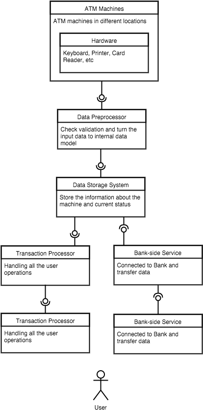
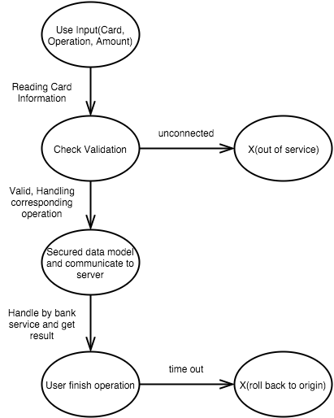
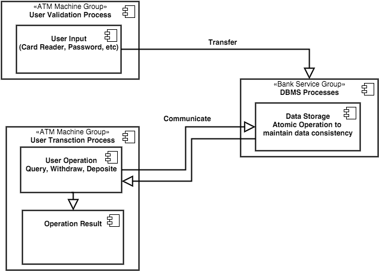
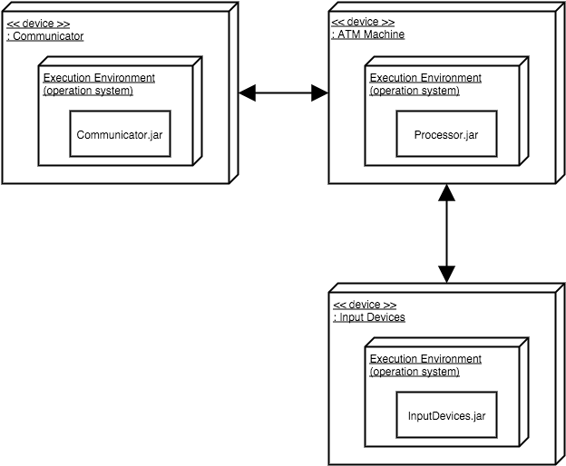
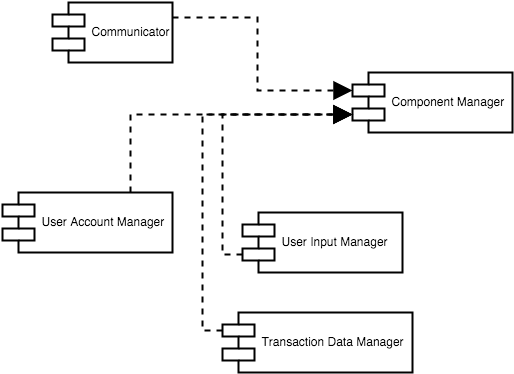

# 18653 HW3.1

## Function View

The function view(below) shows the system's runtime functional elements and their responsibilites, interfaces, and primary interactions. Noted that not all actions are listed. I use a whole `Data Processing` component to handle the `query`, `transcation`, etc.

## Information View

The information view describes how the information stores and how the information flows.

The most important part of the system is the `ATMTranscation` which formed by different user inputs and operations.

And the following is the data flow diagram to show how the information flows:

## Concurrency View

The concurrency view describes the concurrency structure of the system and maps functional elements to concurrency units(Rozanski and Woods 2012)

The most important thing that needs to pay attention to in concurrency is the consistency of data.

## Deployment View

This is the part to clarify which component can be changed and which can not. So the programmers can pay more attention to the flexibility of the system.

## Development View

The developers can use the diagram to classify different components

