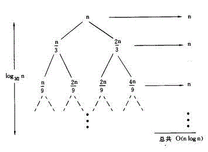

# Big O

# 时间复杂度

## 程序分析法则

+ 对于一些简单的输入输出语句或赋值语句,近似认为需要O(1)时间
+ 对于顺序结构,需要依次执行一系列语句所用的时间可采用大O下"求和法则"
    + 求和法则:是指若算法的2个部分时间复杂度分别为 T1(n)=O(f(n))和 T2(n)=O(g(n)),则 T1(n)+T2(n)=O(max(f(n), g(n)))
    + 特别地,若T1(m)=O(f(m)), T2(n)=O(g(n)),则 T1(m)+T2(n)=O(f(m) + g(n))
+ 对于选择结构,如if语句,它的主要时间耗费是在执行then字句或else字句所用的时间,需注意的是检验条件也需要O(1)时间
+ 对于循环结构,循环语句的运行时间主要体现在多次迭代中执行循环体以及检验循环条件的时间耗费,一般可用大O下"乘法法则"
    + 乘法法则: 是指若算法的2个部分时间复杂度分别为 T1(n)=O(f(n))和 T2(n)=O(g(n)),则 `T1*T2=O(f(n)*g(n))`
+ 对于复杂的算法,可以将它分成几个容易估算的部分,然后利用求和法则和乘法法则技术整个算法的时间复杂度
    + 若g(n)=O(f(n)),则O(f(n))+ O(g(n))= O(f(n))
    + O(Cf(n)) = O(f(n)),其中C是一个正常数

## 递归

递归调用树，一般是等差或等比级数

    T(n) = T(n/4) + T(n/2) + cn^2

    T(n) = c(n^2 + 5(n^2)/16 + 25(n^2)/256) + ….

上述系列是几何级数为5/16。

为得到一个上限,我们求无穷级数的和： (n^2)/(1 – 5/16) 即为 O(n^2)

## 主定理

主定理是解决递归的一种直接方法。但仅用于一些类型或可以转换为以下类型的递归公式：

    T(n) = aT(n/b) + f(n)  （a >= 1 且 b > 1）


## 一些例子

```
decimal Calculation(int n)
{
    decimal result = 0;
    for (int i = 0; i < (1 << n); i++)
    result += i;
    return result;
}
```

这里，给定规模 n，则基本步骤的执行数量为 2n，所以算法复杂度为 O(2n)。

---

斐波那契数列：

+ Fib(0) = 0
+ Fib(1) = 1
+ Fib(n) = Fib(n-1) + Fib(n-2)

F() = 0, 1, 1, 2, 3, 5, 8, 13, 21, 34 ...

```
int Fibonacci(int n)
{
    if (n <= 1)
        return n;
    else
        return Fibonacci(n - 1) + Fibonacci(n - 2);
}
```

通过使用递归树的结构描述可知算法复杂度为 O(2^n)。

## 一个比较完整的例子

T(n) = 2T(n/2) + n^2


这恰好是一个树形结构，由此可引出递归树法。
每一节点中都将当前的自由项n^2留在其中，而将两个递归项T(n/2) + T(n/2)分别摊给了他的两个子节点，如此循环。

图中所有节点之和为:

[1 + 1/2 + (1/2)^2 + (1/2)^3 + … + (1/2)^i] n^2 = 2n^2

可知其时间复杂度为O(n2)

可以得到递归树的规则为：

1. 每层的节点为T(n) = kT(n / m) + f(n)中的f(n)在当前的n/m下的值；
2. 每个节点的分支数为k；
3. 每层的右侧标出当前层中所有节点的和。

---

再举个例子：

　　T(n) = T(n/3) + T(2n/3) + n

其递归树如下图所示：




即T(n) = O(nlogn)　

---

总结，利用此方法解递归算法复杂度：

f(n) = af(n/b) + d(n)


由第二种情况知，若采用分治法对原算法进行改进，则着重点是采用新的计算方法缩小a值。　　

---

需要了解如何分析 Time Complexity 以及 Space Complexity.

+ 了解递归情况下的复杂度分析
	+ 根据递推公式模拟几步，然后找到规律进行分析
	+ When you have a recursive function that makes multiple calls, the runtime will often look like O(branches^depth)
+ Big O just describes the rate of increase.
+ Drop the Constants
+ Drop the Non-Dominant Terms
	+ `O(X!)` > `O(2^x)` > `O(x^2)` > `O(x log x)` > `O(x)` > `O(log x)`
+ do this, then, when done, do that -> add the runtime
+ do this for each time you do that -> multiply the runtime
+ Log N Runtime 来自于二分查找或者诸如二叉树等结构

## 例题

> Suppose we had an algorithm that took in an array of strings, sorted each string, and then sorted the full array. What would the runtime be?

+ Let `s` be the length of the longest string
+ Let `a` be the length of the array

The runtime can be get as followed:

+ Sorting each string is `O(s log s)`
+ We have to do this fro every string, `O(a*s log s)`
+ Now we have to sort all the strings. Need to campare the strings. Each string comparison takes `O(s)` time. There are `O(a log a)` comparisons, therefore this will take `O(a*s log a)` time
+ Add up these two parts, you get `O(a*s(log a + log s))`

> The following simple code sums the values of all the nodes in a balanced binary search tree. What is its runtime?

	int sum(Node node){
	    if (node == null){
	        return 0;
	    }
	    return sum(node.left) + node.value + sum(node.right);
	}

*有树结构并不意味着 runtime 中一定会有 log*

The runtime will be linear in terms of the number of nodes. If there are N nodes, then the runtime is O(N)

> What is the time complexity of this function?

	boolean isPrime(int n){
	    for (int x = 2; x * x <= n; x++){
	        if (n % x == 0){
	            return false;
	        }
	    }
	    return true;
	}

The for loop will start when `x = 2` and end when `x * x = n`, aka √n. So it runs in O(√n) time.

> This code prints all permutations of a string. What is its time complexity?

	void permuation(String str){
	    permutation(str, "");
	}

	void permutation(String str, String prefix){
	    if (str.length() == 0){
	        System.out.println(prefix);
	    }
	    else {
	        for (int i = 0; i < str.length(); i++){
	            String rem = str.substring(0,i) + str.substring(i+1);
	            permutation(rem, prefix + str.charAt(i));
	        }
	    }
	}

可以有两种不同的思路: What It Means 和 What It Does.

**What It Means**

因为是求排列，如果一个字符串有`n`个字符，那么所有的可能为`n*(n-1)*...*2*1` -\> `O(n!)`

**What It Does**

设一共有`n`个字符，第一次循环，有`n`次递归调用，第二次有`n-1`次，到最后一共有`n*(n-1)*...*2*1` -\> `O(n!)`

> The following code computes the Nth Fibonacci number

	int fib(int n){
	    if (n <= 0) return 0;
	    else if (n == 1) return 1;
	    return fib(n-1) + fib(n-2);
	}

There are 2 branches per call, and we go as deep as N, there fore the runtime is O(2^N)

**Generally speaking, when you see an algorithm with multiple recursive calls, you're looking at exponential runtime**

> The following code prints all Fibonacci numbers from 0 to n. What is its time complexity?

	void allFib(int n){
	    for (int i = 0; i < n; i++){
	        System.out.println(i + ": " + fib(i));
	    }
	}

	int fib(int n){
	    if (n <= 0) return 0;
	    else if (n == 1) return 1;
	    return fib(n-1) + fib(n-2);
	}

这题的特点是，循环中的递归次数因为`i`的值的不同是不同的。例如：

	fib(1) -> 2^1 steps
	fib(2) -> 2^2 steps
	fib(3) -> 2^3 steps
	fib(4) -> 2^4 steps
	...
	fib(n) -> 2^n steps

所以把这些加起来的总和为：`2^1 + 2^2 + 2^3 +...+ 2^n = 2^(n+1)` -\> O(2^n)

> The following code performs integer idvision. What is its runtime (assume a and b are both positive)?

	int div(int a, int b){
	    int count = 0;
	    int sum = b;
	    while (sum <= a){
	        sum += b;
	        count++;
	    }
	    return count;
	}

O(a/b). The variable count will eventually equal 1/b. The while loop iterates count times. Therefore, it iterates a/b times.

