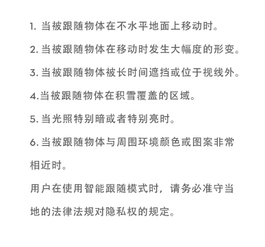

# 【通天塔之聊聊无人机】拾 个人航拍指南

三维空间感知

视觉维持水平稳定，超声波维持竖直方向稳定，低于 3 米时正常工作，超过三米则不行；低空快速飞行可能失效；纯色地面不行；纹理重复很高也不行；下方物体在运动时不行，会让小动物不安；明暗快速变化时不行；地面倾斜角大于 30 度则不行；地面吸收超声波也不行（如厚重地毯）；水面或透明物体上不行；在室内可以考虑关闭 GPS 定位。

飞行前检查

1. 安装桨叶，对应安装
2. 开启电源，确保自检正常
3. GPS 需要 3 格以上
4. 电池预热至 20 度
5. 信道红条过多不宜飞

选择起飞点

1. 空旷开阔的起飞点
2. 观察当前风力
3. 雨雪不能飞
4. 避免鸟群、人群、高大建筑物、磁场干扰地方

飞行遇到特殊情况

+ 图传中断，用天线侧面对准飞机，恢复图传
+ 信号丢失，会自动返回
+ 悬停不稳，控制降落（指南针或 GPS），用姿态模式稳定
+ 迷失机头，使用状态球
+ 大风无法悬停，尽快降落

错误操作

1. 在空中内八或外八，点击停止
2. 桨的安装
3. 返航高度的设置
4. 电量过低无法返航
5. 超视距飞行避障失败，要高于全部
6. 倒飞，避失效
7. 室内飞行飘逸
8. 触发返航乱操作（短按返航键）
9. 恶劣条件强行起飞（空旷、原理干扰源）
10. 刹车后偏移撞机

使用和保养电池

1. 放电过流、放电过温、放电低温、电芯损坏
2. 关闭电池再拔出电池
3. 低温需要预热
4. 不要低于 10% 长期放置
5. 每隔三个月需要充放电一次
6. 不要接触液体
7. 确保外界温度
8. 官方充电器，充电完毕时断开

不是一个简单的小玩具

http://www.dji.com/cn/support/product/phantom-4

技能清单

+ 激活飞行器
+ 同步飞行记录
+ 直播：新浪微博
+ 导出飞行数据
+ 升级飞行器固件与遥控器固件
+ DJI Go 编辑器
+ 指点飞行 P 模式
+ 智能跟随 P 模式
+ 对频

+ 一定要仔细读说明书

