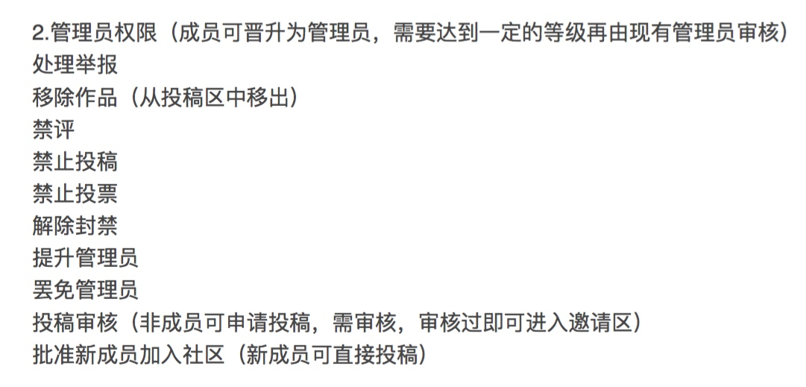

# 社区等级

与其他产品结合起来（比方说高等级用户可以兑换优惠券，可以在新品上市的时候优先购买，如 F 码）

高层设计：正反馈机制与负反馈机制（负反馈需要成本）

一般套路：自动积分（活跃指标、飞行指标） + 人工计分（推荐、参赛）

等级与对应特权：投稿、邀请用户、创建合辑、投反对票、投赞同票、投特别赞、推荐作品进周精选/月精选/年度精选，推荐作品进首页、评论、举报、修改作品 tag

徽章（让不同类型的用户都有参与感）：发布者、参与者、飞手

新手保护，资深用户可以升级为管理员

首页推荐

根据社区贡献获得积分。设定贡献等级，贡献到一定级别给予徽章

## 参考链接

+ [User Reputation League - Stackoverflow](http://stackexchange.com/leagues/1/week/stackoverflow)
+ [Badges - Stackoverflow](http://stackoverflow.com/help/badges)
+ [What is reputation? How do I earn (and lose) it?](http://stackoverflow.com/help/whats-reputation)
+ [Chiphell社区积分等级规则2013版](https://www.chiphell.com/thread-94087-1-1.html)
+ [艾泽拉斯国家地理通用版规](http://bbs.nga.cn/read.php?tid=4111410)

