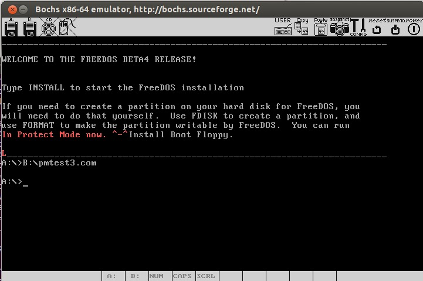

# 一个操作系统的实现

基于《Orange'S: 一个操作系统的实现》，是一些学习和开发时候的笔记。

<!-- MarkdownTOC -->

- 1 最小的“操作系统”
- 2 搭建工作环境
    - 编译安装的方法
    - QEMU
- 3 保护模式(Protect Mode)
    - 保护模式的运行环境
    - GDT(Global Descriptor Table)
    - LDT(Local Descriptor Table)
    - 特权级转移
    - 页式存储
    - 中断和异常
    - 保护模式小结
- 4 让操作系统走进保护模式
- 5 内核雏形
- 6 进程
- 7 输入输出系统
- 8 进程间通讯
- 9 文件系统
- 10 内存管理
- 总结

<!-- /MarkdownTOC -->

## 1 最小的“操作系统”

代码为 `boot.asm`，需要 NASM 编译，Ubuntu 12.04 x64

    nasm boot.asm -o boot.bin

安装 nasm 比较简单 `sudo apt-get install nasm` 即可，之后使用 Bochs 虚拟机进行测试 `sudo apt-get install vgabios bochs`

刚才完成的只是一个引导扇区(Boot Sector)，但是至少是可以直接在裸机上运行的。

**计算机启动时发生了啥**

+ 加电自检(POST)
+ 寻找启动盘，如果选择从软盘启动，检查软盘的 0 面 0 磁道 1 扇区
+ 如果以 `OxAA55` 结束，则 BIOS 认为它是一个引导扇区(还应包含一段少于 512 字节的执行码)
+ 发现了引导扇区，加载 512 字节到内存地址 `0000:7c00` 处，然后跳转到那里将控制权彻底交给这段引导代码

`$-$$` 表示本行距离开始处的相对距离

## 2 搭建工作环境

安装 bochs，推荐编译安装，但是我编译没成功，就直接 apt-get 大法了，不行到时候再换。先是要创建一个虚拟软盘，用 `bximage` 工具即可。然后把引导扇区写入软盘，用 `dd` 命令：

    sudo apt-get install bximage
    dd if=boot.bin of=a.img bs=512 count=1 conv=notrunc

然后是折腾 bochs 的配置文件，配置好了就可以运行了

    bochs -f bochsrc.txt

可惜不能运行，说有东西没装好，于是继续装

    sudo apt-get install bochs-x

再运行还是不行，再装

    sudo apt-get install bochs-sdl

然后在配置文件中加上

    display_library: sdl

再然后 key mapping 又出问题，把那句注释掉，就至少可以运行了

### 编译安装的方法

安装前准备

    sudo apt-get install build-essential xorg-dev libgtk2.0-dev bison

然后下载源代码，解压缩，配置

    ./configure --prefix=/opt/bochs/debug --enable-plugins --enable-debugger --enable-disasm

    make
    sudo make install

最后加一个符号链接

    sudo ln -s /opt/bochs/debug/bin/bochs /usr/bin/bochsdbg

调试的话就是用 `bochsdbg` 命令，但是好像和 sdl 冲突，运行的时候又需要 sdl 库

### QEMU

另一个虚拟机是 QEMU，结果装了用对应命令不行，暂时 bochs 也能用，不折腾了

## 3 保护模式(Protect Mode)

实模式到保护模式

    nasm pmtest1.asm -o pmtest1.bin
    dd if=pmtest1.bin of=a.img bs=512 count=1 conv=notrunc

程序做了什么

+ 定义了一个叫做 GDT 的数据结构
+ 后面的 16 位代码进行了一些与 GDT 有关的操作
+ 程序最后跳到 32 位代码中做了一点操作显存的工作

### 保护模式的运行环境

这里把程序编译成 COM 文件，然后让 DOS 来执行它(以突破 512 字节的限制)

1. 到 Bochs 官网下载一个 FreeDos, 命名为 freedos.img
2. 用 bximage 生成一个软盘映像，起名为 pm.img
3. 修改 bochsrc，把两个 img 都插入进去 `floppya: 1_44=freedos.img, status=inserted` 和 `floppyb: 1_44=pm.img, status=inserted`
4. 启动bochs，FreeDos 启动后格式化盘B `format b:`
5. 把 pmtest1.asm 的第 8 行中的 07c00h 改为 0100h 并重新编译 `nasm pmtest1.asm -o pmtest1.com`
6. 将 pmtest1.com 复制到虚拟软盘 pm.img 上 `sudo mkdir /mnt/floppy`, `sudo mount -o loop pm.img /mnt/floppy`, `sudo cp pmtest1.com /mnt/floppy/`, `sudo umount /mnt/floppy`
7. 到 FreeDos 中执行如下命令：`B:\pmtest1.com`，就可以看到结果了(出现了一个红色的 P)

### GDT(Global Descriptor Table)

在 IA32 下，CPU 有两种模式：实模式和保护模式，在保护模式下，CPU 有巨大的寻址能力，并提供更好的硬件保障。

Intel 8086 是 16 位的 CPU，有着 16 位的寄存器(Register)、16 位的数据总线(Data Bus)以及 20 位的地址总线(Address Bus)和 1MB 的寻址能力。一个地址是由段和偏移两部分组成的：

    物理地址(Physical Address) = 段值(Segment)x16 + 偏移(Offset)

其中段值和偏移都是 16 位的。

在实模式下，16 位的寄存器需要用 `段:偏移` 这种方法才能达到 1MB 的寻址能力。而 32 位寄存器可以寻址 4GB 空间，这里 `段` 的概念发生了改变。实模式下，段值还可以看做是地址的一部分，而在保护模式下，段值仅仅是一个索引，指向一个数据结构的一个表项，这个数据结构就是 GDT。

进入保护模式的主要步骤：

1. 准备 GDT
2. 用 lgdt 加载 gdtr
3. 打开 A20
4. 置 cr0 的 PE 位
5. 跳转，进入保护模式

pmtest2.asm 是从实模式跳转到保护模式再跳转回实模式的一个范例

    nasm pmtest2.asm -o pmtest2.com

    sudo mount -o loop pm.img /mnt/floppy
    sudo cp pmtest2.com /mnt/floppy/
    sudo umount /mnt/floppy

    运行

    B:\pmtest2.com

这里没有进入死循环，重新出现了 DOS 提示符，说明我们重新回到了实模式下的 DOS

### LDT(Local Descriptor Table)

具体代码在 pmtest3.asm 中

    nasm pmtest3.asm -o pmtest3.com

    sudo mount -o loop pm.img /mnt/floppy
    sudo cp pmtest3.com /mnt/floppy/
    sudo umount /mnt/floppy

    运行

    B:\pmtest3.com

### 特权级转移

门也是一种描述符(Gate Descriptor): 调用门(Call gates), 中断门(Interrupt gates), 陷阱门(Trap gates), 任务门(Task gates)，具体的代码示例在 pmtest4.asm 中

之后的 pmtest5.asm 等都是类似的特权转移，我不怎么关心，不赘述

### 页式存储

页就是一块内存，这里只讨论大小为 4KB 的情况。

逻辑地址 -分段机制-> 线性地址 -分页机制-> 物理地址

代码在 pmtest6.asm 中

更相信的内存管理代码在 pmtest7.asm 中，一些其他的函数放在 lib.inc 中，方便看，用下面这条语句来包含在 pmtest7.asm 中

    %include "lib.inc"

这次我们运行一下

    nasm pmtest7.asm -o pmtest7.com

    sudo mount -o loop pm.img /mnt/floppy
    sudo cp pmtest7.com /mnt/floppy/
    sudo umount /mnt/floppy

    运行

    B:\pmtest7.com

进一步体会分页机制 pmtest8.asm

### 中断和异常

代码是 pmtest9.asm 系列，具体有很多很多术语，但是我其实并没有太多想要搞懂的欲望，毕竟不弄操作系统，如果以后需要，再说。

### 保护模式小结

+ 在 GDT, LDT 以及 IDT 中，每一个描述符都有自己的界限和属性等内容，是对描述符所描述的对象的一种限定和保护
+ 分页机制中的 PDE 和 PTE 都含有 R/W 和 U/S 位，提供了页级保护。
+ 页式存储的使用时应用程序使用的是线性地址空间而不是物理地址，与物理内存就被保护起来
+ 中断不再向实模式下一样使用，也提供特权检验等内容
+ I/O 指令不再随便使用，于是端口被保护起来
+ 在程序运行过程中，如果遇到不同特权级间的访问情况，会对 CPL, RPL, DPL, IOPL 等内容进行非常严格的检验，同时可能伴随堆栈的切换，这都对不同层级的程序进行了保护

## 4 让操作系统走进保护模式

建立一个文件，将其通过引导扇区加载如内存，然后将控制权交给它，就解除了 512 字节的束缚。

FAT12 是 DOS 时代就开始使用的文件系统，分为扇区(Sector), 簇(Cluster), 分区(Partition)

例子直接 make 即可

## 5 内核雏形

这一部分跳过

## 6 进程

在 64 位的 Linux 下会出现编译错误，需要换到 32 位的来

## 7 输入输出系统

依然是很多很多和硬件打交道的内容，跳过

## 8 进程间通讯

同步消息机制

## 9 文件系统

设计比较简陋

## 10 内存管理

一个简单的 shell

## 总结

基本上很多都是汇编，感觉意义不是特别大，毕竟我也不会参与太多涉及硬件的内容，可能之后如果遇到相关工作，在回过头来自己做一次吧
