# 机器学习基石 学习笔记

Hsuan-Tien Lin htlin@csie.ntu.edu.tw

<!-- MarkdownTOC -->

- Roadmap
- Lecture 1 The Learning Problem
    - 从学习到机器学习
    - Machine Learning
        - 三个关键
    - 学习问题
- Lecture 2 Learn to Answer Yes/No
    - select g from H
    - Perceptron Learning Algorithm
    - Cyclic PLA
    - Linear Separability 线性可分
    - PLA Fact: W~t Gets More Aligned with W~f
    - PLA Fact: W~t Does Not Grow Too
    - 一个习题
    - More about PLA
    - Learning with **Noisy Data**
    - Pocket Algorithm
- Lecture 3: Types of Learning
    - Different Output Space
    - Different Label
    - Different Protocol
    - Different Input Space
- Lecture 4: Feasibility of Learning
    - Hoeffding's Inequality
    - Connect to Learning
- Lecture 5: Training versus Testing
    - Two Central Questions
    - Trade-off on M
    - Where Did M Come From
    - How Many Lines Are There?
    - Effective Number of Lines
    - Dichotomies: Mini-hypothesis
    - Growth Function
        - Growth Function for Positive Rays
        - Growth Fucntion for Positive Intervals
        - Growth Function for Convex Sets
    - The Four Growth Functions
        - Break Point of H
- Lecture 6: Theory of Generalization
    - Restriction of Break Point
    - Bounding Function
    - BAD Bound for General H
        - Step 1: Replace E~out~ by E~in~'
        - Step 2: Decompose H by Kind
        - Step 3: Use Hoeffding without Replacement
    - Vapnik-Chervonenkis (VC) bound:
- Lecture 7: The VC Dimension
    - More on Vapnik-Chervonenkis(VC) Bound
    - VC Dimension
    - VC Dimension and Learning
    - 2D PLA Revisited
    - VC Dimension of Perceptrons
    - 证明 d~vc~ >= d+1
    - 证明 d~vc~ <= d+1
    - Degrees of Freedom
    - VC Bound Rephrase: Penalty for Model Complexity
    - THE VC Message
    - VC Bound Rephrase: Sample Complexity
    - Looseness of VC Bound
- Lecture 8: Noise and Error
    - Target Distribution P(y|x)
    - Error Measure
    - Two Important Pointwise Error Measures
    - Choice of Error Measure
    - Weighted Classification
    - Minimizing E~in~ for Weighted Classification
- Lecture 9: Linear Regression
    - The Error Measure
    - Matrix Form of E~in~(w)
    - The Gradient ▽E~in~(w)
    - Optimal Linear Regression Weights
    - Linear Regression Algorithm
    - Is Linear Regression a 'Learning Algorithm'?
    - Benefit of Analytic Solution: 'Simpler-than-VC' Guarantee
    - Geometric View of **Hat Matrix**
    - The Learning Curve
    - Linear Classification vs. Linear Regression
- Lecture 10: Logistic Regression
    - Logistic Function
    - Three Linear Models
    - Likelihood
    - Cross-Entropy Error
    - Minimizing E~in~(w)
    - Iterative Optimization
    - Choice of η
    - Putting Everything Together
- Lecture 11: Linear Models for Classification
    - Linear Models Revisited
    - Error-Functions Revisited
    - Theoretical Implication of Upper Bound
    - Two Iterative Optimization Schemes
    - Stochastic Gradient Descent (SGD)
    - Multiclass Classification
    - One-Versus-All (OVA) Decomposition
    - One-versus-one(OVO) Decomposition

<!-- /MarkdownTOC -->

## Roadmap

+ Lecture 1: The Learning Problem
    * _A_ takes _D_ and _H_ to get _g_
+ Lecture 2: Learning to Answer Yes/No
    * Perceptron Hypothesis Set
    * Perceptron Learning Algorithm, PLA
    * Guarantee of PLA
    * Non-Separable Data
+ Lecture 3: Types of Learning
    + Learning with Different Output Space y
        + [classification],[regression], structured
    + Learning with Different Data Lable y~n
        + [supervised], un/semi-supervised, reinforcement
    + Learning with Different Protocol f -> (x~n~,y~n~)
        + [batch], online, active
    + Learning with Different Input Space X
        + [concrete], raw, abstract
+ Lecture 4: Feasibility of Learning
    + Learning is Impossible?
    + Probability to the Rescue
    + Connection to Learning
    + Connection to Real Learning
+ Lecture 5: Training versus Testing
    + Recap and Preview
        + two questions: E~out~(g) ≈ E~in~(g), and E~in~(g) ≈ 0
    + Effective Number of Lines
        + at most 14 through the eye of 4 inputs
    + Effective Number of Hypothesis
        + at most m~H~(N) through the eye of N inputs
    + Break Point
        + when m~H~(N) becomes 'non-exponential'
+ Lecture 6: Theory of Generalization
    + Restriction of Break Point
        + break point 'breaks' consequent points
    + Bounding Function: Basic Cases
        + B(N, k) bounds m~H~(N) with break point k
    + Bounding Function: Inductive Cases
        + B(N, k) is poly(N)
    + A Pictorial Proof
        + m~H~(N) can replace M with a few changes
+ Lecture 7: The VC Dimension
    + Definition of VC Dimension
        + maximum non-break point
    + VC Dimension of
        + d~vc~(H) = d + 1
    + Physical Intuition of VC Dimension
        + d~vc~ ≈ #free parameters
    + Interpreting VC Dimension
        + loosely: model complexity & sample complexity
+ Lecture 8: Noise and Error
    + Noise and Probability Target
        + can replace f(x) by P(y|x)
    + Error Measure
        + affect 'ideal' target
    + Algorithmic Error Measure
        + user-dependent -> plausible or friendly
    + Weighted Classification
        + easily done by virtual 'example copying'
+ Lecture 9: Linear Regression
    + Linear Regression Problem
        + use hyperplanes to approximate real values
    + Linear Regression Algorithm
        + analytic solution with pseudo-inverse
    + Generalization Issue
        + E~out~ - E~in~ ≈ 2(d+1)/N on average
    + Linear Regression for Binary Classification
        + 0/1 error <= squared error
+ Lecture 10: Logistic Regression
    + Logistic Regression Problem
        + P(+1|x) as target and θ(w^T^x) as hypothesis
    + Logistic Regression Error
        + cross-entropy(negative log likelihood)
    + Gradient of Logistic Regression Error
        + θ-weighted sum of data vectors
    + Gradient Descent
        + roll downhill by -▽E~in~(w)
+ Lecture 11: Linear Models for Classification
    + Linear Models for Binary Classification
        + three models useful in different ways
    + Stochastic Gradient Descent
        + follow negative stochastic gradient
    + Multiclass via Logistic Regression
        + predict with maximum estimated P(k|x)
    + Multiclass via Binary Classification
        + predict the tournament champion

## Lecture 1 The Learning Problem

从基础学习 what every machine learning user should know

+ When Can Machines Learn? illustrative + technical
+ Why Can Machines Learn? theoretical + illustrative
+ How Can Machines Learn? technical + practical
+ How Can Machines Learn Better? practical + theorietical

知其然也知其所以然

### 从学习到机器学习

+ 学习的过程：observations -> **learning** -> skill
+ 机器学习的过程：data -> **ML** -> skill(improved performance measure)
+ skill: improve some **performance measure**

### Machine Learning

+ improving some perormance mearsure with experience computed from data
+ an alternative route to build complicated systems

#### 三个关键

+ exists some 'underlying pattern' to be learned, so performance measure can be improved. 要有东西可学
+ but no programmable definition, so 'ML' is needed
+ somehow there is data about the pattern. 要有大量数据

### 学习问题

+ 输入 x
+ 输出 y
+ 目标函数 target function f: X->Y
+ data D={(x~1~,y~1~),(x~2~,y~2~),...,(x~n~,y~n~)}
+ 机器学习可能得到的假设 g:X->Y
+ {(x~n~, y~n~)} from f -> ML -> g

 

+ f 我们不知道
+ g 越接近 f 越好
+ A takes D and H to get g
+ related to DM, AI and Stats

## Lecture 2 Learn to Answer Yes/No

+ 每一个样本的数据可以看成一个向量，可以给每一个向量计算出一个加权得分，每一个维度有一个权重。
+ 把 threshold 收进公式中，可以得到一个统一的表达，最后的得分等于两个向量相乘
+ 
+ perceptrons <-> linear(binary) classifiers 线性分类器

### select g from H

* H = all possible perceptrons, g = ? 从这么多可能的线之中，选出一条最好的，最能区分数据的
* 先要求 g 和 f 在已有数据上结果最接近, g(x~n~) = f(x~n~) = y~n~
* 难点在于，H 很大，有无数种可能的线(分类器)
* 从第一条线 g~0 开始，不断进行修正，可以认为是一开始的权重向量 w~0

### Perceptron Learning Algorithm

* For t = 0, 1, ... 这里 t 是轮数，因为会迭代很多次
* 找到 w~t 的一个分类错误的点(x~n(t)~, y~n(t)~), 即 sign(w~t~^T^x~n(t)~) 不等于 y~n(t)~
* 试着去改正这个错误 w~t+1~ <- w~t + y~n(t)~x~n(t)~ until no more mistakes
* 返回最后得到的 w 为 g, 这个 w 称为 w~pla~

### Cyclic PLA

* For t = 0,1,...
* find the next mistake of wt called (x~n(t)~, y~n(t)~), aka sign(w~t~^T^x~n(t)~) 不等于 y~n(t)~
* correct the mistake by w~t+1~ <- w~t + y~n(t)~x~n(t)~
* until a full cycle of not encountering mistakes
* 可以采用标准的遍历，或者也可以是预先计算好的随机顺序

### Linear Separability 线性可分

* if PLA halts, (necessary condition) D allows some w(一条用来区分的线) to make no mistake
* 有一条线可以区分数据，即有解，有解的时候 PLA 算法才会停

### PLA Fact: W~t Gets More Aligned with W~f

+ 线性可分，则存在一条完美的直线 W~f(即目标函数) 使得 y~n = sign(W~f^T x~n)
+ 也就是 y~n 的符号，与 W~f^T 和 x~n 的乘积(也就是 x~n 到直线 W~f 的距离)的符号，一定是相同的
+ 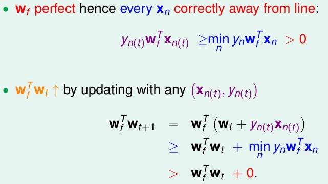
+ W~t 为当前次迭代的直线，找出一个错误的点，然后做更新
+ 通过不等式可以得到，下一次迭代得到的直线，会更加接近于完美的直线 W~f ，因为乘积越来越大了(但是乘积还需要考虑向量的长度，这里说的是角度，下面就是说长度)

### PLA Fact: W~t Does Not Grow Too

+ W~t changed only when mistake
+ 也就是只有在 sign(W~t^T x~n(t)~) 不等于 y~n(t)~ 也就是 y~n(t)~w~t^T^x~n(t)~ <= 0
+ 
+ 平方之后来看长度的公式，蓝色部分通过上面的推导可知是小于等于零的
+ y~n 是正负 1，所以下一次迭代的向量的长度的增长是有限的，最多增长 x~n~^2^ 那么多(也就是长度最大的向量)
+ 然后推导出来 w~t 确实是越来越靠近 w~f 的

### 一个习题

+ 
+ 具体怎么推导的呢，研究了半个多小时终于弄清楚了，如下
+ W~f 是理论上完美的那条线，w~t 是第 t 次迭代得到的那条线，而因为这两条线最好结果就是完全平行，所以有
    + (W~f^T / || W~f ||) * (w~t / || w~t ||) 的最大值为 1 (`eq1`)
+ 由前面 PPT 得到的两个公式：
    + W~f~^T^w~t+1~ >= W~f~^T^w~t~ + min~n~y~n~W~f~^T^x~n~ (`eq2`)
    + w~t+1~^2^ <= w~t~^2^ + max(n)x~n~^2^ (`eq3`)
+ 因为是迭代 T 次，把 `eq2` 和 `eq3` 代入到 `eq1` 中
    + W~f~^T^w~t~ / || w~f~ || 这部分就是条件里的 p，因为迭代 T 次，所以分子变成 T·p
    + 分子是 || w~t ||，根据 `eq3` 可知迭代 T 次后为 √(T·R^2^)
+ 又因为 `eq1` 的最大值为1，可以求出 T 的范围，得到答案

### More about PLA

+ Guarantee: as long as **linear separable** and **correct by mistake**
    + inner product of w~f and w~t grows fast; length of w~t grows slowly
    + PLA 'lines' are more and more align with W~f -> halts
+ Pros
    + Simple to implement, fast, works in any dimensin d
+ Cons
    + **'Assumes' linear separable D** to halt(property unknown in advance)
    + Not fully sure **how long halting takes**(p depends on W~f) -though practically fast
+ What if D not linear separable?

### Learning with **Noisy Data**

+ 
+ Line with Noise Tolerance
    + 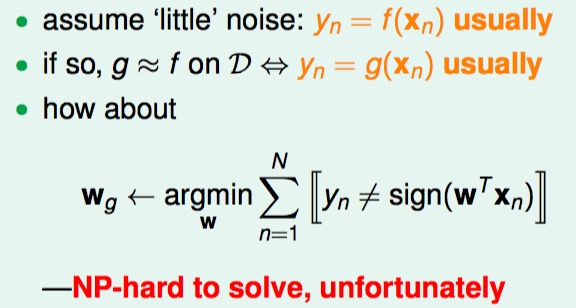
    + 在看到的数据中，找犯错误最少的一条(但是这是一个很难的问题)

### Pocket Algorithm

+ modify PLA algorithm (black lines) by **keeping best weights in pocket**
+ 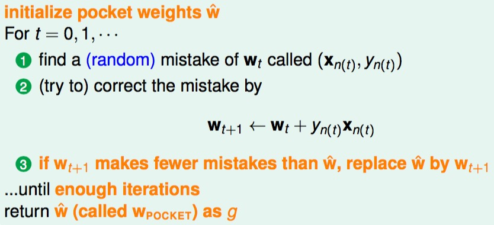
+ 例题时间
+ 

## Lecture 3: Types of Learning

### Different Output Space

+ 二元分类与多元分类
+ 例子：Patient Recovery Prediction Problem
    + binary classification: patient features -> sick or not
    + multiclass classification: patient features -> which type of cancer
    + regression(回归分析)
        + patient features -> how many days before recovery
        + compnay data -> stock price
        + climate data -> temperature
+ 统计上有很多工具也可以放到机器学习里来用
+ Structured Learning
    + Sequence Tagging Problem 词性标注
    + protein data -> protein folding
    + speech data -> speech parse tree

### Different Label

+ 监督式学习
    + 
+ 非监督式学习
    + 
+ 其他一些非监督式学习
    + 
    + diverse, with possibly very different performance goals
+ 半监督式学习
    + 只提供有限信息，只标记一部分，蓝色的是没有标记的，其他颜色是标记出来的
    + 
    + leverage unlabeled data to avoid 'expensive' labeling

### Different Protocol

+ Reinforcement Learning
    + 惩罚错误判断，鼓励正确判断
    + learn with **partial/implicit information**(often sequentially)
+ Batch Learning 填鸭式教育
    + 
    + batch learning: **a very common protocol**
+ Online 老师教书
    + hypothesis 'improves' through receiving data instances sequentially
    + PLA can be easily adapted ton online protocol
    + reinforcement learning is often done online
+ Active Learning
    + 

### Different Input Space

+ Concrete features: the 'easy' ones for ML
+ Raw features -> meaning of digit(比方说笔迹识别，把图像转换成数字化的信息，可以是对称性或者密度，或者直接转化成二维数组，越抽象，对于机器来说就越困难)
    + often need human or machines to **convert to concrete ones**
    + 要么是人工来做，要么就是 deep learning 自动来做
+ Abstract features: **no** physical meaning, even harder for ML
    + 比方说评分预测问题(KDDCup 2011)
    + need **feature conversion**/extraction/construction

## Lecture 4: Feasibility of Learning

+ Inferring Something Unknown
    + diificult to infer **unknown target f outside D** in learning
    + 抽样调查
+ **Hoeffding's Inequality**
    + 只是给出一个比较高的上限
    + probably approximately correct(PAC)

### Hoeffding's Inequality

用一个从罐子里取玻璃球作为例子，有两种玻璃球：橙色和绿色。假设：

    橙色的概率为 u
    则绿色的概率为 1-u
    但 u 具体是多少我们不知道

然后我们从中取出 `N` 个样本：

    橙色的比例为 v
    则绿色的比例为 1-v
    这时我们是知道 v 具体是多少的

> Does **in-sample v** say anything about out-of-sample u?

+ Possibly not: sample can be mostly green while bin is mostly orange
+ Probably yes: in-sample v likely **close to** unknown u

> Formally, what does v say about u?

    u = orange probability in bin
    v = orange fraction in sample

抽样数量足够大的时候，抽样得到的概率 v 和实际概率 u 相差的概率会很小(Heoffding's Inequality)

The statement `v = u` is **probably approximately correct**(PAC)

根据上面的公式我们知道，其实要知道抽样得到的概率 v 和实际概率 u 相差多少，只跟误差和抽样的数量有关。

If **large N**, can **probably** infer unknown u by known v

### Connect to Learning

瓶中的情况 | 对应到 Learning
--- | ---
unknown orange prob. u | fixed hypothesis h(x) ? target f(x)
marble in bin | x 在 X 中
orange | h is wrong -> h(x) 不等于 f(x) aka orange
green | h is right -> h(x) 等于 f(x) aka green
size-N sample from bin | check h on D = {(x~n~, y~n~)} 这里 y~n~ 就是 f(x~n~)

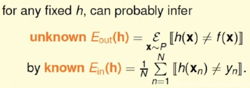

E~out~(h) 对应于 总体概率 u，E~in~(h) 对应于抽样概率 v

Does not depend on E~out~(h),**no need to know E~out~(h)**

E~in~(h) = E~out~(h) is **probably approximately correct**(PAC)

**BAD** sample: **E~in~ and E~out~ far away**

can get **worse** when involving 'choice'

Hoeffding 保证的是出现 Bad Sample 的机会不会很大

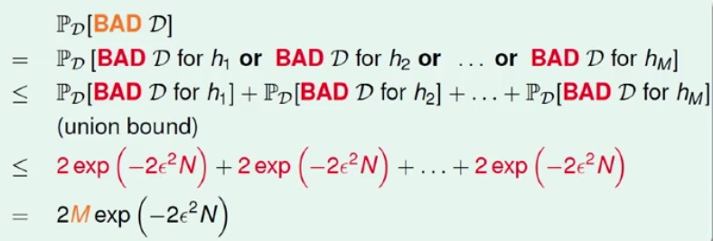

什么意思呢？如果hypothesis set是有有限种选择，训练样本够多，那么不管学习算法A怎么选择，样本的判别结果都会与总体的一致。那么，如果学习算法设计为寻找样本中错误率最小的，那么刚刚的推论PAC就能保证选出来的g与f是约等于的。

也就是说，当有 M 个 hypothesis 的时候，对应的误差也会变大，但是依然可以找到一个情况，此时

E~in~(g) = E~out~(g) is **PAC, regardless of A**

Most reasonable A(like PLA/pocket): pick the h~m with **lowest E~in~(h~m~) as g

不过仍然有一个遗留问题，刚刚的推论是在hypothesis set有限的前提下，那类似于PLA的hypothesis set是无穷的又如何呢？不用紧张，以后会证明这个问题。现在至少在有限的情形下证明了，这是一个很好的出发点。

## Lecture 5: Training versus Testing

### Two Central Questions

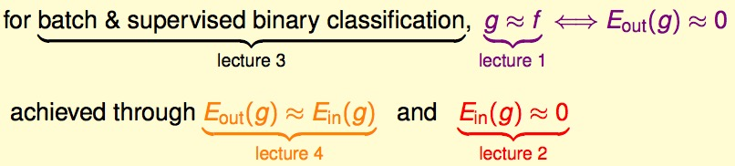

+ Can we make sure that E~out~(g) is close enough to E~in~(g)
+ Can we make E~in~(g) small enough?

### Trade-off on M

M 也就是 hypothesis 的集合，对于不同的值，对于上面两个问题有两个不同的解答

Small M | Large M
--- | ---
Yes! P[BAD] <= 2·M·exp(...) | No! P[BAD] <= 2·M·exp(...)
No! too few choices | Yes!, many choices

这样就两难了，M 小的时候，可以保证 E~out~(g) 和 E~in~(g) 足够接近，但是不能保证 E~in~(g) 足够小；M 大的时候则是相反的情况。如何选择正确的 M 呢？尤其是 M 可能是无限多的情况怎么办呢？

现在的情况就是这个公式和 M 有关

所以想办法能不能把可能无限大的 M，弄成有限的数量 m~H

### Where Did M Come From

之前的讨论中，我们直接把概率的 or 转化为概率的相加，因为我们假设这些 BAD case 不大可能会重叠，但是当 M 很大的时候，这种做法(Uniform Bound)就不行了。为什么呢？

因为假如 h~1 很接近于 h~2~,则 E~out~(h~1~) 会很接近 E~out~(h~2~)，并且很有可能 E~in~(h~1~) = E~in~(h~2~)

Union bound **over-estimating** 很多重复的也被计算进去了。那么对于这种情况，如果我们能 group similar hypothesis by **kind**，就可以减少误差。

### How Many Lines Are There?

考虑平面上所有的线 H = {all lines in R^2^}

+ How many lines? 无限多条
+ How many **kinds of** lines if viewd from one input vector x~1?
    + 两种，一种划分 x~1 是圈，另一种划分 x~1 是叉
    + 2 kinds: h~1~-like(x~1~) = o or h~2~-like(x~1~) = x

如果从两个点的角度来看呢？有 4 种线，x~1 和 x~2 的组合可能是：oo, xx, xo, ox

三个点的情况下呢？通常情况下有 8 种线，x~1~, x~2~, x~3~ 的组合可能是：ooo, xxx, oox, xxo, oxo, xox, oxx, xoo

但是如果三点共线的话，就只有 6 种线了。

四个点的情况下呢？至多只有 14 种线了。(指的是线性可分的线的种类的数量)

### Effective Number of Lines

maximum kinds of lines with respect to N inputs x~1~, x~2~, ..., x~N~ -> **effective number of lines** 可能的有效划分的线种类数量

这里用 `effective(N)` 代替了原来的 `M`，如果 `effective(N)` 远小于 2^N 的话，那么就可能解决无穷条线的问题了

### Dichotomies: Mini-hypothesis

用 Dichotomies Set 的大小来代替 M，但是现在会依赖于不同点的选取，需要做进一步的修改

### Growth Function

注意这里这个 m~H~(N) 是重要的符号

#### Growth Function for Positive Rays

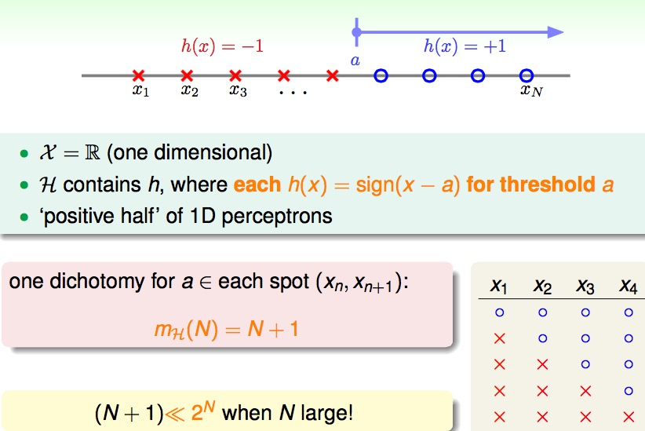

N+1

#### Growth Fucntion for Positive Intervals

0.5N^2 + 0.5N + 1

#### Growth Function for Convex Sets

### The Four Growth Functions

#### Break Point of H

指的是增长函数中第一个有希望的点(也就是增长趋势放缓的点)，比方说之前三个点我们可以做出 8 种线，但是四个点的时候却不能做出 16 种线，所以 4 就是一个 break point。

## Lecture 6: Theory of Generalization

E~out~ ≈ E~in~ possible if **m~H~(N) breaks somewhere** and **N large enough**

growth function m~H~(N): max number of dichotomies

### Restriction of Break Point

what 'must be true' when **minimum break point** k = 2

+ N = 1: every m~H~(N) = 2 by definition
+ N = 2: every m~H~(N) < 4 by definition (so **maximum possible = 3)
+ N = 3: **maximum possible = 4 远小于 2^3^**

既然如此，换一个角度来考虑的话那么更General的情况是：如果现在已知minimum break point k = 2，在样本量N不同的情况下对应的Dichotomies大小又是如何的状况呢？k = 2这里的意义就是说任意的两个样本点都无法被shatter到（shatter到的意思：n个样本点的2^n个情形都能出现，这里就是指2个样本点的4种情形都能出现）。

break point k **restricts maximum possible m~H~(N) a lot** for N > k

idea: m~H~(N) <= **maximum possible m~H~(N) given k** <= poly(N) N 的多项式时间

m~H~(N)跟我们实际上的 hypothesis set 有关，我们不如来算一下 m~H~(N)在有某一个break point的前提下，到底能产生多少种可能性。如果最多的可能性，也即 m~H~(N)的最大值也是一个多项式的话，那么就可以放心大胆的说 m~H~(N)也是多项式的。进而，如果能将这个多项式的 m~H~(N) 成功地放进我们原来的 Hoeffding 不等式的话，也许我们就可以说在PLA这样的无穷 hypothesis set 上的 Learning 是做得到的。

### Bounding Function

**bounding function B(N, k)**: maximum possible m~H~(N) when break point = k

+ combinatorial quantity: maximum number of length-N vectors with (o, x) while **no shatter any length-k** subvectors
+ irrelevant of the details of H.

new goal: B(N, k) <= poly(N)?

B(N, k) <= B(N-1, k) + B(N-1, k-1)

now we have **upper bound** of bounding function

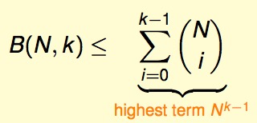

+ simple induction using **boundary and inductive formula**
+ for fixed k, B(N, k) upper bounded by poly(N) -> **m~H~(N) is poly(N) if break point exists
+ `<=` can be `=` actually

### BAD Bound for General H

具体的证明主要分以下几步

#### Step 1: Replace E~out~ by E~in~'

第一步，想办法将式子中的 E~out~(h) 替换掉。hypothesis set只要有一个 h 发生坏事情，也就是 E~in~(h) 与 E~out~(h) 差别很大，我们就说这个训练数据 D 不是好的数据，我们希望坏数据 D 发生的概率不要太高。

+ E~in~(h) finitely many, E~out~(h) infinitely many
+ How? sample **verification set D'** of size N to calculate E~in~'
+ BAD h of E~in~ - E~out~ 可以大概近似于 BAD h of E~in~ - E~in~'

这样一来 evil E~out~ removed by verification with **ghost data**

#### Step 2: Decompose H by Kind

想办法将 Hyspothesis set 换成某一个 h。如下图所示，现在在乎的所有和 BAD 有关的只是 E~in~(h) 和 E~in~(h)' 来决定了。也就是说，如果 h 在 D 与 D’ 上做出一样的 dichotomy 的话，那么 E~in~(h) 和 E~in~(h)' 就会长一样。所以我只要把所有的 hypothesis set 分成 |H(x1, x2…, x’1, x’2…)| 这么多类就好，也就是在这 2N 个点上有多少种 Dichotomies 就好了。这样的话最多最多有 m~H~(2N) 种，把每一种抓一个代表出来我们就可以使用 union bound 了。

use m~H~(2N) to calculate BAD-overlap properly

#### Step 3: Use Hoeffding without Replacement

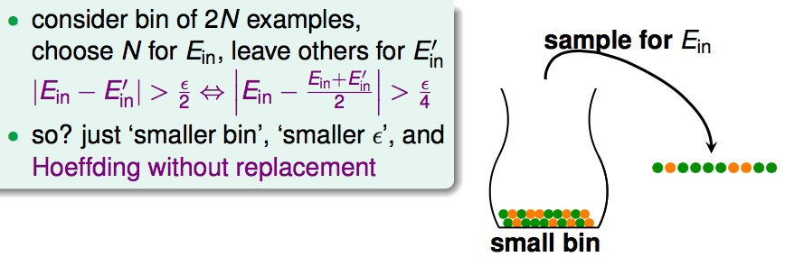

use **Hoeffding** after zooming to fixed h

现在我们已经是固定的 h，想知道两次 sampling 的差别。就好像我们先有 2N 个样本的例子，我们抓 N 个出来然后比较剩下的 N 个；或者说我们抓 N 个出来，比较它跟所有 2N 个的平均是多少。如果想要 E~in~(h) 和 E~in~(h)' 相差 alpha 的话，那么 E~in~(h) 与所有人的平均需要相差 alpha/2。那怎么知道 E~in~(h) 与所有 2N 的差别呢？没错，就是使用 Hoeffding 不等式来解决，只不错这次罐子变得更小，变得有限的 2N 个了。

### Vapnik-Chervonenkis (VC) bound:

## Lecture 7: The VC Dimension

if **finite d~vc~**, **large N**, and **low E~in~**

如果成长函数在 k 处有 break point，那么这个成长函数会被一个上限函数所限制，这个上限函数又会被某个多项式限制，这个多项式是 k-1 次方

### More on Vapnik-Chervonenkis(VC) Bound

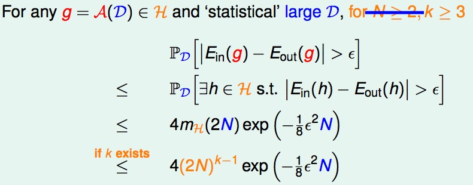

### VC Dimension

the formal name of **maximum non-**break point

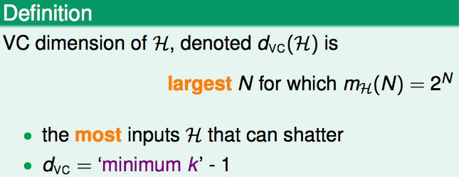

+ N <= d~vc~ -> H can shatter some N inputs
+ k > d~vc~ -> k is a break point for H

if N >= 2, d~vc~ >= 2, m~H~(N) <= N 的 d~vc~ 次方

good: **finite d~vc~**

### VC Dimension and Learning

**finite d~vc~ -> g will generalize E~out~(g) ≈ E~in~(g)**

+ regardless of learning algorithm A
+ regardless of input distribution P
+ regardless of target function f

### 2D PLA Revisited

如果现在 2D 里面我们的数据是 **linearly separable D**，那么 **PLA can converge**，也就是说，当迭代次数 T 足够大的时候，我们可以找到一条线，这条线把所有 data 正确分类，也就是 **E~in~(g)=0**。

如果这些 data 是从某个分布中(具体是什么分布不重要)以及某个target function得来的，即 **with x~n~ ~ P and y~n~ = f(x~n~)**，我们有很大的机会说他们的 E~in~(g) 和 E~out~(g) 是很接近的，因为我们知道了 d~vc~ 是有限的。当 N 很大的时候，可以知道 **E~out~(g) ≈ E~in~(g)**

那么问题来了: general PLA for x with **more than 2 features** 怎么办呢

### VC Dimension of Perceptrons

+ 1D perceptro (pos/neg rays): d~vc~ = 2
+ 2D perceptrons: d~vc~ = 3
    + 如何证明的呢？
    + 三个点的情况下，我们找到一种方式可以shatter，于是 d~vc~ >= 3
    + 四个点的情况下，我们发现所有方式都不可以shatter，于是 d~vc~ <= 3
    + 于是 d~vc~ = 3
+ d-D perceptrons: d~vc~ ? d+1 如何证明呢

### 证明 d~vc~ >= d+1

**一个习题**

There are **some d+1 inputs** we can shatter

注意：X **invertible**

怎么样可以保证 shatter 呢，对于任何一组输入 y，存在这样的 w 保证 Xw 的符号等于 y

'special' X can be shattered -> d~vc~ >= d+1

### 证明 d~vc~ <= d+1

**一个习题**

要证明所有可能性都不行。

linear dependence **restricts dichotomy**

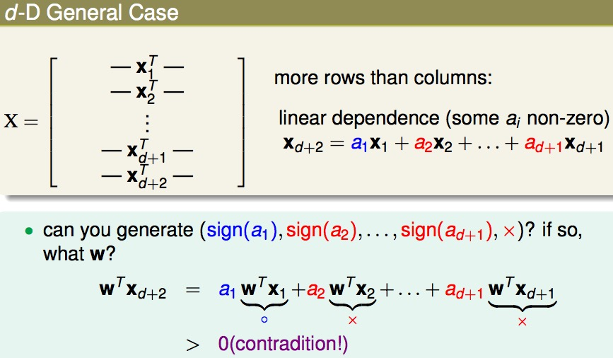

'general' X no-shatter -> d~vc~ <= d+1

### Degrees of Freedom

+ hypothesis parameters w = (w~0~, w~1~,..., w~d~): creates degrees of freedom
+ hypothesis quantity M = |H|: 'analog' degrees of freedom
+ hypothesis 'power' d~vc~ = d+1: **effective 'binary' degrees of freedom**

物理意义是 hypothesis set 在做二元分类的时候有多少自由度(就是有多少可控的参数)

我们发现，d+1 实际上就是perceptron 的维度，所以 VC dimension 就和 perceptron 的维度联系起来了。hypothesis set 是由 d+1 维的 w 来表示的，而这些 w 可以代表着 hypothesis 的自由度 degrees of freedom。所以 VC dimension 的物理意义就是 effective ‘binary’ degrees of freedom，hypothesis set 在作二元分类的状况下到底有多少的自由度。同时也就象征着 powerfulness of H，到底能够产生多少的dichotomies。

d~vc~(H): powerfullness of H

practical rule of thumb: **d~vc~ ≈ #free parameters(but not always)**

**using the right d~vc~ (or H) is important**

### VC Bound Rephrase: Penalty for Model Complexity

VC dimension的一种意义是表征着 model complexity。

坏事情发生的机会很小，也就是好事情发生的机会很大

信赖区间，一般比较在意右边的部分，考虑最坏情况。

根号里面的部分是 penalty for **model complexity** Ω(N, H, δ)

### THE VC Message

**powerful H** not always good

### VC Bound Rephrase: Sample Complexity

VC bound还有另外的一种含义：Sample Complexity样本复杂度。

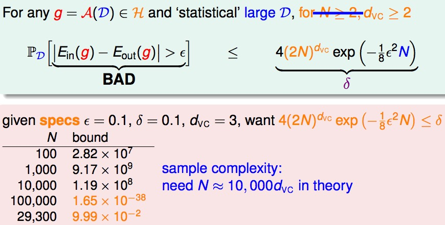

prictical rule of thumb: **N ≈ 10d~vc~ often enough!**

### Looseness of VC Bound

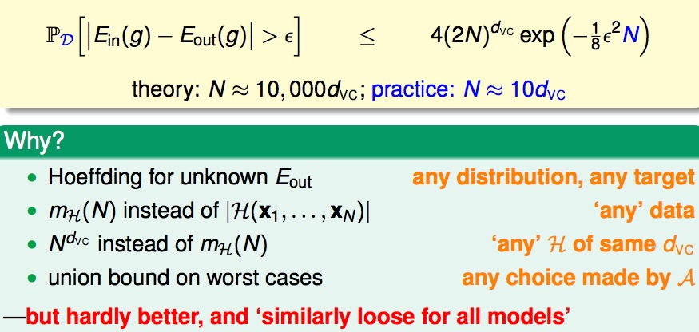

**philosophical message** of VC bound important for improving ML

## Lecture 8: Noise and Error

learning can happen with **target distribution P(y|x)** and **low E~in~ w.r.t. err**

噪声是容易出现的，人工标记错误；同一个数据不同人工标记不同；训练数据收集可能不精准等等原因。那么在有噪声的时候，我们之前推导的 VC bound 是否仍然能作用的很好？

回想一下，VC bound 的核心：我们不知道一个罐子里有多少橘色的弹珠，不过我们抓一把出来就可以估计橘色的弹珠有多少，这些橘色的弹珠就是我们犯错误的地方。噪声的影响就是特别的弹珠，弹珠的颜色不是固定的，譬如弹珠40%是橘色的，60%的时候是绿色的。那这时候我们如何知道罐子大致的橘色的比例是多少呢。

### Target Distribution P(y|x)

也就是说，只要我们的每个训练数据 y 来自某一个 joint distribution P(y|x)，我们在训练的时候和测试的时候都符合 P(y|x)，那么这个 VC bound 的大架构还是有效的。P(y|x) 通常叫做 **target distribution**，对于每一个 x 可以做一个它最理想的预测 **mini-target** 是什么。它告诉我们最理想的预测 **ideal mini-target** 是什么，另外不理想的就是 noise 。例如 P(o|x) = 0.7, P(x|x) = 0.3，也就是说现在拿了一颗弹珠它是圈圈概率是0.7，请问你是要猜圈圈还是要猜叉叉。当然最好猜它是圈圈，那么错误率就是0.3。

那么之前固定的 target f 可以认为是目前 target distribution 的一种特例，这时候P(y|x) = 1 for y = f(x)也就是完全没有噪声。使用 target distribution 的时候和之前是用 target function 的时候基本上没有什么太大的不一样。

所以回头来看，我们 Learning 的目标分为两个部分了 predict **ideal mini-target(w.r.t. P(y|x))** on **often-seen inputs(w.r.t. P(x))**，一个是原先的 P(x)，它告诉我们哪些点是重要的常常会被抽样到也就是在 E~in~(h) 里经常出现；另外一个是 P(y|x)，它告诉我们最理想的 mini-target 是什么。在常见的点上的预测要做的表现好，这就是 machine learning 做的事情。

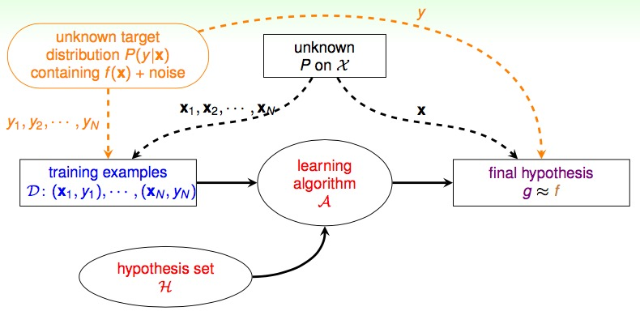

新的流程，区别在于左上角不再是一个固定的 target function 而是一个 target distribution，要保证训练和测试的数据都是从同一个分布产生的。

VC still works.

### Error Measure

final hypothesis g ≈ f

如何衡量 g 跟 f 是长的很像的呢？之前使用的是 E~out~(g)，有三个特性：**out of sample** 衡量的是还没有看过或者是未来抽样出来的x，**point-wise** 可以在每一个x上个别衡量，最后做抽样的平均就可以了，**classification** 二元分类考虑的就是对或者不对。实际上有很多的错误衡量的方式，不过为了简单起见大部分的主要集中在 point-wise 的方式。

### Two Important Pointwise Error Measures

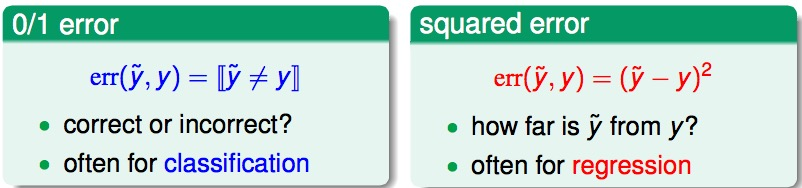

那有哪些 Point-wise 的错误衡量方式呢？0/1 error 通常用在分类上，分对还是分错；平方的 error 通常用在回归分析，计算错误的距离。未来会讲更多不同错误衡量方式。不同的错误衡量方式，会影响到最理想的 mini-target，也就是最好的 f 会长什么样。

VC 理论对于很多不同的 hypothesis set 还有很多不同的错误衡量方式来说都会 work。也就是说，不管是 classification 还是 regression，不只是0/1的错误衡量，都能得到类似的 VC bound。详细的数学推导太过于繁复，大家没有必要都走过一遍。

0/1 找最大概率的那个；平方 找加权平均值

于是新的 Learning Flow 会加上 Error Message 的部分

**一个习题**

### Choice of Error Measure

这些错误的衡量到底哪里来的呢？想象一个指纹分类系统，分类器可能会犯两种错误：false accept，应该要说不可以用，但是分类器说可以用；false reject，明明应该可以用，但是分类器说不可以用。其实也就是我们在分类中常说的 false positive 和 false negative，只是台湾和大陆的叫法不同而已。对于这两种错误的类型，之前的 0/1 error penalizes both types equally。然而，在实际应用中，两种错误带来的影响可能很不一样。

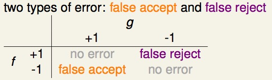

但是很多时候错误衡量的具体权重是不太能确定的，所以在设计算法的时候常常要采用替代的方式。一种替代方式是找一些有意义的错误衡量，例如之前 Pocket PLA 在进行 0/1 分类时如果分不对就认为是噪声，想办法让噪声最小也就是 0/1 error 最小(NP hard问题之前有提到)。以及以后会讲到的距离平方的方式，想办法高斯噪声最小；另外一种替代方式会更 friendly，例如很容易求出解，或者凸优化的目标函数等。

### Weighted Classification

不同的错误有不同的惩罚

weighted classification: **different 'weight' for different (x, y)**

### Minimizing E~in~ for Weighted Classification

目标还是让 E~in~^w^(h) 越小越好

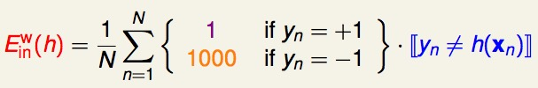

一种比较机械的方式就是，在训练开始前，我们将{(x,y) | y=-1} 的数据复制1000倍之后再开始学习，后面的步骤与传统的 pocket 方法一模一样。然而，从效率、计算资源的角度考虑，通常不会真的将 y=-1 的数据拷贝 1000 倍，实际中一般采用”virtual copying”。

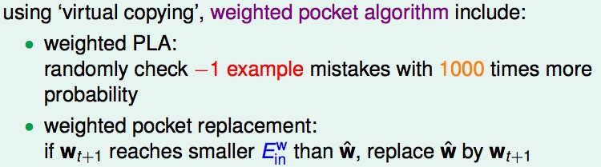

只要保证：randomly check -1 example mistakes with 1000 times more probability。也就是说，pocket 随机访问-1错误点的几率在概率上要比非权重PLA算法时访问-1错误点的几率高了1000倍。

systematic route(called 'reduction') can be applied to many other algorithm

**一个习题**

总之，我们选择好适合特定应用的error measure: err，然后在训练时力求最小化err，即，我们要让最后的预测发生错误的可能性最小（错误测量值最小），这样的学习是有效的。

## Lecture 9: Linear Regression

例如，信用卡额度预测问题：特征是用户的信息（年龄，性别，年薪，当前债务，…），我们要预测可以给该客户多大的信用额度。 这样的问题就是回归问题。目标值 y 是实数空间 R。线性回归的假设 hypothesis 是 h(x) = w^T^x

For x = (x~0~, x~1~, x~2~,..., x~d~) 'features of customer', approximate the **desired credit limit** with a **weighted** sum:

怎么理解？向量 x 就代表客户的不同信息，然后通过这个 hypothesis，也就是不同的权重向量 w，相乘得到一个实数

h(x): like **perceptron**, but without the **sign**

**linear regression**: find lines/hyperplanes with small **residuals**

### The Error Measure

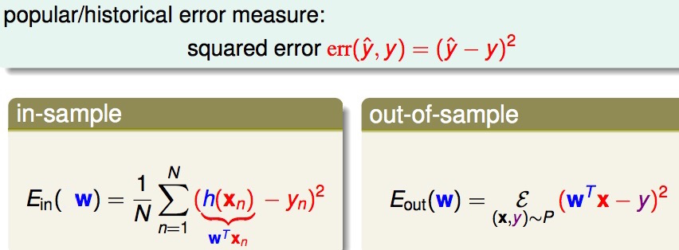

这里之所以可以直接用 w 代替 h，因为每个不同的 hypothesis 实际上就是对应不同的权重

所以现在的问题就是最小化 E~in~(w)

### Matrix Form of E~in~(w)

然后就可以得到下面的式子：

这是一个连续可微凸函数，要找到最低点，表示不管到哪个方向都没有办法更低，也就是对应点的梯度(在每个方向上做偏微分)为零

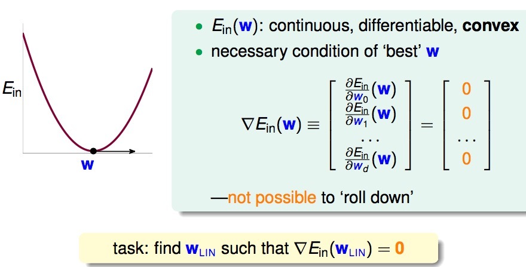

找到一个 W~LIN~,在各个方向偏微分为零

### The Gradient ▽E~in~(w)

假设我们的 w 是一维的，那么上面的式子就变成了一个一元二次方程，求微分就很简单，对 w 求导即可。如果 w 是一个向量，那么就可以按照如下的方式来进行对梯度的求解(其实和一维的情况很像)

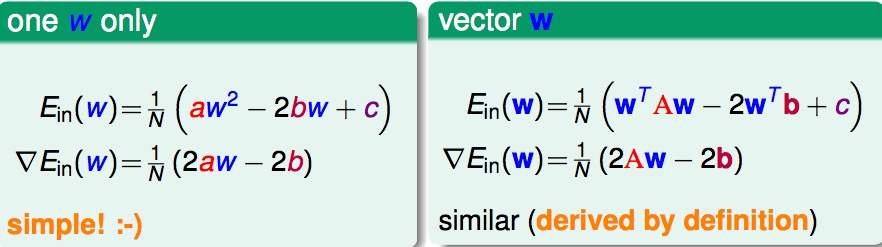

所以整个式子是这么写：

▽E~in~(w) = 2/N * (X^T^Xw - X^T^y)

### Optimal Linear Regression Weights

task: find W~LIN~ such that ▽E~in~(w) = 2/N * (X^T^Xw - X^T^y) = 0

如果 X^T^X 可逆的话，那么问题很简单(有唯一解)，可以直接求出 W~LIN~，并且大部分情况可能是如此。如果不可逆的话，就有很多组解，但是依然可以找到 pseudo-inverse，因此找到 W~LIN~

实际上，无论哪种情况，我们都可以很容易得到结果。因为许多现成的机器学习/数学库帮我们处理好了这个问题，只要我们直接调用相应的计算函数即可。有些库中把这种广义求逆矩阵运算成为 pseudo-inverse。

### Linear Regression Algorithm

有比较好的 pseudo-inverse 的话，这个算法非常简单有效

**一个习题**

### Is Linear Regression a 'Learning Algorithm'?

从某些角度来说，不算是，但是从某些角度来说，也是学习的算法

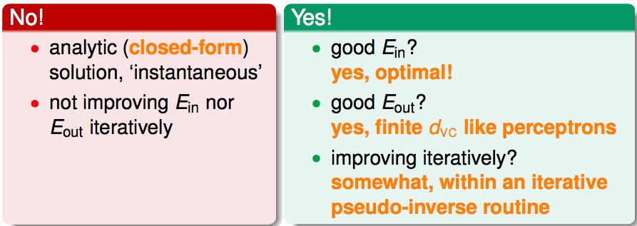

if E~out~(W~LIN~) is good, learning 'happened'!

### Benefit of Analytic Solution: 'Simpler-than-VC' Guarantee

接下来，我们试图求一下E~in~，E~out~ 的平均范围，会比求解VC bound更为简单。

### Geometric View of **Hat Matrix**

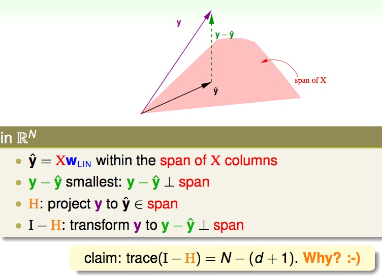

N 维的空间里，y 是在 N 维空间里的向量，那么我要做预测也就是y^hat^ = Xw~LIN~，w 做的事情就是把 X 的每一个 column 作线性组合，X 的每一个 column 也是一个N维的向量。也就是说，X 拿出每个 column 可以展开成在 N 维度里面一个小的空间，然后 y^hat^ 会在这个空间里面。Linear Regression 要做什么？希望y与y^hat^的差别越小越好，也就是 y – y^hat^ 垂直于这个小空间的时候。所以，H 这个矩阵的作用就是把任何一个向量 y 投影到 X 所展开的那个空间里；I-H 的作用就是求解任何一个向量 y 对于 X 所展开的空间的余数。

trace(I-H) 对角线上的值加起来是多少。trace(I – H)的物理意义：我们原来有一个n个自由度的向量，现在我们将其投影到d+1维的空间（因为X有d+1个向量展开），然后取余数，剩下的自由度最多就是N – (d + 1)。

注意到 E~in~ 算的是y – y^hat^，即垂直于平面的距离。而另一个角度来说，y 可以认为是真实的 f(X) + noise的向量，我们会发现将 noise 投影在平面上求解的垂直于平面的距离实际上也就是 y – y^hat^。也就是说，我们现在要求解的 E~in~ 其实就是把I – H 这个线性的变换用在 noise 上面。于是就可以得到E~in~的平均范围，E~out~ 平均范围的求解会相对复杂这里省略。

### The Learning Curve

通过 E~in~ 和 E~out~ 的式子通常就，可以画出一个图通常叫做学习曲线。所以，所谓的 generalization error 也就是 E~in~ 与 E~out~ 的差距，平均来说就是 2(d+1)/N。如果还记得的话，在有 d+1 个自由度时，VC bound最坏情况下是 d+1。所以 Linear regression的 学习真的已经发生了。

linear regression (LinReg): learning 'happened'!

**一个习题**

H: projection y to y^hat^

### Linear Classification vs. Linear Regression

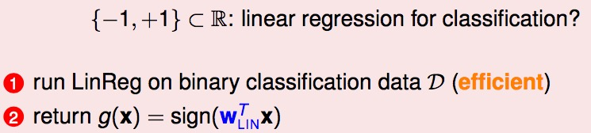

那能否直接用 Linear regression 来解分类问题就好？听起来有点道理。

之所以能够通过线程回归的方法来进行二值分类，是由于回归的 squared error 是分类的 0/1 error 的上界(平方的错误一定比0/1的错误大)

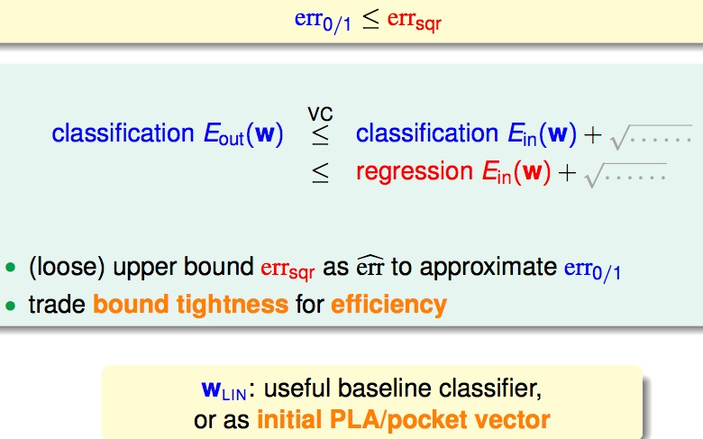

用一个宽松一点但是更好算的限制来简化。

我们通过优化 squared error，一定程度上也能得到不错的分类结果；或者，更好的选择是，将回归方法得到的 w 作为二值分类模型的初始 w 值。

W~LIN~: useful baseline classifier, or as initial PLA/pocket vector 用作一开始的 w~0~，就可以加速 PLA/pocket 的运算

**一个习题**

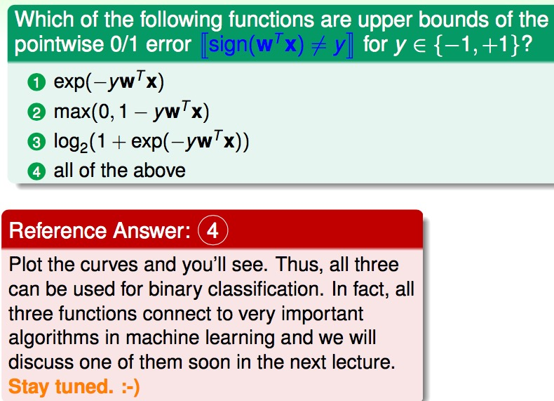

## Lecture 10: Logistic Regression

**gradient descent** on **cross-entropy error** to get good **logistic hypothesis**

有一组病人的数据，我们需要预测他们在一段时间后患上心脏病的“可能性”，就是我们要考虑的问题。通过二值分类，我们仅仅能够预测病人是否会患上心脏病，不同于此的是，现在我们还关心患病的可能性，即 f(x) = P(+1|x)，取值范围是区间 [0,1]。

然而，我们能够获取的训练数据却与二值分类完全一样，x 是病人的基本属性，y 是 +1(患心脏病)或 -1（没有患心脏病）。输入数据并没有告诉我们有关“概率” 的信息。在二值分类中，我们通过 w*x 得到一个 ”score” 后，通过取符号运算 sign 来预测 y 是 +1 或 -1。而对于当前问题，我们如过能够将这个 score 映射到[0,1] 区间，问题似乎就迎刃而解了。

same data as hard binary classification, different **target function**

我们手上的数据可以看成是我们想要资料的有噪声的版本，在噪声的基础上我们来找到最接近真实的情况

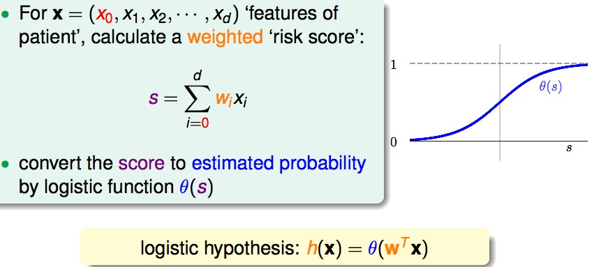

同样是根据权重算出一个分数，但是会通过另一个函数θ 来把这个分数映射到0到1的区间

### Logistic Function

平滑可微 S 形函数

**一个习题**

### Three Linear Models

linear scoring functions: s = w^T^x

how to define **E~in~(w) for logistic regression**?

### Likelihood

在机器学习假设中，数据集 D 是由 f 产生的，我们可以按照这个思路，考虑 f 和假设 h 生成训练数据 D 的概率是多少？首先要产生 x~1~，概率是 P(x~1~)，然后产生 y~1~，概率是 P(y~1~ | x~1~)。

这里可以对 P(o|x~1~) P(x|x~2~) ...进行代换，变成下面的形式

如何想要 h 与 f 很接近的话，那么 h 产生数据 D 的可能性与 f 真正产生这些数据的可能性就会很接近，训练数据的客观存在的，显然越有可能生成该数据集的假设越好。也就是 h 产生数据 D 的可能性是最高的。

logistic hypothesis有一个数学上的特性：1 - h(x) = h(-x)。所以 likelihood(h) 就可以化简为如下图所示，其中灰色的 P(x) 是一系列的常数。所以，likelihood(logistic h) 正比于如下的连乘。

利用上面的特性替换之后：

### Cross-Entropy Error

把上面的公式用 w 和 θ 代入之后，可以得到下面的公式

前面有 h(x) = θ(w^T^x)

但是这里是连乘，不是特别好处理，我们这里取对数，就可以把连乘变成连加

之前我们都做的是最小化，所以增加一个负号，变成最小化，然后在除以一个 N，做一个常数的 scaling

把 θ 具体代入到上面的公式，就可以得到

err(w, x, y) = ln(1 + exp(-ywx)) **cross-entropy error**

是一个 point-wise 的 error function

**一个习题**

### Minimizing E~in~(w)

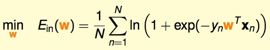

我们已经推导完了E~in~(w)，接下来的事情就是想办法找到 w 使得E~in~(w)是最小的。幸运的是，LR 的这个函数是 convex 的。求解最小值就是找到谷底梯度为0的地方。

第一步就是求梯度 ▽E~in~(w)

一步一步求解偏微分，微积分连锁率。这个是其中一个 component 的推导，然后对于整体来说，可以写成如下形式：用 x~n~ 代替 x~n,i~

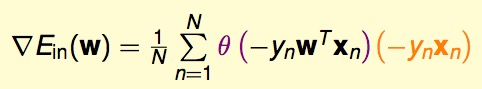

到这一步我们想要的就是让这个梯度为零

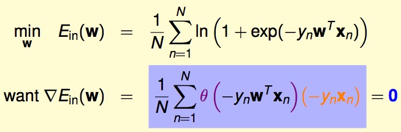

可以把梯度看成是一个以 θ 为权重的 y~n~x~n~ 的加权平均

梯度什么时候是 0？第一个可能是所有的 θ 都是零，也就是说 y~n~w^T^x~n~ 要接近正无限大；但是正常来说更多的是 weighted sum = 0，non-linear equation of w

这是一个困难的问题

想要上式等于零，一种情况是sigmoid 项恒为0，也就是所有的 ywx >> 0，这时要求数据时线性可分的（不能有噪音）。否则，需要迭代优化。回忆一下之前revised PLA求解超平面直观的优化方法：

**一个习题**

最小，代表 w 在 当前的 xy 上是错的，犯错的得到的权重特别大，梯度某种角度也代表了犯错在哪里。

### Iterative Optimization

梯度下降法是最经典、最常见的优化方法之一。要寻找目标函数曲线的波谷，采用贪心法：想象一个小人站在半山腰，他朝哪个方向跨一步，可以使他距离谷底更近（位置更低），就朝这个方向前进。这个方向可以通过微分得到。选择足够小的一段曲线，可以将这段看做直线段，那么有

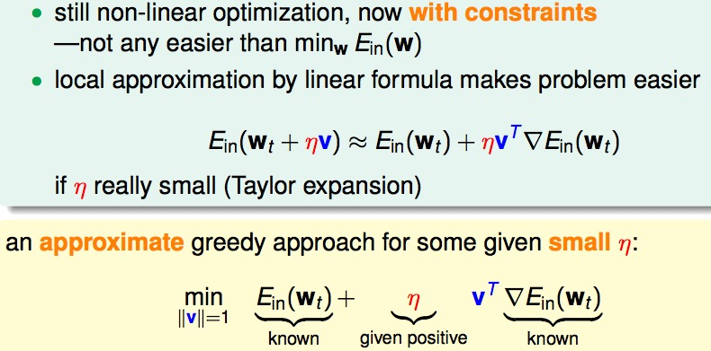

这样就把一个非线性的优化问题利用泰勒展开，变成了一个线性的问题，在η够小的时候。

所以，我们真正要要求解的是 v 乘上梯度如何才能越小越好。也就是 v 与梯度是完全的相反方向。想象一下：如果一条直线的斜率 k>0，说明向右是上升的方向，应该向左走；反之，斜率 k<0，向右走。

gradient descent: a simple & popular optimization tool

### Choice of η

η better be **monotonic of** || ▽E~in~(w~t~) ||

解决的方向问题，步幅η也很重要。步子太小的话，速度太慢；过大的话，容易发生抖动，可能到不了谷底。显然，距离谷底较远（位置较高）时，步幅大些比较好；接近谷底时，步幅小些比较好（以免跨过界）。距离谷底的远近可以通过梯度（斜率）的数值大小间接反映，接近谷底时，坡度会减小。因此，我们希望步幅与梯度数值大小正相关。原式子可以改写为：

### Putting Everything Together

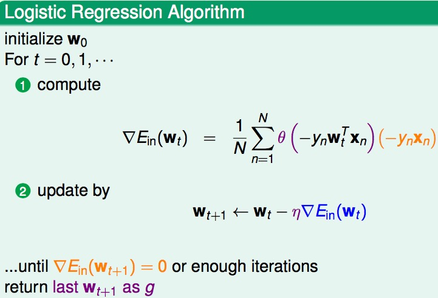

similar time complexity to **pocket** per iteration

**一个习题**

看前面的公式一个一个代入，最后后面是一样的，系数是 0.1 * θ(0) = 0.1 * 0.5 = 0.05，所以选第三个答案

## Lecture 11: Linear Models for Classification

### Linear Models Revisited

linear scoring functions: s = w^T^x

can linear regression or logistic regression **help linear classification**?

### Error-Functions Revisited

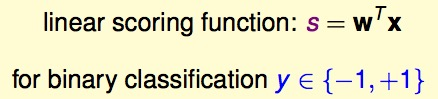

为了更方便地比较三个 model，对其 error function 做一定处理。接下来我们要做的事情就是看看这些 Error Function 跟 ys 的关系，在此之前我们先看看ys 的物理意义：y 代表正确与否 correctness，s 代表正确或错误的程度 score。

**Visulaizing Error Functions**

通过曲线来比较三个error function （注意：为了让Logistic Error Function 完全压在 0/1 的 Error Function 上，一般 cross-entropy 变为以2为底的 scaled cross-entropy），这样很容易通过比较三个 error function 来得到分类的 0/1 error 的上界。

### Theoretical Implication of Upper Bound

**Regression for Classification**

线性分类(PLA)、线性回归、逻辑回归的优缺点比较：

+ PLA
    + 优点：在数据线性可分时高效且准确。
    + 缺点：只有在数据线性可分时才可行，否则需要借助POCKET 算法（没有理论保证）。
+ 线性回归
    + 优点：最简单的优化（直接利用矩阵运算工具）
    + 缺点：y*s 的值较大时，与0/1 error 相差较大(loose bound)。
+ 逻辑回归
    + 优点：比较容易优化（梯度下降）
    + 缺点：y*s 是非常小的负数时，与0/1 error 相差较大。

实际中，逻辑回归用于分类的效果优于线性回归的方法和 POCKET 算法。线性回归得到的结果w 有时作为其他几种算法的初值。

**一个习题**

不 scale 之前有一部分是在 err 1/0 曲线之下的

### Two Iterative Optimization Schemes

每一轮迭代，logistic regression 的复杂度比 PLA 大很多(因为每次都要过一遍所有的点)，所以有没有一个办法，能降低复杂度呢？

### Stochastic Gradient Descent (SGD)

传统的随机梯度下降更新方法如下。每次更新都需要遍历所有data，当数据量太大或者一次无法获取全部数据时，这种方法并不可行。

我们希望用更高效的方法解决这个问题，基本思路是：只通过一个随机选取的数据(xn,yn) 来获取“梯度”，以此对 w 进行更新。这种优化方法叫做随机梯度下降。

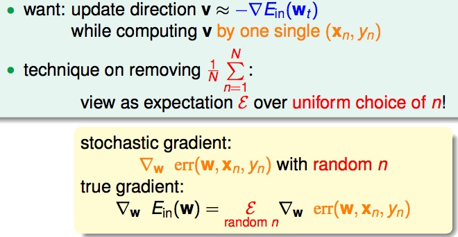

利用期望值的性质，在减少计算量的同时，保持比较高的正确率

stochastic gradient = true gradient + zero-mean 'noise' directions

这种方法在统计上的意义是：进行足够多的更新后，平均的随机梯度与平均的真实梯度近似相等。

注意：在这种优化方法中，一般设定一个足够大的迭代次数，算法执行这么多的次数时我们就认为已经收敛（防止不收敛的情况），η经验上的取值在0.1附近会比较合适。

**一个习题**

### Multiclass Classification

One Class at a Time

这方法有一个问题，就是用简单的二值分类，在交叉和没有覆盖到的区域，会有冲突，所以最要用 Soft 的方式，也就是用概率来表示。

与二值分类不同的是，我们如何将这些Model延伸来做多类别的分类。一种直观的解决方法是将其转化为多轮的二值分类问题：任意选择一个类作为+1，其他类都看做-1，在此条件下对原数据进行训练，得到w；经过多轮训练之后，得到多个 w，如下图得到四个分类器，每个都是一个概率的分类器。

可以看到下面的是一个概率，w~[k]~^T^ 表示第 k 个分类器，其实连 θ 都不用考虑(因为是单调的)，直接比较大小即可

### One-Versus-All (OVA) Decomposition

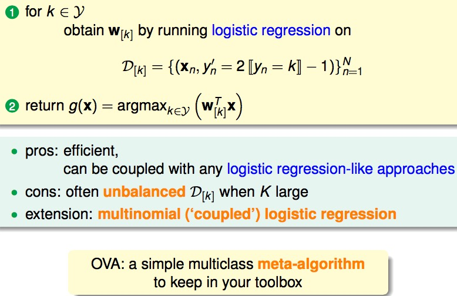

对于某个x，在有些时候4个分类器中只会有1个分类器说x就是它的类别；不过对于中间区域的点，4个分类器似乎都会说不是它们的类别，那该如何分类呢？这个时候，就将其分到可能性最大的那个类（例如逻辑回归对于x 属于某个类会有一个概率估计）。如果目标类别是k 个类标签，我们需要k 轮训练，得到k 个w。这种方法叫做One-Versus-All (OVA)。

它的最大缺点是，目标类很多时，每轮训练面对的数据往往非常不平衡(unbalanced)，因为每次训练都是当前类别的概率与其他K-1个类别的概率比较，会严重影响训练准确性。multinomial (‘coupled’) logistic regression 考虑了这个问题，感兴趣的话自学下吧。

**一个习题**

注意这个过程可以很容易并行

### One-versus-one(OVO) Decomposition

既然这样，One-Versus-All 会出现 Unbalanced 的情况，那么有一种方法叫做 One-Versus-One(OVO)尝试解决这个问题。

基本方法：每轮训练时，任取两个类别，一个作为+1，另一个作为-1，其他类别的数据不考虑，这样，同样用二值分类的方法进行训练；目标类有k个时，需要 `k*(k-1)/2` 轮训练，得到 `k*(k-1)/2` 个分类器。

**Multiclass Prediction: Combine Pairwise Classifiers**

预测：对于某个x，用训练得到的 `k*(k-1)/2` 个分类器分别对其进行预测，哪个类别被预测的次数最多，就把它作为最终结果。即通过“循环赛”的方式来决定哪个“类”是冠军。

显然，这种方法的优点是每轮训练面对更少、更平衡的数据，而且可以用任意二值分类方法进行训练；缺点是需要的轮数太多(k*(k-1)/2)，占用更多的存储空间，而且预测也更慢。

OVA 和 OVO 方法的思想都很简单，可以作为以后面对多值分类问题时的备选方案，并且可以为我们提供解决问题的思路。

**一个习题**

10 个类别，需要 `10*(10-1)/2 = 45` 个分类器，然后因为每个分类器只需要 2N/10 份的资料，所以一次计算的消耗是 N/5 的三次方，相乘之后就是第二个答案

