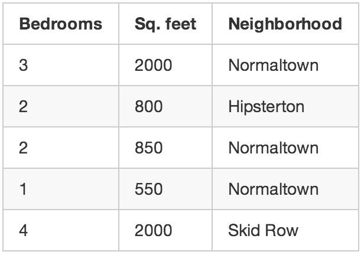
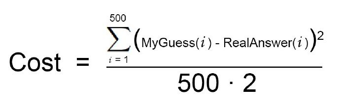
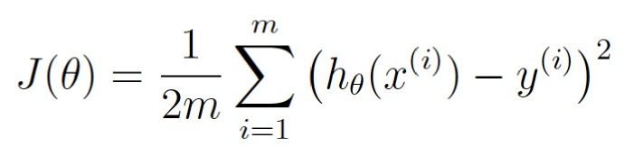

# 机器学习 学习指引

<!-- MarkdownTOC -->

- 最简明入门指南
    - 何为机器学习？
    - 两类机器学习算法
        - 监督式学习
        - 非监督式学习
    - 太酷了，但是评估房价真能被看作“学习”吗？
    - 让我们写代码吧!
        - 步骤 1
        - 步骤2：
        - 步骤3：
        - 思想扰动时间
        - 步骤3中的“尝试每个数字”怎么回事？
    - 还有什么你随便就略过了？
    - 机器学习法力无边吗？
    - 怎样深入学习机器学习
- 不大明白的部分

<!-- /MarkdownTOC -->

## 最简明入门指南

在听到人们谈论机器学习的时候，你是不是对它的涵义只有几个模糊的认识呢？你是不是已经厌倦了在和同事交谈时只能一直点头？让我们改变一下吧！

本指南的读者对象是所有对机器学习有求知欲但却不知道如何开头的朋友。我猜很多人已经读过了“机器学习”的维基百科词条，倍感挫折，以为没人能给出一个高层次的解释。本文就是你们想要的东西。

本文目标在于平易近人，这意味着文中有大量的概括。但是谁在乎这些呢？只要能让读者对于ML更感兴趣，任务也就完成了。

### 何为机器学习？

机器学习这个概念认为，对于待解问题，你无需编写任何专门的程序代码，遗传算法（generic algorithms）能够在数据集上为你得出有趣的答案。对于遗传算法，不用编码，而是将数据输入，它将在数据之上建立起它自己的逻辑。

举个例子，有一类算法称为分类算法，它可以将数据划分为不同的组别。一个用来识别手写数字的分类算法，不用修改一行代码，就可以用来将电子邮件分为垃圾邮件和普通邮件。算法没变，但是输入的训练数据变了，因此它得出了不同的分类逻辑。

机器学习算法是个黑盒，可以重用来解决很多不同的分类问题。

“机器学习”是一个涵盖性术语，覆盖了大量类似的遗传算法。

### 两类机器学习算法

你可以认为机器学习算法分为两大类：**监督式学习（Supervised Learning）**和**非监督式学习（Unsupervised Learning）**。两者区别很简单，但却非常重要。

#### 监督式学习

假设你是一名房产经纪，生意越做越大，因此你雇了一批实习生来帮你。但是问题来了——你可以看一眼房子就知道它到底值多少钱，实习生没有经验，不知道如何估价。

为了帮助你的实习生（也许是为了解放你自己去度个假），你决定写个小软件，可以根据房屋大小、地段以及类似房屋的成交价等因素来评估你所在地区房屋的价值。

你把3个月来城里每笔房屋交易都写了下来，每一单你都记录了一长串的细节——卧室数量、房屋大小、地段等等。但最重要的是，你写下了最终的成交价：

这是我们的“训练数据”。

我们要利用这些训练数据来编写一个程序来估算该地区其他房屋的价值：

这就称为监督式学习。你已经知道每一栋房屋的售价，换句话说，你知道问题的答案，并可以反向找出解题的逻辑。

为了编写软件，你将包含每一套房产的训练数据输入你的机器学习算法。算法尝试找出应该使用何种运算来得出价格数字。

这就像是算术练习题，算式中的运算符号都被擦去了：

看了这些题，你能明白这些测验里面是什么样的数学问题吗？你知道，你应该对算式左边的数字“做些什么”以得出算式右边的答案。

在监督式学习中，你是让计算机为你算出数字间的关系。而一旦你知道了解决这类特定问题所需要的数学方法后，你就可以解答同类的其它问题了。

#### 非监督式学习

让我们回到开头那个房地产经纪的例子。要是你不知道每栋房子的售价怎么办？即使你所知道的只是房屋的大小、位置等信息，你也可以搞出很酷的花样。这就是所谓的非监督式学习。

即使你不是想去预测未知的数据（如价格），你也可以运用机器学习完成一些有意思的事。
这就有点像有人给你一张纸，上面列出了很多数字，然后对你说:“我不知道这些数字有什么意义，也许你能从中找出规律或是能将它们分类，或是其它什么-祝你好运！”

你该怎么处理这些数据呢？首先，你可以用个算法自动地从数据中划分出不同的细分市场。也许你会发现大学附近的买房者喜欢户型小但卧室多的房子，而郊区的买房者偏好三卧室的大户型。这些信息可以直接帮助你的营销。

你还可以作件很酷的事，自动找出房价的离群数据，即与其它数据迥异的值。这些鹤立鸡群的房产也许是高楼大厦，而你可以将最优秀的推销员集中在这些地区，因为他们的佣金更高。

本文余下部分我们主要讨论监督式学习，但这并不是因为非监督式学习用处不大或是索然无味。实际上，随着算法改良，不用将数据和正确答案联系在一起，因此非监督式学习正变得越来越重要。

老学究请看:还有很多其它种类的机器学习算法。但初学时这样理解不错了。

### 太酷了，但是评估房价真能被看作“学习”吗？

作为人类的一员，你的大脑可以应付绝大多数情况，并且没有任何明确指令也能够学习如何处理这些情况。如果你做房产经纪时间很长，你对于房产的合适定价、它的最佳营销方式以及哪些客户会感兴趣等等都会有一种本能般的“感觉”。强人工智能（Strong AI）研究的目标就是要能够用计算机复制这种能力。

但是目前的机器学习算法还没有那么好——它们只能专注于非常特定的、有限的问题。也许在这种情况下，“学习”更贴切的定义是“在少量范例数据的基础上找出一个等式来解决特定的问题”。

不幸的是，“机器在少量范例数据的基础上找出一个等式来解决特定的问题”这个名字太烂了。所以最后我们用“机器学习”取而代之。

当然，要是你是在50年之后来读这篇文章，那时我们已经得出了强人工智能算法，而本文看起来就像个老古董。未来的人类，你还是别读了，叫你的机器仆人给你做份三明治吧。

### 让我们写代码吧!

前面例子中评估房价的程序，你打算怎么写呢？往下看之前，先思考一下吧。

如果你对机器学习一无所知，很有可能你会尝试写出一些基本规则来评估房价，如下：

    def estimate_house_sales_price(num_of_bedrooms, sqft, neighborhood):
      price = 0

      # In my area, the average house costs $200 per sqft
      price_per_sqft = 200

      if neighborhood == "hipsterton":
        # but some areas cost a bit more
        price_per_sqft = 400

      elif neighborhood == "skid row":
        # and some areas cost less
        price_per_sqft = 100

      # start with a base price estimate based on how big the place is
      price = price_per_sqft * sqft

      # now adjust our estimate based on the number of bedrooms
      if num_of_bedrooms == 0:
        # Studio apartments are cheap
        price = price — 20000
      else:
        # places with more bedrooms are usually
        # more valuable
        price = price + (num_of_bedrooms * 1000)

     return price

假如你像这样瞎忙几个小时，也许会取得一点成效，但是你的程序永不会完美，而且当价格变化时很难维护。

如果能让计算机找出实现上述函数功能的办法，这样岂不更好？只要返回的房价数字正确，谁会在乎函数具体干了些什么呢？

    def estimate_house_sales_price(num_of_bedrooms, sqft, neighborhood):
      price = <computer, plz do some math for me>

      return price

考虑这个问题的一种角度是将房价看做一碗美味的汤，而汤中成分就是卧室数、面积和地段。如果你能算出每种成分对最终的价格有多大影响，也许就能得到各种成分混合起来形成最终价格的具体比例。

这样可以将你最初的程序（全是疯狂的if else语句）简化成类似如下的样子：

    def estimate_house_sales_price(num_of_bedrooms, sqft, neighborhood):
     price = 0

     # a little pinch of this
     price += num_of_bedrooms * .841231951398213

     # and a big pinch of that
     price += sqft * 1231.1231231

     # maybe a handful of this
     price += neighborhood * 2.3242341421

     # and finally, just a little extra salt for good measure
     price += 201.23432095

     return price

请注意那些用粗体标注的神奇数字——.841231951398213, 1231.1231231,2.3242341421, 和201.23432095。它们称为权重。如果我们能找出对每栋房子都适用的完美权重，我们的函数就能预测所有的房价！

找出最佳权重的一种笨办法如下所示：

#### 步骤 1

首先，将每个权重都设为1.0：

    def estimate_house_sales_price(num_of_bedrooms, sqft, neighborhood):
      price = 0

      # a little pinch of this
      price += num_of_bedrooms * 1.0

      # and a big pinch of that
      price += sqft * 1.0

      # maybe a handful of this
      price += neighborhood * 1.0

      # and finally, just a little extra salt for good measure
      price += 1.0

      return price

#### 步骤2：

将每栋房产带入你的函数运算，检验估算值与正确价格的偏离程度：

例如：上表中第一套房产实际成交价为25万美元，你的函数估价为17.8万，这一套房产你就差了7.2万。

再将你的数据集中的每套房产估价偏离值平方后求和。假设数据集中有500套房产交易，估价偏离值平方求和总计为86,123,373美元。这就反映了你的函数现在的“正确”程度。

现在，将总计值除以500，得到每套房产的估价偏离平均值。将这个平均误差值称为你函数的代价。

如果你能调整权重使得这个代价变为0，你的函数就完美了。它意味着，根据输入的数据，你的程序对每一笔房产交易的估价都是分毫不差。而这就是我们的目标——尝试不同的权重值以使代价尽可能的低。

#### 步骤3：

不断重复步骤2，尝试所有可能的权重值组合。哪一个组合使得代价最接近于0，它就是你要使用的，你只要找到了这样的组合，问题就得到了解决!

#### 思想扰动时间

这太简单了，对吧？想一想刚才你做了些什么。你取得了一些数据，将它们输入至三个通用的简单步骤中，最后你得到了一个可以对你所在区域的房屋进行估价的函数。房价网，要当心咯！
但是下面的事实可能会扰乱你的思想：

1. 过去40年来，很多领域（如语言学/翻译学）的研究表明，这种通用的“搅动数据汤”（我编造的词）式的学习算法已经胜过了需要利用真人明确规则的方法。机器学习的“笨”办法最终打败了人类专家。
2. 你最后写出的函数真是笨，它甚至不知道什么是“面积”和“卧室数”。它知道的只是搅动，改变数字来得到正确的答案。
3. 很可能你都不知道为何一组特殊的权重值能起效。所以你只是写出了一个你实际上并不理解却能证明的函数。
4. 试想一下，你的程序里没有类似“面积”和“卧室数”这样的参数，而是接受了一组数字。假设每个数字代表了你车顶安装的摄像头捕捉的画面中的一个像素，再将预测的输出不称为“价格”而是叫做“方向盘转动度数”，这样你就得到了一个程序可以自动操纵你的汽车了！

太疯狂了，对吧？

#### 步骤3中的“尝试每个数字”怎么回事？

好吧，当然你不可能尝试所有可能的权重值来找到效果最好的组合。那可真要花很长时间，因为要尝试的数字可能无穷无尽。

为避免这种情况，数学家们找到了很多聪明的办法来快速找到优秀的权重值，而不需要尝试过多。下面是其中一种：

首先，写出一个简单的等式表示前述步骤2：

这是你的代价函数。

接着，让我们将这同一个等式用机器学习的数学术语（现在你可以忽略它们）进行重写：

θ表示当前的权重值。 J(θ) 意为“当前权重值对应的代价”。

这个等式表示我们的估价程序在当前权重值下偏离程度的大小。如果将所有赋给卧室数和面积的可能权重值以图形形式显示，我们会得到类似下图的图表：

代价函数的图形像一支碗。纵轴表示代价。

图中蓝色的最低点就是代价最低的地方——即我们的程序偏离最小。最高点意味着偏离最大。所以，如果我们能找到一组权重值带领我们到达图中的最低点，我们就找到了答案！

因此，我们只需要调整权重值使我们在图上能向着最低点“走下坡路”。如果对于权重的细小调节能一直使我们保持向最低点移动，那么最终我们不用尝试太多权重值就能到达那里。

如果你还记得一点微积分的话，你也许记得如果你对一个函数求导，结果会告诉你函数在任一点的斜率。换句话说，对于图上给定一点，它告诉我们那条路是下坡路。我们可以利用这一点朝底部进发。

所以，如果我们对代价函数关于每一个权重求偏导，那么我们就可以从每一个权重中减去该值。这样可以让我们更加接近山底。一直这样做，最终我们将到达底部，得到权重的最优值。（读不懂？不用担心，接着往下读）。

这种找出最佳权重的办法被称为批量梯度下降，上面是对它的高度概括。如果想搞懂细节，不要害怕，继续深入下去吧。

当你使用机器学习算法库来解决实际问题，所有这些都已经为你准备好了。但明白一些具体细节总是有用的。

### 还有什么你随便就略过了？

上面我描述的三步算法被称为多元线性回归。你估算等式是在求一条能够拟合所有房价数据点的直线。然后，你再根据房价在你的直线上可能出现的位置用这个等式来估算从未见过的房屋的价格。这个想法威力强大，可以用它来解决“实际”问题。

但是，我为你展示的这种方法可能在简单的情况下有效，它不会在所有情况下都有用。原因之一是因为房价不会一直那么简单地跟随一条连续直线。

但是，幸运的是，有很多办法来处理这种情况。对于非线性数据，很多其他类型的机器学习算法可以处理（如神经网络或有核向量机）。还有很多方法运用线性回归更灵活，想到了用更复杂的线条来拟合。在所有的情况中，寻找最优权重值这一基本思路依然适用。

还有，我忽略了过拟合的概念。很容易碰上这样一组权重值，它们对于你原始数据集中的房价都能完美预测，但对于原始数据集之外的任何新房屋都预测不准。这种情况的解决之道也有不少（如正则化以及使用交叉验证数据集）。学会如何处理这一问题对于顺利应用机器学习至关重要。

换言之，基本概念非常简单，要想运用机器学习得到有用的结果还需要一些技巧和经验。但是，这是每个开发者都能学会的技巧。

### 机器学习法力无边吗？

一旦你开始明白机器学习技术很容易应用于解决貌似很困难的问题（如手写识别），你心中会有一种感觉，只要有足够的数据，你就能够用机器学习解决任何问题。只需要将数据输入进去，就能看到计算机变戏法一样找出拟合数据的等式。

但是很重要的一点你要记住，机器学习只能对用你占有的数据实际可解的问题才适用。

例如，如果你建立了一个模型来根据每套房屋内盆栽数量来预测房价，它就永远不会成功。房屋内盆栽数量和房价之间没有任何的关系。所以，无论它怎么去尝试，计算机也推导不出两者之间的关系。

你只能对实际存在的关系建模。

### 怎样深入学习机器学习

我认为，当前机器学习的最大问题是它主要活跃于学术界和商业研究组织中。对于圈外想要有个大体了解而不是想成为专家的人们，简单易懂的学习资料不多。但是这一情况每一天都在改善。

吴恩达教授（Andrew Ng）在Coursera上的机器学习免费课程非常不错。我强烈建议由此入门。任何拥有计算机科学学位、还能记住一点点数学的人应该都能理解。

另外，你还可以下载安装SciKit-Learn，用它来试验成千上万的机器学习算法。它是一个python框架，对于所有的标准算法都有“黑盒”版本。

## 不大明白的部分

+ SVM
+ AdaBoost

只要学习机器学习，一定会看的书籍我推荐一下:

+ Mitchell 的《机器学习》。Mitchell是机器学习的鼻祖，第一个提出机器学习概念的人。这本书很薄，很简单。内容很陈旧，但是都是机器学习的经典问题。而且，这本书概念清晰正确(很可贵啊，又简单又正确的书，说明作者功力很强)。
+ Simon Haykin的《神经网络与机器学习》。 事实上，现在常见的很多机器学习算法都发端于神经网络，像SVM，深度学习，CNN等等。这本书详细的介绍了神经网络及其相关算法的所有细节。如果想深入了解的话，可以看一下。只想运用的话，也可以随便翻翻算法的介绍。
+ AIMA，《人工智能：一种现代的方法》。基本上学术界的人们都认为机器学习是人工智能学科的下属分支(另一部分人认为是统计学或者数学的分支)，所以，一本人工智能的书也是学习机器学习可以参考的方面。

