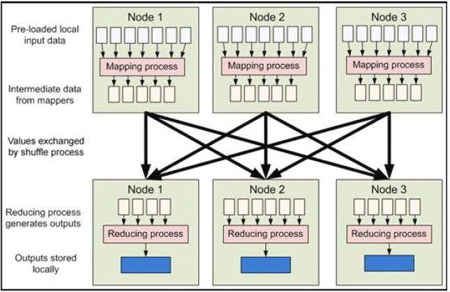

# Hadoop 原理学习

Hadoop是Apache 下的一个项目，由HDFS、MapReduce、HBase、Hive 和ZooKeeper等成员组成。其中，HDFS 和MapReduce 是两个最基础最重要的成员。

HDFS是Google GFS 的开源版本，一个高度容错的分布式文件系统，它能够提供高吞吐量的数据访问，适合存储海量（PB 级）的大文件（通常超过64M），其原理如下图所示：

采用Master/Slave 结构。NameNode 维护集群内的元数据，对外提供创建、打开、删除和重命名文件或目录的功能。DataNode 存储数据，并提负责处理数据的读写请求。DataNode定期向NameNode 上报心跳，NameNode 通过响应心跳来控制DataNode。

Hadoop MapReduce的实现也采用了Master/Slave 结构。Master 叫做JobTracker，而Slave 叫做TaskTracker。用户提交的计算叫做Job，每一个Job会被划分成若干个Tasks。JobTracker负责Job 和Tasks 的调度，而TaskTracker负责执行Tasks。

## Shuffle 和 Sort 分析

MapReduce 框架的核心步骤主要分两部分：Map 和Reduce。当你向MapReduce 框架提交一个计算作业时，它会首先把计算作业拆分成若干个Map 任务，然后分配到不同的节点上去执行，每一个Map 任务处理输入数据中的一部分，当Map 任务完成后，它会生成一些中间文件，这些中间文件将会作为Reduce 任务的输入数据。Reduce 任务的主要目标就是把前面若干个Map 的输出汇总到一起并输出。从高层抽象来看，MapReduce的数据流图如下图所示：

在本文中，Shuffle是指从Map产生输出开始，包括系统执行排序以及传送Map输出到Reducer作为输入的过程。在这里我们将去探究Shuffle是如何工作的，因为对基础的理解有助于对MapReduce程序进行调优。

首先从Map端开始分析，当Map开始产生输出的时候，他并不是简单的把数据写到磁盘，因为频繁的操作会导致性能严重下降，他的处理更加复杂，数据首先是写到内存中的一个缓冲区，并作一些预排序，以提升效率，如图：

每个Map任务都有一个用来写入输出数据的循环内存缓冲区，这个缓冲区默认大小是100M，可以通过io.sort.mb属性来设置具体的大小，当缓冲区中的数据量达到一个特定的阀值(io.sort.mb * io.sort.spill.percent，其中io.sort.spill.percent 默认是0.80)时，系统将会启动一个后台线程把缓冲区中的内容spill 到磁盘。在spill过程中，Map的输出将会继续写入到缓冲区，但如果缓冲区已经满了，Map就会被阻塞直道spill完成。spill线程在把缓冲区的数据写到磁盘前，会对他进行一个二次排序，首先根据数据所属的partition排序，然后每个partition中再按Key排序。输出包括一个索引文件和数据文件，如果设定了Combiner，将在排序输出的基础上进行。Combiner就是一个Mini Reducer，它在执行Map任务的节点本身运行，先对Map的输出作一次简单的Reduce，使得Map的输出更紧凑，更少的数据会被写入磁盘和传送到Reducer。Spill文件保存在由mapred.local.dir指定的目录中，Map任务结束后删除。

每当内存中的数据达到spill阀值的时候，都会产生一个新的spill文件，所以在Map任务写完他的最后一个输出记录的时候，可能会有多个spill文件，在Map任务完成前，所有的spill文件将会被归并排序为一个索引文件和数据文件。如下图所示。这是一个多路归并过程，最大归并路数由io.sort.factor 控制(默认是10)。如果设定了Combiner，并且spill文件的数量至少是3（由min.num.spills.for.combine 属性控制），那么Combiner 将在输出文件被写入磁盘前运行以压缩数据。

对写入到磁盘的数据进行压缩（这种压缩同Combiner 的压缩不一样）通常是一个很好的方法，因为这样做使得数据写入磁盘的速度更快，节省磁盘空间，并减少需要传送到Reducer 的数据量。默认输出是不被压缩的， 但可以很简单的设置mapred.compress.map.output为true 启用该功能。压缩所使用的库由mapred.map.output.compression.codec来设定

当spill 文件归并完毕后，Map 将删除所有的临时spill 文件，并告知TaskTracker 任务已完成。Reducers 通过HTTP 来获取对应的数据。用来传输partitions 数据的工作线程个数由tasktracker.http.threads 控制，这个设定是针对每一个TaskTracker 的，并不是单个Map，默认值为40，在运行大作业的大集群上可以增大以提升数据传输速率。

现在让我们转到Shuffle的Reduce部分。Map的输出文件放置在运行Map任务的TaskTracker的本地磁盘上（注意：Map输出总是写到本地磁盘，但是Reduce输出不是，一般是写到HDFS），它是运行Reduce任务的TaskTracker所需要的输入数据。Reduce任务的输入数据分布在集群内的多个Map任务的输出中，Map任务可能会在不同的时间内完成，只要有其中一个Map任务完成，Reduce任务就开始拷贝他的输出。这个阶段称为拷贝阶段，Reduce任务拥有多个拷贝线程，可以并行的获取Map输出。可以通过设定mapred.reduce.parallel.copies来改变线程数。

Reduce是怎么知道从哪些TaskTrackers中获取Map的输出呢？当Map任务完成之后，会通知他们的父TaskTracker，告知状态更新，然后TaskTracker再转告JobTracker，这些通知信息是通过心跳通信机制传输的，因此针对以一个特定的作业，jobtracker知道Map输出与tasktrackers的映射关系。Reducer中有一个线程会间歇的向JobTracker询问Map输出的地址，直到把所有的数据都取到。在Reducer取走了Map输出之后，TaskTracker不会立即删除这些数据，因为Reducer可能会失败，他们会在整个作业完成之后，JobTracker告知他们要删除的时候才去删除。

如果Map输出足够小，他们会被拷贝到Reduce TaskTracker的内存中（缓冲区的大小由mapred.job.shuffle.input.buffer.percnet控制），或者达到了Map输出的阀值的大小(由mapred.inmem.merge.threshold控制)，缓冲区中的数据将会被归并然后spill到磁盘。

拷贝来的数据叠加在磁盘上，有一个后台线程会将它们归并为更大的排序文件，这样做节省了后期归并的时间。对于经过压缩的Map 输出，系统会自动把它们解压到内存方便对其执行归并。

当所有的Map 输出都被拷贝后，Reduce 任务进入排序阶段（更恰当的说应该是归并阶段，因为排序在Map 端就已经完成），这个阶段会对所有的Map 输出进行归并排序，这个工作会重复多次才能完成。

假设这里有50 个Map 输出（可能有保存在内存中的），并且归并因子是10（由io.sort.factor控制，就像Map 端的merge 一样），那最终需要5 次归并。每次归并会把10个文件归并为一个，最终生成5 个中间文件。在这一步之后，系统不再把5 个中间文件归并成一个，而是排序后直接“喂”给Reduce 函数，省去向磁盘写数据这一步。最终归并的数据可以是混合数据，既有内存上的也有磁盘上的。由于归并的目的是归并最少的文件数目，使得在最后一次归并时总文件个数达到归并因子的数目，所以每次操作所涉及的文件个数在实际中会更微妙些。譬如，如果有40 个文件，并不是每次都归并10 个最终得到4 个文件，相反第一次只归并4 个文件，然后再实现三次归并，每次10 个，最终得到4 个归并好的文件和6 个未归并的文件。要注意，这种做法并没有改变归并的次数，只是最小化写入磁盘的数据优化措施，因为最后一次归并的数据总是直接送到Reduce 函数那里。在Reduce 阶段，Reduce 函数会作用在排序输出的每一个key 上。这个阶段的输出被直接写到输出文件系统，一般是HDFS。在HDFS 中，因为TaskTracker 节点也运行着一个DataNode 进程，所以第一个块备份会直接写到本地磁盘。到此，MapReduce 的Shuffle 和Sort 分析完毕。

## 工作原理

+ Client: 作业提交发起者。
+ JobTracker: 初始化作业，分配作业，与TaskTracker通信，协调整个作业。
+ TaskTracker: 保持JobTracker通信，在分配的数据片段上执行MapReduce任务。

提交作业

+ 在作业提交之前，需要对作业进行配置
+ 程序代码，主要是自己书写的MapReduce程序。
+ 输入输出路径
+ 其他配置，如输出压缩等。
+ 配置完成后，通过JobClinet来提交

作业的初始化

+ 客户端提交完成后，JobTracker会将作业加入队列，然后进行调度，默认的调度方法是FIFO调试方式。

任务的分配

+ TaskTracker和JobTracker之间的通信与任务的分配是通过心跳机制完成的。
+ TaskTracker会主动向JobTracker询问是否有作业要做，如果自己可以做，那么就会申请到作业任务，这个任务可以使Map也可能是Reduce任务。

任务的执行

+ 申请到任务后，TaskTracker会做如下事情：
    + 拷贝代码到本地
    + 拷贝任务的信息到本地
    + 启动JVM运行任务

状态与任务的更新

+ 任务在运行过程中，首先会将自己的状态汇报给TaskTracker，然后由TaskTracker汇总告之JobTracker。
+ 任务进度是通过计数器来实现的。

作业的完成

+ JobTracker是在接受到最后一个任务运行完成后，才会将任务标志为成功。
+ 此时会做删除中间结果等善后处理工作。

## 错误处理

任务失败

+ MapReduce在设计之出，就假象任务会失败，所以做了很多工作，来保证容错。
+ 一种情况: 子任务失败
+ 另一种情况: 子任务的JVM突然退出
+ 任务的挂起

TaskTracker失败

+ TaskTracker崩溃后会停止向Jobtracker发送心跳信息。
+ Jobtracker会将该TaskTracker从等待的任务池中移除。并将该TaskTracker上的任务，移动到其他地方去重新运行。
+ TaskTracker可以被JobTracker放入到黑名单，即使它没有失败。

JobTracker失败

+ 单点故障，Hadoop新的0.23版本解决了这个问题。

## 作业调度

+ FIFO: Hadoop 中默认的调度器，它先按照作业的优先级高低，再按照到达时间的先后选 择被执行的作业
+ 公平调度器: 为任务分配资源的方法，其目的是随着时间的推移，让提交的作业获取等量的集 群共享资源，让用户公平地共享集群。具体做法是：当集群上只有一个任务在运行 时，它将使用整个集群，当有其他作业提交时，系统会将TaskTracker节点空间的时 间片分配给这些新的作业，并保证每个任务都得到大概等量的CPU时间。
+ 容量调度器: 支持多个队列，每个队列可配置一定的资源量，每个队列采用 FIFO 调度策略，为 了防止同一个用户的作业独占队列中的资源，该调度器会对同一用户提交 的作业所 占资源量进行限定。调度时，首先按以下策略选择一个合适队列：计算每个队列中正在运行的任务数与其应该分得的计算资源之间的比值，选择一个该比值最小的队列；然后按以下策略选择该队列中一个作业：按照作业优先级和提交时间顺序选择 ，同时考虑用户资源量限制和内存限制。但是不可剥夺式

## Shuffle & Sort

Mapreduce 的 map 结束后，把数据重新组织，作为 reduce 阶段的输入，该过程称之为shuffle-- 洗牌。而数据在 Map 与 Reduce 端都会做排序。

Map

+ Map 的输出是由collector控制的
+ 我们从collect函数入手

Reduce

+ reduce的Shuffle过程，分成三个阶段：复制Map输出、排序合并、reduce处理。
+ 主要代码在reduce的 run函数

Shuffle优化

+ 首先Hadoop的Shuffle在某些情况并不是最优的，例如，如果需要对2集合合并，那么其实排序操作时不需要的。
+ 我们可以通过调整参数来优化Shuffle
+ Map端: io.sort.mb
+ Reduce端: mapred.job.reduce.input.buffer.percent

## 任务的执行时的一些特有的概念

推测式执行

+ 每一道作业的任务都有运行时间，而由于机器的异构性，可能会会造成某些任务会比所有任务的平均运行时间要慢很多。
+ 这时MapReduce会尝试在其他机器上重启慢的任务。为了是任务快速运行完成。
+ 该属性默认是启用的。

JVM重用

+ 启动JVM是一个比较耗时的工作，所以在MapReduce中有JVM重用的机制。
+ 条件是统一个作业的任务。
+ 可以通过mapred.job.reuse.jvm.num.tasks定义重用次数，如果属性是-1那么为无限制。

跳过坏记录

+ 数据的一些记录不符合规范，处理时抛出异常，MapReduce可以讲次记录标为坏记录。重启任务时会跳过该记录。
+ 默认情况下该属性是关闭的。

任务执行环境

+ Hadoop为Map与Reduce任务提供运行环境。
+ 如：Map可以知道自己的处理的文件
+ 问题：多个任务可能会同时写一个文件
+ 解决办法：将输出写到任务的临时文件夹。目录为：{mapred.out. put.dir}/temp/${mapred.task.id}

## 流程分析

Map端：

1. 每个输入分片会让一个map任务来处理，默认情况下，以HDFS的一个块的大小（默认为64M）为一个分片，当然我们也可以设置块的大小。map输出的结果会暂且放在一个环形内存缓冲区中（该缓冲区的大小默认为100M，由io.sort.mb属性控制），当该缓冲区快要溢出时（默认为缓冲区大小的80%，由io.sort.spill.percent属性控制），会在本地文件系统中创建一个溢出文件，将该缓冲区中的数据写入这个文件。
2. 在写入磁盘之前，线程首先根据reduce任务的数目将数据划分为相同数目的分区，也就是一个reduce任务对应一个分区的数据。这样做是为了避免有些reduce任务分配到大量数据，而有些reduce任务却分到很少数据，甚至没有分到数据的尴尬局面。其实分区就是对数据进行hash的过程。然后对每个分区中的数据进行排序，如果此时设置了Combiner，将排序后的结果进行Combia操作，这样做的目的是让尽可能少的数据写入到磁盘。
3. 当map任务输出最后一个记录时，可能会有很多的溢出文件，这时需要将这些文件合并。合并的过程中会不断地进行排序和combin操作，目的有两个：1.尽量减少每次写入磁盘的数据量；2.尽量减少下一复制阶段网络传输的数据量。最后合并成了一个已分区且已排序的文件。为了减少网络传输的数据量，这里可以将数据压缩，只要将mapred.compress.map.out设置为true就可以了。
4. 将分区中的数据拷贝给相对应的reduce任务。有人可能会问：分区中的数据怎么知道它对应的reduce是哪个呢？其实map任务一直和其父TaskTracker保持联系，而TaskTracker又一直和JobTracker保持心跳。所以JobTracker中保存了整个集群中的宏观信息。只要reduce任务向JobTracker获取对应的map输出位置就ok了哦。

到这里，map端就分析完了。那到底什么是Shuffle呢？Shuffle的中文意思是“洗牌”，如果我们这样看：一个map产生的数据，结果通过hash过程分区却分配给了不同的reduce任务，是不是一个对数据洗牌的过程呢？呵呵。

Reduce端：

1. Reduce会接收到不同map任务传来的数据，并且每个map传来的数据都是有序的。如果reduce端接受的数据量相当小，则直接存储在内存中（缓冲区大小由mapred.job.shuffle.input.buffer.percent属性控制，表示用作此用途的堆空间的百分比），如果数据量超过了该缓冲区大小的一定比例（由mapred.job.shuffle.merge.percent决定），则对数据合并后溢写到磁盘中。
2. 随着溢写文件的增多，后台线程会将它们合并成一个更大的有序的文件，这样做是为了给后面的合并节省时间。其实不管在map端还是reduce端，MapReduce都是反复地执行排序，合并操作，现在终于明白了有些人为什么会说：排序是hadoop的灵魂。
3. 合并的过程中会产生许多的中间文件（写入磁盘了），但MapReduce会让写入磁盘的数据尽可能地少，并且最后一次合并的结果并没有写入磁盘，而是直接输入到reduce函数。
