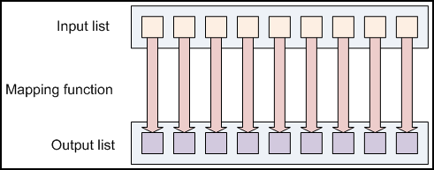

# Hadoop Tutorial

<!-- MarkdownTOC -->

- The Hadoop Approach
    - Data Distribution
    - MapReduce: Isolated Processes
- The Hadoop Distributed File System
    - Architecture
    - Namenode
    - Datanode
    - Block
    - Detail
- MapReduce
    - MapReduce Basics
        - Functional Programming Concepts
        - List Processing
        - Mapping Lists
        - Reducing Lists
        - Putting Them Together in MapReduce
    - An Example Application: Word Count
    - The Driver Method
- MapReduce Data Flow
    - A Closer Look
    - Additional MapReduce Functionality
    - Fault Tolerance

<!-- /MarkdownTOC -->

## The Hadoop Approach

Hadoop is designed to efficiently process large volumes of information by connecting many commodity computers together to work in parallel.

### Data Distribution

In a Hadoop cluster, data is distributed to all the nodes of the cluster as it is being loaded in. The Hadoop Distributed File System (HDFS) will split large data files into chunks which are managed by different nodes in the cluster. In addition to this each chunk is replicated across several machines, so that a single machine failure does not result in any data being unavailable. An active monitoring system then re-replicates the data in response to system failures which can result in partial storage. Even though the file chunks are replicated and distributed across several machines, they form a single namespace, so their contents are universally accessible.

Data is conceptually record-oriented in the Hadoop programming framework. Individual input files are broken into lines or into other formats specific to the application logic. Each process running on a node in the cluster then processes a subset of these records. The Hadoop framework then schedules these processes in proximity to the location of data/records using knowledge from the distributed file system. Since files are spread across the distributed file system as chunks, each compute process running on a node operates on a subset of the data. Which data operated on by a node is chosen based on its locality to the node: most data is read from the local disk straight into the CPU, alleviating strain on network bandwidth and preventing unnecessary network transfers. This strategy of moving computation to the data, instead of moving the data to the computation allows Hadoop to achieve high data locality which in turn results in high performance.

### MapReduce: Isolated Processes

Hadoop limits the amount of communication which can be performed by the processes, as each individual record is processed by a task in isolation from one another. While this sounds like a major limitation at first, it makes the whole framework much more reliable. Hadoop will not run just any program and distribute it across a cluster. Programs must be written to conform to a particular programming model, named "MapReduce."

In MapReduce, records are processed in isolation by tasks called Mappers. The output from the Mappers is then brought together into a second set of tasks called Reducers, where results from different mappers can be merged together.

Separate nodes in a Hadoop cluster still communicate with one another. However, in contrast to more conventional distributed systems where application developers explicitly marshal byte streams from node to node over sockets or through MPI buffers, communication in Hadoop is performed implicitly. Pieces of data can be tagged with key names which inform Hadoop how to send related bits of information to a common destination node. Hadoop internally manages all of the data transfer and cluster topology issues.

By restricting the communication between nodes, Hadoop makes the distributed system much more reliable. Individual node failures can be worked around by restarting tasks on other machines. Since user-level tasks do not communicate explicitly with one another, no messages need to be exchanged by user programs, nor do nodes need to roll back to pre-arranged checkpoints to partially restart the computation. The other workers continue to operate as though nothing went wrong, leaving the challenging aspects of partially restarting the program to the underlying Hadoop layer.

## The Hadoop Distributed File System

### Architecture

Given below is the architecture of a Hadoop File System.

HDFS follows the master-slave architecture and it has the following elements.

### Namenode

he namenode is the commodity hardware that contains the GNU/Linux operating system and the namenode software. It is a software that can be run on commodity hardware. The system having the namenode acts as the master server and it does the following tasks:

+ Manages the file system namespace.
+ Regulates client’s access to files.
+ It also executes file system operations such as renaming, closing, and opening files and directories.

### Datanode

The datanode is a commodity hardware having the GNU/Linux operating system and datanode software. For every node (Commodity hardware/System) in a cluster, there will be a datanode. These nodes manage the data storage of their system.

+ Datanodes perform read-write operations on the file systems, as per client request.
+ They also perform operations such as block creation, deletion, and replication according to the instructions of the namenode.

### Block

Generally the user data is stored in the files of HDFS. The file in a file system will be divided into one or more segments and/or stored in individual data nodes. These file segments are called as blocks. In other words, the minimum amount of data that HDFS can read or write is called a Block. The default block size is 64MB, but it can be increased as per the need to change in HDFS configuration.

### Detail

HDFS, the Hadoop Distributed File System, is a distributed file system designed to hold very large amounts of data (terabytes or even petabytes), and provide high-throughput access to this information. Files are stored in a redundant fashion across multiple machines to ensure their durability to failure and high availability to very parallel applications.

HDFS is designed to be robust to a number of the problems that other DFS's such as NFS are vulnerable to. In particular:

+ HDFS is designed to store a very large amount of information (terabytes or petabytes). This requires spreading the data across a large number of machines. It also supports much larger file sizes than NFS.
+ HDFS should store data reliably. If individual machines in the cluster malfunction, data should still be available.
+ HDFS should provide fast, scalable access to this information. It should be possible to serve a larger number of clients by simply adding more machines to the cluster.
+ HDFS should integrate well with Hadoop MapReduce, allowing data to be read and computed upon locally when possible.

But while HDFS is very scalable, its high performance design also restricts it to a particular class of applications; it is not as general-purpose as NFS. There are a large number of additional decisions and trade-offs that were made with HDFS. In particular:

+ Applications that use HDFS are assumed to perform long sequential streaming reads from files. HDFS is optimized to provide streaming read performance; this comes at the expense of random seek times to arbitrary positions in files.
+ Data will be written to the HDFS once and then read several times; updates to files after they have already been closed are not supported. (An extension to Hadoop will provide support for appending new data to the ends of files; it is scheduled to be included in Hadoop 0.19 but is not available yet.)
+ Due to the large size of files, and the sequential nature of reads, the system does not provide a mechanism for local caching of data. The overhead of caching is great enough that data should simply be re-read from HDFS source.
+ Individual machines are assumed to fail on a frequent basis, both permanently and intermittently. The cluster must be able to withstand the complete failure of several machines, possibly many happening at the same time (e.g., if a rack fails all together). While performance may degrade proportional to the number of machines lost, the system as a whole should not become overly slow, nor should information be lost. Data replication strategies combat this problem.

HDFS is a block-structured file system: individual files are broken into blocks of a fixed size. These blocks are stored across a cluster of one or more machines with data storage capacity. Individual machines in the cluster are referred to as **DataNodes**. A file can be made of several blocks, and they are not necessarily stored on the same machine; the target machines which hold each block are chosen randomly on a block-by-block basis. Thus access to a file may require the cooperation of multiple machines, but supports file sizes far larger than a single-machine DFS; individual files can require more space than a single hard drive could hold.

If several machines must be involved in the serving of a file, then a file could be rendered unavailable by the loss of any one of those machines. HDFS combats this problem by replicating each block across a number of machines (3, by default).

Most block-structured file systems use a block size on the order of 4 or 8 KB. By contrast, the default block size in HDFS is 64MB -- orders of magnitude larger. This allows HDFS to decrease the amount of metadata storage required per file (the list of blocks per file will be smaller as the size of individual blocks increases). Furthermore, it allows for fast streaming reads of data, by keeping large amounts of data sequentially laid out on the disk. The consequence of this decision is that HDFS expects to have very large files, and expects them to be read sequentially. Unlike a file system such as NTFS or EXT, which see many very small files, HDFS expects to store a modest number of very large files: hundreds of megabytes, or gigabytes each. After all, a 100 MB file is not even two full blocks. Files on your computer may also frequently be accessed "randomly," with applications cherry-picking small amounts of information from several different locations in a file which are not sequentially laid out. By contrast, HDFS expects to read a block start-to-finish for a program. This makes it particularly useful to the MapReduce style of programming described in Module 4. That having been said, attempting to use HDFS as a general-purpose distributed file system for a diverse set of applications will be suboptimal.

Because HDFS stores files as a set of large blocks across several machines, these files are not part of the ordinary file system. Typing ls on a machine running a DataNode daemon will display the contents of the ordinary Linux file system being used to host the Hadoop services -- but it will not include any of the files stored inside the HDFS. This is because HDFS runs in a separate namespace, isolated from the contents of your local files. The files inside HDFS (or more accurately: the blocks that make them up) are stored in a particular directory managed by the DataNode service, but the files will named only with block ids. You cannot interact with HDFS-stored files using ordinary Linux file modification tools (e.g., ls, cp, mv, etc). However, HDFS does come with its own utilities for file management, which act very similar to these familiar tools. A later section in this tutorial will introduce you to these commands and their operation.

It is important for this file system to store its metadata reliably. Furthermore, while the file data is accessed in a write once and read many model, the metadata structures (e.g., the names of files and directories) can be modified by a large number of clients concurrently. It is important that this information is never desynchronized. Therefore, it is all handled by a single machine, called the NameNode. The NameNode stores all the metadata for the file system. Because of the relatively low amount of metadata per file (it only tracks file names, permissions, and the locations of each block of each file), all of this information can be stored in the main memory of the NameNode machine, allowing fast access to the metadata.

To open a file, a client contacts the NameNode and retrieves a list of locations for the blocks that comprise the file. These locations identify the DataNodes which hold each block. Clients then read file data directly from the DataNode servers, possibly in parallel. The NameNode is not directly involved in this bulk data transfer, keeping its overhead to a minimum.

Of course, NameNode information must be preserved even if the NameNode machine fails; there are multiple redundant systems that allow the NameNode to preserve the file system's metadata even if the NameNode itself crashes irrecoverably. NameNode failure is more severe for the cluster than DataNode failure. While individual DataNodes may crash and the entire cluster will continue to operate, the loss of the NameNode will render the cluster inaccessible until it is manually restored. Fortunately, as the NameNode's involvement is relatively minimal, the odds of it failing are considerably lower than the odds of an arbitrary DataNode failing at any given point in time.

## MapReduce

MapReduce is a programming model designed for processing large volumes of data in parallel by dividing the work into a set of independent tasks. MapReduce programs are written in a particular style influenced by functional programming constructs, specifically idioms for processing lists of data.

### MapReduce Basics

#### Functional Programming Concepts

MapReduce programs are designed to compute large volumes of data in a parallel fashion. This requires dividing the workload across a large number of machines. This model would not scale to large clusters (hundreds or thousands of nodes) if the components were allowed to share data arbitrarily. The communication overhead required to keep the data on the nodes synchronized at all times would prevent the system from performing reliably or efficiently at large scale.

Instead, all data elements in MapReduce are immutable, meaning that they cannot be updated. If in a mapping task you change an input (key, value) pair, it does not get reflected back in the input files; communication occurs only by generating new output (key, value) pairs which are then forwarded by the Hadoop system into the next phase of execution.

#### List Processing

Conceptually, MapReduce programs transform lists of input data elements into lists of output data elements. A MapReduce program will do this twice, using two different list processing idioms: map, and reduce. These terms are taken from several list processing languages such as LISP, Scheme, or ML.

#### Mapping Lists

The first phase of a MapReduce program is called mapping. A list of data elements are provided, one at a time, to a function called the Mapper, which transforms each element individually to an output data element.

As an example of the utility of map: Suppose you had a function toUpper(str) which returns an uppercase version of its input string. You could use this function with map to turn a list of strings into a list of uppercase strings. Note that we are not modifying the input string here: we are returning a new string that will form part of a new output list.

#### Reducing Lists

Reducing lets you aggregate values together. A reducer function receives an iterator of input values from an input list. It then combines these values together, returning a single output value.

Reducing is often used to produce "summary" data, turning a large volume of data into a smaller summary of itself. For example, "+" can be used as a reducing function, to return the sum of a list of input values.

#### Putting Them Together in MapReduce

The Hadoop MapReduce framework takes these concepts and uses them to process large volumes of information. A MapReduce program has two components: one that implements the mapper, and another that implements the reducer. The Mapper and Reducer idioms described above are extended slightly to work in this environment, but the basic principles are the same.

**Keys and values**: In MapReduce, no value stands on its own. Every value has a key associated with it. Keys identify related values. For example, a log of time-coded speedometer readings from multiple cars could be keyed by license-plate number; it would look like:

    AAA-123   65mph, 12:00pm
    ZZZ-789   50mph, 12:02pm
    AAA-123   40mph, 12:05pm
    CCC-456   25mph, 12:15pm

The mapping and reducing functions receive not just values, but (key, value) pairs. The output of each of these functions is the same: both a key and a value must be emitted to the next list in the data flow.

MapReduce is also less strict than other languages about how the Mapper and Reducer work. In more formal functional mapping and reducing settings, a mapper must produce exactly one output element for each input element, and a reducer must produce exactly one output element for each input list. In MapReduce, an arbitrary number of values can be output from each phase; a mapper may map one input into zero, one, or one hundred outputs. A reducer may compute over an input list and emit one or a dozen different outputs.

**Keys divide the reduce space**: A reducing function turns a large list of values into one (or a few) output values. In MapReduce, all of the output values are not usually reduced together. All of the values with the same key are presented to a single reducer together. This is performed independently of any reduce operations occurring on other lists of values, with different keys attached.

### An Example Application: Word Count

A simple MapReduce program can be written to determine how many times different words appear in a set of files. For example, if we had the files:

**foo.txt**: Sweet, this is the foo file

**bar.txt**: This is the bar file

We would expect the output to be:

    sweet 1
    this  2
    is    2
    the   2
    foo   1
    bar   1
    file  2

Naturally, we can write a program in MapReduce to compute this output. The high-level structure would look like this:

    mapper (filename, file-contents):
      for each word in file-contents:
        emit (word, 1)

    reducer (word, values):
      sum = 0
      for each value in values:
        sum = sum + value
      emit (word, sum)
    // Listing 4.1: High-Level MapReduce Word Count

Several instances of the mapper function are created on the different machines in our cluster. Each instance receives a different input file (it is assumed that we have many such files). The mappers output (word, 1) pairs which are then forwarded to the reducers. Several instances of the reducer method are also instantiated on the different machines. Each reducer is responsible for processing the list of values associated with a different word. The list of values will be a list of 1's; the reducer sums up those ones into a final count associated with a single word. The reducer then emits the final (word, count) output which is written to an output file.

We can write a very similar program to this in Hadoop MapReduce; it is included in the Hadoop distribution in `src/examples/org/apache/hadoop/examples/WordCount.java`. It is partially reproduced below:

    public static class MapClass extends MapReduceBase
        implements Mapper<LongWritable, Text, Text, IntWritable> {

        private final static IntWritable one = new IntWritable(1);
        private Text word = new Text();

        public void map(LongWritable key, Text value,
                        OutputCollector<Text, IntWritable> output,
                        Reporter reporter) throws IOException {
          String line = value.toString();
          StringTokenizer itr = new StringTokenizer(line);
          while (itr.hasMoreTokens()) {
            word.set(itr.nextToken());
            output.collect(word, one);
          }
        }
    }

    /**
     * A reducer class that just emits the sum of the input values.
     */
    public static class Reduce extends MapReduceBase
        implements Reducer<Text, IntWritable, Text, IntWritable> {

        public void reduce(Text key, Iterator<IntWritable> values,
                           OutputCollector<Text, IntWritable> output,
                           Reporter reporter) throws IOException {
          int sum = 0;
          while (values.hasNext()) {
            sum += values.next().get();
          }
          output.collect(key, new IntWritable(sum));
        }
    }
    // Listing 4.2: Hadoop MapReduce Word Count Source

There are some minor differences between this actual Java implementation and the pseudo-code shown above. First, Java has no native `emit` keyword; the `OutputCollector` object you are given as an input will receive values to emit to the next stage of execution. And second, the default input format used by Hadoop presents each line of an input file as a separate input to the mapper function, not the entire file at a time. It also uses a `StringTokenizer` object to break up the line into words. This does not perform any normalization of the input, so "cat", "Cat" and "cat," are all regarded as different strings. Note that the class-variable `word` is reused each time the mapper outputs another (word, 1) pairing; this saves time by not allocating a new variable for each output. The `output.collect()` method will copy the values it receives as input, so you are free to overwrite the variables you use.

### The Driver Method

There is one final component of a Hadoop MapReduce program, called the `Driver`. The driver initializes the job and instructs the Hadoop platform to execute your code on a set of input files, and controls where the output files are placed. A cleaned-up version of the driver from the example Java implementation that comes with Hadoop is presented below:

    public void run(String inputPath, String outputPath) throws Exception {
        JobConf conf = new JobConf(WordCount.class);
        conf.setJobName("wordcount");

        // the keys are words (strings)
        conf.setOutputKeyClass(Text.class);
        // the values are counts (ints)
        conf.setOutputValueClass(IntWritable.class);

        conf.setMapperClass(MapClass.class);
        conf.setReducerClass(Reduce.class);

        FileInputFormat.addInputPath(conf, new Path(inputPath));
        FileOutputFormat.setOutputPath(conf, new Path(outputPath));

        JobClient.runJob(conf);
    }
    // Listing 4.3: Hadoop MapReduce Word Count Driver

This method sets up a job to execute the word count program across all the files in a given input directory (the `inputPath` argument). The output from the reducers are written into files in the directory identified by `outputPath`. The configuration information to run the job is captured in the `JobConf` object. The mapping and reducing functions are identified by the `setMapperClass()` and `setReducerClass()` methods. The data types emitted by the reducer are identified by `setOutputKeyClass()` and `setOutputValueClass()`. By default, it is assumed that these are the output types of the mapper as well. If this is not the case, the methods `setMapOutputKeyClass()` and `setMapOutputValueClass()` methods of the `JobConf` class will override these. The input types fed to the mapper are controlled by the InputFormat used. Input formats are discussed in more detail below. The default input format, "TextInputFormat," will load data in as `(LongWritable, Text)` pairs. The long value is the byte offset of the line in the file. The Text object holds the string contents of the line of the file.

The call to `JobClient.runJob(conf)` will submit the job to MapReduce. This call will block until the job completes. If the job fails, it will throw an IOException. JobClient also provides a non-blocking version called `submitJob()`.

## MapReduce Data Flow

Now that we have seen the components that make up a basic MapReduce job, we can see how everything works together at a higher level:

MapReduce inputs typically come from input files loaded onto our processing cluster in HDFS. These files are evenly distributed across all our nodes. Running a MapReduce program involves running mapping tasks on many or all of the nodes in our cluster. Each of these mapping tasks is equivalent: no mappers have particular "identities" associated with them. Therefore, any mapper can process any input file. Each mapper loads the set of files local to that machine and processes them.

When the mapping phase has completed, the intermediate (key, value) pairs must be exchanged between machines to send all values with the same key to a single reducer. The reduce tasks are spread across the same nodes in the cluster as the mappers. This is the only communication step in MapReduce. Individual map tasks do not exchange information with one another, nor are they aware of one another's existence. Similarly, different reduce tasks do not communicate with one another. The user never explicitly marshals information from one machine to another; all data transfer is handled by the Hadoop MapReduce platform itself, guided implicitly by the different keys associated with values. This is a fundamental element of Hadoop MapReduce's reliability. If nodes in the cluster fail, tasks must be able to be restarted. If they have been performing side-effects, e.g., communicating with the outside world, then the shared state must be restored in a restarted task. By eliminating communication and side-effects, restarts can be handled more gracefully.

### A Closer Look

The previous figure described the high-level view of Hadoop MapReduce. From this diagram, you can see where the mapper and reducer components of the Word Count application fit in, and how it achieves its objective. We will now examine this system in a bit closer detail.

The above figure shows the pipeline with more of its mechanics exposed. While only two nodes are depicted, the same pipeline can be replicated across a very large number of nodes. The next several paragraphs describe each of the stages of a MapReduce program more precisely.

**Input files**: This is where the data for a MapReduce task is initially stored. While this does not need to be the case, the input files typically reside in HDFS. The format of these files is arbitrary; while line-based log files can be used, we could also use a binary format, multi-line input records, or something else entirely. It is typical for these input files to be very large -- tens of gigabytes or more.

**InputFormat**: How these input files are split up and read is defined by the InputFormat. An InputFormat is a class that provides the following functionality:

+ Selects the files or other objects that should be used for input
+ Defines the InputSplits that break a file into tasks
+ Provides a factory for RecordReader objects that read the file

Several InputFormats are provided with Hadoop. An abstract type is called `FileInputFormat`; all InputFormats that operate on files inherit functionality and properties from this class. When starting a Hadoop job, FileInputFormat is provided with a path containing files to read. The FileInputFormat will read all files in this directory. It then divides these files into one or more InputSplits each. You can choose which InputFormat to apply to your input files for a job by calling the `setInputFormat()` method of the JobConf object that defines the job. A table of standard InputFormats is given below.

InputFormat | Description | Key | Value
---|---|---|---
TextInputFormat | Default format; reads lines of text files | The byte offset of the line | The line contents
KeyValueInputFormat | Parses lines into key, val pairs | Everything up to the first tab character | The remainder of the line
SequenceFileInputFormat | A Hadoop-specific high-performance binary format | user-defined | user-defined

The default InputFormat is the `TextInputFormat`. This treats each line of each input file as a separate record, and performs no parsing. This is useful for unformatted data or line-based records like log files. A more interesting input format is the `KeyValueInputFormat`. This format also treats each line of input as a separate record. While the `TextInputFormat` treats the entire line as the value, the KeyValueInputFormat breaks the line itself into the key and value by searching for a tab character. This is particularly useful for reading the output of one MapReduce job as the input to another, as the default OutputFormat (described in more detail below) formats its results in this manner. Finally, the `SequenceFileInputFormat` reads special binary files that are specific to Hadoop. These files include many features designed to allow data to be rapidly read into Hadoop mappers. Sequence files are block-compressed and provide direct serialization and deserialization of several arbitrary data types (not just text). Sequence files can be generated as the output of other MapReduce tasks and are an efficient intermediate representation for data that is passing from one MapReduce job to anther.

**InputSplits**: An InputSplit describes a unit of work that comprises a single map task in a MapReduce program. A MapReduce program applied to a data set, collectively referred to as a Job, is made up of several (possibly several hundred) tasks. Map tasks may involve reading a whole file; they often involve reading only part of a file. By default, the FileInputFormat and its descendants break a file up into 64 MB chunks (the same size as blocks in HDFS). You can control this value by setting the mapred.min.split.size parameter in hadoop-site.xml, or by overriding the parameter in the JobConf object used to submit a particular MapReduce job. By processing a file in chunks, we allow several map tasks to operate on a single file in parallel. If the file is very large, this can improve performance significantly through parallelism. Even more importantly, since the various blocks that make up the file may be spread across several different nodes in the cluster, it allows tasks to be scheduled on each of these different nodes; the individual blocks are thus all processed locally, instead of needing to be transferred from one node to another. Of course, while log files can be processed in this piece-wise fashion, some file formats are not amenable to chunked processing. By writing a custom InputFormat, you can control how the file is broken up (or is not broken up) into splits.

The InputFormat defines the list of tasks that make up the mapping phase; each task corresponds to a single input split. The tasks are then assigned to the nodes in the system based on where the input file chunks are physically resident. An individual node may have several dozen tasks assigned to it. The node will begin working on the tasks, attempting to perform as many in parallel as it can. The on-node parallelism is controlled by the mapred.tasktracker.map.tasks.maximum parameter.

**RecordReader**: The InputSplit has defined a slice of work, but does not describe how to access it. The RecordReader class actually loads the data from its source and converts it into (key, value) pairs suitable for reading by the Mapper. The RecordReader instance is defined by the InputFormat. The default InputFormat, TextInputFormat, provides a `LineRecordReader`, which treats each line of the input file as a new value. The key associated with each line is its byte offset in the file. The RecordReader is invoke repeatedly on the input until the entire InputSplit has been consumed. Each invocation of the RecordReader leads to another call to the map() method of the Mapper.

**Mapper**: The Mapper performs the interesting user-defined work of the first phase of the MapReduce program. Given a key and a value, the map() method emits (key, value) pair(s) which are forwarded to the Reducers. A new instance of Mapper is instantiated in a separate Java process for each map task (InputSplit) that makes up part of the total job input. The individual mappers are intentionally not provided with a mechanism to communicate with one another in any way. This allows the reliability of each map task to be governed solely by the reliability of the local machine. The map() method receives two parameters in addition to the key and the value:

+ The OutputCollector object has a method named collect() which will forward a (key, value) pair to the reduce phase of the job.
+ The Reporter object provides information about the current task; its getInputSplit() method will return an object describing the current InputSplit. It also allows the map task to provide additional information about its progress to the rest of the system. The setStatus() method allows you to emit a status message back to the user. The incrCounter() method allows you to increment shared performance counters. You may define as many arbitrary counters as you wish. Each mapper can increment the counters, and the JobTracker will collect the increments made by the different processes and aggregate them for later retrieval when the job ends.

**Partition & Shuffle**: After the first map tasks have completed, the nodes may still be performing several more map tasks each. But they also begin exchanging the intermediate outputs from the map tasks to where they are required by the reducers. This process of moving map outputs to the reducers is known as shuffling. A different subset of the intermediate key space is assigned to each reduce node; these subsets (known as "partitions") are the inputs to the reduce tasks. Each map task may emit (key, value) pairs to any partition; all values for the same key are always reduced together regardless of which mapper is its origin. Therefore, the map nodes must all agree on where to send the different pieces of the intermediate data. The Partitioner class determines which partition a given (key, value) pair will go to. The default partitioner computes a hash value for the key and assigns the partition based on this result.

**Sort**: Each reduce task is responsible for reducing the values associated with several intermediate keys. The set of intermediate keys on a single node is automatically sorted by Hadoop before they are presented to the Reducer.

**Reduce**: A Reducer instance is created for each reduce task. This is an instance of user-provided code that performs the second important phase of job-specific work. For each key in the partition assigned to a Reducer, the Reducer's reduce() method is called once. This receives a key as well as an iterator over all the values associated with the key. The values associated with a key are returned by the iterator in an undefined order. The Reducer also receives as parameters OutputCollector and Reporter objects; they are used in the same manner as in the map() method.

**OutputFormat**: The (key, value) pairs provided to this OutputCollector are then written to output files. The way they are written is governed by the OutputFormat. The OutputFormat functions much like the InputFormat class described earlier. The instances of OutputFormat provided by Hadoop write to files on the local disk or in HDFS; they all inherit from a common FileOutputFormat. Each Reducer writes a separate file in a common output directory. These files will typically be named part-nnnnn, where nnnnn is the partition id associated with the reduce task. The output directory is set by the FileOutputFormat.setOutputPath() method. You can control which particular OutputFormat is used by calling the setOutputFormat() method of the JobConf object that defines your MapReduce job. A table of provided OutputFormats is given below.

OutputFormat | Description
---|---
TextOutputFormat | Default; writes lines in "key \t value" form
SequenceFileOutputFormat | Writes binary files suitable for reading into subsequent MapReduce jobs
NullOutputFormat | Disregards its inputs

Hadoop provides some OutputFormat instances to write to files. The basic (default) instance is TextOutputFormat, which writes (key, value) pairs on individual lines of a text file. This can be easily re-read by a later MapReduce task using the KeyValueInputFormat class, and is also human-readable. A better intermediate format for use between MapReduce jobs is the SequenceFileOutputFormat which rapidly serializes arbitrary data types to the file; the corresponding SequenceFileInputFormat will deserialize the file into the same types and presents the data to the next Mapper in the same manner as it was emitted by the previous Reducer. The NullOutputFormat generates no output files and disregards any (key, value) pairs passed to it by the OutputCollector. This is useful if you are explicitly writing your own output files in the reduce() method, and do not want additional empty output files generated by the Hadoop framework.

**RecordWriter**: Much like how the InputFormat actually reads individual records through the RecordReader implementation, the OutputFormat class is a factory for RecordWriter objects; these are used to write the individual records to the files as directed by the OutputFormat.

The **output files** written by the Reducers are then left in HDFS for your use, either by another MapReduce job, a separate program, for for human inspection.

### Additional MapReduce Functionality

**Combiner**: The pipeline showed earlier omits a processing step which can be used for optimizing bandwidth usage by your MapReduce job. Called the Combiner, this pass runs after the Mapper and before the Reducer. Usage of the Combiner is optional. If this pass is suitable for your job, instances of the Combiner class are run on every node that has run map tasks. The Combiner will receive as input all data emitted by the Mapper instances on a given node. The output from the Combiner is then sent to the Reducers, instead of the output from the Mappers. The Combiner is **a "mini-reduce" process which operates only on data generated by one machine**.

Word count is a prime example for where a Combiner is useful. The Word Count program in listings 1--3 emits a (word, 1) pair for every instance of every word it sees. So if the same document contains the word "cat" 3 times, the pair ("cat", 1) is emitted three times; all of these are then sent to the Reducer. By using a Combiner, these can be condensed into a single ("cat", 3) pair to be sent to the Reducer. Now each node only sends a single value to the reducer for each word -- drastically reducing the total bandwidth required for the shuffle process, and speeding up the job. The best part of all is that we do not need to write any additional code to take advantage of this! If a reduce function is both commutative and associative, then it can be used as a Combiner as well. You can enable combining in the word count program by adding the following line to the driver:

    conf.setCombinerClass(Reduce.class);

The Combiner should be an instance of the Reducer interface. If your Reducer itself cannot be used directly as a Combiner because of commutativity or associativity, you might still be able to write a third class to use as a Combiner for your job.

### Fault Tolerance

One of the primary reasons to use Hadoop to run your jobs is due to its high degree of fault tolerance. Even when running jobs on a large cluster where individual nodes or network components may experience high rates of failure, Hadoop can guide jobs toward a successful completion.

The primary way that Hadoop achieves fault tolerance is through restarting tasks. Individual task nodes (TaskTrackers) are in constant communication with the head node of the system, called the JobTracker. If a TaskTracker fails to communicate with the JobTracker for a period of time (by default, 1 minute), the JobTracker will assume that the TaskTracker in question has crashed. The JobTracker knows which map and reduce tasks were assigned to each TaskTracker.

If the job is still in the mapping phase, then other TaskTrackers will be asked to re-execute all map tasks previously run by the failed TaskTracker. If the job is in the reducing phase, then other TaskTrackers will re-execute all reduce tasks that were in progress on the failed TaskTracker.

Reduce tasks, once completed, have been written back to HDFS. Thus, if a TaskTracker has already completed two out of three reduce tasks assigned to it, only the third task must be executed elsewhere. Map tasks are slightly more complicated: even if a node has completed ten map tasks, the reducers may not have all copied their inputs from the output of those map tasks. If a node has crashed, then its mapper outputs are inaccessible. So any already-completed map tasks must be re-executed to make their results available to the rest of the reducing machines. All of this is handled automatically by the Hadoop platform.

This fault tolerance underscores the need for program execution to be side-effect free. If Mappers and Reducers had individual identities and communicated with one another or the outside world, then restarting a task would require the other nodes to communicate with the new instances of the map and reduce tasks, and the re-executed tasks would need to reestablish their intermediate state. This process is notoriously complicated and error-prone in the general case. MapReduce simplifies this problem drastically by eliminating task identities or the ability for task partitions to communicate with one another. An individual task sees only its own direct inputs and knows only its own outputs, to make this failure and restart process clean and dependable.
