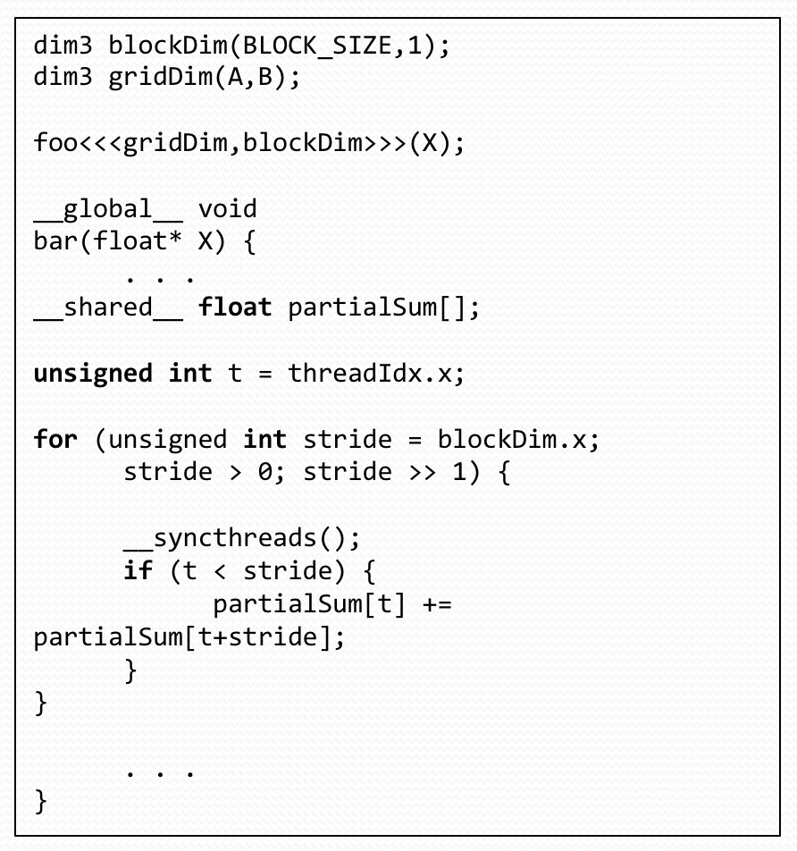

# 18645 final preparation

Saturday May 9th, 8:00-11:00am, N206

**80 min paper exam(Three sections)**

+ one cheat sheet
+ Multi-choice
+ Short Answer
+ Multi-part questions -> Answer two out of three questions
    + HADOOP
    + OpenMP
    + CUDA

<!-- MarkdownTOC -->

- Suggested Preparation
- Sample Question
    - Multi-choice/Single Choice questions
    - Short Answers
    - Design Question
- OpenMP & Multicore Computing
    - Mid-term OMP Question
    - Multiple Choice Questions
    - Short Answer Questions
    - Long Questions
- CUDA & Manycore Computing
    - Midterm Question 3 - CUDA
    - Short Questions
    - Long Questions
- Mid Term Review
    - Short Questions - OMP
    - Long Questions - OMP
    - SIMD Short Answer
- Bonus Question

<!-- /MarkdownTOC -->

## Suggested Preparation

+ Core Review
    + Review core lectures from course
    + 2, 3, 4, 6, 7, 8, 9, 10, 12, 13
    + Reivew Midterm
+ Additional
    + Review questions in homeworks and mini-projects
    + Suggested course textbooks

基本原理的理解，个别细节处的变化，概念的精确认识

## Sample Question

### Multi-choice/Single Choice questions

> Which of the following statements about HDFS are **wrong**:

1. HDFS automatically replicates data blocks
2. HDFS acts in a peer-to-peer manner, in other words, any single node's failure won't affect the data safety
3. HDFS support Read/Write/Append operations
4. HDFS is tailored to meet the requirements of MapReduce

Answer 2&3

> Consider the following problems, which one is most suitable to be solved in MapReduce framework?

1. Calculate the 500000th Fibonacci number
2. Sort 10000000 strings
3. Matrix Multiplication
4. Hosting a website

Answer 2

### Short Answers

1. Where can you easily find the run time of each Mapper/Reducer task?
2. How does Haddop handle the failure of task attempts?

Answers

1. Hadoop Web Interface
2. Hadoop will rerun the job on different nodes

### Design Question

We have a huge log file that contains the web link access of a website. The format of the file is as follows:

    URL [TAB] TIME

Indicating the URL was accessed at the time T.

Now the admin wants to know how frequently each URL is accessed during between 9am and 5pm

1. Design a MapReduce job that can handle the request.
2. A student thinks adding a Combiner to the Mapper can speed up the process. Do you think so and why?
3. Alternatively, if we want to have a list of time that a particular URL was accessed, how to design the MapReduce job?
4. Does a combiner help in this case and why?

Answer:

1. Mapper: Take the URL, if it is within the time frame, output the URL as the key. NullWritable as the value Reducer: Take sorted input and count the number of times it occurs.
2. Yes, it reduces the number of key/values written to the disk and passed through the network.
3. Mapper: Output the time if the URL matches the pattern. Reducer: Just output what is received.
4. No, because it won't reduce anything.

## OpenMP & Multicore Computing

### Mid-term OMP Question

+ Understand the directives:
    + E.g. Limitation of #omp_atomic
+ Racing condition, when it may occur?
+ Common optimizations/traps
    + Thread initialization cost
    + Sharing/locking of variables
    + Cache-line optimization

### Multiple Choice Questions

> The "atomic" synchronization clause in OpenMP will ensure,

1. the entire statement occurs without thread context being switched
2. the entire statement occurs without process context being switched
3. the memory update(read, update, and write) portion occurs without thread context being switched
4. the memory update(read, update, and write) portion occurs without process context being switched
5. other threads can access a memory location

Answer 3

> Select all statements that are true for the execution pattern in OpenMP

1. Only the master thread can create new threads
2. A "critical" code block will be executed by only one thread at a time
3. A "nowait" synchronization allow threads to proceed only after two or more threads each barrier
4. A "barrier" synchronization allow threads to proceed only after two or more threads reach the barrier
5. A "single" construct denotes a block of code that is executed by only one thread

Answer 2 & 5

### Short Answer Questions

> Explain the scheduling clauses "static", "dynamic", and "guided" for loop iterations.

Answer

+ Static - Deals out blocks of iterations of specified
+ Dynamic - Each thread grabs specified number of iterations off a queue until all iterations have been completed
+ Guided - Threads dynamically grab blocks of iterations. The size of the blocks start large and shrink down to a specified size as the calculation proceeds.
    + Each grabbed block size is proportional to the number of unassigned iterations, divided by the number of threads, decreasing to 1

### Long Questions

> Very briefly describe the storage attributes "SHARED", "PRIVATE", "FIRSTPRIVATE", and "LASTPRIVATE"

+ SHARED: variables with this attribute are shared by all threads
+ PRIVATE: variables with this attribute are private to each thread
+ FIRSTPRIVATE: variables with this attribute are private to each thread. They are initialized using the value of the variable with the same name of the master
+ LASTPRIVATE: variables with this attribute are private to each thread. In a parallelized loop, the value of this private vairable in the last iteration will be copied to ta global variable with the same name outside the parallel region.

> By describing the execution of the following chunks of code(clearly explaining which section of the code will execute in parallel), select the more optimized chunk of code.

**For section a)**

The 4 threads will initially take on iterations 0, 1, 2, 3 of the for-loop.

Since the code block within the for-loop is marked as critical, the execution of the function `funcA(int)` and `ic = ic + results_of_funcA(i)` will happen in sequence

Then the process will be repeated for the other values of i < 16

**For seciton b)**

The 4 threads will initially take on iterations 0, 1, 2, 3 of the for-loop and each of the threads will execute the function `funcA(int)` in parallel

The atomic clause will apply to only `ic = ic + results_of_funcA(i)`, and each thread will execute for these instructions in a non-overlapping manner

Then the process will be repeated for the other values of i < 16

**Conclusion**

Thus code chunk(a) provides greater parallelism by allowing `funcA(int)` to be executed in parallel

## CUDA & Manycore Computing

> Consider the matrix addition where each element fo the output matrix is the sum of the corresponding elements of the two input matrices. Can one use the shared memory to reduce the global memory bandwidth consumption?

No. In this case, no threads share input data, so reading-sharing cannot be exploited through cooperative use of shared memory.

> During a meeting, a new graduate student told his advisor that he improved his kernel performance by using `cudaMalloc()`  to allocate constant memory and `cudaMemcpy()` to transfer read-only data from the CPU memory to the constant memory. If you were his advisor, what would be your response and why?

`cudaMemcpy()` and `cudaMalloc()` are very expensive and slow operations and should be used only for DMA through global memory. If you want to use the constant memory you should use `__constant__ float constData[256];` to declare and allocate the memory space and `cudaMemcpyToSymbol()` to copy the data. These operations are much faster and optimized for this purpose.

> Does CUDA support Function Pointers?

1. No
2. Only if you pay Nvidia or buy a commercial lisence for CUDA
3. Yes, the lastest version supports function pointers
4. Yes, it supports but through Thrust
5. No, the developer has to hack the API to unlock this feature

Answer 3

> How can I find out how many registers / how much shared/constant memory my kernel is using?

1. You can't, Nvidia doesn't allow you to find out, only after executing the code
2. You can use the visual profiler to get such feedback
3. Only through the cuda debugger
4. You can add the option "--ptxas-options=-v" to the nvcc command line
5. Only if you carefully examine your source code and/or the ptx assembly

Answer 2 & 4

> The following kernels are wasteful in their use of threads; half of the threads in each block never execute. Modify the kernels to eliminate such waste.

kernel 1

Kernel 2

The configuration parameters should be modified such that the block size (BLOCK_SIZE) is half of what it was originally in this case

(唯一的区别就是 for 循环 stride 那里从 < 变成了 <=)

(唯一的曲鳖就是 for 循环 blockdim.x 不用右移一位)

> Give the relevant execute configuration parameter values at the kernel launch. Is there a cost in terms of extra arithmetric operation needed? Which resource limitation can be potentially addressed with such modification?

kernel 1 (same as kernel 1 ans)

Kernel 2 (same as kernel 2 ans)

For kernel1: Fewer threads have to check the branch if it is taken or not. One multiplication and one module operation were removed

For kernel2: Less threads check the branch. One right shift operation was removed.

### Midterm Question 3 - CUDA

Based on the code above in Part 2, please answer the following questions:

> How many global memory loads and stores are done for each thread? List the line numbers, and their variable names

+ Line 21: A
+ Line 21: B
+ Line 30: d_C

> How many accesses to shared memory are done for **each thread block**? List the line numbers, the variable accessed, and counts per thread block

+ L21: accumResult[tx], 256 times
+ L27
    + Stride = 128, 384 times
    + Stride = 64, 192 times
    + Stride = 32, 96 times
    + Stride = 16, 48 times
    + Stride = 8, 24 times
    + Stride = 4, 12 times
    + Stride = 2, 6 times
    + Stride = 1, 3 times
+ 765 times total for L27
+ L30: accumResult[0], 256 times
+ Total: 1277 times

> How many iterations of the for-loop (Line 23) will have branch divergence? Show the value of the strides for the iterations with branch divergence.

+ Strides = 16
+ Strides = 8
+ Strides = 4
+ Strides = 2
+ Strides = 1

> Identify an opportunity to significantly reduce the bandwidth requirement on the global memory. How would you achieve this? How many accesses can you eliminate?

    if (threadIdx.x == 0){
        d_C[blockIdx.x] = accumResult[0];
    }

Eliminate 255 accesses

> Is there any opportunity to reduce the number of `__syncthreads (Line 25)` executed? If no, why not? If it is possible, hwo could you achieve this? Explain in one or two sentences hwo you could do this. You don't have to write out the code.

When the for-loop in Line 23 is only using one warp, no `__syncthreads()` are necessary. This would eliminate 5 `__syncthreads()`

### Short Questions

> Difference between constant and shared memory?

+ **constant memory**: good for read only, and if each thread in a warp is reading the same data, otherwise bank conflicts occur
+ **shared memory**: good for fast on chip read/write and high reuse, more flexible to avoid bank conflicts

> What is benefit of using registers?

Fast!!!

### Long Questions

    1 // D = A + B * C
    …
    12 int main(int argc, char* argv[]) {
    13   const unsigned int N = 128;
    14
    15   // Allocate memory.
    16   float* A = NULL;
    17   float* B = NULL;
    18   float* C = NULL;
    19   float* D = NULL;
    20   cudaMalloc(&A, N * sizeof(float));
    21   cudaMalloc(&B, N * sizeof(float));
    22   cudaMalloc(&C, N * sizeof(float));
    23   cudaMalloc(&D, N * sizeof(float));
    …
    27   const unsigned int Y = 64;
    28   const unsigned int X = N / Y;
    29
    30   fma_kernel<<<X, Y>>>(A, B, C, D);
    31
    32   // Free memory.
    33   cudaFree(A); cudaFree(B); cudaFree(C); cudaFree(D);
    34 }

> How many?

+ Threads per block are there? Y = 64
+ How many blocks are there in total? X = 2

> Range / Value?

+ It is simple... Idx(range), Dim(Value)...
+ threadIdx.x Range[0, 63]
+ blockDim.x Value 64
+ blockIdx.x Range[0, 1]

> FMA

+ Fused Multiply and Add
+ Benefit 1. 2Flops / clock
+ Benefit 2. precision benefits (since less rounding by using larger internal buffer)

> Share / L1 / Global memory?

+ No shared memory usage.
+ Implicit L1 cache usage
+ 3 read + 1 write per thread (4 * 64 = 256 per thread block, 512 total)

> Maximum inflight warps?

+ 128 threads / 32 threads per warp = 4
+ No other(register, shared memory) limitation

> Occupancy

+ (inflight warp) / (maximum warp)
+ 4 / (7 * 2048 / 32) * 100 = 0.8928%

> GFLOPS

2 flops/instruction(FMA) * 192 instructions/clock * 7.5M * 980 MHz(boosted) = 2634 Gflops

## Mid Term Review

Some Stats

+ mean: 63.95
+ std dev: 14.13
+ Max: 93

### Short Questions - OMP

> What is False Sharing? Explain it by writing a code snippet using openMP

When multiple threads access the same cache line.

只需要不同的线程轮流访问邻接的数据即可

    int a[10] = {0,1,2,3,4,5,6,7,8,9};
    #pragma omp parallel for
    for (int i = 0; i < 10; ++i){
        a[i]++;
    }

> What is wrong with the code

    #pragma omp parallel for
    for (int i = 0; i < MAX_ITERATIONS; i++){
        perform_kmeans(const float **dataset, // data array
                        const int n, // Number of clusters
                        float **cluster_centers, // ip and op for cluster centers
                        int *membership); // Memberships
    }
    // You can assume that the perform_kmeans does one iteration of kmeans clustering

Each iteration depends on previous. This cannot be parallelized.

### Long Questions - OMP

> Read the following code and answer the questions. The function finds the minimum element of every column of a square matrix. The matrix is stored in float* matrix array, which has `dimension x dimension` elements, and the minimum element will be stored in a pre-allocated array `float *min_elem` that has dimension elements

     1 void func(float *matrix, float *min_elem, unsigned int dimension){
     2     for (unsigned int i = 0; i < dimension; i++){
     3         min_elem[i] = matrix[i*dimension];
     4         #pragma omp parallel for
     5         for (unsigned int j = 1; j < dimension; j++){
     6             if (matrix[i*dimension + j] < min_elem[i]){
     7                 min_elem[i] = matrix[i*dimension + j];
     8             }
     9         }
    10     }
    11 }

> Part I: THe function is to find the minimum elements of every column of a square matrix. Will the program work correctly(output expected results) with the highlighted OMP directive? List one reason why it would or would not work correctly?

It won't work correctly.

Reasons:

1. It is performing row-wise minimization
2. `min_elem[i]` accesses and writes will suffer from race conditions

> Part II: We do not want to change the OpenMP directive in line 4, and want to make the program functional correct. You friend Jim suggested the following modification to replace the following three lines:

     6             if (matrix[i*dimension + j] < min_elem[i]){
     7                 min_elem[i] = matrix[i*dimension + j];
     8             }

> to

    #pragma omp atomic
    min_elem[i] = min_elem[i] < matrix[i*dimension + j] ? min_elem[i] : matrix[i*dimension + j];

> But this doesn't work. Can you provide the reason why?

### SIMD Short Answer

    float array[256] = {...}; // initialize with some value
    __m128 v0 = _mm_load_ps((__m128*)array);

绝大部分 SSE 指令都要求位址是 16 的倍数，如果不是的话，就会导致 exception。而浮点数只会对齐在 4 bytes 或 8 bytes 的边上(根据 compiler 设定而不同)

这题里面就不符合对齐的要求。

可以用 `_mm_loadu_ps` 来读取非 16 对齐的。

## Bonus Question

> Write a small code snippet that demonstrates a race condition

只需要不同的线程访问同一个数据即可

    int a = 0;
    #pragma omp parallel for
    for (int i = 0; i < 10; ++i){
        a++;
    }
