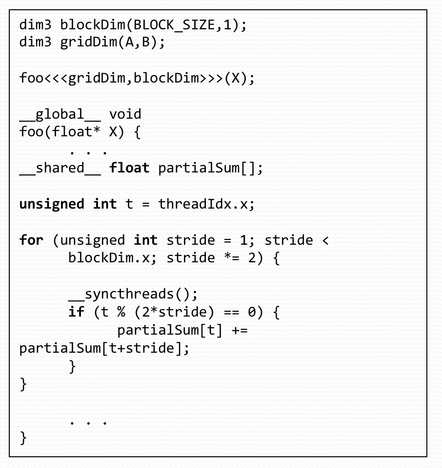
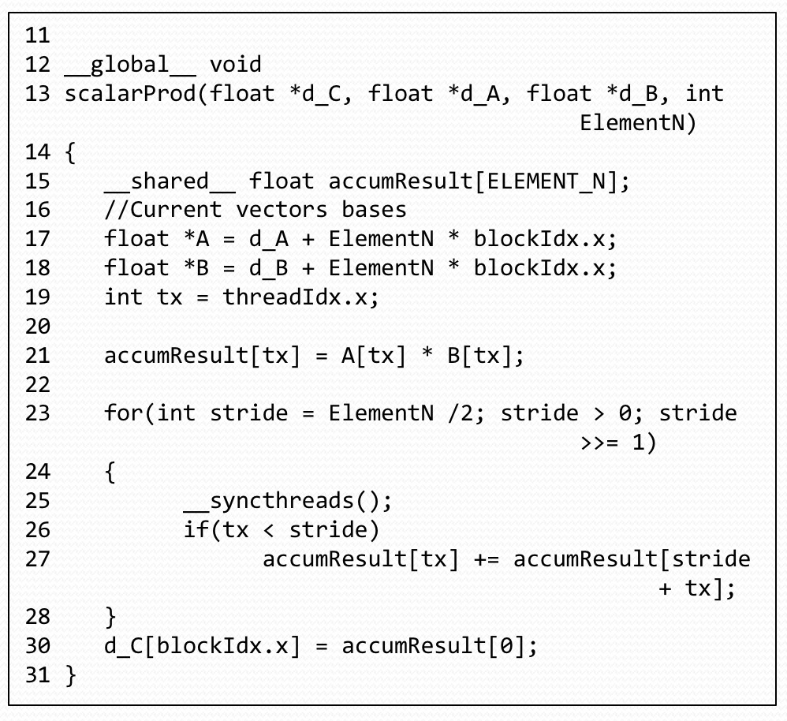

# 18645 final preparation

Saturday May 9th, 8:00-11:00am, N206

**80 min paper exam(Three sections)**

+ one cheat sheet
+ Multi-choice
+ Short Answer
+ Multi-part questions -> Answer two out of three questions
    + HADOOP
    + OpenMP
    + CUDA

目录

<!-- MarkdownTOC -->

- Suggested Preparation
- Sample Question
    - Multi-choice/Single Choice questions
    - Short Answers
    - Design Question
- OpenMP & Multicore Computing
    - Mid-term OMP Question
    - Multiple Choice Questions
        - nowait vs barrier vs single
    - Short Answer Questions
    - Long Questions
- CUDA & Manycore Computing
    - Midterm Question 3 - CUDA
    - Short Questions
    - Long Questions
- Mid Term Review
    - Short Questions - OMP
    - Long Questions - OMP
    - SIMD Short Answer
    - SIMD Long Answer
        - AoS vs SoA
- Report Speedup
- Bonus Question
- Definition - OpenMP(2.1)
    - Different level of Parallelism
    - Thread overhead
    - Parallelizable
    - False sharing
    - Solution to false sharing
    - Reduction 聚合
    - Sharing
    - Schedule
    - Synchronization
        - Ordered
        - Collapse
- Definition - Hadoop
    - MapReduce
    - How does Hadoop Work
    - Why safe
    - Master-slave structure
    - HDFS I/O
    - Advantage
    - HDFS
- Definition - CUDA - Working
    - SIMT: Single Instruction Multiple Threads
    - Why not just use one thread block?
    - __syncthreads()
    - atomics
- Thanks

<!-- /MarkdownTOC -->

## Suggested Preparation

+ Core Review
    + Review core lectures from course
    + 2, 3, 4, 6, 7, 8, 9, 10, 12, 13
    + Reivew Midterm
+ Additional
    + Review questions in homeworks and mini-projects
    + Suggested course textbooks

基本原理的理解，个别细节处的变化，概念的精确认识

---

## Sample Question

### Multi-choice/Single Choice questions

> Which of the following statements about HDFS are **wrong**:

1. HDFS automatically replicates data blocks
2. HDFS acts in a peer-to-peer manner, in other words, any single node's failure won't affect the data safety
3. HDFS support Read/Write/Append operations
4. HDFS is tailored to meet the requirements of MapReduce

Answer 2 & 3

For 2: HDFS is not `peer-to-peer`, it is `master-slave`

For 3: HDFS doesn't support `Append` operation

---

> Consider the following problems, which one is most suitable to be solved in MapReduce framework?

1. Calculate the 500000th Fibonacci number
2. Sort 10000000 strings
3. Matrix Multiplication
4. Hosting a website

Answer 2

---

### Short Answers

1. Where can you easily find the run time of each Mapper/Reducer task?
2. How does Haddop handle the failure of task attempts?

Answers

1. Hadoop Web Interface
2. Hadoop will rerun the job on different nodes

---

### Design Question

We have a huge log file that contains the web link access of a website. The format of the file is as follows:

    URL [TAB] TIME

Indicating the URL was accessed at the time T.

Now the admin wants to know how frequently each URL is accessed during between 9am and 5pm

1. Design a MapReduce job that can handle the request.
2. A student thinks adding a Combiner to the Mapper can speed up the process. Do you think so and why?
3. Alternatively, if we want to have a list of time that a particular URL was accessed, how to design the MapReduce job?
4. Does a combiner help in this case and why?

Answer:

1. Mapper: Take the URL, if it is within the time frame, output the URL as the key. NullWritable as the value Reducer: Take sorted input and count the number of times it occurs.
2. Yes, it reduces the number of key/values written to the disk and passed through the network.
3. Mapper: Output the time if the URL matches the pattern. Reducer: Just output what is received.
4. No, because it won't reduce anything.

Combiner 的意义在于能够先对 mapper 的结果在本地 reduce 一次，实际上对于计算量的减少并不算大，但是这里有个问题，数据合并得越多，shuffle 过程中需要传输的数据越少，这种 IO 操作速度的提升，是实实在在看得见的。但是如果 combiner 没办法做合并的操作，那么就不能减少数据传输，也就没办法加速。

---

## OpenMP & Multicore Computing

### Mid-term OMP Question

+ Understand the directives:
    + E.g. Limitation of #omp_atomic
+ Racing condition, when it may occur?
+ Common optimizations/traps
    + Thread initialization cost
    + Sharing/locking of variables
    + Cache-line optimization

---

### Multiple Choice Questions

> The "atomic" synchronization clause in OpenMP will ensure,

1. the entire statement occurs without thread context being switched
2. the entire statement occurs without process context being switched
3. the memory update(read, update, and write) portion occurs without thread context being switched
4. the memory update(read, update, and write) portion occurs without process context being switched
5. other threads can access a memory location

Answer 3

atomic 只对某个变量的更新有效，而且是针对 thread 的，所以只有 3 符合要求

---

> Select all statements that are true for the execution pattern in OpenMP

1. Only the master thread can create new threads
2. A "critical" code block will be executed by only one thread at a time
3. A "nowait" synchronization allow threads to proceed only after two or more threads each barrier
4. A "barrier" synchronization allow threads to proceed only after two or more threads reach the barrier
5. A "single" construct denotes a block of code that is executed by only one thread

Answer 2 & 5

#### nowait vs barrier vs single

**Barrier**

    #include <stdio.h>
    #include <omp.h>

    int main(){
        #pragma omp parallel
        {
            for (int i = 0; i < 100; ++i){
            printf("%d+\n", i);
            }
            #pragma omp barrier
            for (int j = 0; j < 10; ++j){
                printf("%d-\n", j);
            }
        }
    }

两个线程(具体数目不同 CPU 不同)执行了第一个for循环，当两个线程同时执行完第一个for循环之后，在barrier处进行了同步，然后执行后边的for循环。

**Single**

Only one thread will execute the region of code.

**NO WAIT / nowait**

If specified, then threads do not synchronize at the end of the parallel loop.

---

### Short Answer Questions

> Explain the scheduling clauses "static", "dynamic", and "guided" for loop iterations.

Answer

+ Static - Deals out blocks of iterations of specified
+ Dynamic - Each thread grabs specified number of iterations off a queue until all iterations have been completed
+ Guided - Threads dynamically grab blocks of iterations. The size of the blocks start large and shrink down to a specified size as the calculation proceeds.
    + Each grabbed block size is proportional to the number of unassigned iterations, divided by the number of threads, decreasing to 1

---

### Long Questions

> Very briefly describe the storage attributes "SHARED", "PRIVATE", "FIRSTPRIVATE", and "LASTPRIVATE"

+ SHARED: variables with this attribute are shared by all threads
+ PRIVATE: variables with this attribute are private to each thread
+ FIRSTPRIVATE: variables with this attribute are private to each thread. They are initialized using the value of the variable with the same name of the master
+ LASTPRIVATE: variables with this attribute are private to each thread. In a parallelized loop, the value of this private vairable in the last iteration will be copied to ta global variable with the same name outside the parallel region.

---

> By describing the execution of the following chunks of code(clearly explaining which section of the code will execute in parallel), select the more optimized chunk of code.

**For section a)**

The 4 threads will initially take on iterations 0, 1, 2, 3 of the for-loop and each of the threads will execute the function `funcA(int)` in parallel

The atomic clause will apply to only `ic = ic + results_of_funcA(i)`, and each thread will execute for these instructions in a non-overlapping manner

Then the process will be repeated for the other values of i < 16

**For seciton b)**

The 4 threads will initially take on iterations 0, 1, 2, 3 of the for-loop.

Since the code block within the for-loop is marked as critical, the execution of the function `funcA(int)` and `ic = ic + results_of_funcA(i)` will happen in sequence

Then the process will be repeated for the other values of i < 16

**Conclusion**

Thus code chunk(s) provides greater parallelism by allowing `funcA(int)` to be executed in parallel

---

## CUDA & Manycore Computing

> Consider the matrix addition where each element of the output matrix is the sum of the corresponding elements of the two input matrices. Can one use the shared memory to reduce the global memory bandwidth consumption?

No. In this case, no threads share input data, so reading-sharing cannot be exploited through cooperative use of shared memory.

每个 thread 都有自己的一份 register 和 local memory 的空间。同一个 block 中的每个 thread 则有共享的一份 share memory。此外,所有的 thread(包括不同 block 的 thread)都共享一份 global memory, constant memory 和 texture memory。不同的 grid 则有各自的 global memory, constant memory 和 texture memory。

> During a meeting, a new graduate student told his advisor that he improved his kernel performance by using `cudaMalloc()`  to allocate constant memory and `cudaMemcpy()` to transfer read-only data from the CPU memory to the constant memory. If you were his advisor, what would be your response and why?

`cudaMemcpy()` and `cudaMalloc()` are very expensive and slow operations and should be used only for DMA through global memory. If you want to use the constant memory you should use `__constant__ float constData[256];` to declare and allocate the memory space and `cudaMemcpyToSymbol()` to copy the data. These operations are much faster and optimized for this purpose.

---

> Does CUDA support Function Pointers?

1. No
2. Only if you pay Nvidia or buy a commercial lisence for CUDA
3. Yes, the lastest version supports function pointers
4. Yes, it supports but through Thrust
5. No, the developer has to hack the API to unlock this feature

Answer 3

---

> How can I find out how many registers / how much shared / constant memory my kernel is using?

1. You can't, Nvidia doesn't allow you to find out, only after executing the code
2. You can use the visual profiler to get such feedback
3. Only through the cuda debugger
4. You can add the option "--ptxas-options=-v" to the nvcc command line
5. Only if you carefully examine your source code and/or the ptx assembly

Answer 2 & 4

---

> The following kernels are wasteful in their use of threads; half of the threads in each block never execute. Modify the kernels to eliminate such waste.

kernel 1

Kernel 2

The configuration parameters should be modified such that the block size (BLOCK_SIZE) is half of what it was originally in this case

---

### Midterm Question 3 - CUDA

Based on the code above in Part 2, please answer the following questions:

> How many global memory loads and stores are done for each thread? List the line numbers, and their variable names

+ Line 21: A
+ Line 21: B
+ Line 30: d_C

---

> How many accesses to shared memory are done for **each thread block**? List the line numbers, the variable accessed, and counts per thread block

+ L21: accumResult[tx], 256 times
+ L27
    + Stride = 128, 384 times
    + Stride = 64, 192 times
    + Stride = 32, 96 times
    + Stride = 16, 48 times
    + Stride = 8, 24 times
    + Stride = 4, 12 times
    + Stride = 2, 6 times
    + Stride = 1, 3 times
+ 765 times total for L27
+ L30: accumResult[0], 256 times
+ Total: 1277 times

---

> How many iterations of the for-loop (Line 23) will have branch divergence? Show the value of the strides for the iterations with branch divergence.

+ Strides = 16
+ Strides = 8
+ Strides = 4
+ Strides = 2
+ Strides = 1

---

> Identify an opportunity to significantly reduce the bandwidth requirement on the global memory. How would you achieve this? How many accesses can you eliminate?

    if (threadIdx.x == 0){
        d_C[blockIdx.x] = accumResult[0];
    }

Eliminate 255 accesses

---

> Is there any opportunity to reduce the number of `__syncthreads (Line 25)` executed? If no, why not? If it is possible, hwo could you achieve this? Explain in one or two sentences how you could do this. You don't have to write out the code.

When the for-loop in Line 23 is only using one warp, no `__syncthreads()` are necessary. This would eliminate 5 `__syncthreads()`

---

### Short Questions

> Difference between constant and shared memory?

+ **constant memory**: good for read only, and if each thread in a warp is reading the same data, otherwise bank conflicts occur
+ **shared memory**: good for fast on chip read/write and high reuse, more flexible to avoid bank conflicts

> What is benefit of using registers?

Fast!!!

---

### Long Questions

    1 // D = A + B * C
    …
    12 int main(int argc, char* argv[]) {
    13   const unsigned int N = 128;
    14
    15   // Allocate memory.
    16   float* A = NULL;
    17   float* B = NULL;
    18   float* C = NULL;
    19   float* D = NULL;
    20   cudaMalloc(&A, N * sizeof(float));
    21   cudaMalloc(&B, N * sizeof(float));
    22   cudaMalloc(&C, N * sizeof(float));
    23   cudaMalloc(&D, N * sizeof(float));
    …
    27   const unsigned int Y = 64;
    28   const unsigned int X = N / Y;
    29
    30   fma_kernel<<<X, Y>>>(A, B, C, D);
    31
    32   // Free memory.
    33   cudaFree(A); cudaFree(B); cudaFree(C); cudaFree(D);
    34 }

> How many?

+ Threads per block are there? Y = 64
+ How many blocks are there in total? X = 2

> Range / Value?

+ It is simple... Idx(range), Dim(Value)...
+ threadIdx.x Range[0, 63]
+ blockDim.x Value 64
+ blockIdx.x Range[0, 1]

> FMA

+ Fused Multiply and Add
+ Benefit 1: 2 Flops / clock
+ Benefit 2: precision benefits (since less rounding by using larger internal buffer)

> Share / L1 / Global memory?

+ No shared memory usage.
+ Implicit L1 cache usage
+ 3 read + 1 write per thread (4 * 64 = 256 per thread block, 512 total)

> Maximum inflight warps?

+ 128 threads / 32 threads per warp = 4
+ No other(register, shared memory) limitation

> The NVIDIA GTX670 has 7 multiprocessors, maximum 2048 threads per multiprocessor, maximum 1024 threads per block ,fixed warp size of 32 and fixed clock speed of 915 MHz. What is the maximum occupancy percentage for this kernel?

+ (inflight warp) / (maximum warp)
+ 4 / (7 * 2048 / 32) * 100 = 0.8928%

> The NVIDIA GTX670 has 7 multiprocessors, 192 CUDA cores per multiprocessor, fixed warp size of 32 and fixed clock speed of 915 MHz. And GTX670 can conduct 192 floating point instructions per clock cycle per multiprocessor. What is the theoretical maximum GFLOPs?

2 flops/instruction(FMA) * 192 instructions/clock * 7M * 915 MHz = 2459.52 GFLOPs

---

## Mid Term Review

Some Stats

+ mean: 63.95
+ std dev: 14.13
+ Max: 93

### Short Questions - OMP

> What is False Sharing? Explain it by writing a code snippet using openMP

When multiple threads access the same cache line.

只需要不同的线程轮流访问邻接的数据即可

    int a[10] = {0,1,2,3,4,5,6,7,8,9};
    #pragma omp parallel for
    for (int i = 0; i < 10; ++i){
        a[i]++;
    }

---

> What is wrong with the code

    #pragma omp parallel for
    for (int i = 0; i < MAX_ITERATIONS; i++){
        perform_kmeans(const float **dataset, // data array
                        const int n, // Number of clusters
                        float **cluster_centers, // ip and op for cluster centers
                        int *membership); // Memberships
    }
    // You can assume that the perform_kmeans does one iteration of kmeans clustering

Each iteration depends on previous. This cannot be parallelized.

---

### Long Questions - OMP

> Read the following code and answer the questions. The function finds the minimum element of every column of a square matrix. The matrix is stored in float* matrix array, which has `dimension x dimension` elements, and the minimum element will be stored in a pre-allocated array `float *min_elem` that has dimension elements

     1 void func(float *matrix, float *min_elem, unsigned int dimension){
     2     for (unsigned int i = 0; i < dimension; i++){
     3         min_elem[i] = matrix[i*dimension];
     4         #pragma omp parallel for
     5         for (unsigned int j = 1; j < dimension; j++){
     6             if (matrix[i*dimension + j] < min_elem[i]){
     7                 min_elem[i] = matrix[i*dimension + j];
     8             }
     9         }
    10     }
    11 }

> Part I: THe function is to find the minimum elements of every column of a square matrix. Will the program work correctly(output expected results) with the highlighted OMP directive? List one reason why it would or would not work correctly?

It won't work correctly.

Reasons:

1. It is performing row-wise minimization
2. `min_elem[i]` accesses and writes will suffer from race conditions

---

> Part II: We do not want to change the OpenMP directive in line 4, and want to make the program functional correct. You friend Jim suggested the following modification to replace the following three lines:

     6             if (matrix[i*dimension + j] < min_elem[i]){
     7                 min_elem[i] = matrix[i*dimension + j];
     8             }

> to

    #pragma omp atomic
    min_elem[i] = min_elem[i] < matrix[i*dimension + j] ? min_elem[i] : matrix[i*dimension + j];

> But this doesn't work. Can you provide the reason why?

Reasons:

1. It is performing row-wise minimization
2. Atomics do not support ternary operators
3. Even if they did, they protect only writes, so race condition would persist

---

> Part III: Starting with the original program (line 1-11), if we do not want to chagne the OpenMP directive in line 4, can you make a small update to the code to make the program functionally correct?

Use #pragma omp critical

---

> Part IV: Given your change to the program will run correctly, but it would still be a slow program. Can you give three reasons why it is slow?

1. Critical: Sequential running
2. False sharing of `min_elem` array
3. thread overhead

---

> Part V: Make two suggestios on hwo to improve the speed of the code. You don't need to write the code, just state the modification briefly and the reason for the speedup.

1. Move the pragma to outer loop
2. Transpose the matrix to perform row-wise access
3. Use local variable to store min and write to `min_elem` at the end

---

### SIMD Short Answer

> What is wrong with the following code segment?

    float array[256] = {...}; // initialize with some value
    __m128 v0 = _mm_load_ps((__m128*)array);

Deliberate **Red Herring**; will complie fine

绝大部分 SSE 指令都要求位址是 16 的倍数，如果不是的话，就会导致 exception。而浮点数只会对齐在 4 bytes 或 8 bytes 的边上(根据 compiler 设定而不同)

这题里面就不符合对齐的要求。

---

> Describe one possible way to fix the above code

可以用 `_mm_loadu_ps` 来读取非 16 对齐的。

`__attribute__((aligned(16)))` or `__declspec(align(16))`

---

### SIMD Long Answer

Question: Well known Complex Multiplication kernel

复数乘法

> The initial, high-level changes required to make this code segment amenable to vectorization.

alignment and loop unrolling

---

> If data layout changes are allowed how, would such a change reduce the vectorization overhead? What are the disadvantages of your proposed format change?

AOS -> SOA

+ No need for shuffling
+ need to carry around more pointers
+ may impact prefetcher, cache behavior

#### AoS vs SoA

Struct of Arrays: 一共只有一个 struct

    typedef struct
    {
        float* x;
        float* y;
        float* z;
    } Constraints;

x | x | x | y | y | y | z | z | z

Array of Struct

    typedef struct __align__(16)
    {
        float3 position;
    } Constraint;

x | y | z | x | y | z | x | y | z

It depends on the usage of the data.

Note that AoS pads within each struct. While SoA pads between the arrays.

These have the following trade-offs:

1. AoS tends to be more readable to the programmer as each "object" is kept together.
2. AoS may have better cache locality if all the members of the struct are accessed together.
3. SoA could potentially be more efficient since grouping same datatypes together sometimes exposes vectorization.
4. In many cases SoA uses less memory because padding is only between arrays rather than between every struct.

---

> The scalar version requires

    256 * 4 load ops,
    256 * 6 arithmetic ops, and
    256 * 2 store ops

> Describe the portion of non-arithmetic SIMD instructions(loads, sotres, shuffles etc.) required to implement this kernel in SIMD.

Recall, the `_mm_shuffle_ps` instruction can operate on a single vector (the first input) and arbitrarily permute is based on the mask (the second input)

Example:

    _mm_shuffle_ps({1,2,3,4}, DCBA) -> {4,3,2,1}
    _mm_shuffle_ps({1,2,3,4}, AACC) -> {1,1,3,3}

Where A is first element, B is the second element and so on.

Recall, the `__mm_addsub_ps` instruction which for input vectors {X0,X1,X2,X3} and {Y0,Y1,Y2,Y3} produces {X0-Y0,X1+Y1,X2-Y2,X3+Y3}

    _mm_addsub_ps(
        _mm_mul_ps(
            _mm_shuffle_ps(X, AACC)   // reals
            _mm_shuffle_ps(Y, ABCD))  // ident
        _mm_mul_ps(
            _mm_shuffle_ps(X, BBDD)   // images
            _mm_shuffle_ps(Y, BADC))) // rev

等价于

    _mm_addsub_ps( 4 flops
        _mm_mul_ps( 4 flops
            _mm_shuffle_ps(X, AACC)   // reals
                           Y)         // ident
        _mm_mul_ps( 4 flops
            _mm_shuffle_ps(X, BBDD)   // images
            _mm_shuffle_ps(Y, BADC))) // rev

12 flops/ 6 insts == 2flops/insts

复数乘法的公式为 `(a+bi)(c+di) = (ac-bd) + (ad+bc)i`

这一条可以一次计算两对复数的乘积

    a = x0 + y0i
    b = x1 + y1i
    c = x2 + y2i
    d = x3 + y3i

其中

    X = {x0,y0,x2,y2}
    Y = {x1,y1,x3,y3}

这里

    ab = (x0 + y0i)(x1 + y1i) = (x0x1-y0y1) + (x0y1+y0x1)i
    cd = (x2 + y2i)(x3 + y3i) = (x2x3-y2y3) + (x2y3+y2x3)i

对应的语句

    _mm_mul_ps( 4 flops
        _mm_shuffle_ps(X, AACC)   // reals
                       Y)         // ident

    {x0,x0,x2,x2} mul {x1,y1,x3,y3} = {x0x1,x0y1,x2x3,x2y3}

    _mm_mul_ps( 4 flops
            _mm_shuffle_ps(X, BBDD)   // images
            _mm_shuffle_ps(Y, BADC))) // rev

    {y0,y0,y2,y2} mul {y1,x1,y3,x3} = {y0y1,y0x1,y2y3,y2x3}

最后再用 `_mm_addsub_ps`

    x0x1-y0y1,x0y1+y0x1,x2x3-y2y3,x2y3-y2x3

正好分别是 ab 和 cd 的实部和虚部

然后根据这个来分析具体的比例即可

---

## Report Speedup

+ 不同的体系结构有不同的优势，如果用同样的算法测试不同的架构，得到的结果是不准确的。
+ Algorithms have to match architecure
+ Much harder to make standardized cross platform comparison.
    + Wide Parallel Reduction - Good for GPU
    + Narrow Parallel Reduction - Good for CPU
+ Speedup 从哪里来(Platform - Application)
    + Hardware Architect - Architecture Researchers(1) - Application Developers(2) - End User
    + (1)**Implementation Strategies**(1.5-8x): Detailed performance tuning to specific hardware platform to achieve maximum execution efficiency
        + Saving Memory BW(GPU) / Kernel Merge Vectorization(CPU)
    + (2)**Algortihm Strategies**(10-40x): Selection of local computation building blocks and algorithms to improve overall application performance
        + Faster Convergence
    + (2)**Organization & Structure**(20-100x): Arrangements of overall application components and computation patterns that mitigate performance bottlenecks
        + Reduce Computation
+ 说来说去就是比较是很难的，常见的几种方式有
    + 确保同一个算法在不同平台上是一致的
    + 旧平台 vs 新平台
    + 贵平台 vs 便宜平台
    + 100W 部分 vs 1W 部分
+ 啥时候比较是有用的
    + Before: Performance x, After: Performance y
    + ROI(Speedup) y / x (并行化程序时对比可能比较有效)
    + Speedup 不仅取决于 processor 或者 platform
        + different application architecurt
        + different algorithm strategy
        + different implementation strategy
        + different fine-tuning parameters
+ 怎么Speedup
    + Deep application domain expertise
        + Start with application-level trade-offs
        + Measure where bottlenecks are
        + Understand what performance is required
    + Deep implementation platform expertise
        + Leverage existing building blocks / patterns
        + Understand the peak-achievable performance
    + 早期决策时确定什么对性能影响最大
    + 用现有的库、设计模式来减少部署的风险
+ 如何Report
    + Baseline
        + Platform
        + Software architecure
        + Algorithm strategy
        + Implementation strategy
    + Speedup
        + different processor
        + different platform
        + different application architecurt
        + different algorithm strategy
        + different implementation strategy
        + different fine-tuning parameters

---

## Bonus Question

> Write a small code snippet that demonstrates a race condition

只需要不同的线程访问同一个数据即可

    int a = 0;
    #pragma omp parallel for
    for (int i = 0; i < 10; ++i){
        a++;
    }

---

> HDFS的是基于流数据模式访问和处理超大文件的需求而开发的，默认的最基本的存储单位是64M，具有高容错、高可靠性、高可扩展性、高吞吐率等特征，适合的读写任务是

1. 一次写入，少次读写
2. 多次写入，少次读写
3. 一次写入，多次读写
4. 多次写入，多次读写

Answer 3

> HDFS无法高效存储大量小文件，想让它能处理好小文件，比较可行的改进策略不包括

1. 利用SequenceFile、MapFile、Har等方式归档小文件
2. 多Master设计
3. Block大小适当调小
4. 调大namenode内存或将文件系统元数据存到硬盘里

Answer 4

>关于HDFS的文件写入，正确的是

1. 支持多用户对同一文件的写操作
2. 用户可以在文件任意位置进行修改
3. 默认将文件块复制成三份存放
4. 复制的文件块默认都存在同一机架上

Answer 3

知识点：在HDFS的一个文件中只有一个写入者，而且写操作只能在文件末尾完成，即只能执行追加操作。默认三份文件块两块在同一机架上，另一份存放在其他机架上。

> MapReduce框架提供了一种序列化键/值对的方法，支持这种序列化的类能够在Map和Reduce过程中充当键或值，以下说法错误的是

1. 实现Writable接口的类是值
2. 实现WritableComparable<T>接口的类可以是值或键
3. Hadoop的基本类型Text并不实现WritableComparable<T>接口
4. 键和值的数据类型可以超出Hadoop自身支持的基本类型

Answer 3

> 以下四个Hadoop预定义的Mapper实现类的描述错误的是

1. `IdentityMapper<K, V>`实现`Mapper<K, V, K, V>`，将输入直接映射到输出
2. `InverseMapper<K, V>`实现`Mapper<K, V, K, V>`，反转键/值对
3. `RegexMapper<K>`实现`Mapper<K, Text, Text, LongWritable>`，为每个常规表达式的匹配项生成一个(match, 1)对
4. `TokenCountMapper<K>`实现`Mapper<K, Text, Text, LongWritable>`，当输入的值为分词时，生成(taken, 1)对

Answers 2

知识点：`InverseMapper<K, V>`实现`Mapper<K, V, V, K>`

---

## Definition - OpenMP(2.1)

### Different level of Parallelism

**SIMD**

Exploited using vectorizing compiler and hand-code intrinsics

**SMT**

OS abstract it to core-level parallelism

**Core-level**

Using threads to describe work done on different cores

### Thread overhead

Compute each step as a separate thread involves significant thread management overhead (hundreds of cycles)

### Parallelizable

Computation of each step is independent

### False sharing

When multiple threads access the same cache line.

### Solution to false sharing

1. Be aware of the cache line sizes for a platform.
2. Avoid accessing the same cache line from different threads

### Reduction 聚合

在每一个线程中都会有一个私有的聚合变量，在退出并行区以后，把所有的这些私有变量（以及这个聚合变量在并行区之前的初始值）聚合成一个值

1. A local copy of each list variable is made and initialized depending on the “op” (e.g. 0 for “+”)
2. Updates occur on the local copy
3. Local copies are reduced into a single value and combined with the original global value

直接上例子

    #include <iostream>
    #include <stdio.h>
    #include <omp.h>
    using namespace std;

    int main(){
        int sum = 0;
        cout << "Before: " << sum << endl;

        #pragma omp parallel for reduction(+:sum)
        for (int i = 0; i < 10; ++i){
            sum = sum + i;
            printf("%d\n", sum);
        }

        cout << "After: " << sum << endl;

        return 0;
    }

其中sum是共享的，采用reduction之后，每个线程根据reduction（+: sum）的声明算出自己的sum，然后再将每个线程的sum加起来。

### Sharing

Global variables are SHARED among threads

1. File scope variables, static
2. Dynamically allocated memory (ALLOCATE, malloc, new)

Not all are shared

1. Functions called from parallel regions are PRIVATE
2. Automatic variables within a statement block are PRIVATE

### Schedule

The schedule clause affects how loop iteraHons are mapped onto threads:

1. **static**: Deal-out blocks of iterations of size “chunk” to each thread.
2. **dynamic**: Each thread grabs “chunk” iterations off a queue until all iterations have been handled
3. **guided**: Threads dynamically grab blocks of iterations. The size of the block starts large and shrinks down to size “chunk” as the calculation proceeds.
4. **runtime**: Schedule and chunk size taken from the OMP_SCHEDULE environment variable.

### Synchronization

#### Ordered

The ordered region executes in the sequential order. Specifies that the iterations of the loop must be executed as they would be in a serial program.

#### Collapse

Specifies how many loops in a nested loop should be collapsed into one large iteration space and divided according to the schedule clause. The sequential execution of the iterations in all associated loops determines the order of the iterations in the collapsed iteration space.

---

## Definition - Hadoop

At its core, Hadoop has two major layers namely:

+ Processing/Computation layer (MapReduce), and
+ Storage layer (Hadoop Distributed File System).

### MapReduce

MapReduce is a parallel programming model for writing distributed applications devised at Google for efficient processing of large amounts of data (multiterabyte data-sets), on large clusters (thousands of nodes) of commodity hardware in a reliable, fault-tolerant manner. The MapReduce program runs on Hadoop which is an Apache open-source framework.

### How does Hadoop Work

Hadoop runs code across a cluster of computers. This process includes the following core tasks that Hadoop performs:

+ Data is initially divided into directories and files. Files are divided into uniform sized blocks of 128M and 64M (preferably 128M).
+ These files are then distributed across various cluster nodes for further processing.
+ HDFS, being on top of the local file system, supervises the processing.
+ Blocks are replicated for handling hardware failure.
+ Checking that the code was executed successfully.
+ Performing the sort that takes place between the map and reduce stages.
+Sending the sorted data to a certain computer.
+ Writing the debugging logs for each job.

### Why safe

1. fail-safe storage:By default save 3 copies for each block
2. fail-safe task management:Failed tasks re-scheduled up to 4 times

A distributed “group by” operation is implicitly performed between the map and reduce phases

### Master-slave structure

1. **JobTrackerNode**:Creating object for the job, determines number of mappers/ reduces, schedules jobs, bookkeeping tasks’ status and progress
2. **TaskTrackerNode**:slaves manage individual tasks

### HDFS I/O

A typical read from a client involves:

1. Contact the NameNode to determine where the actual data is stored
2. NameNode replies with block idenIfiers and locaIons (which DataNode)
3. Contact the DataNode to fetch data

A typical write from a client involves:

1. Contact the NameNode to update the namespace and verify permissions
2. NameNode allocates a new block on a suitable DataNode
3. The client directly streams to the selected DataNode

### Advantage

Block replication benefits MapReduce

1. Scheduling decisions can take replicas into account
2. Exploit better data locality

HDFS checksum all data during I/O

**Small number of large files preferred over a large number of small files**

### HDFS

namenode(master)->管理文件系统，持有文件系统树,和树中所有文件和目录的元数据（meta data）。同时namenode知道用户需要文件的各个文件块分别位于哪些datanode

datanode->存储以及取回文件块.定时（隔一段时间）向namenode汇报自己保存着谁的文件块

## Definition - CUDA - Working

### SIMT: Single Instruction Multiple Threads

1. A single instruction controls multiple processing element
2. Different from SIMD – SIMD exposes the SIMD width to the programmer
3. SIMT abstract the #threads in a thread block as a user-specified parameter

### Why not just use one thread block?

If you only use one core of a manycore hardware, it can not fully utilized the resources.

### __syncthreads()

1. waits until all threads in the thread block have reached this point and all global and shared memory accesses made by these threads prior to __syncthreads() are visible to all threads in the block
2. used to coordinate communication between the threads of the same block

### atomics

An atomic function performs a read-modify-write atomic operation a word

## Thanks

+ Jiexin Guo
+ Yaoxiu Hu
+ Jinhong Chen
+ Yuanyuan Ma

