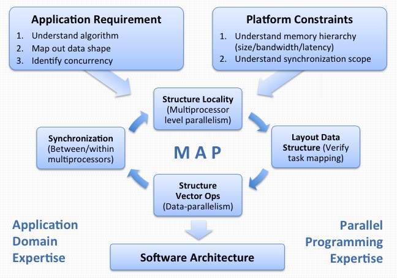

Teachers

+ Jike Chong, `jike.chong@sv.cmu.edu`, skype: chong.18645
+ Ian Lane, `lane@cs.cmu.edu`, Skype: lane.18645

+ Fast Platforms (Multicore platforms, Manycore platforms, Cloud platform) + Good Techniques (Data structure, Algorithm, Software Architecture)
+ Need is driven by the applications, NOT by the availability of the platform.
+ Background -> Multicore(openmp) -> Manycore(CUDA) -> cluster(Hadoop) -> Special Topics

## Multicore vs Manycore

+ Multicore: yoke of oxen. Each core optimized for executing a single thread.
+ Manycore: flock of chickens. Cores optimized for aggregate throughput, deemphasizing individual performance.

## Instruction Level Parallelism (ILP)

Instructions in a sequence that can be computed at the same time.

+ Advantages
    * No changes in sequential software necessary
+ Disadvantages
    * Significantly more complex processor architecture
    * Longer to design the processor
    * Longer to verify the correctness of the processor design
    * Consumes more energy than simple in-order processor

## Out-of-order Pipelines

Allows instruction re-ordering, register-renaming

## SIMD

+ can be area and power efficient
+ parallelism exposed to programmer & compiler

Locality, Temporal Locality, Spatial Locality

Compulsory misses, Capacity misses, Conflict misses

+ Advantages
    * Power-efficient wya to improve instruction throughput
    * Exploitable in many compute-intensive applications
+ Disadvantages
    * Explicit representation in vector instructions
    * Software requires re-compilation to take advantage of new SIMD capabilites.
    * May require hand-tuning to expoit full benefit

## Simultaneous multithreading

Capturing the opportunity to run faster when more than one thread of instructions are available.

+ Advantages
    * Gain power-efficiency by increase processor pipeline utilization
+ Disadvantages
    * Requires multiple threads available
    * May trigger confilicts in shared cache during execution
    * Does not improve latency of each thread

## Concurrency vs Parallelism

+ Concurrency: We expose concurrency in our application
+ Parallelism: We exploit parallelism in our platform

Concurrency: A sequence of instructions executes concurrently if they execute independent of each other as if they were executed at the same time.

+ They do not need to be executed truly at the same time though.
+ On a single processor computer, multi-tasking systems execute programs concurrently by interleaving their operations such that they appear to execute at the same time.

Parallelism: Instruction streams that execute in parallel actually execute at the same time

+ Parallelism allows multiple instructions to be executed at the exact same time
+ Parallelism requires multiple processing units, ranging from small pipeline stages up through multithreaded architectures and multicore and multiprocessing systems

Difference

+ Time
+ In concurrency, at any given time, a single operation is occurring.
    * High clock rates and clever interleaving can give the illusion of parallelism
    * All modern desktop/server OS give you this. Embedded, maybe not.
+ In parallelism, at a given point in time, multiple operations are occurring.
    * This is important to distinguish. Parallelism means it is extremely difficult (often impossible) to predict the interleaving of instructions.

## The process of problem solving:

+ Understand the current state
    + Running on a platform
    + Using a specific set of resources
    + Achieving a specific performance
    + Meeting a specific criteria/requirement
+ Observe the internal representation
    + Application structure
    + Implementation concerns
        + Task considerations
        + Data representations
        + concurrency opportunities
+ Search among alternatives
+ Select from a set of choices

## Kmeans Problem

+ Find K cluster centers that minimize the distance from each data point to a cluster center (centroid)
+ Important algorithm in machine learning
+ NP-hard for arbitrary input
+ Issues
    + Worst case running time is super-polynomial
    + Approximation can be arbitrarily bad

## How to write fast code

+ **Expose** concurrencies in applications and algorithms
+ **Exploit** parallelisms on application platform
+ **Explore** mapping between concurrency and parallelism

## The phases(kmeans)

+ Initialization: Randomly select k cluster centers
    + Select k samples from data as initial centers [Forgy Partition]
+ Expectation: Assign each data point go closest center
    + Compare each data point (N) to each cluster center (K)
    + Distance Metric: Euclidean distance (D dimensions)
+ Maximization: Update centers based on assignments
+ Evaluate: Re-iterate steps 2-3 until convergence or stopping criteria.

## Performance Analysis: Roofline Model

+ Observe the phases of execution
+ Characterize the execution time break downs
+ Reason about why a piece of code is slow
+ Identify performance bottleneck

## How to evaluate a mapping

+ Efficiency: Runs quickly, makes good use of computational resources
+ Simplicity: Easy to understand code is easier to develop, debug, verify and modify
+ Portability: Should run on widest range of parallel computers
+ Scalability: Should be effective on a wide range of processing elements

## Exploiting Different Levels of Parallelism

+ SIMD-Level: using vectorizing compiler and hand-code intrinsics
+ SMT-Level: OS abstract it to core-level parallelism
+ Core-Level: Using threads to describe work done on different cores

## False Sharing

+ Cache loads and stores work with 4-16 word long cache lines(64B for Intel)
    * If two threads are wrting to the same cache line, conflicts occurs
+ Even if the address differs, one will still suffer performance penalty

## Optimization Categorization

+ Maximizing In-core Performance
    + Exploit in-core parallelism (reorder, unroll, SIMD, eliminate branch)
+ Maximizing Memory Bandwidth
    + Exploit NUMA, Hide memory latency (unit-stride streams, memory affinity, sw prefetch, DMA Lists, TLB Blocking)
+ Minimizing Memory Traffic
    + Eliminate Capacity/Conflict/Compulsory misses (cache blocking, array padding, compress data, streaming stores)

## Measuring Arithmetic Intensity

Arithmetic Intensity = (# of FP Operations to run the program) / (# of Bytes Accessed in the Main Memory)

Arithmetic Intensity = FLOPs / (Allocations + Compulsory + Conflict + Capacity)

## Roofline Model

Attainable Performance(ij) = min(FLOP/s with Optimization(1-i), AI*Bandwidth with Optimization(1-j)

Plot on log-log scale

Lantency -> Runtime

Throughput -> Performance

+ Throughput
    * Usually measured in floating point operations per second(FLOPS)
    * Floating point operations = addition + multiplication

Higher Performance != Shorter Runtime

True Arithmetic Intensity (AI) ~ Total Flops / Total DRAM Bytes

+ Arithmetic intensity is ultimately limited by compulsory traffic
+ Arithmetic intensity is diminished by conflict or capacity misses

## Data: Three Classes of Locality

+ Spatial Locality
    * data is transferred from cache to registers in words
    * However, data is transferred to the cache in 64-128 Byte lines
    * using every word in a line maximizes spatial locality
    * transform data structures into struct of arrays(SoA) layout
+ Temporal Locality
    * reusing data(either registers or cachelines) multiple times
    * amortizes the impact of limited bandwidth
    * transform loop s or algorithms to maximize reuese.
+ Sequential Locality
    * Many memory address patterns access cache lines sequentially
    * CPU's hardware stream prefetchers exploit this observation to hide speculatively load data to memory lantency
    * Tansform loops to generate long, unit-stride accesses

## GPU is an Accelerator

+ Host System (CPU) <—> Device System (GPU)
+ When Does Using GPU Make Sense?
    + Application with a lot of concurrency (1000-way, fine-grained concurrency)
    + Some memory intensive applications (Aggregate memory bandwidth is higher)
    + Advantage diminishes when task granularity becomes too large to fit in shared memory

## GPU Programming Model: Stream

+ Stream -> kernel -> stream
+ Streams: An array of data units
+ Kernels
    * Take streams as input, produce streams at output
    * Perform computation on streams
    * Kernels can be linked together

## CUDA: Compute Unified Device Architecture

+ Integrated host + device app C program
+ Serial or modestly parallel parts in host C code
+ Highly Parallel parts in device SPMP kernel C code

## CUDA Programming Model

+ Executing kernel functions within threads
+ Threads organization
    * Blocks and Grids
+ Hardware mapping of threads
    * Computation-to-core mapping
        - Thread -> Core
        - Thread blocks -> Multi-processors
+ Thread organization
    * an array of threads -> block
    * an array of blocks -> grid
+ All threads in one grid execute the same kernel
+ Grids are executed sequentially
+ Thread Cooperation
    * Threads within a block
        - Shared memory
        - Atomic operation on Share memory & global memory
        - Barrier
    * Threads between blocks
        - Atomic operation on global memory
    * Threads between grids
        - NO WAY!
+ Thread Mapping and Scheduling
    * A grid of threads takes over the whole device
    * A block of threads is mapped on one multi-processor
        - A multi-processor can take more than one blocks.(Occupancy)
        - A block can not be preempted until finish
    * Threads within a blocks are shceduled to run on multi-processors
    * Threads are grouped into warps(32) as scheduling units
+ Parallel Memory Sharing
    * Local Memory: per-thread
    * Shared Memory: per-Block
    * Global Memory: per-application
+ Shared Memory
    * Each Multi-processor has 32KB of Shared Memory - 32 banks of 32bit words
    * Visible to all threads in a thread block

## Why Warps

Each Fermi core can maintain 48 warps of architecural context.

Each warp manages a 32-wide SIMD vector worth of computation

With ~20 registers for each trhead:

4(Bytes/register) x 20(Registers) x 32(SIMD lanes) x 48 (Warps) = 128KB per core x 16 (core) = 2MB total of register files

+ Software abstract info hid an extra level of architecture complexity
+ A 128KB register file is a large memory (takes more than one cycle)
+ Hardware provide 160wide physical SIMD units, half-pump register files
+ To simplify the programming model

## How to Deal with GPUs of Different Sizes?

+ CUDA provides an abstract infor concurrency to be fully exposed
+ HW/Runtime provides capability to schedule the computation

## Thread Blocks

+ Computation is grouped into blocks of independent concurrently execrable work
+ Fully exposed the concurrency in the application
+ The HW/Runtime makes the decision to selectively sequentialize the execution as necessary

## !! Threads

+ Threads are the computation performed in each SIMD lane in a core
    + CUDA provides a SIMT programming abstraction to assist users
+ SIMT: Single Instruction Multiple Threads
    + A single instruction multiple processing elements
    + Different from SIMD
    + SIMT abstract the # threads in a thread block as a user-specified parameter
+ SIMT enables programmers to write thread-level parallel code for
    + Independent, Scalar threads
    + Data-parallel code fro coordinated threads
+ For function correctness, programmers can ignore SIMT behavior
+ For performance, programmer can tune applications with SIMT in mind

## About Data

+ SIMD style programming can be very restrictive for communication between SIMD lanes.
+ On the same chip, in the same core, computations in SMD lanes (physically) takes places very close to each other

## Shared Memory/L1 cache

+ Manycore processors provide memory local to each core
+ Computations in SIMD-lanes in the same core can communicate via memory read / write
+ Two types of memory:
    + Programmer-managed scratch pad memory
    + HW-managed L1 cache
+ For NVIDIA Fermi architecture, you get 64KB per core with 2 configurations:
    + 48KB scratch pad (Shared Memory), 16KB L1 cache
    + 16KB scratch pad (Shared Memory), 48KB L1 cache
+ How many Threads per Thread Block
    + In Fermi, 48 warps of context are maintained per core
    + In Fermi, each thread block can have up to 1024 threads

## Synchronization

+ `__syncthreads()`
    * waits until all threads in the thread block have reached this point and all global and shared memory accesses made by these threads prior to `__syncthreads()` are visible to all threads in the block
    * used to coordinate communication between the threads of the same block

## Compilation

+ Any source file containing CUDA language extensions must be compiled with NVCC
    + NVCC is a compiler driver
    + Works by invoking all the necessary tools and compilers like cudacc, g++, …
+ NVCC outputs
    + C code (host CPU code)
        + Must be compiled with the rest of the application using another tool
    + PTX
        + object code directly
        + or, PTX source, interpreted at runtime

## SOA vs AOS

Struct of Arrays: 一共只有一个 struct

    typedef struct
    {
        float* x;
        float* y;
        float* z;
    } Constraints;

x | x | x | y | y | y | z | z | z

Array of Struct

    typedef struct __align__(16)
    {
        float3 position;
    } Constraint;

x | y | z | x | y | z | x | y | z

It depends on the usage of the data.

Note that AoS pads within each struct. While SoA pads between the arrays.

These have the following trade-offs:

1. AoS tends to be more readable to the programmer as each "object" is kept together.
2. AoS may have better cache locality if all the members of the struct are accessed together.
3. SoA could potentially be more efficient since grouping same datatypes together sometimes exposes vectorization.
4. In many cases SoA uses less memory because padding is only between arrays rather than between every struct.

## Optimization Strategies

+ Global Memory Access Pattern -> Coalescing
+ Control Flow -> Divergent branch

## Memory Coalescing

+ Hardware Constraint: DRAM is accessed in 'segments' of 32B/64B/128B
+ Goal: combine multiple memory accesses generated from multiple threads into a single physical transaction
+ Rules for maximizing DRAM memory bandwidth:
    + Possible bus transaction sizes: 32B, 64B, or 128B
    + Memory segment must be aligned: First address = multiple of segment
    + Hardware coalescing fro each half-warp: 16-word wide

Threads can access any words in any order, including the same words, and a single memory transaction for each segment addressed by a half-warp.

核心想法就是一次载入，尽量多次使用，减少访问次数。

## Use of Shared Memory

+ Process:
    + Load from DRAM to shared memory
    + Synchronize
    + Perform work on data in shared memory
    + Synchronize
    + Write out results to DRAM

Trick: Double Buffering

先载入到 global memory 再折腾到 shared memory

Declared a fixed sized variable at compile time

    __shared__ float As[BLOCK_SIZE][BLOCK_SIZE];

Define a size to be used at run time

    mykernel <<<nBloks, nThds, shmemByteSize>>>(a, objects);
    在 kernel 函数中也需要进一步处理

## Memory Bank Conflicts

+ Shared memory has 32 banks
    + Organized such that successive 32-bit words are assigned to successive banks
    + Each bank has a bandwidth of 32 bits per two clock cycles (2 cycle latency)

A bank conflict occurs if two or more threads access any bytes within different 32-bit words belonging to the same bank.

如果访问的是同一个 bank 的同一个数据，那么多少个线程一起访问也不 conflict

## Padding Technique

矩阵的那个如果不是整数可以考虑 padding

## Branch divergence

Optimization: Factor out decision variables to have shorter sequence of divergent code

Branch divergence occurs only within a warp

## Optimizing Instruction Mix

+ Compiler Assisted Loop Unrolling
    + Provides more instruction level parallelism for the compiler to use
    + Improves the ability for the compiler to find the instruction mix that instructions executed per cycle(IPC)
+ By default, the compiler unrolls small loops with a know trip count
+ In CUDA, `#pragma unroll` directive can control unrolling of any given loop
    + Must be placed immediately before the loop and only applies to that loop
    + Optionally followed by a number

### Device-only CUDA intrinsic function

常用的数学计算有 gpu 版本替代

## Data Parallel Algorithms - Map

Map: A fucntion that applies a given function to each element of a list , and returning a list of results

Two important properties:

+ Side-effect free: Only returning a value, no modifications of state with the rest of the application
+ Independent: Has an independent piece of work, where its input does not depend on another function

## Data Parallel Algorithm - Reduce

Reduce: A function that takes in a list of objects and builds up a return value.

Important properties for parallel reduction:

+ Associativity: a+(b+c) == (a+b)+c
+ Allows elements to be reduced in prarallel in a 'tree'

## Data Parallel Algorithms - Scan

Scan(prefix-sum): Takes a binary associative operator ⊕ with identity I, and an array of n elements [a0, a1, ..., an-1] and returns the ordered set [I, a0, (a0⊕a1),..., (a0⊕a1⊕...⊕an-2)]

Example:

if ⊕ is addition, than scan on the set [3 1 7 0 4 1 6 3 ] returns the set [0 3 4 11 11 15 16 22]

Scan Algorithm in CUDA 4.0

## Data Parallel Algorithms - Compact

Compaction: Removing elements from an array - take in an array and produce an shorter array.

How do we perform removal in parallel?

+ Map - create flags (1 keep, 0 remove)
+ Scan - compute index
+ Map - copy to new array

## Data Parallel Algorithms - FindUniq

FindUniq: Removing duplicates from an array - take in an set, produces an equal or smaller set of unique values

在某些特殊情况可以利用 hash insertion 去掉 sort 的步骤, hash table 已经是有序的，就是打表的方法。

## Parallel Software Patterns

A parallel software pattern is a generalizable solution to a class of recurring problems that occurs in the design of parallel software.

Attaches names to well-analyzed solutions that encapsulate the way an expert in the field solves problems.

Aims to achieve three goals:

+ Define a set of vocabularies to communicate
+ Present a set of expert techniques for beginners to learn
+ Allows experts to more quickly design complex systems

[Our Pattern Language](http://parlab.eecs.berkely.edu/wiki/patterns/patterns)

OPL: The Organization

Structural Patterns:

+ !Pipe-and-Filter
+ Agent-and-Repository
+ Event-based
+ Layered Systems
+ Model-view-constroller
+ Arbitrary Task Graphs
+ Puppeteer
+ Iterator/BSP
+ !MapReduce

Monte Carlo Methods

### Applications to Your Term Projects

## Distributed Computing

+ Speedup not necessarily from better algorithm, but from scale
+ When an algorithms is converted to MapReduce it may operate significantly slower than sequential code on a single node
+ Mapping algorithms to a MapReduce framework is the challenge

## Big Data

+ Web Data: Search, Advertisements, Behavioral data, Social graphs
+ Computational Physics Experiments
    * Atomic Energy Research
    * Numerical Wind Tunnels
+ The Earth Simulator
    * Global Climate Change Research
+ Weather Forecasting
+ The Human Genome Project, AIDS Research

## Distributed and Cloud Computing

+ Distributed Computing
    * Using distributed systems to solve computational problems.
    * Problem is divided in to many tasks, each of which is solved by one or more computers.
+ Cloud Computing
    * Distributed Computing on Cloud Resources

Distributed Computing on Cloud Computing Infrastructure = Scalable Computing

## Scalabel Computing

+ Embarrassingly parallel problems
    * Shared Nothing Architecture
+ Two dimensions of scalability
    * Data: Given twice the amount of data, the same algorithm should take no more than twice as long to run
    * Resources: Given a cluster of twice the size, the same algorithm should take no more than half as long to run

## Big Data

+ Decompose the original problem in smaller, parallel tasks
+ Schedule tasks on workers distributed in a cluster
    * Data locality
    * Resource availability
+ Ensure Workers get the data they need
+ Coordinate synchronization among workers
+ Share partial results
+ Handle failures
+ Implementation details are complex
+ Shared memory approach(OpenMP)
    * Developer needs to take case of almost everything
    * Synchronization, Concurrency
    * Resource Allocation
+ MapReduce: a shared nothing approach
    * Most of the above issures are taken care of
    * Problem decomposition and sharing partial results need particular attention
    * Optimization(memory and network consumption) are tricky

## Failures in Distributed Computing

+ In large-scale distriuted computing, failure is ensured
+ Without fail-safe mechanisms distributed computing cannot work
+ HADOOP: MapReduce + HDFS(Hadoop Distributed Filesystem)
    * Fail-safe Storage: By default stores 3 separate copies of each block
    * Fail-safe Task Management: Failed tasks re-scheduled up to 4 times

-> Reliable and scalable computing

## HADOOP -> MapReduce

+ What is MapReduce?
    * A programming model
        - Inspired by function programming
        - Model to express distributed computations on massive amounts of data
    * An execution framework
        - Designed for large-scale data processing
        - Designed to run on clusters of commodity hardware
+ Separate the what from how
    * Abstract away the "distributed" part of the system -> handled by framework
+ For optimal performance knowledge of framework is key
    * Custom data reader/writer
    * Custom data partitioning
    * Memory utilization

### Map & Reduce

+ Map: (map operation in functional programming)
    * Transformation over a dataset
    * Apply a function f(x) to all elements in isolation
    * The application of f(x) to each element of a dataset can be parallelized in a straightforward manner
+ Reduce: (fold operation in functional programming)
    * Aggregation operation defined by a function g(x)
    * Data locality: elements in the list brought together
    * If we can group elements of the list, then reduce phase can proceed in parallel
+ The framework coordinates the map and reduce phases
    * How intermediate results are grouped for the reduce to happen in parallel

### Designing a MapReduce algorithm

+ Key-value pairs are the basic data structures in MapReduce
    * Keys and values can be: integers, strings, arbitrary data structures
+ The design of a MapReduce algorithm involves:
    * Define a key-value structures for application
    * Define mapper and reducer functions
        - map: (k1,v1)->[(k2,v2)]
        - reduce: (k2,[v2]) -> [(k3,v3)]

### A MapReduce Job

+ Dataset: stored on the underlying distributed filesystem
    * Split across files and across machines
+ Mapper: The mapper is applied to every input key-value pair to generate intermediate key-value pairs
+ Reducer: The reducer is applied to all values associated with the same intermediate key to generate output key-value pairs
+ A distributed "group by" operation is implicitly performed between the map and reduce phases
    * Intermediate data arrives at each reducer in order, sorted by the key
    * No ordering is guaranteed across reducers
+ Output Keys from reducers are written to distributed filesystem
+ Intermediate keys are transient

### Simplified View of MapReduce

+ Mappers applied to all input key-value pairs -> generate intermediate pairs
+ Reducers applied to all intermediate values associated with the same intermediate key
+ Between map and reduce lies a barrier that involves a large distributed sort and group by

### Word Count in MapReduce

+ Define the appropriate key-value structures?
    * Input (docid, doc)
    * Mapper (word, 1)
    * Output (word, C(word))
+ Define Mapper and Reducer functions
    * Mapper: tokenize the document, outputs key-value (word, 1)
    * The framework guarantees all values associated with the same key(word) are brought to the same reducer
    * Reducer: receives all values associated to some key (word)
    * Sums the values and writes output key-value pairs(word, C(word))

### Implementation Details

+ A partitioned is in charge of assigning intermediate keys(words) to reducers
    * Partitioner can be customized
+ How many map and reduce tasks?
    * The framework essentially takes care of map tasks
    * The designer/developer takes care of reduce tasks

### A MapReduce Job on Hadoop

Master-slave architecture

+ JobTrackerNode creating object for the job, determines number of mappers/reduces, schedules jobs, bookkeeping tasks' status and progress
+ TaskTrackerNode: slaves manages individual tasks

## HADOOP -> HDFS

+ Improve computing throughput by co-locating data and computation
+ Abandon the separation between compute and storage nodes
    * Not mandatory but highly desirable for MapReduce computing
+ Distributed filesystems:
    * Write once, read many workloads
    * Does not handle concurrency, but allows replication
    * Optimized for throughput not latency
+ HDFS(Hadoop Distributed FileSystem)
    * Tailored to the specific requirements of MapReduce

### HDFS I/O

+ A typical read from a client involves:
    * Contact the NameNode to determine where the actual data is stored
    * NameNode replies with block identifiers and locations(which DataNode)
    * Contact the DataNode to fetch data
+ A typical write from a client invovles:
    * Contact the NameNode to update the namespace and verify permissions
    * NameNode allocates a new block on a suitable DataNode
    * The client directly streams to the selected DataNode
    * HDFS files are immutable
+ Data is never moved through the NameNode -> no bottleneck

### HDFS Replication

+ By default, HDFS stores 3 separate copies of each block
    * Ensures reliability, availability and performance
+ Replication policy
    * Spread replicas across different racks -> Robust against cluster node and rack failures
+ Block replication benefits MapReduce
    * Scheduling decisions can take replicas into account
    * Exploit better data locality
+ HDFS also transparently checksums all data during I/O

### HDFS Constraints

+ Input splits for MapReduce based on individual files
    * Mappers are launched for every file
    * High startup correctness
    * Inefficient "shuffle and sort"

Small number of large files preferred over a large number of small files

## Cloud Computing - Advantages

+ Illusion of infinite computing resources on demand
+ Elimination of an up-front commitment by user
+ Ability to pay for use of computing resources on a short-term basis as needed
+ Lowering entry barrier for large scale computing
    * Removing equipment fixed cost
+ Making available economy-of-scale
    * Reducing operating variable cost

## Developing Algorithms in Hadoop

+ Algorithm development involves:
    * preparing the input data
    * Implement the mapper and the reducer
    * Optionally, design the combiner and the partitioner
+ How to recast existing algorithms in MapReduce?
    * It is not always obvious how to express algorithms
    * Data structures play an important role
    * Optimization is hard
+ Developer needs to understand the framework
+ Learn by examples
    * Design Patterns
    * Synchronization is most trick aspect

## Efficiency, Bottlenecks & Precautions

+ Efficiency
    * Reduces I/O bandwidth(number of intermediate key-value pairs)
    * Un-necessary object creation and destruction(garbage collection)
+ Bottlenecks
    * In-mapper combining depends on having sufficient memory
    * Multiple threads compete for same resources
+ Precautions
    * Breaks functional programming paradigm due to state preservation
    * Preserving state -> algorithm behavior might depend on execution order

## How do you interpret speedup results?

Based on the PALLAS paper from UC Berkeley

+ (SW) Application Developers
    + Provide end-user with new capabilites within cost constraints
    + Concerned about a specific subset of applications at a time
    + Pragmatic towards processor platform choices
    + Gains no value from documenting multiple implementation platforms
    + **Platform as a black box**
+ (HW) Architecture Researchers
    + Develop new micro-architectures features for next-gen processors
    + Understand the pros and cons of architectural features of a **broad range** of platform for a **broad range** of applications
    + Use **toy problems** to exercise all features
    + **Application as a black box**

## Computational Finance

Use Value-at-Risk(VaR) estimates - based on Monte Carlo methods Pattern.

+ VaR
    + Maximum expected loss that will not be exceeded
    + under normal market considerations
    + over a predetermined period
    + at a given confidence level

+ Different Optimization Across Platforms
    + Oganization & Structure: Reduce Computation
    + Algorithm Strategies: Fast Convergence
    + Implementation Strategies: Saving Memory BW / Kernel Merge Vectorization

## Speedup

Before: Performance x  -- After: Performance y -- ROI(speedup): y/x

## Term Project Report

+ Clearly describe what is the **baseline** you are comparing to, in terms of:
    + Platform used
    + Software architecture
    + Algorithm strategies
    + Implementation strategies
+ Present your speed ups, which is often **NOT** only the result of differences in the processor or the platform, but also include:
    + Differences in application architecture
    + Differences in algorithm strategy
    + Differences in implementation strategy techniques
    + Differences in the fine-tuning of parameters
