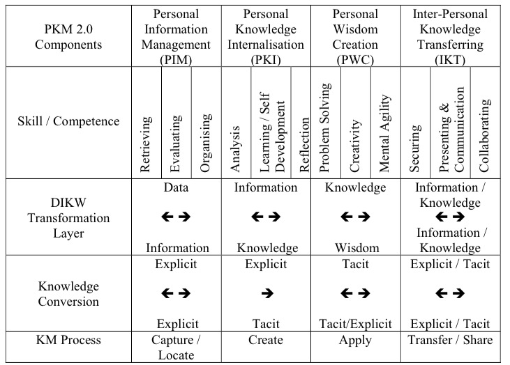

# 文献综述 Literature Review

<!-- MarkdownTOC -->

- Recommender System
    - Related Papers
    - What is a Recommender System
        - The Recommender Problem
        - Approaches to Recommendation
        - What works
    - Traditional Methods
        - Collaborative Filtering
            - User-based Collaborative Filtering
            - Item-Item Collaborative Filtering
            - Challenges of Nearest-neighbor Collaborative Filtering
            - Model-based Collaborative Filtering
            - Limitations of Collaborative Filtering
        - Content-based Recommendations
            - Advantages
            - Disadvantages
            - Content-based Method
    - Novel Methods
        - Learning to Rank
            - Metrics
            - Approaches
        - Context-aware Recommendations
            - Pre-Filtering
            - Post-filtering
            - Contextual Modeling
        - Deep Learning
        - Similarity
            - What is similarity?
        - Social Recommendations
            - Defining Trust
    - Hybrid Approaches
    - References
- Personal Knowledge Management(PKM)
    - Nature of PKM
    - Development of PKM
    - Knowledge Management
    - Two Types of Knowledge
    - New Personal Knowledge Management Model
        - (1) Personal Information Management (PIM)
        - (2) Personal Knowledge Internalisation (PKI)
        - (3) Personal Wisdom Creation (PWC)
        - (4) Interpersonal Knowledge Transferring (IKT)
- 基于遗传算法的新书推荐系统研究
- Paper

<!-- /MarkdownTOC -->

## Recommender System

### Related Papers

+ The Recommender Problem Revisited. KDD and Recsys 2014 Tutorial
+ KDD: Big & Personal: data and models behind Netflix recommendations. 2013
+ SIGKDD Explorations: Mining large streams of user data for personalized recommendations. 2012
+ Recsys: Building industrial-scale real-world recommender systems. 2012
+ Recys - Walk the Talk: Analyzing the relation between implicit and explicit feedback for preference elicitation. 2011
+ SIGIR – Wisdom of the Few. 2009
+ CARS – Implicit context-aware recommendations. 2009
+ UMAP – I like it I like it not. 2009

### What is a Recommender System

Chris Anderson in "The Long Tail"

> We are leaving the age of information and entering the age of recommendation

CNN Money, "The race to create a 'smart' Google"

> The Web, they say, is leaving the era of search and entering one of dicovery. What's the difference? Search is what you do when you're looking for something. Discovery is when something wonderful that you didn't know existed, or din't know how to ask for, finds you.

Information overload.

#### The Recommender Problem

+ Estimate a **utility function** that **automatically predicts** how a user will like an item.
+ Based on: Past behavior, Relations to tother users, Item similarity, Context
+ Let `C` be set of all users and let `S` be set of all possible recommendable items
+ Let `u` be a utility function measuring the usefulness of item `s` to user `c`, i.e., `u: C x S -> R`, where `R` is a totally ordered set
+ For each user `c` in `C`, we want to choose items `s` in `S` that maximize `u`

#### Approaches to Recommendation

Offline: Learning Process, Model/Clusters

Online: Decision Process, Recommended Items

+ Collaborative filtering(CF): Recommend items based only on the users past behavior
    + **User-based**: Find similar users to me and recommend what they liked
    + **Item-based**: Find similar items to those that I have previously liked
+ Content-based: Recommend based on item features
+ Personalized Learning to Rank: Treat recommendation as a ranking problem
+ Demographic: Recommend based on user features
+ Social recommendations(trust-based)
+ Hybrid: Combine any of the above

**Recommendation as data mining**

The core of the Recommendation Engine can be assimilated to a general data mining problems:

+ Data Preparation
    + Feature selection
    + Dimensionality Reduction
    + Normalization
    + Data Subsetting
+ Data Mining
    + Clustering
    + Classification
    + Rule Generation
+ Postprocessing
    + Filtering
    + Visualization
    + Pattern Interpretation

**Serendipity**

+ Unsought finding
+ Don't recommend items the user already knows or **would have found anyway**
+ Expand the user's taste into neighboring areas by improving the obvious
+ Collaborative filtering can offer controllable serendipity(e.g. controlling how many neighbors to use in the recommendation)

#### What works

+ Depends on the **domain** and particular **problem**
+ However, in the general case it has been demonstrated that the best isolated approach is CF.
    + Other approaches can be hybridized to improve results in specific cases (cold-start problem)
+ What matters:
    + **Data preprocessing**: outlier removal, denoising, removal of global effects (e.g. individual user's average)
    + "Smart" dimensionality reduction using MF/SVD
    + Combining methods

### Traditional Methods

传统方法可能不够足够个性化，但是总体来说更加容易控制，也有比较好的预期

#### Collaborative Filtering

**The CF Ingredients**

+ List of `m` Users and a list of `n` Items
+ Each user has a `list of items` with associated `opinion`
    + Explicit opinion - a rating score
    + Sometimes the rating is implicitly - purchase records or listen to tracks
+ `Active user` for whom the CF prediction task is performed
+ `Metric` for measuring `similarity between users`
+ Method for selecting a subset of `neighbors`
+ Method for `predicting a rating` for items not currently rated by the active user

**The basic steps**

+ Identify set of ratings for the `target/active user`
+ Identify set of users most similar ot the target/active user according to a similarity function(`neighborhood formation)
+ Identify the products these similar users liked
+ `Generate a prediction` - rating that would be given by the target user to the product - for each one of these products
+ Based on this predicted rating recommend a set of top N products

**Pros & Cons**

+ Pros:
    + Requires `minimal knowledge` engineering efforts
    + Users and products are symbols without any internal structure or characteristics
    + Produces good-enough results in most cases
+ Cons:
    + Requires a large number of `reliable` user feedback data to bootstrap
    + Requires products to be standardized (users should have bought `exactly` the same product)
    + Assumes that `prior behavior determines current behavior` without taking into account contextual knoledge(session-level)

**Netflix Prize's first conclusion: it is really extremely simple to produce "reasonable" recommendations and extremly difficult to improve them.**

##### User-based Collaborative Filtering

+ A collection of user `u~i, i=1,...,n` and a collection of products `p~j, j=1,...,m`
+ An `n x m` matrix of ratings v~ij, with v~ij = ? if user i did not rate product j
+ Prediction for user i and product j is computed

+ Similarity can be computed by Pearson correlation

**Challenges**

+ Sparsity - evaluation of large item sets, users purchases are under 1%
+ Difficult to make predictions based on nearest neighbor algorithms => Accuracy of recommendation may be poor
+ Scalability - Nearest neighbor require computation that grows with both the number of users and the number of items
+ Poor relationship among like minded but sparse-rating users
+ Solution: usage of lantent models to capture similarity between users & items in a reduced dimensinal space

##### Item-Item Collaborative Filtering

+ Look into the items that target users has rated
+ Compute how similar they are to the target item
    + Similarity only using past ratings from other users
+ Select k most similar items
+ Compute Prediction by taking weighted average on the target user's ratings on the most similar items

**Item Similarity Computation**

+ Similarity between items `i` & `j` computed by finding users who have rated them and then applying a similarity function to their ratings
+ `Cosine-based Similarity` - items are vectors in the `m` dimensinal user space (difference in rating scale between users is not taken into account)

+ `Correlation-based Similarity` - using the Pearson-r correlation(used only in cases where the users rated both item i & item j)

+ `Adjusted Cosine Similarity` - each pair in the co-rated set corresponds to a different user(takes care of difference in rating scale)

**Prediction Computation**

+ Generating the prediction - look into the target users ratings and use techniques to obtain predictions
+ `Weighted Sum` - how the active user rates the similar items

**Performance Implications**

+ Bottleneck - Similarity computation
+ Time complexity, highly time consuming with millions of users and items in the database

##### Challenges of Nearest-neighbor Collaborative Filtering

**Sparsity Problem**

+ Typically: large product sets, user ratins for a small percentage of them
+ Standard CF must have a number of users comparable to one tenth of the size of the product catalogue
+ Methods of dimensionality reduction
    + Matrix Factorization
    + Clustering
    + Projection(PCA ...)

**Scalability Problem**

+ Nearest neighbor algorithms require computations that grows with both the number of customers and products
+ With millions of customers and products a web-based recommender can suffer serious scalability problems
+ The worst case complexity is O(mn)(`m` customers and `n` product)
+ But in practice the complexity is O(m+n) since for each customer only a small number of products are considered
+ Some clustering techniques like K-means can help

**Performance Implications**

+ User-based CF - similarity between users is dynamic, precomputing user neighborhood can lead to poor predictions
+ Item-based CF - similarity between items is static
+ Enables precomputing of item-time similarity => prediction process involves only a table lookup for the similarity values & computation of the weighted sum

##### Model-based Collaborative Filtering

+ Use the entire user-item database to generate a prediction
+ Usage of statistical techniques to find the neighbors - e.g. nearest-neighbor
+ First develop a model of user
+ Type of model:
    + Probabilistic (e.g. Bayesian Network)
    + Clustering
    + Rule-based approaches (e.g. Association Rules)
    + Classification
    + Regression
    + LDA

**Clustering**

+ Pros
    + Clustering techniques can be used to work on aggregated data
    + Can also be applied as a first step for shrinking the slection of relevant neighbors in a collaborative filtering algorithm and improve performance
    + Can be used to capture laten tsimilarities between users or items
+ Cons
    + Recommendations may be less relevant than collaborative filtering

**Locality-sensitive Hashing(LSH)**

+ Method for grouping similar items in highly dimensional spaces
+ Find a hashing function s.t. similar items are grouped in the same buckets
+ Main application is Nearest-neighbors
    + Hashing function is found iteratively by concatenating random hashing functions
    + Addresses on eof NN main concerns: performance

**Association Rules**

+ Past purchases are transformed into relationships of common purchases
+ These association rules are then used to make recommendations
+ Recommendations are constrained to some minimum levels of confidence
+ Pros
    + Fast to implement
    + Fast to execute
    + Not much storage space required
    + Not individual specific
    + Very successful in broad applications for large populations
+ Cons
    + Not suitable if knowledge of preferences change rapidly
    + It is temptingto not apply restrictive confidence rules => May lead to literally `stupid` recommendations

**Classifiers**

+ Classifiers are general computational models trained using positive and negative examples
+ They may take in inputs
    + Vector of item features
    + Preferences of customers
    + Relations among item
+ E.g. Logistic Regression, Bayesian Networks, Support Vector Machines, Decision Trees, etc.
+ Pros
    + Versatile
    + Can be combined with other methods to improve accuracy of recommendations
+ Cons
    + Need a relevant training set
    + May overfit(Regularization)

##### Limitations of Collaborative Filtering

+ Cold Start: There need s to be enough other users already in the system to find a match. New items need to get enough ratings
+ Popularity Bias: Hard to recommend items to someone with unique tastes
    + Tends to recommend popular items(items from the tail do not get so much data)

#### Content-based Recommendations

+ Recommendations based on information on the content of items rather than on other users' opinions/interactions
+ Use a machine learing algorithm to induce a model of the users preferences from examples based on a featural description of content
+ In content-based recommendations, the system tries to recommend items similar to those a given user has liked in the past
+ A pure content-based recommender system makes recommendations for a user based solely on the profile built up by analyzing the content of items which that user has rated in the past

**What is content?**

+ It can be explicit attributes or characteristics of the item
+ It can also be textual content(title, description, table of content, etc)
    + Several techniques to compute the distance between two textual documents
    + Can use NLP techniques to extract content features
+ Common for recommending **text-based** products(web pages, usenet news messsages)
+ Items to recommend are `described` by their associated **features**(e.g. keywords)
+ User Model structured in a similar way as the content: features/keywords more likely to occur in the preferred documents(lazy approach)
    + Text documents recommended based on a comparison between their content(words appearing) and user model(a set of preferred words)
+ The user model can also be a classifier based on whatever technique(Neural Networds, Naive Bayes...)

##### Advantages

+ No need for data on other users
    + No cold-start or sparsity problems
+ Able to recommend to users with unique tastes
+ Able to recommend new and unpopular items
    + No first-rater problem
+ Can provide explanations of recommended items by listing content-features that caused an item to be recommended

##### Disadvantages

+ Requires content that can be encoded as meaningful features
+ Some kind of items are not amenable to easy feature extraction methods(e.g. movies, music)
+ Even for texts, IR techniques cannot consider multimedia information, aesthetic qualities, download time
    + If you rate positively a page it could be not related to the presence of certian keywords
+ Users' tastes must be represented as a learnable function of these content features
+ Hard to exploit quality judgements of other users
+ Difficult to implement serendipity
+ Easy to overfit(e.g. for a user with few data points we may "pigeon hole" her)

##### Content-based Method

+ Let Content be an `item` profile, i.e. a set of attributes characterizing item `s`.
+ Content usually described with keywords
+ Importance(informativeness) of word k~j in document d~j is determined with some weighting measure w~ij
+ One of the best-know measures in IR is the term frequency/inverse document frequency(TF-IDF)

**Content-based User Profile**

+ Let `ContentBasedProfile(c)` be the profile of user `c` containing preferences of this user profiles are obtained by:
    + analyzing the content of the previous items
    + using keyword analysis techniques
+ For example, `ContentBasedProfile(c)` can be defined as a vector of weights (w~c1 ,..., w~ck ) where weight w~ci denotes the importance of keyword k~i to user `c`

**Similarity Measures**

In content-based systems, the utility function `u(c,s)` is usually defined as:

    u(c, s) = score(ContentBasedProfile(c), Content(s))

Both `ContentBasedProfile(c)` of user `c` and `Content(s)` of document `s` can be represented as TF-IDF vectors of keyword weights

Utility function `u(c,s)` usually represented by some scoring heuristic defined in terms of vectors, such as the cosine similarity measure

### Novel Methods

#### Learning to Rank

+ Most recommendations are presented in a sorted list
+ Recommendation can be understood as a ranking problem
+ Popularity is the obvious baseline
+ Ratings prediction is a clear secondary data input that allows for personalization
+ Many other features can be added
+ Machine learning problem: goal is to construct ranking model from training data
+ Training data can be a partial order or binary judgments(relevant/not relevant)
+ Resulting order of the items typically induced from a numerical score
+ Learning to rank is a key element for personalization
+ You can treat the problem as a standard supervised classification problem

##### Metrics

+ Quality of ranking measured using metrics as
    + Normalized Discounted Cumulative Generating
    + Mean Reciprocal Rank(MRR)
    + Fraction of Concordant Pairs(FCP)
+ But, it is hard to optimize machine-learned models directly on these measures(they are not differentiable)
+ Recent research on models that directly opimize ranking measures

##### Approaches

+ Pointwise
    + Ranking fucntion minimizes loss function defined on individual relevance judgment
    + Ranking score based on regression or classification
    + Ordinal regression, Logistic regression, SVM, GBDT, ...
+ Pairwise
    + Loss function is defined on pair-wise preferences
    + Goal: minimize number of inversions in ranking
    + Ranking problem is then transformed into the binary classification problem
    + RankSVM, RankBoost, RankNet, FRank
+ Listwise
    + Indirect Loss Function
        + RankCosine: similarity between ranking list and ground truth as loss function
        + ListNet: KL-divergence as loss function by defining a probability distribution
        + Problem: optimization of listwise loss function may not optimize IR metrics
    + Directly optimizing IR measure(difficult since they are not differentiable)
    + Directly optimize IR measures through Genetic Programming
    + Directly optimize measures with Simulated Annealing
    + Gradient descent on smoothed version of bojective function(e.g. CLiMF presented at RECsys 2012 or TFMAP at SIGIR 2012)
    + SVM-MAP relaxes the MAP metric by adding it to the SVM constraints
    + AdaRank uses boosting to optimize NDCG

#### Context-aware Recommendations

Context is an important factor to consider in personalized Recommendation.

Three types of Architecutre for using context in recommendation(Adomavicius, Tuzhilin, 2008)

+ Contextual Pre-filtering
    + Context information used to select relevant portions of data
+ Contextual Post-filtering
    + Contextual information is used to filter/constrain/re-rank final set of recommendation
+ Contextual Modeling
    + Context information is used directly as part of learning preference models

Variants and combinations of these are possible

##### Pre-Filtering

Using contextual information to select the most relevant data for generating recommendations.

Example: if a person wants to see a movie on Saturday, onlye the Saturday rating data is used to recommend movies.

+ Context Over-Specification
    + Using an exact context may be too narrow
    + Certain aspects of the overly specific context may not be significant(e.g. Saturday vs. weekend)
    + Sparsity problem: overly specified context may not have enough training examples for accurate prediction
+ Pre-Filer Generalization
    + Different Approaches
    + Roll up to higher level concepts in context hierarchies (e.g. Saturday => weekend, or movie theater => any location)
    + Use latent factors models or dimensionality reduction approaches(Matrix factorization, LDA, etc.)

##### Post-filtering

Ignore context in the data selection and modeling phases, but filter or (re-rank) recommendations based on contextual information.

+ Contextual Post-Filtering is generally heuristic in nature
    + Basic Idea: Treat the context as an additional constraint
    + Many different approaches are possible

##### Contextual Modeling

Using contextual information directly in the modeling learning phase(Multi-dimensional recommendation models)

Contextual variables are added as dimensions D~1 ,..., D~n in the feature space in addition to the Users and Items dimensions

R: U x I x D~1 x ... x D~n => Ratings

**Tensor Factorization**

各种公式，暂时略

**Factorization Machines(Rendle, 2010)**

各种公式，暂时略

#### Deep Learning

这个完全不懂，略

#### Similarity

##### What is similarity?

+ Similarity can refer to different dimensions(metadata/tags, user play behavior, user rating hehavior)
+ SimRank(Jeh & Widom, 02): two objects are similar if they are referenced by similar objects
+ Similarity ensembles
    + Come up with a score of play similarity, rating similarity, tag-based similarity...
    + Combine them using an ensemble (Weights are learned using regression over existing response)
+ The final concept of "similarity" responds to what users vote as similar

#### Social Recommendations

大概涉猎一下

+ A social recommender system recommends items that are "popular" in the social proximity of the user
+ **A person being close in our social network does not mean we trust their judgement**
+ This idea of trust is central in social based systems
+ It can be a general per-user value that takes into account social proximity but can also be topic-specific

##### Defining Trust

+ Trust is very complex
    + Involves personal background, history of interaction, context, similarity, reputatioin
+ Sociological definitions
    + Trust requires a belief and a commitment
    + Similar to a bet
+ In the context of recommender systems, trust is generally used to describe similarity in opinion
    + Ignores authority, correctness on facts

**Trust Inference**

Major Algorithms - Networks:

+ Advogato(Levien)
+ Appleseed (Ziegler and Lausen)
+ MoleTrust(Massa and Avesani)
+ TidalTrust(Golbeck)

**Building Recommender Systems Using Trust**

+ Use trust as a way to give more weight to some users
+ Trust fro collaborative filtering
    + Use trust in place of (or combined with) similarity
+ Trust for sorting and filtering
    + Prioritize information from trusted sources

**Other ways to use Social**

+ Social connections can be used in combination with other approaches
+ In particular, "friendships" can be fed into collaborative filtering methods in different ways
+ Demographic Methods

### Hybrid Approaches

Smart Models

+ Regression models(Logistic Linear, Elastic nets)
+ GBDT/RF
+ SVD & other MF models
+ Factorization Machines
+ Restricted Boltzmann Machines
+ Markov Chains & other graphical models
+ Clustering (from k-means to HDP)
+ Deep ANN
+ LDA
+ Association Rules
+ ...

### References

## Personal Knowledge Management(PKM)

Our students, who will spend most of their working lives in the 21st century, will need to see the computer and related technologies as an extension of themselves, as a tool as important as the pencil was for the past several hundred years.

PKM is still an under-explored or under-researched area (Pauleen 2009; Tsui 2002; Zhang 2009).

Ahmed et al. (2002) mentioned that knowledge management involves individuals combining and sharing their experience, skills, intuition, ideas, judgments, context, motivations and interpretations. One of the knowledge management strategies proposed by Wiig (1997) is personal knowledge responsibility. It means to focus on individual responsibility for knowledge-related investments, innovations and also on the competitive side, renewal, effective use and availability to others of the knowledge assets within each employee’s area of accountability.

### Nature of PKM

**(1) Frand and Hixon (1999)**

Personal Knowledge Management is a system designed by individuals for their own personal use (Frand & Hixon 1999) and “it is a conceptual framework to organise and integrate information that we, as individuals, feel is important so that it becomes part of our personal knowledge base. It provides a strategy for transforming what might be random pieces of information into something that can be systematically applied and that expands our personal knowledge.”

**(2) Avery et al. (2001)**

Avery et al. (2001) argued that “PKM assumes that individuals have developed a self-awareness of their limits and abilities, i.e. what they know and what they can do. This personal self-awareness is an understanding of how much they know, how to access the things they know, strategies for acquiring new knowledge and strategies for accessing new information as needed. In the vast amount of information available and many means for acquiring new information, individuals have each mapped out their own areas of expertise and their own methods for additional learning.”

**(3) Higgsion (2004)**

Higgison (2004) defined personal knowledge management as “managing and supporting personal knowledge and information so that it is accessible, meaningful and valuable to the individual; maintaining networks, contacts and communities; making life easier and more enjoyable, and exploiting personal capital”

**(4) Jefferson (2006)**

Jefferson (2006) argued that “PKM is focused on bottom up approach, with an individual perspective to KM. The goal is to allow individuals to choose what information to collect, how to structure it, and who to share it with. Individuals need to be able to manage their own information so that is meaningful, accessible when it needed, can be easily exploited. PKM allows workers to organise both digital and paper content in such a way to allow them to make sense of the deluge they are continually exposed to.”

**(5) Volkel and Abecker (2008)**

Volkel and Abecker (2008) termed “Personal Knowledge Management to denote the process of the individuals to manage knowledge” and “PKM deals with embrained, embodied and encoded knowledge i.e. mostly with personal, self- authored artefacts.”

**(6) Jerome Martin (2008)**

Martin (2008) argued that “PKM is knowing what knowledge we have and how we can organise it, mobilise it and use it to accomplish our goal, and how we can continue to create knowledge.”

**(7) Harold Jarche (2010)**

Jarche (2010) mentioned that “PKM is an individual, disciplined process by which we make sense of information, observations and ideas. In the past it may have been keeping a journal, writing letters or having conversations. These are still valid, but with digital media we can add context by categorising, commenting or even remixing it. We can also store digital media for easy retrieval”

Irrespective of how personal knowledge management is defined by different scholars, Cheong and Tsui (2010 Forthcoming) argued that the key purpose of personal knowledge management is to provide a framework for individuals to manage new information, integrate it and enrich each individual knowledge database in an effective manner; doing this successfully will empower each individual to easily apply their own personal knowledge to deal with new and old problems, to learn from new experience and to create new knowledge; and it is a continuous and interactive process which is not independent of other knowledge management.

### Development of PKM

Pauleen (2009) mentioned that the history of personal knowledge management begins with the idea of the knowledge worker by Drucker (1968) but Volkel and Abecker (2008) argued that the term of personal knowledge management has already been used since Polanyi (1958). In this section, the development of personal knowledge management was discussed since Frand and Hixon (1999), their work has impacted and drawn the focus of many scholars in this areas in the past decade.

Frand and Hixon (1999) mentioned that we are living in a sea of data, our challenge is knowledge and its management that everyone must listen to a great deal of noise in order to retrieve the few bits of information that are of value to them. Some problems appear to be intrinsic knowledge management, whether it is being performed using a word processor, a formal language-based tool or pencil and paper. These problems include (1) Categorising or classifying; (2) Naming things and making distinctions between them; and (3) Evaluating and assessing The PKM framework proposed by Frand and Hixon (1995) focused on personal information management and failed to address the importance of inter-personal knowledge activities.

Avery et al (2001) based on the idea created by Paul Dorsey and developed another PKM framework which addressed this gap to include collaborating around, securing and presenting information. Avery et al (2001) believed that PKM requires to clarify the distinction between data, information and knowledge and believed that information could become knowledge which entails activities such as comparing, exploring consequences, making connection to other information and knowledge and conversing with others. Their proposed PKM framework focused on the information skills which consisted of seven PKM skills namely (1) Retrieving information; (2) Evaluating information; (3) Organising information; (4) Collaborating around information; (5) Analysing information; (6) Presenting information, and (7) Securing Information.

Tsui (2002) provided a technology-centric view on PKM and also explored the issues when using the PKM tools available at that time. In the view of Tsui (2002), PKM is a collection of processes that individuals need to carry out in their daily activities in order to manage their own knowledge management work including gather, classify, store, search and retrieve knowledge, it is not limited to work-related activities but also the social activities. Tsui (2002) suggested that the knowledge workers need constantly to (1) locate the right information quickly, (2) stay abreast with business and technology trend, (3) switching between learning and practising, (4) create new knowledge and be innovative, and (5) maintain communications and build trust among peers. These five suggestions are actually in line with the Avery et al (2001) PKM framework and communications and working with peers are a key element in PKM. In addition, PKM should enable innovation and put PKM in practise.

Berman and Annexstein (2003) based on the Avery et al. (2001) proposed PKM Skills and developed a personal knowledge book, “PK-Book”, model to actualise the PKM. Berman and Annexstein (2003) argued that the ability to actualise context for PKM is facilitated by a design combination consisted of (a) a structured and secured container for the organisation of information, (b) algorithms for the generation of associated contextual metadata, and (c) utilisation of a contextual engine driven by applications. It is the natural processes associated with the organisation of focused information which leads to an ability to actualise context in information applications, and conversely, through the usage of context in applications, the focused information unit can be augmented and improved over time. The PK-Book model seeks to provide users with a natural organisational structure and methodology, along with a set of associated tools and applications that together to capture and reflect the structure of information as understood by the individual (Berman & Annexstein 2003).

Pollard (2004) worked out his model of personal knowledge management which focused on the information acquisition, information processing and social activities. The information acquisition includes looking up data, finding / retrieving information & answers, compiling/ researching / reading/ studying / learning, and subscribing to information source. The information processing activities include writing / analysing / narrating / interpreting, editing /reviewing / annotating, and sharing and publishing knowledge work. The social activities include finding people / experts, connecting to people, collaborating, and interacting. Pollard (2004) argued that this “system” has no pre-defined sequence, no flow and it is just an undifferentiated set of knowledge activities that underpin human intellectual activities.

Efimova (2005) argued that PKM is an interactive process between individuals, other people and ideas. This is an approach which focuses on supporting knowledge worker productivity by taking an active perspective in studying their work. Efimova (2005) defined PKM as managing a one-person enterprise, the knowledge product, e.g. the processes, tools, relations with partners, customers and suppliers, are connected with literature on personal effectiveness and time management or personal branding and networking. Efimova (2005) used Weblog as an example to illustrate the PKM works.

Agnihotri and Troutt (2009) argued that technology is a critical part of PKM to enhances individual efficiency and effectiveness such that it will help users to classify ideas and information, or to archive interactions emails and other items of they are easy to locate. Agnihotri and Troutt (2009) referenced to the PKM tools classification by Tsui (2002) and addressed the importance of fit between PKM skills and the tools.

In recent years, the development of PKM started to focus on technologies, e.g. online tools, Web 2.0 technology and semantic web, which enabled the development of PKM tools to support the workers to practise PKM in online and virtual environment. Pettenati et al. (2007) studied the relationship between social networking software and PKM skills; Diao, Zuo & Liu (2009) investigated the artificial intelligence in PKM; Kim, Breslin and Decker (2009) proposed a wiki-based semantic tagging system for PKM and Volkel and Haller (2009) proposed a conceptual data structures for PKM.

Diao, Zuo & Liu (2009) argued that although the application of artificial intelligence in personal knowledge was still at the initial stage, the requirement of artificial intelligence were increasing. The artificial intelligence can be applied to PKM for (1) intelligent search of knowledge, (2) automatic classification of knowledge, and (3) conversion of tacit knowledge. The use of artificial intelligence technology to assist in PKM illustrates the usefulness of artificial intelligence.

Kim, Breslin and Decker (2009) argued that typical personal management systems do not provide effective ways for representing knowledge worker’s unstructured knowledge or idea. Based on this, a Wiki-based semantic tagging system (Wiki-based social Network Thin Client – WANT) was proposed to facilitate the collaboration and communication of the knowledge creation and maintenance and also the social semantic cloud of tags (SCOT) was suggested to represent tag data at a semantic level and combine this ontology in WANT. Kim, Breslin and Decker (2009) mentioned that the PKM system is not only focused on managing data, but also on connecting people and enabling them to share data between them.

Volkel and Haller (2009) developed a unified data model called Conceptual Data Structure (CDS) to bridge the gap between unstructured content (e.g. informal notes) and formal semantics (e.g. ontologies) by allowing the use of vague semantics and by subsuming arbitrary relation types under more general ones. The purpose of the CDS serves as a guideline for future PKM tools, providing a set of crucial structural primitives as well as provides a knowledge exchange format.

Based on the evaluation of the PKM models, it is clear that PKM has evolved from mere individual activities to something that are more outcome/impact oriented; from information handling skills to personal competencies, sensemaking and self-reflection; from individually focused to a community and social collaborative focused. Increasingly the model also provides an alignment of the appropriate technologies. This evolution necessitates the definition of requirements for a comprehensive PKM model that comprehensively encapsulates the need for personal information management, knowledge internalisation, transferring of knowledge and knowledge creation, and learning.

### Knowledge Management

+ Davenport & Prusak: A systematic attempt to create, gather, distribute and use knowledge
+ Lethbridege: The process of acquiring, representing, storing and manipulating the categorizations, characterizations and definitions of both things and their relationship

**Who**

+ Initially geared toward UCLA MBA students
+ Introduced to corporate managers
+ Generalize to anyone in any field

**What**

+ A conceptual framework to organize and integrate information that we, as individuals, fell is important so that it becomes part of our personal knowledge base
+ A strategy for transforming what might be random pieces of information into something that is more systematic and expands our personal knowledge

**Why**

Information Explosion

Information Chaos

If the WWW were compared to a library, the 'books' on its shelves would keep changing their relative locations as well as their sizes and names. Individual 'pages' in those publications would be shuffled ceaselessly. Finally, much of the data on those pages would be revised, updated, extended, shortened or even deleted without warning almost daily.

Information Overload

+ Makes keeping track of information difficult
+ Volume of information in the world degrades value due to redundancy and noise

**When**

Must become part of routine and used whenever working with information and knowledge:

+ creating
+ acquiring
+ evaluating/assessing
+ organizing/storing
+ cataloging/classifying/indexing
+ retrieving from personal memory

**Where**

One schema for all:

+ Paper documents
+ Electronic documents
+ Web bookmarks
+ Personal home library

**How**

+ Initiate a process for developing a mental map of the knowledge with which you work
+ Create an organizational structure which facilitates your finding and relating personal and professional information
+ Use techonology as an organic tool, an extension of your own memory, enhancing your natural abilities, skills, and talents for synthesis and processing of ideas for more effective problem solving and decision making

### Two Types of Knowledge

+ Tacit(Subjective) Knowledge
    + Insights, intuitions, and hunches
    + Knowledge of experience(body)
    + Not easily visible and expressible
    + Highly personal, hard to formalize, difficult to communicate or share with others
    + Rooted in individual's actions and experiences, including ideals, values, or emotions
+ Explicit(Objective) Knowledge
    + Formal and systematic
    + Knowledge of rationality(mind)
    + Can be expressed in words and numbers
    + Easily communicated and shared in form of hard data, formula, codified procedures, or universal principles
    + Can be expressed in computer code, chemical formula, sets of general principles

### New Personal Knowledge Management Model

A conceptual model of PKM 2.0 was developed by the authors based on the literature review and also the results of a global survey about the roles and values of the PKM (Cheong & Tsui 2010b). There are four core components in this model, namely Personal Information Management (PIM), Personal Knowledge Internalisation (PKI), Personal Wisdom Creation (PCW) and Inter-Personal Knowledge Transferring (IKT). The interaction action of the components is illustrated in figure 5.1 and table 5.1 and provides more a detailed view of the model in terms of the required skill/competence, the belonging layer of the DIKW transformation, the inherent knowledge conversion and the involved KM process.

The underlying theories of this PKM 2.0 framework includes the DIKW hierarchy defined by Russell Ackoff (1989), the knowledge conversion framework suggested by Nonaka and Takeuchi (1995) and the KM process described by Seufert et al. (2003).

#### (1) Personal Information Management (PIM)

PIM is the focus of many scholars in the area of PKM and it is the process to capture or locate knowledge as defined by Seufert et al. (2003). The data is transformed to information and vice versa in this process and it is mainly deal with the past knowledge, as argued by Russell Ackoff (1989). Knowledge conversion is in the form of explicit knowledge (from one media, e.g. hard copy to another media, e.g. electronic copy), and is the combination process as suggested by Nonaka and Takeuchi (1995). The PIM is the foundation of PKM , where individuals are able to create their own knowledge database for immediate or future use in this process.

The required skills / competences in PIM are retrieving, evaluating and organising, which are the skills playing significant roles in capture / locate knowledge.

#### (2) Personal Knowledge Internalisation (PKI)

PKI is the process of creating knowledge in the KM cycles, suggested by Seufert et al. (2003). The information is transformed to knowledge and vice versa in this process. It requires understanding of the past knowledge and current information / knowledge available to an individual. It represents the understanding layer as mentioned by Russell Ackoff (1989) between knowledge and wisdom. The knowledge conversion is mainly in the form of explicit to tacit knowledge; it is the internalisation process in the SECI model (Nonaka & Takeuchi 1995). PKI is beyond PIM as it turns the past knowledge into new knowledge.

The required competences in PKI are analysis, learning / self development and reflection.

#### (3) Personal Wisdom Creation (PWC)

PWC is the process of applying knowledge in the KM cycles, suggested by Seufert et al. (2003). The knowledge is transformed to wisdom in this process, and putting the knowledge in practise to tackle the current challenges and prepare for the future, as argued by Russell Ackoff (1989) that wisdom is dealing with the future. The knowledge conversion in this process is between tacit to tacit/explicit; it involves the socialisation and externalisation process in the SECI model (Nonaka & Takeuchi 1995). PWC is beyond PKI as it puts knowledge in practise in tackling the daily challenges from personal life, social life and work.

The required skills / competences in PWC are problem solving, creativity and mental agility.

#### (4) Interpersonal Knowledge Transferring (IKT)

IKT plays an important role in PKM which maximises the knowledge work by others to form a knowledge collaborating environment for individuals. It is the process to share / transfer knowledge in the KM cycles suggested by Seufert et al. (2003). The information is transformed to knowledge in both explicit and tacit form in this process. It is a bidirectional transfer through different social activities in both face-to-face and virtual models. IKT is beyond PIM, PKI and PWC as it positions PKM 2.0 in an interactive and collaborating mode. It links the networked individuals together and gears the distributed process of socialisation, externalisation, combination and internalisation (Nonaka & Takeuchi 1995) in a meshed knowledge network to increase the knowledge flow and knowledge quality.

The required skills / competence in IKT are securing, presenting and communication, and collaborating.

---

PKM is en emerging discipline and this paper evaluated the previous literatures and introduced a new PKM model. It is cleared that PKM is an important aspect in knowledge management but it is also an open question to the researchers that what is the roles and values of PKM in different individual, organisation and social context. The authors set a research direction to explore this research question and also to explore how technology can enable PKM to maximise the contribution to competency improvement. The authors believe that this future research would lead the scholars and researchers to continue or refocus to this important discipline.

**University Environment/Culture**

+ Goal is knowledge
    + Acquisition through study and assignment
    + Transmission through teaching, reading, study groups
+ Emerging Environments: Knowledge as Process
    + Expectation that it's Life Long Learning
    + Blurring of roles and responsibilities in this new, digitally enhanced communication environment
    + Library evolving into "Information Resource Center" with knowledge guides and facilitators

**Knowledge Management Challenges**

1. Categorizing / Classifying
2. Naming things / Making distinctions
3. Evaluating / Assessing

**Knowledge Spiral**

**Knowledge Transfer Process**

> I call my field knowledge management, but you can't really manage knowledge. What a company can do is manage the environment that optimizes knowledge. --Larry Prusak, IBM, 1998

Personal Knowledge Management (PKM) focuses on the indivi- dual for the quest to learn, work efficiently or socialise. An important aspect of PKM is to allow the individual to better manage their knowledge processes and interaction, collaboration and knowledge exchanges with others. PKM reflects the goal of supporting individual knowledge workers rather than establishing an organisational approach. Initially PKM was approached as a framework to organise the knowledge of individuals that is important for individuals (Frand and Hixson, 1999). The concept has evolved over time and involves organising personal information, making sense of information, negotiating meaning, creating new ideas, developing networks, collaborating, sharing and interacting (Efimova, 2004; Wright, 2005). PKM environments integrate individual work environments and infrastructures to support joint creation, distribution, sharing and application of knowledge (Maier and Sametinger, 2004).

## 基于遗传算法的新书推荐系统研究

关于实现个性化新书推荐系统的研究现已提出多种解决方案，其主要思路均是将各类智能算法融入到系统中通过自主分析用户的检索意图及个性化需求，从而实现新书推荐系统的个性化和智能化。

文献[3]提出了一类基于密度的动态协同新书推荐算法，通过动态跟踪用户的兴趣变化调整新书推荐策略，提高了图书的推荐精度。武建伟，俞晓红，陈文清.基于密度的动态协同过滤图书推荐算法[J].计算机应用研究，2010，27(8):3013~3015

在众多智能算法中，遗传算法作为一类并行性强、自适应性好的全局优化搜索算法也逐步应用到了数字图书馆各类系统的设计开发中。 遗传算法是一种模拟生物界自然选择和自然遗传机制的随机搜索算法，其本质是一种高效、并行、全局搜索的方法，它能在搜索过程中自动获取和累积有关搜索空间的知识，并自适应地控制搜索过程以求得最优解。利用遗传算法在关于数字图书馆系统的开发研究中，遗传算法均体现出了良好的性能。本文提出一类基于遗传算法的新书推荐方法(Genetic Algorithm Based New Book Recommendation，GAN-Book)。GANBook 算法首先在新书集合中随机生成初始种群即一定数量的新书子集，然后以特定读者兴趣为适应度，利用遗传操作的反复优化，最终找出最优个体即最符合读者兴趣的图书子集完成新书推荐。

## Paper

[1] “基于遗传算法的新书推荐系统研究,” pp. 1–5, Mar. 2015.
[1] “Personal Knowledge Management,” pp. 1–63, Apr. 2013.
[1] Nonaka, I & Takeuchi, H 1995, The Knowledge-Creating Company: How Japanese Companies Create the Dynamics of Innovation, Oxford University Press, Oxford.
[1] Practical Techniques for Organizing and Measuring Knowledge 1994
[1] The New Organizational Weatlth: Managing & Measuring Knowledge-based Assets, 1997
[1] K. F. Cheong, “From Skills and Competences to outcome-based Collaborative Work: Tracking a decade’s development of Personal Knowledge Management (PKM) Models,” Sep. 2012.
[1] Pauleen, D 2009, 'Personal knowledge management: Putting the "person" back into the knowledge equation', Online Information Review, vol. 33, no. 2, pp. 221-4.
[1] Schwarz, S 2006, 'A context model for personal knoweldge management', Modeling and Retrieval of Context, Lexture Notes in Computer Science, vol. 3946, pp. 18-33.
[1] Volkel, M & Abecker, A 2008, Cost-Benefit Analysis for the design of Personal Knowledge Management Systems.
[1] Wright, K 2005, 'Personal knowledge management: supporting individual knowledge worker performance', Knowledge Management Research & Practice, vol. 3, no. 3, pp. 156-65.
[1] Zhang, Z 2009, 'Personalising organisational knowledge and organisationalising personal knowledge', Online Information Review, vol. 33, no. 2, pp. 237-56.
[1] Zuber-Skerritt, O 2005, 'A model of values and actions for personal knowledge management', THe Journal of Workplace Learning, vol. 17, no. 1/2, pp. 49-64.

[1]  Wiig, K. M., 2011. The Importance of Personal Knowledge Management in the Knowledge Society, In: Pauleen, D. J. and Gorman, G. E. (Eds.), Personal Knowledge Management, pp. 229-262, Gower.
[1] Stewart, I. and Cohen, J., 1999. Figments of Reality - The Evolution of the Curious Mind, Cambridge University Press.
[1] Schmitt, U., 2012. Knowcations - The Quest for a Personal Knowledge Management Solution, 12th International Conference on Knowledge Management and Knowledge Technologies (i-Know), Graz, Austria, Copyright 2012 ACM 978-1-4503-1242-4/12/09.
[1] Schmitt, U., 2013. Innovating Personal Knowledge Creation and Exploitation, 2nd Global Innovation and Knowledge Academy (GIKA), Jul 9-11, 2013, Valencia, Spain, 978-1- 909507-26-5.
[1] Schmitt, U., 2013. Managing Personal Knowledge to make a Difference, 27th British Academy of Management Conference Proceedings (BAM), Sep 10-12, 2013, Liverpool, UK, 978-0-9549608-6-5.
[1] Schmitt, U., 2013. Knowcations - Conceptualizing a Personal Second Generation Knowledge Management System, 8th Conference on Knowledge, Information & Creativity Support Systems (KICSS), Nov 07-09, 2013, Krakow, Poland, 978-83-912831-6-5.
[1] Schmitt, U., 2014. Overcoming the Seven Barriers to Innovating PKM Systems, International Forum on Knowledge Asset Dynamics (IFKAD), June 11-13, Matera, Italy.

[1] Bora, “Effective Personal Knowledge Management: A Proposed Online Framework,” pp. 1–9, Jan. 2013.
[1]
[1]
[1]
[1]
[1]
[1]
[1]
[1]
[1]
[1]

