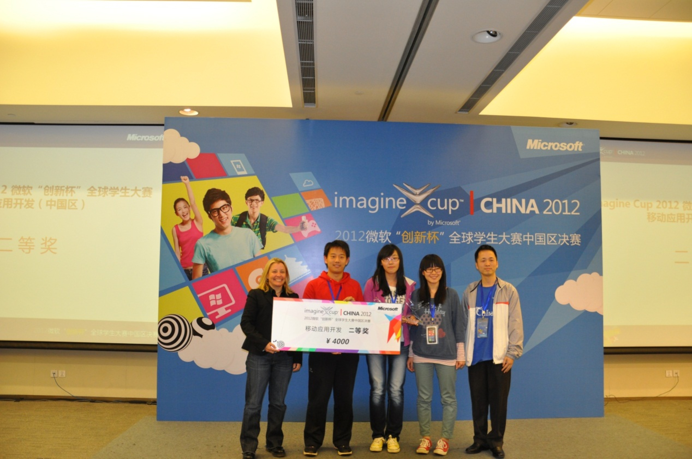

# 三家店

命运是很神奇的东西，有的时候会用不可思议的手法，把不同的人串起来，虽然好似若即若离，但是总有那么些时刻，会让人觉得这真是命运的安排。当年懵懵懂懂站在领奖台上，远不曾想到，我们三个人，三年之后，又将在另一个国度重逢。从广州到北京，从上海到美国，很多东西变了，很多东西没变。一点一点长大，当年的初心，虽然不可避免地为现实妥协，但是种子已种下，就等一个春天，发芽。

> 当你老了，回顾一生，就会发觉：什么时候出国读书、什么时候决定做第一份职业、何时选定了对象而恋爱、什么时候结婚，其实都是命运的巨变。只是当时站在三岔路口，眼见风云千樯，你做出抉择的那一日，在日记上，相当沉闷和平凡，当时还以为是生命中普通的一天。但一场巨变，已经发生了。地动山移，浑然不觉，当时只道是寻常。世上的生死荣衰，不就是在空寂之中缘起缘灭的吗？

一直觉得，大三那年不知怎么的遇上这两个有意思的小姑娘，是特别幸运的事情。没来由的创意，没来由地一路进了决赛，没来由地在展示前十五分钟才准备好一切，没来由地得了第二名。后来甚至还稀里糊涂因此见了一次鲍尔默，想想也是很神奇的事情。

原来我以为缘分就是相遇，现在慢慢懂了，缘分其实是一次次错过之后还愿意坚持，直到那一次相遇。有的情感浓烈，像可爱的洪水猛兽；有的情感平淡，像淅沥的细雨和风。不过无论怎样，当你意识到羁绊的存在，冥冥之中已有定数。

还记得当时写在本子上的留言，说有机会还能再继续并肩作战，没想到，这么快就应验了。忽然觉得，生活越来越有意思了，我也要更努力些，让它再更有趣一点！
