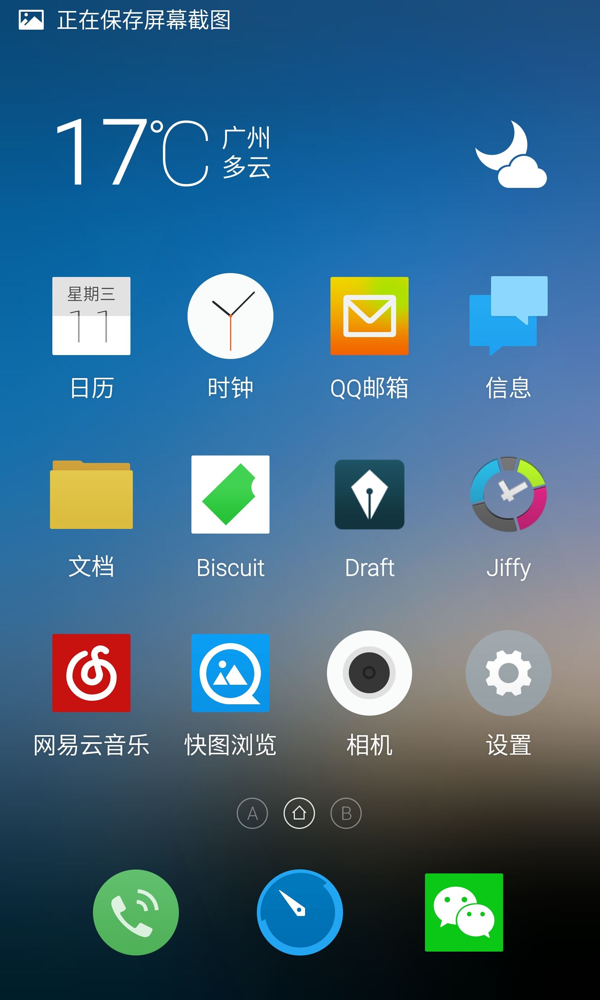

# Android 极简之道

知道自己要什么已属不易，倘若想要再进一步，分辨出自己不想要什么，则更需要用时间和经验细细打磨，方能窥见初心。而这正是极简主义者的生活态度：用极度削减的方式，将注意力集中在为数不多的事物上；这种模式令人心绪平静，感官敏锐。智能手机入侵生活，浅尝辄止代替了细细品味。太多太多的一次性 APP 把我们的生活碎片化，如果你也觉得烦恼，不妨看看我的 Android 极简之道。

## 总体理解和标准

不同人有不同的需求，只有围绕着自己的真实需求去极简，才是有效的，可以提高生活品质的极简。对于手机 APP 来说，我希望它是能切实增加我的生活品质的，所以设定了一个严苛的打分系统，分数不够，就删掉：

1. 这个应用所提供的功能是我非常需要的吗？（3分）
2. 手机上还有没有同类应用？（1分）
3. 这个应用的功能我是不是都能用上？（2分）
4. 这个应用每天都会用到吗？（2分）
5. 这个应用能否排进我心中应用的TOP20？（2分）
6. 是否曾经有类似的应用，安装了却很少用？（有的话扣2分）

根据这个标准，如果分数不够 6 分的，就直接删掉。下面是我的主屏幕，就拿 Jiffy 这个应用来介绍如何使用这个打分系统吧。

Jiffy 是一款时间管理的应用，可以根据预先设定的主题，统计我在不同事情上的时间花费，针对自己的情况，六项得分及原因分别如下：

1. 1/3(最近在优化时间管理方式，所以需要记录自己在不同事情上的用时以对阵下药，但是这个功能并不是那么必需，用纸笔都可以，所以只有1分)
2. 1/1(手机上并没有同类应用)
3. 2/2(界面美观，逻辑清晰，没有太多我用不上的功能)
4. 2/2(每天都会用到)
5. 2/2(大约排名10~20之间)
6. -1/-2(之前也有用过类似的，但是都没有坚持下来)

可以看到 Jiffy 最终的得分是 7 分，因此可以留下。之前我删掉了网易新闻客户端，就是没有达到评分标准，得分及原因如下：

1. 0/3(大部分新闻可以从微博微信及身边朋友获悉，并不是特别需要)
2. 0/1(浏览器可以访问网页版)
3. 1/2(除了新闻版块，其他乱七八糟的我都不用)
4. 2/2(安装了之后，每天都会看看)
5. 2/2(客户端总体来说非常不错，排名10~20之间)
6. 0/-2(基本上装了就会用)

网易新闻只得了 5 分，没有及格，所以需要删掉。用这样的方式把应用程序过滤一遍，就会有一个极简的 Android 手机了。刚开始的时候会非常不适应，但是调整之后你会发现，时间使用更加集中，产生的价值也更大了。

不需要的自带应用 root 之后删除或者冻结，不常用的应用利用浏览器访问网页版(新闻、电影、大众点评、各类查询)，常用的应用按照个人习惯固定桌面摆放顺序，利用小插件减少信息获取步骤(日历、待办事项)，尽量选择可以多设备同步的，这就是我的 Android 极简之道。

## 非系统应用列表及简介 Jan 11 2015

1. 微信：刚需，很臃肿很多功能用不上，只希望出一个纯净版
2. 快图浏览：体积小速度快可定制程度高
3. 网易云音乐：良心，微信封锁，但是我只在乎好音乐
4. Jiffy：时间统计管理
5. Draft：支持 markdown 的轻笔记，可以利用 dropbox 同步
6. Biscuit：对于我来说这个比词典更合适，单词本词典完美结合
7. QQ 邮箱：我就想收个 gmail
8. 支付宝钱包：刚需，很臃肿很多功能用不上，只希望出一个纯净版
9. Smooth：第三方微博客户端，简单干净没烦恼
10. 有道口语大师：练习口语还是这个最喜欢
11. 知乎：有事没事学点新知识
12. 印象笔记：知识收集管理
13. LOFTER：写写画画，培养审美的地方
14. 多看阅读：一直在用的数字阅读应用
15. Sunrise Calendar：日历，全平台支持
16. 奇妙清单：待办事项应用，全平台支持
17. 钛备份：备份数据哪家强
18. SD Maid：系统清理哪家强
19. 腾讯地图：用着比较顺手，但是越来越臃肿了
20. Snapseed：照骗技术新境界
21. Pixlr：照骗拼图哪家强
22. Six Pack：练腹肌哪家强
23. 百度云：自动备份照片和文件夹同步很有用
