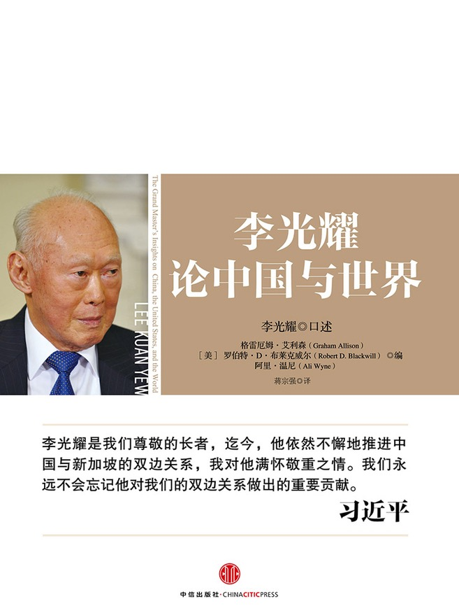

# 【李光耀论中国与世界】大处着眼，小处实现

新加坡对于我这种没出过国的乡巴佬来说，还停留在不给吃口香糖和做错事要挨鞭子的印象。不过看完这本更接近于语录精选集的小册子，也大概可以了解李光耀是如何能够在短短几十年创造如此不可思议的奇迹。清晰的思路，高效的组织，铁腕的手段，凝聚的人心，长远的眼光，怎么夸都夸不过来。不过看完之后我就在想，我们能从中学到什么呢？

治国是大事，要高屋建瓴高瞻远瞩，正所谓大处着眼；但是真正把事情做好，要胆大心细坚持不懈，此之谓小处实现。不是每个人都可以成为大领导，但是我们至少可以管好自己，从这个角度来说，还是可以从李光耀的讲话中找到不少有意思的思路的。所以就来和大家分享一下我的感悟。

> 中国的策略是在这个框架下发展，等待时机，直到变得足够强大，可以重新定义政治经济秩序。

对于我们来说也是如此，在力量没有办法强大到能改变一切的时候，就先好好努力着，变得足够强之后，才有可能去改变些什么。

> 美国经济出类拔萃的根源在于美国人富有企业家精神。企业家和投资者认为风险和失败都是自然的，是成功的必由之路。当他们失败时，他们能够做到在哪里跌倒、在哪里爬起来，一切重新开始。

虽然我们总说失败是成功之母，但是大家却是如此厌恶失败。我还是觉得丢脸出丑并不是什么问题，即使一开始大家嘲笑你，只要他们意识到你是真的想做好一件事情，都会转变态度，甚至来帮你。

> 一个国家如果要发展自己，更需要纪律，而不是民主。民主过于兴旺，就会催生无纪律、无秩序的环境，这是不利于发展的。

一个人如果要发展自己，更需要纪律，而不是随性。过于随性，就会催生无纪律、无秩序的心境，这是不利于发展的。但是这并不意味不能随性，而是当你随性做了一个决定之后，要用钢铁一般的纪律坚持下去。

> 要治理好一个国家，最佳方法就是让最优秀的人做难度最大的工作

要学好一门本事，最佳方法就是用最有效率的时间做难度最大的工作

> 作为一个领导人，你的职责就是激励民心、凝聚民智，而不是让人民替你分担忧愁。如果你将难题抛给人民，就会使他们感到沮丧

> 我从来没有因为民意调查或欢迎度调查而过度忧虑或纠结过。我认为如果你为此而过度忧虑或纠结，你就是一位虚弱无力的领导者。如果你一直过分关注自己的受欢迎程度是升还是降，那么你就不是一位领导者。

这两句关于领导力的注解真是掷地有声，回顾一下历史，大家最喜爱的领导人，大多是这样的。决定好了，就发动一切力量去做，肯定有人反对，但是没关系，用实打实的成绩去打他们的脸。

> 历史不会重复，但某些趋势及其结果却是永恒不变的。如果你不懂历史，就会目光短浅；如果你懂历史，就能着眼未来、高瞻远瞩。

> 在任何一个犹太人的社会中，“拉比”通常都是最聪明的，他们博览群书、博学多才，因为他们系统学习过《塔那赫》、《塔木德》等犹太教经典，懂多门语言。因此，成功的犹太人往往喜欢追求“拉比”的子女，希望以此把优良基因引进自己的家族。正是通过这种方式，犹太人的优良基因不断复制

所以说我们要读历史学历史，或者说，我们需要从中找到成为聪明人的线索。对于我们现在社会中出现的反智(可能没这么夸张，但是我觉得不把不把智力放在前列就是反智)倾向很是担忧，我们更喜欢钱多的，简单粗暴，却把聪明人贴上几个标签然后扔到一边。当然，聪明人是更容易赚到钱，但是如果聪明人更愿意去追求一些其他的东西呢？那么大家恐怕就觉得这个聪明人，太笨了。

> 人的思想不只来自阅读，你可以从书本中获取，但如果你不把书本知识同自己的情况结合起来，书本知识就无用武之地。我自己经常会把读到的东西同自身情况结合起来……同博学多才的人展开讨论具有重要的意义，这一点一定不要忽略，我认为这比单纯孜孜不倦地阅读文献强得多。因为通过短暂的交流，你就能萃取对方的知识和对方的思想精华

现在也愈发觉得交流的重要，所以开始有选择地拓展自己的圈子，不是一味去认识更多人，而是要去认识那些真正有趣，有自己生活和见解的人。尤其是老一辈读过很多书的人，他们对你的启发真的是全方位无死角，认识到自己多浅薄的感觉，很爽。

> 你必须有需求，这是至关重要的。在你拥有一件事物之前，你必须想拥有它，而想要拥有一件事物首先就意味着你要有能力发现自己需要什么，其次还意味着你要有能力训练自己、组织自己以获得你想要的东西。

于是一个让我感觉到很恐慌的事情是，我问身边的朋友你们想要什么，更多时候他们不知道。如果连发现自己需要什么的能力都没有，那么也许能做的不过是随波逐流，即使能流得很快，可是依然是没有自我的人。

> 壳牌的人才评估系统把人的特质归结为三种：强大的分析能力，合理把握事实的能力，以及善于总结原则并关注基本事实的能力。壳牌把它们称为一个人的“直升机素质”，既能从宏观的角度鸟瞰事情和问题，又能确认关键细节，调整焦距对症下药。

相信我，这是影响李光耀判断很重要的一个理念。当然，也是心智提升过程中，着重需要培养的能力。

> 只有那些有魄力、有勇气、无论发生什么事情都敢于为了民族和国家秉持信念、捍卫信念的人才是有价值的人，才是重要的人。

我只能说，看到这句话，我立刻想起了周恩来总理：为中华之崛起而读书。

可能很多人觉得可笑，可是我是真心实意觉得，这是一个大写的人应有的心境。

所谓爱国者之枪。
