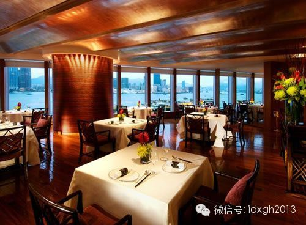
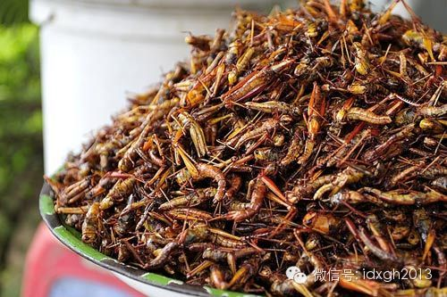

**摘要：偏见与势利是人类的本能。它虽被道德家诟病，但在构建共同体的认同中发挥了重要作用。偏见和势利也发生在对美食的判断和偏好上。**

**  
**

文/黄章晋

  

“譬如吃东西罢，某种是毒物不能吃，我们好象全惯了，很平常了。不过，这一定是以前有多少人吃死了，才知道的。所以我想，第一次吃螃蟹的人是很可佩服的，不是勇士谁敢
去吃它呢？螃蟹有人吃，蜘蛛一定也有人吃过，不过不好吃，所以后人不吃了。像这种人我们当极端感谢的。”

  

鲁迅先生这段话符合一般中国人的经验，但未必符合更大范围内的经验，螃蟹并非为所有中国人所好，阳澄湖大闸蟹引进到新疆后，曾因爬进哈萨克牧民帐篷，被误认为是巨型怪
蜘蛛而引发恐慌。而在东南亚、南美更有老饕爱好蜘蛛，当在纪录片中看到相关镜头，生理不适感是必然的反应。

  

为什么“他们”会有如此奇怪的食物偏好？

**【吃虫子，比大家想象的都普遍】**

广东人什么都吃的刻板印象，各地人民似乎都不太待见，甚至在代表网络亚文化的李毅吧中，广东因此得名“吃省”。食谱中不仅自鸟雀至蛇、蛙、鼠龟，覆盖了小型脊椎动物，
更拓展到各种昆虫。一千二百年前，韩愈被贬到潮州时，就对岭南美食颇为惊恐，特意写了《初南食胎元十八协律》。

  

其实上述重口味食材，也曾在北方中原地区的食谱上。比如：蚕蛹在很长时期内是中国丝绸产区重要的动物蛋白来源。蝗虫则自古是从北非、中东到东亚的美食。每逢蝗灾，蝗虫
便替代了田中的主粮。

  

不过古人缺少食用油，无法像广东人那样油炸，主流的方法是烹煮食用蝗虫，味道类似煮虾。当然也有另类，李世民为勉励百姓战胜蝗虫，率先垂范生吃蝗虫，并配以精彩台词出
演爱民如子之形象：“尔食朕百姓五谷，如食朕之肺腑”。

  

今天的欧洲除法国等少数例外，多半无法接受昆虫。但在古希腊罗马时代，因动物蛋白的匮乏，不少名人留下了盛赞蝉、蝗虫甚至大甲虫美味的文字，不过由于炎热的南欧，昆虫
资源一直不丰富，先民的爱好没能流传下来。

  

即便食物禁忌繁杂如犹太人，摩西五经中却对蝗虫和一些门类不清的甲虫网开一面。古犹太人生活的地区——无论是他们曾作为奴隶被役使的埃及还是巴比伦，蝗虫会定期遮天蔽
日。所以，为什么要错过这样的美食呢？

  

其实排除后天文化因素，人们应该天然喜欢食用昆虫。据一些专家认为，人们对酥脆食物不分民族、文化的共同喜好，就是喜欢吃昆虫的人类在进化过程中形成的一种生理偏好。

  

不同地区的人为什么会形成对不同动物性食物的偏好？生态学家们提出的假说则是最佳搜寻理论。所谓最佳搜寻，即单位时间热量回报最高。捕捉大动物有极高的热量回报，但不
易获得；小动物热量回报奇低，若它很稀少，以它为食甚至得不偿失，但如果成群结队，那就值得比较了。

  

假说的解释力看上去不错：乌干达人喜欢吃活蚂蚁拌盐、象牙海岸人吃白蚁，是因为在他们的生活环境中，蚂蚁们巨量扎堆，采集它们比猎获一头鹿要容易得多；而南美人和东南
亚人吃的蜘蛛，个头和螃蟹差不多大。而欧洲人不吃蝗虫，是因为欧洲的气候根本不适合蝗虫大规模繁殖。犹太人曾吃蝗虫，但迁到欧洲后就没有如此条件了。

  

最佳搜寻并不只影响单次搜寻食物行为，长期的集体选择会形成一种上升到饮食文化层面的取舍——不会去捕食的就是不可吃乃至丑陋的，而值得捕食的就是美味。

  

如此说来，广东人与北方人之间关于食材的分歧就很好理解了。广东人热爱这些各种虫子，是因为在南方湿热且植被丰厚的环境里，它们容易获得；而在北方，它们少到不可能成
为饮食文化的一部分。

_柬埔寨金边的油炸昆虫小摊_

  

惊奇与歧视并不是单向的。北方一直有吃羊的习惯，且有较发达的羊肉烹饪技术，而南方人逐渐开始接受羊肉，则是在1980年代以后物流高度发展后的事，今天依然有不少南
方人拒斥羊肉，而态度越强烈的地方，基本上是羊越少的地方。

  

犹太教、伊斯兰教对猪肉的禁忌，有无数种能自成体系的解释，用这种方式打量，也能解释得通——出现忌食猪肉的地区（从古埃及到古巴比伦），在形成禁忌观念时，就已是不
适宜猪生存的干旱、半干旱地区。

**【作为身份象征的饮食偏好】**

人们不但以自我为中心歧视他者的饮食文化，并且很容易将饮食文化的差异上升到文化优劣甚至族群优劣的程度上。在农耕与游牧文明对立的时代，游牧人以肉乳为食，故被文明
程度更高的定居民族称为腥膻之辈。

  

不同人群之间歧视乃至仇恨的理由，甚至会被直接简化为饮食文化象征的优越性上，譬如1990年6月，中亚吉尔吉斯斯坦境内的奥什，发生吉尔吉斯人对乌兹别克人的大规模
暴力攻击，许多人事后在法庭受审被问及为何要杀害无辜时，他们的回答干脆简练而傲慢：我们是吃肉的，他们是吃草的。

  

更多时候，能吃什么或喜欢吃什么，是身份和阶层的象征。

  

在中国，大概没有什么饮食偏好比西餐更能代表身份和阶层了。西餐虽然口味与中国人的偏好迥异，但进入中国后，迅速被那些自认为文化上、经济上最先进的人群接受。某些时
候，当众怀念自己留洋时吃到的正宗面包、香肠甚至奶酪，是一种得体的炫耀方式。

  

1949年后，西餐馆随着公私合营大批关门，文革爆发后，除了高级首长能吃到西餐外，中国几乎已经找不到西餐店了。或许正是由于西餐几乎绝迹，中国才有两拨完全不同的
人，会以定期吃西餐的方式，来校准自己的身份和阶层的坐标。

  

1971年，上海著名的红房子西菜社恢复供应西餐，它立即成了一批落难的昔日小开们抚平心灵创伤的据点。那些忧伤的年轻人在红房子雪白的餐桌布前怀旧时，北京大院的红
色子弟们，正在老莫（莫斯科餐厅）挥洒恣肆着他们青春。

  

这两拨毫不相干的人，除了能被西餐联系起来外，还有午餐肉。二战时，美国制造了数量惊人的午餐肉，获得了除美国兵外一切人群的热爱。二战结束，剩余的午餐肉和生产线部
分给了中国，上海小开们自然是最早吃到他们的人群之一。1949年后，苏联援华，美国人转给苏联的产能，也部分转移到了中国，这回轮到大院子弟们尝鲜了。

_某著名午餐肉品牌在其周年庆时，制作的二战主题海报，这款著名食品的成分包括：猪肩肉、火腿、盐、糖、淀粉和亚硝酸钠（用于鱼类和肉类的染色和防腐）_

  

虽然无论是当时的红房子还是老莫，由于原料断绝，除罗宋汤外，餐桌前摆放的基本上都已是中国化的西餐，但丝毫不影响北京和上海年轻食客们对自己身份和血统的认知，后续
的历史也确实没有辜负他们。

  

有些不易被人认为是值得炫耀的饮食偏好，某些时候也会被人拿来炫耀。譬如湖南、四川、贵州都以喜好吃辣而著称，但罕有四川、贵州人离开家乡时，刻意要带上一大瓶辣椒酱
，而这种情形很容易发生在湖南人身上。

  

它只能有两种解释，或者是湖南人的口味偏好是如此固执，以至于不接受任何不辣的食物；另一种或许是“不辣不革命”以及它容易引发盛产革命领袖的联想有关。这使得辣椒酱
之于湖南人，与英国人到中东旅行时还要带一把雨伞有着相似的动机。

**【势利的偏好】**

经济和文化较发达的强势文化，似乎总是能将其饮食文化的偏好推销给更多的人，将这样的现象归因于势利或许并不为过。

  

西餐、日本料理始终占据着中国餐饮业的中高端，而东南亚和印度饮食，无论它多么精细，始终难于被广泛认可。

  

带有浓郁地方饮食文化特征的餐厅，在中国餐饮业中占据的地位，基本上是其在中国经济地位的反映。不管你喜欢不喜欢，粤菜、上海本帮菜以及来自港台的餐饮，总是占据着中
高端，川菜、湘菜、西北清真餐厅，只占据中低端市场。

  

鲁菜地位的没落，也是山东经济、文化地位的反应。鲁菜一直是北方菜中的高端代表，直接影响了宫廷菜，但近三十年山东的文化影响力无法与广东、江浙相比，因此被无情地挤
出中高端市场；而在中低端市场上，又因川菜等偏重刺激性的口味更受大众欢迎，鲁菜被人遗忘了。

  

强势文化很容易改变人们的口味偏好。很难认为南方省份的人会对外来的北京烤鸭给出高于广东烧鹅的评价，但由于北京烤鸭是中国饮食文化最著名的招牌，南方人哪怕不接受，
也不会表现明确而公开的不屑。

  

同理，如果印度是个发达国家，咖喱味还会是被很多中国人鄙夷的味道吗？如果非洲某个喜爱吃昆虫的部落率先完成了近代化，那么工业化规模养殖昆虫，估计会成为全世界普遍
接受的美食；而电影《雪国列车》就会把三等车厢吃蟑螂粉碎做成的凝胶、一等车厢吃牛肉，改为三等车厢吃牛肉粉碎做成的凝胶，一等车厢吃活蟑螂沾酱。

  

脑洞还可以开得更大——若春晚出现的大都是广东、福建方言，而非现在政治中心的普通话和东北话，“广东人除了天上的飞机不吃，除了地上的汽车不吃”，有没有可能由鄙夷
变为羡慕？

  

_（近期大象公会将推出谈论饮食及相关故事的系列文章。接下来，有关餐饮行业的政治经济学、美食之都在哪里，都是我们探究的话题。敬请留意）_

  

> 版权声明：  
大象公会所有文章均为原创，版权归大象公会所有。如希望转载，请事前联系我们： bd@idaxiang.org

大象公会：知识、见识、见闻

微信：idxgh2013

微博：@大象公会

投稿：letters@idaxiang.org

商务合作：bd@idaxiang.org

  

[阅读原文](http://mp.weixin.qq.com/s?__biz=MjM5NzQwNjcyMQ==&mid=202454933&idx=1&sn
=1903a00b38ad463d8bc95e7ee6919ce1&scene=0#rd)

