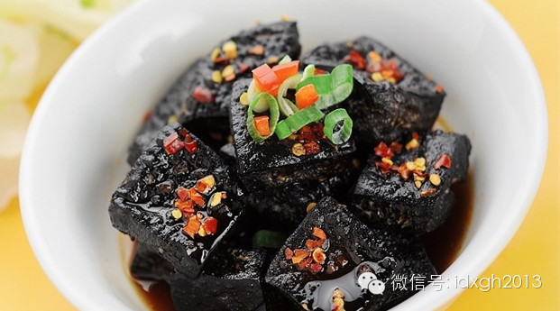
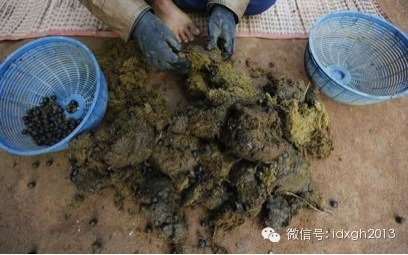
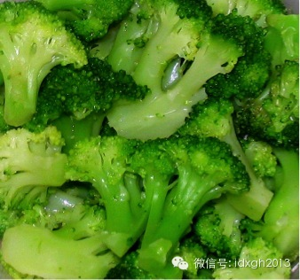
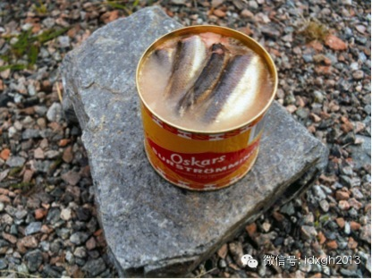

**人对食物口味的偏好，有些是进化出来的共同偏好，有些则是后天培养的，但区域型美食，在他人眼中是美味还是重口味，其实是妈妈说了算。**

  

文|郑子宁

  

豆腐脑应该是咸还是甜的？这差不多是个会导致中国分裂的争议话题。但中国人对皮蛋的意见就统一多了，绝大多数中国人都认为皮蛋好吃，但2011年6月，CNN旗下旅游
频道CNNGo的网站投票选举全世界最恶心的食物时，皮蛋居然位居十大最恶心食物。

  

这个中国人未参与的投票，属于中国人爱吃的还有燕窝和醉虾，在国内多数新闻中，后来者多未被提到，原因很简单，燕窝只有极少数人消费，而醉虾在很多中国人看来，也是一
种重口味食物。

  

**【哪些美食容易“被重口味”】**

  

如果贵州的牛瘪（一种用牛胃和牛肠道中半消化的物体为原料，以汤锅或干锅的方式烹饪，前者被认为味道鲜嫩，后者被认为浓郁、热烈）、徽州的臭鳜鱼、海南的鱼茶、北京的
豆汁、湖南等地的臭豆腐之类被列为重口味，或许遭到的反对会少得多。

_牛瘪的制作过程_

  

想要无限穷举全世界各种重口味是不可能的，但我们很容易总结出哪些食物在一些人眼里是美食，在另外一些人眼中会成为重口味。

  

从食材上来看，容易被其他人视为重口味的美味，多为动物性食材——毕竟植物性食材若未经过深加工，多半会被人自动认为至少它与自己熟悉植物性食物是相似的。而且不同文
化的食物禁忌也多是动物性的。如果某种动物性食材在其他文化中不被列入食谱，就很容易被视为重口味。

  

如果食材特别奇特并且吃法奇特，就会让外人觉得特别难以忍受。比如古波斯时代就有的美食羊眼珠，与中国有些地方羊眼珠是卤熟的不同，它是一大盘新鲜的羊眼珠装盘，端给
贵客。“众目睽睽”下抓过一只放进嘴里，确实需要勇气。毛鸡蛋被列为重口味也是这种类型。

  

就加工烹饪方式而言，对高蛋白质食物的发酵，是制造重口味的最大宗技术，因为发酵过程深刻地改变了高蛋白质食物的味道。北京人喜好的豆汁，东南亚和日本腌制的酸鱼，对
熟悉这些食物的人来说，味道都很难接受。而酸黄瓜、酸白菜、酸萝卜等低蛋白质食物，在全世界的反对者都不多。

  

如果是陌生的高蛋白质食物，又是发酵的，其重口味程度就更加一等。比如东亚人对各种发酵的奶制品，欧洲人对各种发酵的豆类及豆制品（日本纳豆、中国臭豆腐），就很容易
被认为难以接受的重口味了。好在西方人的强势文化，使中国人对奶酪等食品已不那么陌生，重口味指数已经大幅下调。

  

而皮蛋之所以能够被列入十大恶心食物，是因为皮蛋的制作方式不但对鸡蛋鸭蛋的口味改变丝毫不逊于发酵，而且这种方式不像发酵技术一样遍及全球，听上去极为奇特。

  

如果某个地方的美食不但兼具前两种特征，而且烹饪方式也极为罕见，描述起来都会让人难以忍受。譬如欧洲北极圈附近的某些居民喜欢吃发酵的鸟：他们在春夏之际用网捕捉飞
回北方的小鸟，然后装在口袋中踩死或摔死，袋子口扎好后，埋在地下，到了食物匮乏的冬天，取出已经发酵变酸的鸟，拔掉羽毛直接吃。

  

人类文献记载中最重口味的食物，应该是被西方人因其野蛮而被消灭掉的习俗，它们多具备了各种顶级重口味特征，这里就不提了。

  

**【口味的天然排序】**

  

不同的人对不同的味道喜好度截然不同，这种现象早已为学界所注意。研究表明味觉并非在出生时就已经定型，而是随着人的成长，受先天后天因素制约而逐渐形成的。但世界上
也有不少食品是人见人爱的。

  

糖果除了少数对健康比较在意的人会强忍不碰，绝大多数人都是毫无抵抗力的。雪碧可乐等软饮料更是风靡全球，为全球减肥产业创造了大量需求。而香甜的烘焙蛋糕更是让无数
爱美女士又爱又恨，自己吃了一块就恨不得让闺蜜吃上三块。

  

_大多数人对这块蛋糕都没什么抵抗力_

  

可能读者已经注意到人见人爱的食品大多数都是甜的，这并非巧合。研究发现，新生儿在喝到糖水时，相比白开水会吞咽得更加起劲，面部表情也会更加放松，嘴角上扬，近似微
笑，而且甜度越高新生儿就会越开心。

  

不光如此，给正在做包皮环切的男婴喝糖水也能降低哭声。爱甜味是与生俱来的，如果能经常吃到甜食的话，就会越来越嗜甜。对甜味的嗜好是地球人共通的特征，故甜食绝大多
数人几乎不需要适应就会立刻喜欢。

  

从生物学角度上讲，自然界的甜味物质大多数是不会引发急性食物中毒的安全食品。多数情况下甜味是由于糖的存在而产生的，让人觉得甜蜜的几种糖如葡萄糖、果糖、半乳糖、
乳糖、蔗糖等多是简单的单糖或者双糖，人摄入后消化容易且能迅速补充能量。

  

人类进化史中，绝大部分时间都处于时常要忍饥挨饿的状态，在自然选择压力下，人对高热量易吸收的含糖类食物产生甜味的嗜好，是理所当然的。与之相似的，还有人类对油脂
等高热量食物的天然偏爱（具体可见大象公会《被利用的口舌弱点》一文）。

  

相比甜味，其他几种主要味觉就需要一定的后天培养才会喜欢。咸味新生儿要长到四个月大时才会慢慢接受，不过一般来说绝大多数婴儿最终会适应咸味。苦味和酸味就是让婴儿
愁眉苦脸的怪味。酸苦的味道经常是来自对身体有害的物质，所以新生儿不爱酸苦两味实则是一种趋利避害，保护自身健康的行为。

  

由于人天生爱甜的特性，甜食风靡世界也就不足为奇。而其他味道则由于需要一定的培养才能喜欢，流行程度就大打折扣。其中最有地域特色的食品常常就是要么酸要么苦，只有
从小吃惯的人方会品味。

  

而发酵类食物其实是在人类在食物和保鲜技术匮乏时代的发明——万般无奈中发觉接近“变质”的食物勉强还可以吃，即使口味怪异也要接受，这种共同经历，使不同地域的人大
都培养出了接受发酵技术的饮食文化。

  

**【妈妈的味道才是真理】**

  

有育儿经验的人多会对孩子的挑食问题头疼。一旦儿童有挑食征兆，纠正起来就费时费力且成效不彰，就算连哄带骗加强迫也难如愿。这种状况可不能光怪小朋友，挑食很大程度
上是大人培养出来的。

  

孩童在刚开始进食固体食物时对多数食品都能接受，这个阶段如果他们能吃到某种食品，则就会逐渐培养起对这种食品以及类似食物的偏好。随着年龄增长，爱上新食物就会越来
越难，两到五岁的幼儿要想喜欢上一样食品得反复逼食才会有效果。

  

虽然对新食物的生理厌恶随着年龄增长又会逐渐减退，但并不会完全消失。如果一个人在婴儿期食谱很单一的话，就会自然而然养成挑食习惯，破除起来非常麻烦。

  

不食用不熟悉的食品的现象不光是人类的专利，也是很多动物的共性：老鼠对吃什么就很挑剔，只选择食用自己熟悉的食物。如果猫仅靠吃猫粮长大，成年后有不少会排斥肉类，
只对猫粮感兴趣。

  

对食品接受度随着年龄变化而变化也是进化留下来的痕迹：人在婴儿期吃到的食物一般由父母控制，父母给小孩吃的食物绝大部分都是安全的，所以可以大胆尝试。

  

随着年龄增大，小孩饮食逐步脱离父母控制，这时不乱吃东西对保证身体健康就是至关重要的一环。毕竟，挑食带来的问题尚可通过其他食品替代弥补，要是出门随便抓个东西就
往嘴里塞，吃下了特别毒的东西，就没有把基因传给下一代的机会了。久而久之，那些在饮食上特别有冒险精神的小朋友就被自然淘汰，剩下来的都是老老实实只吃自己熟悉的了
。

  

所以，要培养人接受没有先天喜好的食物，多数只能靠父母在年幼时善加诱导，通过反复食用让小孩接受并且渐渐喜欢上。而幼年时期很少接触某类食品的人群，成年后一般会觉
得该食品味道怪异，吃起来很不舒服。

  

由于绿色蔬菜经常稍带苦味，幼儿对其有先天性抗拒，所以挑食最常见的就是不吃绿色蔬菜。研究显示对绿色蔬菜的喜爱只能靠多吃来培养，用“吃掉这颗青菜就给你个冰淇淋”
、“喝掉这锅菠菜汤才能看电视”之类的鼓励/惩罚式反馈，只会让孩子把吃菜当成任务，导致他们越发不爱吃。长大以后他们就会成为不爱吃素的所谓的“肉食动物”。

  

_营养价值极高但小朋友们普遍恨之入骨的西兰花_

  

如果一种食品在某地很不常见，则大人自己不会吃，也不会喂给孩子吃。孩子在成长过程中就没有机会品尝到这种食品，他们就不会产生对这种陌生食品的获得性喜好。成年后就
算有机会也会敬而远之，而强行品尝的话多半也觉得并不可口。

  

不少穆斯林闻到猪肉味往往都觉得令人作呕，同样也有很多从小不吃羊肉的人觉得羊肉腥膻难忍，无法入口。本质上说，并非猪肉、羊肉真有什么让人都受不了的怪味，而是年幼
时没有接触，导致无法欣赏猪肉或羊肉的独特味觉而已。

  

因此，最好的味道永远是妈妈的味道，哪怕是外人眼中的重口味，这是条颠簸不破的真理——并不是妈妈厨艺一定多棒，只是我们从小习惯了妈妈的味道。

  

由于一个地区气候地理人文环境的原因，可供食用的食材和调味料也大略相似，不但食品味道相似，人们给孩子吃的也都差不多，长期作用下，该地区就会形成比较一致的口味。
这种共同口味中往往有些偏好是本地独有的，它若与外地人的口味偏好差别极大，就会被当作重口味。

  

如南京湿热的的气候诞生了大量臭味食品，除了外地常见的臭豆腐外，还有臭干、臭苋菜梗、臭鸭蛋等臭味更加馥郁的食品。绍兴则有大批霉味食品，如霉千张、霉干菜、霉毛豆
等。这类霉腐臭味让很多外地人对此唯恐避之而不及。但从小吃惯了的南京人和绍兴人品味起来却甘之如饴。

  

_臭食之王瑞典臭鱼罐头，风闻一定得在室外打开，否则会直接把人熏晕_

  

全球化时代的今天，人们有机会领略全世界各种不同的风味，有些地域性口味极强饮食会因为其文化和经济的强势具有强大的扩张性，最典型的就是西餐和洋酒。相对中国人对中
华饮食文化的自信，洋酒比西餐更受欢迎。对中国新型富裕阶层来说，它早已成为一种身份的象征。

  

只是，对不少一掷千金购买昂贵洋酒的土豪来说，灌下一杯味道陌生而酸涩的液体，在还得喊“好酒”时，恨不得兑点雪碧改善口感，多少是桩憾事。没关系，一代人不行两代人
来，又有谁是一代人就变成了贵族呢？

  

> 版权声明：  
大象公会所有文章均为原创，版权归大象公会所有。如希望转载，请事前联系我们： bd@idaxiang.org

大象公会：知识、见识、见闻

微信：idxgh2013

微博：@大象公会

投稿：letters@idaxiang.org

商务合作：bd@idaxiang.org

[阅读原文](http://mp.weixin.qq.com/s?__biz=MjM5NzQwNjcyMQ==&mid=203051037&idx=1&sn
=e36d9a9959996b681f5119791a97e903&scene=0#rd)

