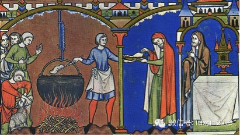
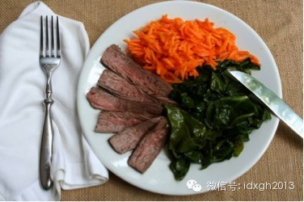
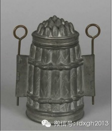

**黑暗料理，最早出自日本动漫《中华小当家》，现泛指以摧残人类味觉及视觉为乐的饭菜。中世纪的英国菜，色香味俱全，其创意与技艺令人称奇，而如今，印度咖喱成为英国流行的菜品。从美食之邦到黑暗料理，英国菜经历了什么？**

  

文/郑子宁

  

英国往往给人以十分美好的联想：高贵冷艳的王室、庄严肃穆的古堡、令无数学子心驰神往的大学……美中不足的是，不少人对英国的美好印象在吃下一口英国烹饪艺术结晶的瞬
间就会灰飞烟灭了，从此对英国由粉转黑。

  

英国菜究竟有多难吃？2005年伦敦和巴黎竞争奥运会主办权时，时任法国总统希拉克在跟俄罗斯和德国领导人会谈时曾对英国菜有如下言论：“做菜如此不堪的人不值得信任
。”“英国人对欧洲农业唯一的贡献就是疯牛病。”“除了芬兰以外，英国是食品最最糟糕的国家。”

  

要想消除英国菜的臭名声显然不是一日之功，在相当长的一段时间里，英国菜仍将是黑暗料理的典型代表。但是英国菜却不是从来就如此不堪的，中世纪，英国非但不是黑暗料理
王国，反而是美食之邦。只是工业革命后，英国菜水准每况愈下，终于沦为笑柄。

  

_著名英国黑暗料理仰望星空派_

  

**【曾经的美食之邦】**

  

1066年，来自法国的诺曼底公爵威廉征服英格兰，此后，英格兰的文化在各方面都受到法国文化的影响，烹饪也不例外。英语中有个有趣的现象，表示动物的词一般是都是本
土词，如猪、牛、羊、鹿，但是这些动物的肉却往往用法语借词表示，诺曼入侵后肉食虽然由说英语的农民生产，但主要供给讲法语的领主。就这样，诺曼征服者将法国的烹饪文
化引入英格兰，是为英国菜的发端。

  

当年的法国菜可不是像现在这样是高大上餐饮的代表，吃一口仿佛人生都能升华。在诺曼入侵时代，法国菜的发展水平仍然很低。

  

1051年基辅的安娜嫁给法国国王。在婚后给父亲写的吐槽信中，她狠狠地抱怨了巴黎的破旧，法国人的粗野，法国菜的单调寡淡——婚宴一共只有三道菜，而安娜在基辅的时
候每顿晚餐都有五道菜。法国菜咸鱼翻身还要等到五百年后：佛罗伦萨美第奇家族的女儿嫁给法国国王时，为了避免遭遇劣质饮食的荼毒，带了自己一整套意大利厨师班子到巴黎
，带领法国人走向新时代。

  

与此同时，在海峡对岸的英格兰，烹饪艺术却蓬勃发展。诺曼人和北欧的维京海盗沾亲带故，也继承了祖先的航海才能，在中世纪早期，诺曼人东征西讨，足迹遍及整个北海和地
中海。他们征服了当时由阿拉伯人控制的西西里岛，并参与了十字军东征，抵达了地中海东岸。

  

在这过程中，他们带回了大量在西北欧少见的食材和香料，如肉豆蔻、丁香、藏红花、肉桂、南姜等。这些从东方引入的新鲜玩意让英国菜有了自己的风格。在汲取了东方料理的
营养后，英国的厨师们不断推陈出新，创制出各色菜品。

  

由于中世纪英格兰相对发达的饮食文化，菜谱也风行一时，这些保存至今的古菜谱也让现代人有机会看到中世纪英国菜的真容，不少菜品的创意和技艺繁复程度都令人啧啧称奇。

  

譬如有一道菜叫萨拉森炖肉（萨拉森为中世纪欧洲人对阿拉伯人的称呼），菜如其名，做法相当东方：将肉先煎一下锁住汁水，然后再在用红酒、糖、丁香、肉豆蔻皮调成的汁中
熬煮；还有一道菜体现了中世纪英国人对食材的冒险精神：烤天鹅，菜谱指导厨师应该在拔了毛、去了内脏的天鹅身上抹上从地中海地区进口的橄榄油再行烘烤，而天鹅的内脏千
万不可随意丢弃，因为那是制作肖东酱的主料，得和烤好的天鹅一起上桌。

  

由于天主教有周五斋戒不能吃肉的规矩，所以更有了一些精致的素食，譬如在空蛋壳内灌入加了不同调味料颜色不同的甜杏仁奶，如此一来，这个“鸡蛋”也就外白内黄，看起来
也就多少有些像真正的鸡蛋了，这种仿荤食的素食跟中国各种豆制品制成的素鸡素鸭素火腿倒也颇有异曲同工之妙。至于各种面点就更是英国菜的强项，相较而言，法国菜当时则
很少有面点，棋输一着。

  

_中世纪的厨房_

  

中世纪的英国菜色香味俱全，和黑暗料理搭不上边，名声相当不错。照这样发展，英国现在应该是全球老饕向往的美食天堂了吧？可世事难料，几百年过去后，英国菜的水准居然
不进反退，英国也一步步沦落成黑暗料理王国。

  

**【工业革命时代的沉沦】**

  

在18世纪，英格兰由于得天独厚的地理环境和较为有利的政治制度，率先开始了工业革命。工业革命对英国有很大的正面影响。英国的实力迅速上升，得以在全球扩张，占领了
大片殖民地，号称日不落帝国。可惜，工业革命也让英国菜开始沉沦。

  

工业革命的一大特征是工业化和城市化，在此期间，英国农业生产趋于集约化，土地高度集中，数百万英格兰农民抛弃了传统的农业生活方式，进城成为产业工人。英国各大城市
人口迅速膨胀，城市人口逐渐成为英国人口的主流。

  

中世纪时依靠自己的一片地供应新鲜食品的传统套路在英国各大都会已无法维持。对于一个工业革命时期的城市工人来说，他日常生活所需的食物大多是从距离较远的产地运输而
来。而当时的运输技术仍然相对落后，主要运输工具是速度很慢的马车。就这样，一车车的食物由马车从产地运入英国各大城市，确保了生活在城市中的英国人能有饭吃。

  

由于马车的低下效率，等到食品从产地送上城里人的餐桌时，往往已经过了很长时间，食品不再新鲜。为了防止腐败引发食物中毒，英国人想出了各种防腐策略。

  

例如从根源抓起，选择耐储存的食材，如新近从美洲引入的马铃薯。还有一大招数则是罐头食品，密封的罐头食品虽然新鲜度和味道大打折扣，但却不太容易腐败，相对安全。而
当这些耐储存的食材进入一个工人家庭的厨房时，已经在工厂忙碌了一整天的女主人没有多少时间精力花在烹调上，各种调味品对一个工人家庭来说往往价格也过分昂贵。

  

所以英国烹调的主要技法演变为简单的水煮。水煮虽然往往味道不佳，却是一种很安全省事的烹调方式，只要水不煮干，再差的厨艺也不会出大问题。于是在这样的条件下，普通
英国家庭的日常主食就变成了一块煮肉加两种水煮蔬菜（其中一种往往是马铃薯）。这样寡淡的食物虽然不见得多好吃，却容易准备，营养充分而且花销较低，适合城市工人食用
。

  

_英国普通家庭最常见的晚餐——水煮一荤两素_

  

工业革命也让英国外卖餐饮业兴起，忙碌的工人需求的外卖餐饮也需具备廉价耐储存快捷易携带的特点。油炸食品恰恰能满足这些，于是以炸鱼薯条为代表的英国快餐应运而生。
虽然未必好吃健康，却能迅速高效地补充能量填饱肚子。

**【缓慢复兴路】**

  

工业革命后的一段时间内，虽然英国平民餐饮出现了严重的质量下滑，但乡村贵族的餐桌仍然很丰富多彩。有闲有钱雇得起厨工，领地有新鲜食材的贵族仍然热衷于美食，譬如当
年饭后经常有做成各种精巧形状的冰淇凌作为甜点，这在没有现代冰冻技术的时代可是费工费时的活。

  

_芦笋型冰淇淋模具_

  

可惜乡村贵族们的餐桌也很快不再丰盛了。两次世界大战严重打击了英国贵族阶层。在战争中大量贵族和他们的厨师战死沙场。各种进口调味品由于贸易被战争打断也在英国绝迹
。

  

而两次世界大战期间以及二战后长达十余年的食品配给制，更是使得贵族们的厨师巧妇难为无米之炊，以前那种精致的冰淇淋肯定就吃不上了。随着英国逐渐演变为平民社会，贵
族的财力和权势也逐渐削弱，雇佣一大帮厨工对绝大多数贵族来说也成为遥不可及的回忆。

  

久而久之，味道一般却颇为方便的食品变成了英国菜的主流。虽然后来随着运输技术的进步和英国人生活水平的提高，理论上英国人完全可以享受更好的美食，可是已经习惯了劣
质饮食的英国人早就忘记了好吃的食品是什么味道了。由于绝大多数英国人对饮食的水准要求已经低到令人发指的程度，英国对于美食的需求也就降得很低。

  

在大家都只要吃饱不要吃好的背景下，萎靡的市场需求导致供应美食成为一件费力不讨好的事。就算有少数美食家，也只能是屈尊食用劣质食品了。这种情况一直维持到1970
年代后，越来越多的英国人有机会出国以后才有所改观。

  

无法被英国菜满足口腹之欲的新一代英国人开始追求全球各地美食，英国菜谱里又出现了大蒜、橄榄油之类貌似异域风情实则几百年前就被英国人用过的调料。而法国则由于工业
革命和城市化进程远远滞后英国，已经有新科技的辅助，所以烹饪文化并没受到严重损害，加之近水楼台之便，法国菜更是牢牢占据了英国高端餐饮市场。英国人面对法国人对英
国菜的嘲讽也就只能自叹不如忍气吞声了。

  

当代伦敦作为一座人文荟萃的大都会确实当得起美食之都的称号，不过主打的已经是全球各地的美味佳肴而不是英国菜了，根据调查，英国目前最流行的菜品是一种印度咖喱。看
来，真正英国菜的复兴真不是件容易的事。

  

> 版权声明：  
大象公会所有文章均为原创，版权归大象公会所有。如希望转载，请事前联系我们： bd@idaxiang.org

大象公会：知识、见识、见闻

微信：idxgh2013

微博：@大象公会

投稿：letters@idaxiang.org

商务合作：bd@idaxiang.org

  

[阅读原文](http://mp.weixin.qq.com/s?__biz=MjM5NzQwNjcyMQ==&mid=202721309&idx=1&sn
=9cc179e596ae831982658bdc376009d3&scene=0#rd)

