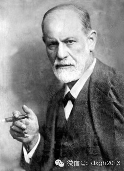
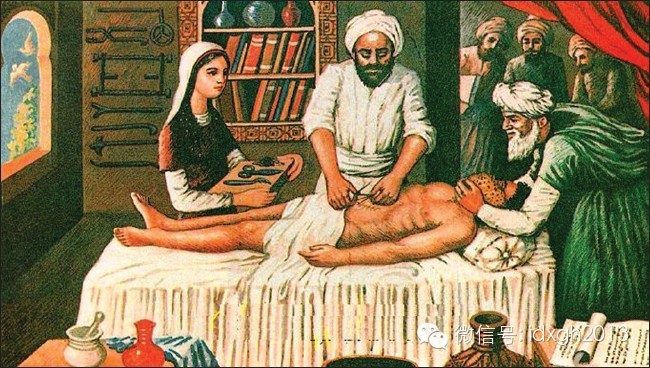
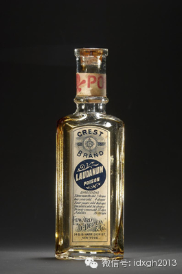
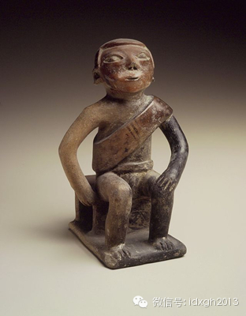
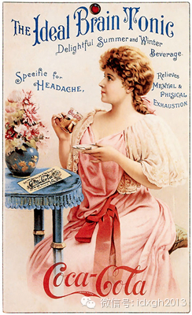
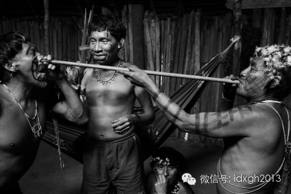
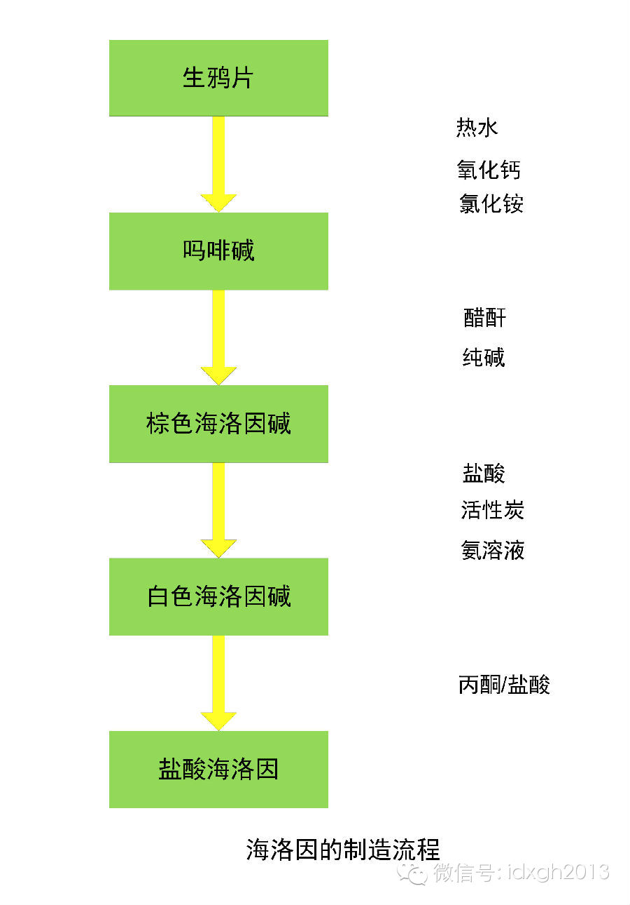
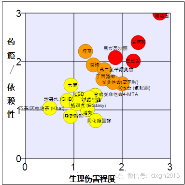
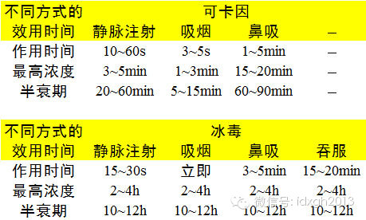

**罂粟、古柯是古老的“快乐植物”，人们熟知的鸦片、吗啡、海洛因、可卡因等精神药物，都是其提取物。不过，这些一个比一个更具威力的药物，却是以戒断“毒瘾”的方式被推广起来的。**

  

文/李小龙  

  

1885年，西格蒙德**弗洛伊德这位未来的精神学派创始人有点头大，他发现自己可能亲手创造了第一个可卡因瘾君子：为帮助好友弗莱斯尔**马克索夫戒除吗啡瘾，一直
在研究可卡因医学用途的弗洛伊德向他推荐用可卡因来戒断吗啡瘾。

  

一年过后，他的好友就从吗啡瘾转向了可卡因瘾，当可卡因的兴奋作用消退，却发现吗啡瘾仍然存在，于是又使用鸡尾酒用法：可卡因和吗啡双管齐下。又过了6年，弗莱斯尔-
马克索夫在神经瘤的巨疼和可卡因、吗啡的作用下悲剧死去。

  

弗洛伊德烟不离手：一直定期定量服用了可卡因十几年没有上瘾，却有极大的烟瘾，他甚至提出：包括香烟在内的瘾症是手淫的良好代替品——他在性方面极为克制，认为性压抑
可以提高创造力（毕加索可能会表示有异议）

  

这个不小心制造出的可卡因瘾君子案例，某种程度上是近现代毒品进化史的缩影：为了解决鸦片成瘾，人们用上了吗啡，为了解决吗啡成瘾，于是又有了海洛因和可卡因。

  

或许一切还要从欧亚大陆的罂粟说起。

  

**【欧**亚**大陆的快乐植物】**

  

至少在公元前4200年，人类就已经使用罂粟仔或罂粟果。印度学者曾提出一种假说，《梨俱吠陀》中苏摩酒的原料就是罂粟。

  

约公元前3400年，美索不达米亚平原的苏美尔人就有种植罂粟和收集乳胶活动，蒴果乳胶经过简单处理，成为鸦片。在苏美尔人独特的楔形文字中，罂粟被称为“快乐植物”
。

  

这种技术被亚述人、巴比伦人继承，扩散到中东、欧洲和北非。此后，阿拉伯帝国的崛起（632年—1258年）与十字军东征（1096年—1291年），让鸦片的知识兵
分两路，进入中国和欧洲腹地，只是当时没得到人们广泛重视。

  

情况在18世纪发生变化，吊诡的是，欧洲和中国差不多步调一致地大量使用鸦片，只不过清朝将之用为消遣品，欧洲则用作特效药。

  

中世纪的阿拉伯“麻醉海绵”手术艺术图：将浸染过鸦片和其他药剂的海绵捂在病人的鼻子上，通过吸入这些含有药剂的鸦片进行全身麻醉。这种麻醉手段的弊端是剂量难于控制
，因为鸦片有抑制呼吸的作用和催吐的作用，剂量过大时往往造成呕吐物进入肺部，造成肺部感染或者死亡

  

中国人吸食鸦片的方法相当独特，每次都像完成一套仪式：

  

**首先**，将鸦片膏（熟鸦片）取出放在小器具中。

**接着**，用烟钎沾上一点鸦片膏在烟灯上烘焙，待鸦片膏被烘干之后，再沾再烤，让烟钎上形成一个小烟球。

**之后**，把烟球置入烟斗中，将烟斗置于烟灯上烘烤。

**最后**，烟球化成烟，才开口吸食。

  

这种长烟管烘焙法吸取了美洲印第安人的烟草吸食、东南亚岛国的鸦片烟草混吸的方法，最终在中国成型。相对于直接吞服和混在烟草吸食，排斥作用更小，最明显的是——不会
在吸食初期便秘。同时，不会破坏鸦片中的生物碱，能更好地吸收。

  

一套相当考究的鸦片烟具。上好的烟具对用料、手感、艺术的审美方面有极高的要求。同时非常注重对鸦片烤灯灯光的利用，利用器具金属的各种棱角和表面反射灯光，可以充分
影响吸烟人的情绪

  

欧洲则是另一番景象。他们沿用了希腊人的观念，把鸦片当成万能药，与葡萄酒、红酒之类混合，制成鸦片酊，它可包治各种疑难杂症：疼痛、痢疾、霍乱、咳嗽、失眠、发烧、
梅毒、忧郁症……甚至被用来治疗泼妇、神经过敏的女人——因为有镇静作用。

  

鸦片药剂的另一种形式是糖浆，主要用于让哭闹的婴儿安静，但效果一般，经常造成婴儿的发育异常或者死亡。

  

不少人发现鸦片能抑制呼吸，于是又开发了崭新的用途——谋杀。一些母亲用大剂量的鸦片酊来谋杀私生子。

  

广泛使用也催生了很多瘾君子。众所周知的歌德、雪莱、拜伦、富兰克林、波德莱尔、济慈、兰波、爱伦**坡等都有鸦片酊瘾，只不过不如中国人精致、细腻。

  

因不断过量服用造成死亡的案列越来越多，1868年后英国的鸦片酊瓶子被要求有注明“毒品”的字样

  

**【新大陆的馈赠】**

  

美洲大陆同样有自己的快乐植物——古柯。

  

不过，首先发现美洲新大陆的哥伦布，在为亚欧大陆引进了烟草和各种高产农作物时，却忽略了当时原住民食用古柯叶的习惯。

  

直到1499年，才有了亚美利哥相关的文字描述：这些原住民用先用嘴湿润木棒，然后用木棒沾着白色粉末将粉末送进嘴里，让白色粉末和绿色的叶子混在一块后嚼个不停。

  

这里提及的绿色叶子就是古柯叶，古柯叶中含有微量的可卡因。白色粉末则是碱性物质，可以是石灰或者是草木灰。当古柯叶和这些碱性物质一块被咀嚼时，古柯叶中微量的可卡
因能被更好地吸收。原住民咀嚼古柯叶后会精神倍增、体力充沛，由于古柯叶有抑制食欲的作用，可以吃得更少。

  

公元850—1500年间的印第安粘土艺术品：左边鼓鼓的腮帮子似正在咀嚼古柯叶

  

古柯叶的妙用很快在西班牙奴役印第安人开矿时派上用场，被作为工资来支付给印第安人。欧洲天主教会也积极参与其中：从中提取10％的古柯叶交易税。

  

虽然欧洲人对印第安人这种塞得嘴鼓鼓，还不停添加石灰的不体面用法不怎么感兴趣，但古柯叶的神奇功效还是引起了欧洲人的兴趣。后来他们发明了和鸦片酊一样体面的服用方
式——饮用古柯酒。

  

1863年，一个叫马里亚尼的药剂师推出了第一款古柯葡萄酒作为提神饮料，它被命名为“马里亚尼葡萄酒”。古柯酒一时大受欢迎。自由女神像的设计者巴托尔迪、仲马、凡
尔纳等名流都曾被马里亚尼葡萄酒所吸引。

  

最初形态的可口可乐也是混合了古柯叶和可乐豆活性成分的葡萄酒。在宣传中它能治疗各种疾病：头痛、身体虚弱、消化不良、神经衰弱、胃痛、便秘、阳痿等，还包括治疗鸦片
或吗啡瘾。

后来由于美国各州禁酒令，1886年古柯酒才变成了非酒精性饮料，也即是可口可乐的最初版，但仍然含有微量的可卡因。到1904年之后，可口可乐中的可卡因成分才逐渐
被剔除。

  

19世纪80年代，可口可口的广告着重强调药用方面的功效

  

欧洲人一直试图从古柯叶中分离出起兴奋作用的生物碱，但都因其在古柯叶中所含的分量太低，同时欧洲和南美的距离太远导致古柯叶无法完好保存而失败。

  

1855年，古柯叶中的生物碱被德国化学家弗里德里希**哥德克分离出来，但其提取方法没人能再复制。1859年德国化学家阿尔伯特**尼曼再度成功提取古柯叶最主要
的活性生物碱，将其命名为可卡因，并在1860年发表的博士论文中公布了详细的提取步骤，但并未引起广泛注意。

  

不过，可卡因和海洛因很快就要在欧洲成功回师了。

  

**【以毒攻毒的恶性循环】**

  

从罂粟中成功提取生物碱比从古柯中的生物碱早了半个世纪——1804年，德国药剂师塞尔杜纳将提取物命名为吗啡。

  

这种效力十倍于鸦片的新药一开始被当作止痛剂，但当时欧洲人苦于鸦片酊瘾泛滥，它很快被用来戒断鸦片或者酒瘾。它确实非常有效，因为吗啡的成瘾性比鸦片和酒精要强得多
。

  

这是走向深渊开始，并且一个药剂师往往不够用。

  

1853年亚历山大**伍德医生发明了真正意义上的皮下注射器，他认为注射方法可以消除口服吗啡的上瘾作用。皮下注射避免了服药的“首过效应”（口服药物进入消化道被
脏器分解消除），药效更强，同时吸收更快。

  

伍德医生的新发明让吗啡瘾君子数量剧增，时代呼唤新的解毒药，于是可卡因和海洛因这两大杀器相继登上历史舞台。

  

可卡因后来能被广泛认知和使用，还得依靠弗洛伊德和他的同事科勒推动：1884年，弗洛伊德发表了《论古柯》，稍晚，科勒发现可卡因可作为局部麻醉剂使用，引起巨大轰
动。很快可卡因在其他麻醉上的用途被发现：神经阻滞麻醉、硬膜外麻醉、腰麻等。

  

当时人们对精神类药物对人体的作用认知非常有限，认为可卡因的兴奋作用可以抵消吗啡的镇静作用（或者相反）。于是，在弗洛伊德帮助下，他的朋友成为第一个可卡因成瘾者
。

  

今天，法律意义上的毒品，依照其对中枢神经系统的效用，被分为三大类：抑制剂、兴奋剂和致幻剂。

  

抑制剂对中枢神经系统有镇静和镇痛作用，其代表是鸦片、吗啡、海洛因、K粉（氯胺酮）等。而兴奋剂对中枢神经系统有振奋作用，冰毒和可卡因等属此类。而致幻剂能让人产
生空间、时间等一系列认知错觉，自然界的植物曼陀罗即属此类。美洲大陆很多原始部落的巫师就有使用致幻剂以达到灵魂出窍、神灵附体等效果的传统。

  

委内瑞拉的亚诺马莫人的萨满通过另一人将大果柯拉豆树种子制成的粉末喷入鼻腔，进入迷幻状态后，用舞蹈和咏唱的方式叙述通神时的所见所闻

  

这些精神类药物对中枢神经系统通常不是单一作用，特别是在大量使用的情况下。

  

譬如吗啡除了抑制作用（原理是肽类物质和阿片受体的特异性结合）以外，还有部分的兴奋（多巴胺释放增多）和致幻作用；可卡因除了有兴奋作用（多巴胺的再回收被阻断）以
外，使用过量也有致幻作用。

  

用可卡因治疗吗啡瘾君子的结果，是让其从单一的精神药物滥用变成了两种不同类型的药物滥用的被戕害者。

  

人们还在为可卡因瘾和吗啡瘾相互作用纠缠不清之时，一直隐忍未发的海洛因已经做好了登场准备。

  

1874年，吗啡更高级的衍生物海洛因被英国药剂师埃尔德•莱特首度人工合成，但未引起太大关注。直到1897年德国拜耳公司的化学家菲利克斯**霍夫曼再度独立合成
海洛因，它才开始进入人们视野。

  

海洛因也被当成一种高效而不致瘾的吗啡替代物，由于它比吗啡有更强的水溶性和脂溶性，可以比吗啡更容易穿透人的血脑屏障作用于中枢神经系统。

海洛因的制造流程

  

**【“毒品时代”开始了】**

  

可卡因在药用上名声大震时就开始被滥用。而海洛因自1897年被重新合成以来，除了被作为拜耳或其他制药公司的特效药使用外，并未马上引发滥用潮流。

  

英国Allen &Hanburys制药公司的“Allenburys”牌No.63喉片盒，上面写着药剂的成分：由海洛因和可卡因调制合成

  

1910年后情况发生改变。饱受鸦片和吗啡滥用之苦的美国在1909年通过了《排斥吸食鸦片法案》，吸食鸦片者开始转向它的高级代替品海洛因。

  

和吗啡相比，海洛因的管控更宽松，瘾君子发现海洛因比吗啡的“药效”更强也只是时间问题。海洛因理所当然取代了吗啡，成为被滥用的主力军。

  

20世纪第一个十年之后，同样是植物的生物碱半合成品的海洛因和可卡因开始分别占据人类常用毒品的阴阳（抑制和兴奋）两极——在成瘾性和对身体伤害上长期独占鳌头。

  

人类这才开始进入毒品时代。

  

2007年英国医学杂志《柳叶刀》关于常见管制药品伤害性及成瘾性比较显示：海洛因和可卡因在对身体的伤害和依赖性上分居前两位。至于最近因携带大麻1.15克被捕的
著名反派“古惑仔”演员耀杨哥看到这张表格可能会颇感无奈：大麻对身体的伤害和依赖性都还不如烟草和酒精

  

需要强调的是，毒品是个相对概念，英文并无对应词汇，多表述为“药品滥用”或“药品成瘾性依赖”。中文常见的“联合国禁毒署”，直译其实是“国际麻醉品管制署”，联合
国禁毒公约的直译，分别是《单一麻醉药物公约》与《精神药物公约》。

  

今天，人类对快乐植物的诅咒依然束手无策。而且，作为萃取植物精华而成的海洛因和可卡因，在后来不断出现的纯人工合成的精神类药物前不落下风。

  

不过，“冰毒”这种早期人工合成毒品似乎有赶超之势。

  

冰毒因为容易大量合成（比如我国化学天才刘招华一不小心就合成了12吨冰毒，纯度最高达99%），所以价格更亲民，因此被称为穷人的可卡因。但冰毒药效持续时间比可卡
因长的多，如此物美价廉，瘾君子选择冰毒很正常。

  

可卡因和冰毒的效用时间对比

  

比如静脉注射，可卡因在体内的代谢速度20-60分钟就能衰减一半，而冰毒的代谢速度10-12小时内才衰减掉一半，作用时间十几倍于可卡因。

  

除了冰毒，冰毒衍生物浴盐也是人工合成精神药物中的后起之秀，2012年美国迈阿密骇人听闻的啃食路人头脸的“食人魔”，就是其重度成瘾者。

  

或许，人类摆脱快乐植物的诅咒，很不幸地要靠这些更可怕的纯人工合成精神药物。

  

> 版权声明：  

> 大象公会所有文章均为原创，版权归大象公会所有。如希望转载，请事前联系我们： bd@idaxiang.org

大象公会：知识、见识、见闻

微信：idxgh2013

微博：@大象公会

投稿：letters@idaxiang.org

商务合作：bd@idaxiang.org

举报

[阅读原文](http://mp.weixin.qq.com/s?__biz=MjM5NzQwNjcyMQ==&mid=204091650&idx=1&sn
=a7ffea154bf441136dcaea8673b10d60&scene=0#rd)

