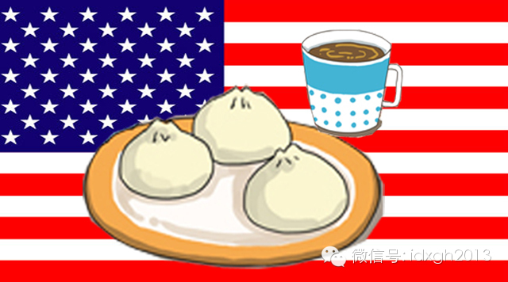
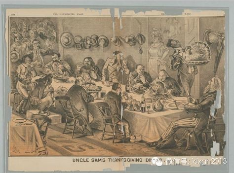
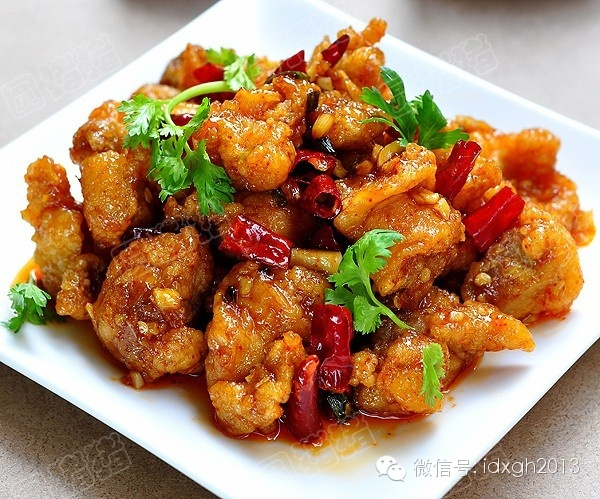
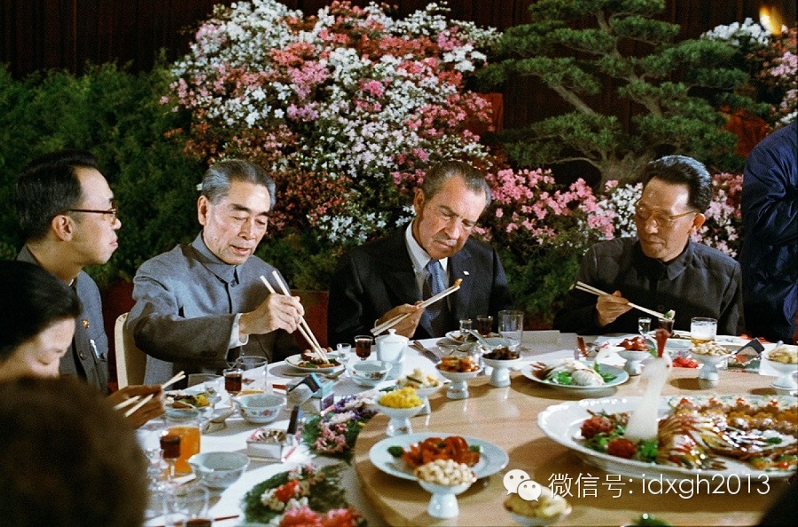

**整个纽约都曾为“炒杂碎”而疯狂。中国名将左宗棠凭借一道菜名在美国家喻户晓。两百年走过，美国中餐或许并不正宗，但烹饪的内涵就在于因地制宜、即兴发挥。**

  

文/I.Issak

  

包子似乎迎来了历史性的机遇，先是习近平主席光顾庆丰包子铺，后是“狗不理”计划进军美国。这家入选国家级非物质文化遗产的老字号称，计划收购美国某家著名咖啡连锁店
。

  

曾被美国人称为“惨白色的蛋糕，里面夹着肉”的包子，选择与咖啡结合，大概是美式中餐形成史的又一个趣闻。

  

一个多世纪以来，中餐馆在美国无孔不入，生根发芽。就连当年用来计划刺杀林肯总统的华盛顿特区旅馆，如今也成了当地知名中餐馆珍味楼的所在地。

  

一切，都要从二百年前说起。

  

【“吃老鼠”的中国人】

  

1820年代第一批华人移民美国。由于其中多数是广东省台山人，故美国的中餐也发端于台山菜。

  

十多年后，加州开始了淘金热，至少有20000华人去大洋彼岸寻找“金山”。在矿上，中国人施展出源远流长的保存食物技术，凭借着咸鸭蛋、腌菜、腌萝卜、鱼干、干菇，
乃至从中国引种的柿子，成为了金矿上吃的最好的一群人。

  

一些中国人在金矿附近开设供应各种炒菜（chowchow，炒炒之意）的餐厅，最早将第三产业引入金矿地区，还有人在当地的名门望族中担任家庭厨师。一位淘金者曾评价
说，加州最好的餐馆都是中国人开的，中国菜味道饱满平衡。

  

在1850年至1910年间，故国故土要么政局动荡、匪盗横行，要么灾害不断，所以广东台山人将美国视为新的沃土。1950年代之前，80%的中国移民来自这一地区。
他们源源不断地登陆美国西海岸之后，广泛分布在制造业、农业、采矿业和铁路等行业中。

  

随着淘金热和修筑铁路的热潮慢慢褪去后，无论容貌还是言谈举止都极易被识别的华人开始遭到白人的排挤。白人工人们认为，中国人已经泛滥成灾，“偷”走了他们的工作。中
国人变成了歧视、仇恨甚至杀戮的对象，中餐馆于是生意一落千丈。

  

在偏见之下，中国人的食材也令他们胆寒。在美国人眼中，中餐就是煮食各种来源神秘、质地怪异的肉类和蔬菜，并把它们切成极小的碎片，或者干脆捣烂，再和以奇汁异酱。

  

19世纪60年代，马克吐温在采访一个叫阿成的店主时，毫不犹豫地接受了主人递过来的一杯白兰地酒，却婉言谢绝了一种看上去干净整洁的小香肠，因为“当时人们都害怕香
肠里有老鼠肉。”

  

_1877年，美国杂志刊登的一幅漫画中，美国各民族人士一起享用丰盛的感恩节大餐，在座的中国人正在大口吃着老鼠。_

  

偏见以外，受清教徒和新教徒影响较深的美国文化也阻碍了中餐馆的发展。美国人奉行简朴节制，认为食物只是用以维持生命的粮食。他们对中国人热火朝天、忙碌喧嚣的烹饪场
面持怀疑态度。切菜、剁菜、大火熊熊燃烧、餐具碰撞，以及饭桌上吃饭聊天的声音，都曾让他们难以接受。

  

1882年，美国主流社会对中国人的常年歧视最终导致《排华法案》出台。这部美国历史上唯一一部排斥某个人种或种族的法律，使得在美国本土出生，成为中国人获得美国国
籍的唯一途径。

  

在大门紧闭之前到达美国的中国人，也逐渐失去了工作机会。他们只好以两种方式应对：开设餐馆和洗衣房——这被视为是女人的事情，不会对白人男性的工作造成威胁。

  

【“杂碎”救了中国移民？】

  

因为生存环境恶劣，中餐馆展开了一系列“美国化”的努力：比如，那个时期的中餐馆菜单上赫然出现“荷式烤牛排”、“加州烤鸡配黑加仑布丁”，当然，还有招牌的“炒杂碎
（chop suey）”。

  

关于“炒杂碎”，有一个极富历史传奇色彩的故事：1896年李鸿章访美，在一家餐厅吃饭，因他有消化不良的痼疾，就把桌上几道菜随便倒在一起混杂成一道新菜。有人问起
这道新菜的菜名，结果被告知是“杂碎”。

  

李鸿章杂碎的故事流布甚广，但在其访美之前，“炒杂碎”就已存在，它照例起源于广东台山，只不过到了美国后，肉代替了内脏。李鸿章的名声，只是有利于炒杂碎的市场营销
。

  

在排斥“重口味”和奇异食材的美国主流饮食观念约束下，经过改良的杂碎一时间成为美国中餐的头牌名菜。整个纽约都曾为它疯狂，甚至约会中的男人为搏红颜一笑，也会带她
去吃“炒杂碎”。1923年，一位15岁的芝加哥女孩用假支票从父母那里盗用了3400美元，全部花在了中餐馆的杂碎上。

  

即便如此，美国人对中餐的接受还是扭扭捏捏。1903年的《纽约时报》中写道：“中国人，就是那帮在别人都睡觉的时候还在吃东西的人，会炒杂碎便赚得盆满钵益的人。”

  

倒是有一个群体对中餐馆一直钟爱有加——犹太人。这个民族同样渴求主流社会的接受，在饮食上积极向美国大众靠拢，但无奈有严格的饮食戒律，权衡之后开始频繁光顾不常在
菜里放入乳制品的中餐馆。

  

重压之下，中餐馆顽强地渗入了美国社会，1870年到1920年间，从164家上升到11438家。1903年，洛杉矶电话黄页中登记有三个中餐馆，1941年增加到
了73个。此外，波士顿、纽约、芝加哥等美国各大城市中都相继开始出现中餐馆。

  

对菜式的创新还不够，被“猪尾巴”伤害太深的中国人，开始大量在餐厅里引入燕尾服，并在装饰上引入一些西方元素。

  

严格来说，这些中餐馆还只能被称为“中国人开的餐厅”——1940年代著名社会学家费孝通访美，在一家中餐馆吃过饭之后表示，那顿饭丝毫没有让他想起家的感觉。不止是
菜品，就连餐厅里的表演者，也全然和中国人无关。

  

【基辛格的最爱】

  

第一次世界大战中，现代食品工业大量制造罐头食品，极大地方便了战争后勤。一战结束之后La
Choy公司在底特律成立，以炒杂碎和炒面为主，制造和出售罐装中餐。此后，罐装炒面和中菜调料包就出现在了主流超市的货架。

  

1940年到1945年，二次世界大战再次成为中餐发展的历史机遇。随着美国国防工业在西部沿海地区大规模发展，人口增长了50万。大量激增的人口，使得该地区唐人街
的中餐馆生意蒸蒸日上。

  

1943年，美国政府撤销了《排华法案》。连年的国共内战，以及1949年的政权更迭，大量优秀的厨师为躲避政治风险而到达美国。而从1971年起，大陆和美国关系好
转、台湾渐渐被国际社会疏离，有不少心有恐惧的台湾人也拖家带口移民美国。

  

和传统依靠同乡关系的移民方式不同，这次大规模的移民人口来源多元，川菜、湘菜、浙菜、粤菜等各大菜系都在这段时期被迅速引入美国，重新定义了美国中餐。

  

二战之后，普遍富裕的美国人对饮食也有了新的认识，逐渐意识到饮食除了填饱肚子之外，也可以是一项卓越的艺术。他们在享受法式大餐的同时，也开始“勇敢地”拿起筷子去
尝试中国美食。

  

1961年，美国争取种族和平的自由乘车运动爆发，众多示威者们聚集在华盛顿一家中餐馆用餐，准备餐后搭乘改变美国黑人命运的第一班自由巴士。隔年，肯尼迪总统和前苏
联特使在燕京楼进行秘密会谈，成功消除古巴导弹危机。

  

时隔一个世纪之后，杂碎也完成了他的使命，渐渐从美国菜单上消失，取而代之的是左宗棠鸡、花椰菜牛肉和咕咾肉。

  

因为中餐的缘故，左宗棠在美国家喻户晓，几乎任何一家中餐馆都可以一尝左宗棠鸡的美味，每个星期都有数以万计的美国人提起他的名字。鲜美酥脆的鸡肉，蘸上香浓扑鼻的辣
酱，用大蒜、生姜和辣椒小炒，直至鲜香四溢。

  

_左宗棠鸡。_

  

不过，在左宗棠将军的家乡——中国湖南，没人知道左宗棠鸡。这道菜发明于台湾，发明者彭长贵曾说如此命名，是为了纪念自己的家乡。左宗棠鸡表面上是湘菜，底子是淮扬菜
，手法为岭南菜，另外加上彭长贵的创意。

  

1973年，彭长贵前往美国，在纽约开设彭园餐厅。前美国国务卿基辛格到彭园用餐后，非常喜爱左宗棠鸡，后来经常前往。再加上ABC电视台增推出报道此菜的特别节目，
使它在美国声名大噪，成为美国人认知中最著名的中国菜之一。

  

当前美国各地中菜馆推出的左宗棠鸡，依照不同厨师的创意而有许多变化，主要特征之一是带有甜味——彭长贵对此感到不可思议，现在连他自己也不认识美国的左宗棠鸡了。

  

美国人对不同文化的兴趣不止局限在饮食上。1971年，纽约时报著名记者James
Reston在北京阑尾发炎发作，并接受了针灸治疗，据说效果奇佳。回国后，他将这一传奇经历发表出来，掀起一小股中国热，中餐厅因此大赚一笔。

  

第二年，美国总统尼克松访华。当他拿着筷子面露困惑的表情在全世界传播开来，海外中餐馆的生意迎来又一次春风。仅仅在接下来的两年，25本中式菜谱书在美国和英国出版
。  

_尼克松访华，吃中餐。_  

  

现在，中餐发展迅速。有媒体报道，在2009年美国全境有41000个中餐厅，这个数字已经超过了美国境内所有的麦当劳、肯德基、汉堡王、必胜客、Taco
Bell的总合。英国史学家Eric Hobsbawm甚至说，中餐是“东方文明最伟大的文化输出”。

  

尽管美国中餐的发展仍偶有风波，比如中餐调味品味精是否有害健康曾引起争议，中餐的热量是否过高也曾受到质疑。但是，美国中餐早已成为美国文化不可或缺的一部分。纵观
人类的美食史，或许烹饪的内涵就在于因地制宜、即兴发挥。

  

在社会学的概念里，“同化”也不再是少数群体融入到多数群体，而是不同文化间的融合。左宗棠鸡，既是美国菜，也是中国菜——诞生、流行在美国本土，却是受到了中国菜烹
饪技法的启发。

  

兴许在不久的将来，纽约白领在买杯咖啡上班的同时，也能捎带上两个包子和一碟酱菜。

  

大象公会：最好的饭桌谈资，知道分子的进修基地。

[大象公会所有文章均为原创，版权归大象公会所有。如希望转载，请事前联系我们：idaxiang@idaxiang.org ]

[阅读原文](http://mp.weixin.qq.com/s?__biz=MjM5NzQwNjcyMQ==&mid=10225543&idx=1&sn=
38452d385a7c37025c7803d666e78d0c&scene=1#rd)

