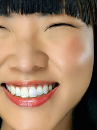
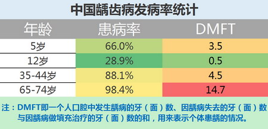
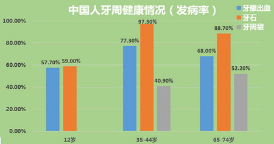
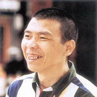
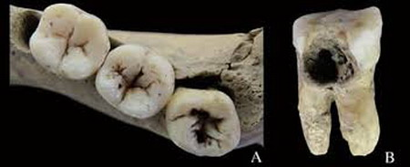
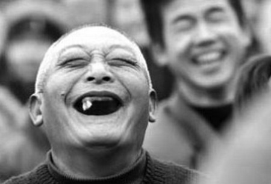
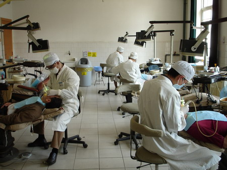
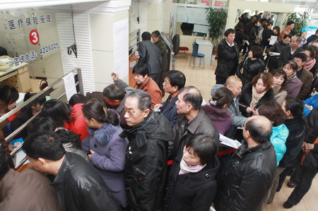
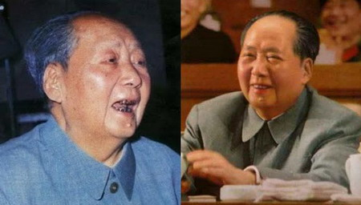

****1990年代，有医学专家上书高层，称今天在外交场合，领导人牙齿好坏事关国家形象。于是，在牙医们的帮助下，《新闻联播》头几分钟出现的中国人的牙齿状况大为改观。如今，电视广告中推销幸福生活的模特，都有了一口“中产阶级牙齿”。****

  

文/黄懽

  

电视广告中向你推销幸福生活的的模特，与普通中国人最大的区别是什么？是的，他们都很漂亮，从长相到身材，但最大的区别是牙齿，无论男女老幼，他们都有一口“中产阶级
牙”，像珍珠一样晶莹洁白，并且非常整齐。

****电视广告中模特洁白、整齐的牙齿****

  

除了广告，我们几乎看不到有这样牙齿的中国人，即使是在《新闻联播》——众所周知，那里生活着全中国最幸福的人。《新闻联播》里的中国人，牙齿虽然好过普通中国人，但
与《新闻联播》后十分钟国际新闻中出现的欧美牙齿相比，还是有相当差距。  

  

如果留意《新闻联播》的牙齿，你会发现欧美国家的明显更整齐漂亮，而第三世界穷国则和中国人一样，牙齿都不那么好。

  

从统计数据看，牙齿的好坏大体反映了一国国民富裕程度与健康水平，对个人而言，也是其阶层的直观体现。总体上，发达国家国民的牙齿整体上优于发展中国家，而发达国家中
，富裕阶层的牙齿又明显好过贫困阶层。

  

不过，牙齿好坏与阶层的关系，在中国体现得并不明显。中国虽然正迅速成为“强盛大国”，但牙齿健康状况却与拥有的财富并不相符——几乎整体处于世界垫底水平。

****中国龋齿病发病率统计****

****  
****

****中国人牙周健康情况（发病率）统计****

  

事实上，中国电视广告中那些有一口中产阶级好牙的模特和演员，牙齿状况也未必光鲜。演员已经是中国最舍得花钱美白牙齿的人群，但绝大多数依然没有养成护牙的习惯——中
产阶级牙齿周围往往存在严重的牙周炎，到了一定年龄，牙齿很容易松动脱落。  

  

中国人的牙不好，首先是观念性的，多数中国人不太在意牙齿好坏美观与否；其次，错误的刷牙方式也导致国人坏牙频发。绝大部分中国人是牙疼才去找牙医，已算晚期，基本不
可能看好了。因为发炎、溃烂，需要拔牙、镶牙，还要更替。几乎很少有人为了牙齿健康日常定期看牙。

****多数中国人不太在意牙齿好坏美观与否****

  

****【亚洲人的牙齿普遍不行？】****

中国人普遍对牙齿的忽视，或许有先天性因素。在古代中国，这里就是龋齿高发区。考古学家在判断一个地区新石器和青铜时代的古人是农耕还是游牧或狩猎时，墓葬遗骨的龋齿
发病率是一个重要判断指标。

  

引起龋齿的一个重要原因，是食物中的碳水化合物残留在口腔内，其中的糖分会被口腔内的细菌代谢产生酸，侵蚀破坏牙齿，产生龋洞，故以谷物为主食的农耕民族，龋齿发病率
会明显高于游牧或狩猎民族。中国人是世界上最早进入农业社会的人群之一，而长城沿线明显成为龋齿高发区和较低地区的分界线。

****湖北青龙泉新石器时代居民龋齿病变，A下颌臼齿咬合面龋齿，B上颌臼齿近中面龋齿****

  

另外，日本横滨鹤见大学研究者2014年9月在《口腔生物学》杂志发表论文称， DLX3基因上一个rs2278163的基因位点可能与蛀牙易感性相关。在口腔中有高
突变链球菌的人群中，龋齿易感性有明显个体差异性。龋齿易感性个体中，TT型比例为58%，CC型比例为4%。说明T型等位基因可能增加了龋齿易感性，而C型同位基因
可能抑制了龋齿易感性。  

  

研究人员发现，该等位基因频度种系差异较为明显，日本人57%属于风险型TT，明显比例偏高，北京汉族为26.2%，而白人和黑人则在10%以内。或许它是亚洲人牙齿
普遍不好的原因之一——富裕的日本人牙齿要明显好过中国，但较欧美仍有相当差距。

  

由于对护理工作的轻视，中国人基本都有牙周病。牙齿表面的脏东西未得到及时清洁，进而引起牙龈退缩，牙齿变松以致脱落。实际上，如果有良好的健康卫生习惯，牙齿可以一
直伴随到老，今天欧美国家的老人已经很少像中国人一样“老掉牙”了。

****“老掉牙”其实是中国的误区****

  

龋齿发病率和经济发展水平基本是同一条曲线。当中国人还停留在如何治疗它的阶段，欧美则着重预防，例如在水里、在牙膏里加氟，另外强调要少吃糖，因为残留在口腔中糖形
成酸会腐蚀牙齿，虽然欧美人均糖类摄入量依然很高，但注重口腔卫生的习惯，使龋齿发病率被控制在一个很低水平。  

  

除了个人的观念和意识，中国医疗卫生体制的现状也让中国人整体上很难有一口好牙。

  

今天全球大概有130万牙科医生，美国有16万（13万在岗工作，其他为退休等非在岗医生），巴西有20万牙科医生，居世界之首。按人口比例，中国牙医数量严重不足，
卫生部官方统计，中国牙医为14万人（中国每年约2万人通过牙科医生考试，有望近年超越美国）。

  

但是，牙医统计数据各国标准不同。欧美国家口腔助理并不被称为医生，而中国则将助理医生也计为牙医。卫生部公布的14万牙医中，一半是助理医生，中国口腔学会的数据为
20万，助理医生也占一半左右。

  

这些助理医师工作一段时间后，可以参加通过率在30%左右的资格考试，多数助理医师都会参加这项考试，很大比例会转为医师。而欧美国家的医师门槛非常高，助理医师很难
像中国一样成为医师。

  

中国牙医数量不足，技术水平更成问题。中国口腔院校有100多所，但教学质量较高的院校有限，而且大学扩招之后，师生比失调，甚至有两个老师教两百个学生的情形。目前
中国实际在岗的口腔医生，平均学历在本科以下。

****目前中国实际在岗的口腔医生，平均学历在本科以下****

  

另外，国外牙科（dentistry）和医科（medicine）是并列的，而中国口腔医生则属于医科（医学）的。中国牙医大学前三年学的还是临床学，要做阑尾炎手术
、妇科等，最后两年才会分科，它导致学生在专业水平上与国外有很大差距。  

  

中国这套独特的体系进口自苏联，此前中国的上海医科大学（圣约翰大学）、北京医科大学和华西医科大学有独立的牙科，1958年按苏联体系口腔科从五官科分离出来，牙科
成为其中一个部分。

  

今天中国80%以上的公立医院都有口腔科，国外不但没有口腔医生这个职业划分，而且牙科医院基本上都是私人开办。

  

****【公立医院与私人牙医】****

中国牙科医院分四类：公立口腔专科医院、公立医院口腔科、民营牙科连锁医院、牙医独立开办的医院。

  

公立口腔专科医院主要服务一般百姓。国家赋予其教、研、医结合的任务，因为有研究做基础，临床技术可以达到很高水平，但教学水平很低——老师很大部分精力花在看病上。
在国外，这类机构第一任务是教，第二是研，很少承担看病任务。

  

公立医院口腔科远不能与公立口腔专科医院相比，因为公立医院盈利主要靠大内科大外科，口腔科基本不受领导重视，技术和设备投入很少，牙医们文章发不了、职位上不去，专
业上容易自暴自弃。

  

中国人喜欢去公立医院看牙，但中国公立医院永远像火车站候车室一样人山人海，必须起大早排队挂号。而医生必须在极短时间内了解病人的过去和现在，未来如何则无暇顾及。

  

中国人对公立医院医生水平的高下有常见的误区——有些极为挑剔的人，选择医生时，会挑论文发表得多的学术权威，其实，他们的临床经验反而较少。中国体制下医生升主任、
升教授，都需要写文章，耽误了临床的经验积累。

****中国公立医院永远像火车站候车室一样人山人海，必须起大早排队挂号****

  

民营牙科连锁医院在服务上要远优于公立医院，通常它们都有精良的设备，但中国很大一部分好医生还是在公立医院，最好的都自己开诊所了，所以连锁牙科医院一般都是二流、
三流或者年轻的牙科医生。  

  

最接近欧美国家的，是由医生独立开设的民营医院。美国的牙科从医指南通常建议病人去私人诊所，因为这种诊所通常靠口口相传建立信誉，形成稳定的顾客群。

  

民营牙科医院都要赚钱，所以收费要明显高于公立医院，但牙科收费比其他医疗消费要透明的多，没有回扣、红包，选择时可以货比三家。公立医院虽然手术收费标准是规定好的
，但存在床位问题、专家问题这种塞红包的灰色地带。

  

若是遇到牙疼，在不怕浪费时间的情况下，性价比最高的自然是去公立口腔专科医院；但若是为了平时养护和牙齿的美观，则应首选医生独立开设的诊所。

  

不过，今天中国这类民营诊所接待的客户中，真正牙齿出现问题的病人占绝对多数，这与欧美国家牙科诊所多数是为了维护牙齿美观的客户完全不同。不少即使舍得一顿饭花几万
的富豪，牙疼需要求医时，都会觉得需要上万的费用太贵。

  

当然，我们还是有理由相信，在国家领导人的率先垂范下，中国人的牙齿整体上会好起来——当年毛泽东虽有中国最好的医疗保健，却以老虎不刷牙但牙齿照样锋利为由，拒绝保
健医生劝他注意口腔卫生的建议。当然，他一口灰绿色的牙齿并不会展现给世人，照片上的形象可以通过暗房技术修改。

****毛泽东照片上的形象可以通过暗房技术被修改****

  

不过，中国尚未掌握修改电视画面里的人物形象的技术，于是1990年代，有医学专家上书高层，称今天在外交场合，领导人牙齿好坏事关国家形象，在牙医们的帮助下，《新
闻联播》头几分钟出现的中国人的牙齿大为改观。  

  

如果你留意《新闻联播》中的牙齿，你会发现美国人的牙齿是最整齐漂亮的，事实上，美国人的牙最好是世界公认的，为什么？**请看下一篇《美国人的牙齿为什么最漂亮》*
*。

  

**_（作者系世界牙科论坛报中文版总编，美国gIDE/Loma Linda大学种植牙大师课程中国区主任，美国UCLA美学牙科课程中国区主任，哈佛大学中国种植牙课程中方负责人，中华口腔医学会口腔器械材料分会常委，北京市口腔医学会民营口腔医疗分会秘书，美国牙医学会会员。）_**

**_  
_**

**版权声明**

****大象公会所有文章均为原创，****  

****版权归大象公会所有。如希望转载，****

****请事前联系我们：****

bd@idaxiang.org

****知识 | 见识 | 见闻****

阅读

__ 举报

[阅读原文](http://mp.weixin.qq.com/s?__biz=MjM5NzQwNjcyMQ==&mid=206684381&idx=1&sn
=11bcadd8df7b2f27b38984e4acd5556c&scene=0#rd)

