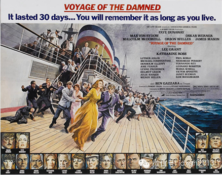
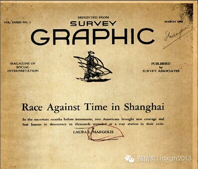
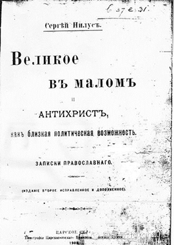
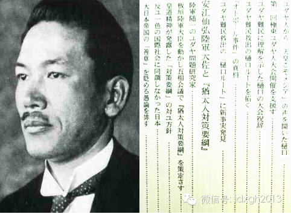
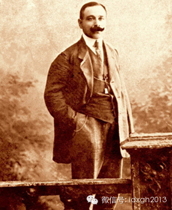
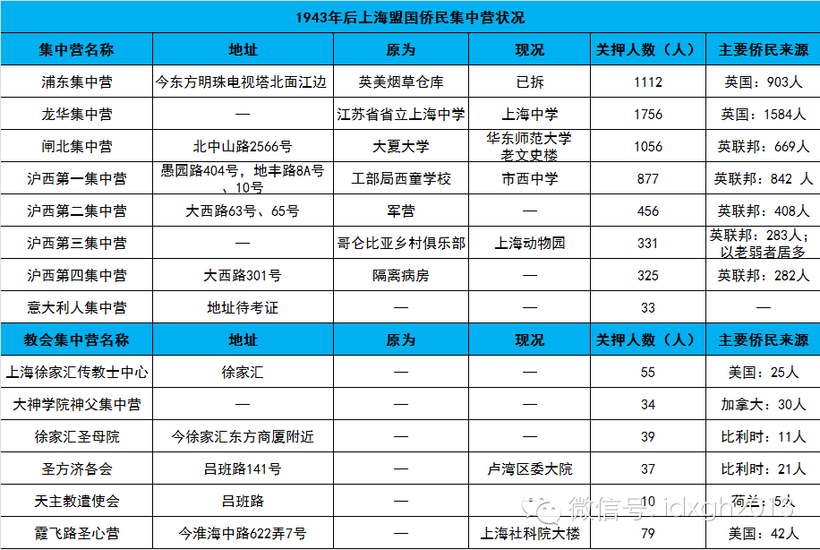

**二战期间，上海慷慨地给予犹太人庇护，谱写了民族间的友谊赞歌。但在这些犹太人的回忆录中，却很少提及这段恩情，一些人提到最感激日本人。这究竟是为什么呢？**

**  
**

文/李清末  

  

一个月前，上海犹太难民纪念馆和美国犹太人委员会在华盛顿举办“犹太难民与上海”图片展，二战期间“拯救犹太人”的旧事再度出现在舆论视野中，国内相关报道多以“大屠
杀亲历者泪谢中国”作为标题，在强调中国人善良、乐于助人的同时，有的还捎带了日本人的凶残、蛮横。

  

1933年—1941年，有3万犹太人为躲避纳粹迫害逃到上海，同期美国只接收了20万犹太人。犹太人的故土巴勒斯坦——1939年英国殖民当局宣布未来5年内只接受
7.5万犹太人。尤其是1938年11月9日德国爆发迫害犹太人的“水晶之夜”后，上海几乎是全世界唯一对犹太人敞开大门的城市。

  

上海犹太难民留下的大量回忆文献中，不少人表现出对上海的眷恋，但很少看到他们对上海或上海人表达感恩之情的文字。这与中国的相关报道差异很大。

**  
**

**【为什么是上海】**  

**  
**

上海无意中成为了犹太人的“希望之港”。  

  

1933年纳粹上台后，对前途悲观的犹太人纷纷逃离德国，严格来说他们是侨民而非难民。“水晶之夜”后，纳粹德国突然加速清除犹太人，那些在“事情不会那么糟”的自我
安慰中留下来观望的犹太人，突然发现自己已变成难民，并且全世界几乎找不到容身之所。

  

1938年7月，罗斯福牵头在法国埃维昂莱班组织讨论接收犹太难民的国际会议，但32个与会国中，除多米尼加外，其余国家皆不愿接收犹太人，牵头者美国也不例外。当时
西方盛行反犹主义，即使是对犹太人最友好的美国，也有上百个反犹太团体。

  

反犹压力使得犹太人即使逃到美国也无法入境，最典型的是“圣路易斯”号邮轮悲剧。1939年5月，九百名犹太难民被纳粹德国用“圣路易斯”号邮轮送至古巴，结果被古巴
拒绝，停靠迈阿密登陆又被美国拒绝，只好返回欧洲。他们当中有六百人后来死于集中营。1980年代中国曾引进的美国电影《苦海余生》即以该事件为原型。

  

电影《苦海余生》海报

  

虽然多米尼加表态接纳10万犹太人，但它无力筹措巨额安置费，而犹太人也不愿去生活环境贫穷且与欧洲相去甚远的国家。此时，万里之外的中国上海因为多重因素叠加，成为
唯一选择。  

  

首先是上海租界“国中之国”的独特地位。1845年上海成立租界后，逐渐形成英美等国租界合并而成的公共租界和法租界，它独立于中国政府，尤其是不受任何外国领事管辖
的公共租界，属于由外国侨民自治的独特地方实体。

  

由于租界地位特殊，清代及民国初，外国人旅居上海无需任何手续，1932年，民国政府开始对吴淞口和上海登陆的外国人增设查验护照签证程序，由于传统习惯，上海实际上
对任何人都实行落地签，是世界最著名的开放城市。

  

1937年上海陷落，国民政府无法行使行政管辖，而日本还未组建傀儡政权管理上海，进入上海的签证管辖权被虚置，租界无意中扮演了难民收容所的角色（淞沪会战时，公共
租界北区和东区被日军控制，这部分后被称为“日租界”）。

  

所以，从1937年八一三抗战到1939年9月之前，上海租界为犹太人敞开了大门：无需签证、无需有人宣誓担保，无需警方证明，无需保证经济独立。

  

上海不仅有犹太人入境的便利，还有先期定居犹太人的财力。当时上海有两个犹太人集团，一个是英国的巴格达商人，他们中有沙逊家族、卡多利家族、哈同家族等著名富豪，另
一个是俄国犹太人，他们虽不如前者富有，但人多且颇有财力。

  

在外滩16铺码头登陆的犹太人并不很像难民，至少从欧洲到上海的逃难并不狼狈，甚至算得上奢侈。他们购买头等舱的船票，在船上开Party，吃高档西餐。在许多犹太人
的回忆中，彩带、日本乐队、专用乘务员、蛋糕是他们旅途最主要的印象。  

  

但是战争期间的背井离乡毕竟不同于旅行，上岸后，他们很快就典当完了家具、衣服和行李，只有等待救济。巴格达犹太富商第一个伸出救援之手，1938年他们组建了第一个
援助犹太人的COMA委员会，不但提供公寓，还向每位难民每天提供5美分，足以保证难民的基本生活。

  

1939年，进入上海的犹太人由1938年的1374名激增至12089名。这时美国犹太人社团组织JDC联合慈善力量，成为救助难民的主要机构。

  

JDC颁布的援助上海犹太难民文件

  

无论如何，犹太难民过得远比上海当地人要好，亚洲式的贫困令他们印象深刻：“那些拉着富人一天到晚在街上闲逛的中国车夫简直不是人，冬天他们没有暖气，很多中国人在街
头被冻死，第二天垃圾车来的时候，尸体直接被抛到了车上。”

  

日本占领下中国人的不幸同样让他们印象深刻：“日本人对待犹太人和中国人的差别很大，每当中国人过桥时，总会受到日本人的侮辱，日本兵用刺刀戳他们，或用烟头烧，但是
中国人更厉害，他们回头对伤害自己的日本人笑笑，在我看来，这是中国人打败日本人的标志。”

  

**【兄弟、恩人与谋略】**  

  

日本也许是当时世界上对犹太人最有好感的国家，他们对犹太人的好感源远流长，它是妄想、阴谋论和感恩的奇特混合。

  

早在明治时期，苏格兰传教士麦克劳德为了方便日本传教，提出了一个异想天开的假说：日本人是犹太“失散的10个部落”的后裔，这成为后来“日犹同祖论”的起源。

  

麦克劳德的学说曾在日本颇受欢迎，当时日本处于“一种被视为远东孤岛和异教国家的不光彩地位”，“日犹同祖论”可让日本人从西欧世界中“并无过错却遭排斥”的犹太人那
里找到共情基础。

  

日本神学家也加入到这个“伟大理论”的构建：中田重治在《圣经中的日本》里论证日本人与犹太人同是“神的子民”；佐伯好郎则提出，日本古代望族秦氏到日本后，定居京都
郊外的“太秦”，而“太秦”日语读法为“uzu massa”，那么“太（uzu)”即是希伯来语中的“i-shu（耶稣）”，“秦（masa）”则指“弥赛亚”。

  

和犹太人拉上关系，至少为日本近代受西方歧视与欺辱提供了一个自我神话的完美回答：犹太人因为在宗教起源上有先于基督教的“宗教史上的长子权”而受欺负，日本在宗教上
也是一个藐视欧美各国的“神州帝国”，所以我们同自己的“兄弟”一样，不断受到欧美各国的欺辱。

  

历史证明，日本人没有白认这个“犹太人兄弟”。

  

1905年日俄战争爆发，时任日本帝国银行副总裁的高桥是清赴伦敦筹款，他的游说毫无成效，直到偶遇美国犹太富商雅各布•亨利•希夫。后者对沙皇俄国的排犹主义恨之入
骨，当即答应借给日本500万英镑，在雅各布的帮助下，日本最终筹到共4.5亿美元。雅各布由此获得了由明治天皇颁发的旭日章。

  

日俄战争中被日军俘获的俄军有不少犹太人，他们得到了日本人的特殊优待，这些在俄国备受歧视的犹太人由此对日本深怀感激，其中一些人最后定居日本。

  

1903年，沙俄曾出版过一本反犹著作《犹太贤士议定书》，它是犹太人操控世界阴谋的集大成。俄国爆发十月革命后，它又成为犹太阴谋的新证据（布尔什维克早期领袖有很
多犹太人），白军大量印刷了这本反犹著作。当时日本参与协约国出兵西伯利亚，受此书影响，日军从上到下都深信犹太“兄弟”兼恩人暗中操控着世界。

  

沙俄1905年版《犹太贤士议定书》

  

德国开始反犹后，当年将《犹太贤士议定书》译为日文的“犹太专家”很快有了利用德国犹太人的资本和技术开发满洲的设想，这个1934年提出的想法即“河豚计划”——犹
太人犹如河豚，如果有好的厨师，河豚便是美味，否则就可能是毒药。

  

并非只有日本有利用德国犹太人的想法，1939年，国民政府立法院也曾有过吸引10万德国犹太人定居西南的提案，它比日本吸引5万德国犹太人的想法更宏大，只是当时中
国根本没有机会付诸行动。

  

“河豚计划”提出后，日本迅速终止了侵夺满洲俄裔犹太人财富——九一八事变后俄裔犹太人受此影响纷纷南下，导致他们成为上海犹太人的主体。

  

卢沟桥事变前后，日本开始越来越“亲犹”，他们派代表团公关美国的犹太教拉比（类似神父）——介绍犹太教与神道教的类似之处。日本人还希望吸引美国新闻业和好莱坞的好
感，他们认为犹太人即使没有完全控制，起码也强烈地影响着这两个行业。  

  

《犹太贤士议定书》的日文译者和河豚计划的主要制定者安江仙弘  

  

日本的努力得到中国俄裔犹太人社团的积极响应，他们先后召开三次远东犹太人大会，肯定日本治下的种族平等，积极表示参与满洲国的建设，俄裔犹太社团还主动向世界各地犹
太人组织传递日本的亲善。

  

亲日哈尔滨犹太领袖亚伯拉罕．考夫曼

  

1938年12月8日，日本“五大臣会议”制定了最高对犹政策，它希望在不得罪德国的前提下，积极利用犹太人的资本和技术力量建设满洲，同时希望利用犹太人在美国的影
响，改变美国对日本不友好的态度。

  

它最异想天开的构想是，希望套取美国犹太人的巨额资本支持，在日本占领的中国领土上建立犹太人定居点，帮助建设大东亚共荣圈。

  

**【报恩是个复杂的问题】**  

**  
**

日本人坚信犹太人的神通，不但太平洋战争爆发前，他们试图通过美国犹太人来调和日美关系，甚至1944年还想让美国犹太人帮助说服罗斯福与日本和谈。问题是，犹太人的
影响力只是日本的想象，而且美国犹太人与中国犹太人的立场完全不同。  

  

美国犹太人社团领袖斯蒂芬**魏斯对中国犹太人社团的游说斩钉截铁：“任何与日本合作的犹太人都是卖国分子，违反了美国对日本的道义禁运”、“你们正在干一件对犹太人
极其有害的事。”

  

1939年，由于美国犹太人社团的援助开始减少，先期到达上海的犹太人向日本占领军提出控制犹太人流入上海的要求，日本遂于1939年9月开始限制犹太人入境数量并收
入500美元的保证金。

  

逃到中国的犹太人让日本人大失所望——并没有传说中腰缠万贯的犹太富商。更令日本人沮丧的是，他们无人响应满洲犹太社团开发满洲的召唤。

  

1939年9月政策调整后抵沪的犹太难民人数

  

1941年12月7日，日军袭击珍珠港，次日，日军攻占上海租界，在华西方人和几百万中国人的避难孤岛沉没。受冲击最大的倒不是中国人，而是除德、意之外的西方人。日
本不但劫夺了他们的财产，还把他们关进了集中营。  

  

犹太人也被波及，巴格达犹太人因为英国国籍，和滞留上海的美国JDC成员一同被送进集中营。失去外援的犹太难民生活水准急剧下降。雪上加霜的是，更多犹太人抵达上海，
包括日本接收的波兰、立陶宛犹太人。不过，犹太人仍有自由，他们创办了三份报纸，甚至可以宣传犹太复国主义。

  

日本对美英等国宣战后，纳粹德国不断向日本施压，1942年6月，德国提出彻底“清除”上海犹太人的“梅辛格计划”，日本不得不有所表示，1943年2月18日，上海
犹太人被驱赶到虹口区的“无国籍难民隔离区”。

  

这个隔离区有大量中国居民，既没有围墙也没有路障，犹太人在隔离区不但可自由行事，还可凭路条出入隔离区，而日本哨兵并不阻拦犹太人。

  

隔离区内大约有1.5万犹太人，由于俄裔犹太人一直积极响应日本，故隔离对象并不包括俄裔犹太人。1943年—1945年，隔离区曾出现过“上海发烧”等流行病，且有
犹太难民因营养不良或疾病死亡，但期间最让犹太人恐惧的是1945年后美军对上海的轰炸。有31个犹太难民和数百中国邻居被炸死。

  

相比之下，犹太人的生活是值得英美等国侨民羡慕的，后者失去了一切自由，集中营每天只分配0.4斤大米和其他食物——1943年9月，意大利向盟军投降，上海的意大利
人立即成为集中营的新房客。

  

1943年后上海盟国侨民集中营状况  

  

或许日本人最纳闷的是，犹太人被限制在隔离区前，虽然生活已相当困难，却想方设法帮助集中营里的美英法侨民——在犹太难民看来，这是他们报恩的方式。

  

犹太人当然是知恩图报的民族。

  

二战期间，中华民国驻维也纳总领事何凤山和日本驻立陶宛代理领事杉原千亩向犹太人大量发放签证，拯救了许多人性命——当时的奥地利和苏联，犹太人若无签证将无法离境。
何凤山和杉原千亩由此获得以色列政府授予的“国际义人”称号。

  

一个广为流传的说法是，在以色列第二大城市特拉维夫的市中心有一个纪念碑，上书“中国人，我们不会忘记你们的恩！”似乎没有人见到这块碑，当然，更不可能有“日本人，
我们不会忘记你们的恩！”

  

> 版权声明：  
大象公会所有文章均为原创，版权归大象公会所有。如希望转载，请事前联系我们： bd@idaxiang.org

大象公会：知识、见识、见闻

微信：idxgh2013

微博：@大象公会

投稿：letters@idaxiang.org

商务合作：bd@idaxiang.org

[阅读原文](http://mp.weixin.qq.com/s?__biz=MjM5NzQwNjcyMQ==&mid=203808139&idx=1&sn
=08a406dfb05a5655f8813efc7f2acdb4&scene=0#rd)

