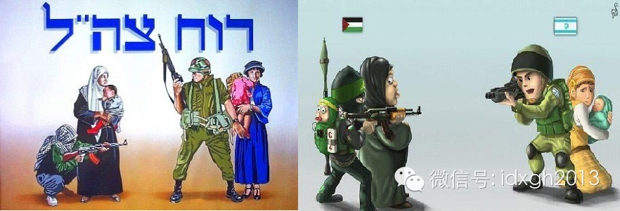
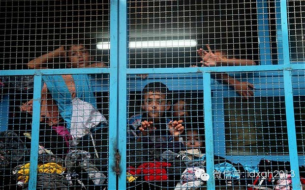
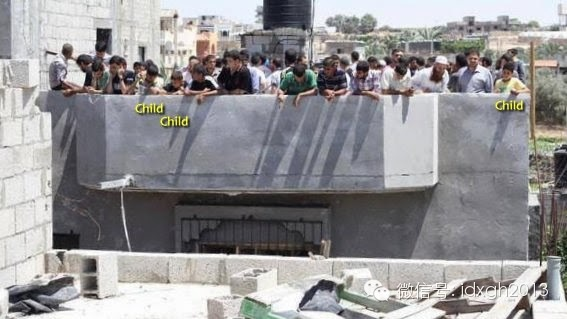
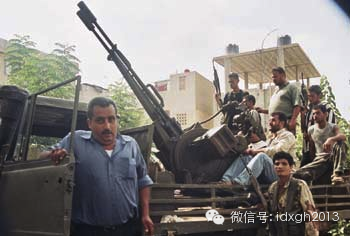
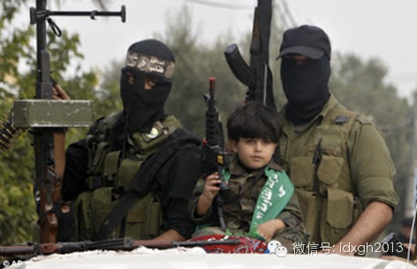
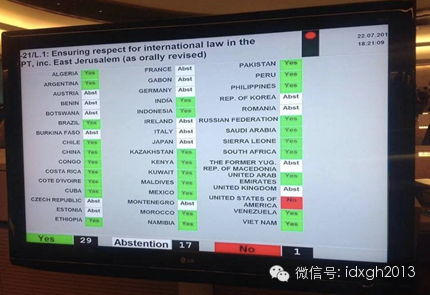

**巴以冲突让“人体盾牌”再度成为热词，国际法中对人体盾牌有何限制规定，它能有效约束使用人体盾牌的一方和打击人体盾牌的一方吗？**  

  

文/李净植

  

以色列7月8日发动“护刃行动”以来，双方除了战场上的较量外，还有大量宣传战，巴方渲染以色列滥杀无辜，以色列则称其军事行动是针对哈马斯军工厂和火箭弹发射基地的
自卫行为，并谴责哈马斯将加沙地带平民当作人体盾牌。

  

以色列司法部长齐皮•利夫尼对以色列电台这样解释军方行为：“我们很遗憾有平民丧生，但当我们通知平民撤离时，哈马斯却要求他们留下来，于是造成了平民伤亡。”

  

以色列官方的宣传漫画

  

以军实施精确打击时，通知相关居民提前撤离的做法，中国不少官方媒体都有相关报道，譬如8月1日，环球网就曾以《以军激光制导炸弹命中加沙街区瞬间》为题，详细介绍以
军电话告知一桩建筑的主人，5分钟后炸弹将落下的经过。

  

以色列官方称，以军这种通知，有时会导致哈马斯禁止被攻击建筑的居民离去，甚至驱赶无辜居民进入可能成为打击目标的建筑内，为此以军曾多次临时取消打击。英国《每日电
讯报》亦披露哈马斯限制包括儿童在内的居民离开战区或危险建筑。

  

站在教室铁窗后的巴勒斯坦儿童，他们来自加沙北部拜特哈农镇

  

哈马斯在楼顶上组成的人肉盾牌（图中标出有部分儿童）

  

2006年黎以冲突，身着平民服装潜入民宅的黎巴嫩真主党武装分子（澳大利亚记者Chris Tinkler摄）

  

不过，在巴以冲突中整体上一直同情巴勒斯坦的西方媒体，多不支持以色列对哈马斯的指控。譬如BBC和《纽约时报》驻加沙记者杰里米**鲍文、安妮**巴纳德和约迪**
鲁德伦分别表示没有证据证实哈马斯的确使用了人体盾牌——起码不是国际法定义下的人体盾牌。

  

国际危机小组加沙工作报告的撰写者之一纳森**斯洛尔则称，历史上像哈马斯这样的叛乱组织多少都会利用民用设施储存武器或保存战力，但哈马斯是否在主观上希望以平民伤
亡换取外交或政治上的好处是另外一回事。

  

**【国际人道法视角下的人体盾牌】**

  

什么是人体盾牌的判定条件？禁止使用人体盾牌的国际法基础是什么？如果武装冲突一方使用人体盾牌，另一方是否就可以无顾忌地攻击？国际社会为什么不采取法律手段制止构
成战争罪的行为？

  

尽管没有专门规制人体盾牌的国际条约，国际人道法却为我们分析和评价人体盾牌问题提供了基本框架。

  

区分战斗员及平民、军事目标与民用物体是国际人道法体系下的核心问题之一。历史上，战争曾是各交战国全部居民之间的争斗——无论男女长幼、是否携带武器，交战国的任何
人都可为交战国的另一方任意杀害。

  

认为战争是国家而非个人间的敌对关系的学说可以溯源到卢梭（1712年—1778年），19世纪下半叶以后，欧洲大陆学者普遍接受了这一学说，认为各交战国的人民作为
士兵才是敌人，作为公民就不是敌人。

  

二战后，与武装冲突相关的国际条约相继出台。其中，1949年签订的日内瓦四公约与1977年的《关于保护国际性武装冲突受难者的附加议定书》《关于保护非国际性武装
冲突受难者的附加议定书》构成日内瓦体系，规定了国际人道法的核心内容。

  

《国际刑事法院规约》规定，利用平民或受保护的人员的在场，使特定地区或军事力量免受军事打击构成战争罪。红十字国际委员会曾总结使用人体盾牌包括如下要素：有意识地
转移军事目标、平民或丧失战斗力的人员，以及存在利用这种方式使军事目标免受打击的主观意图。

  

以上述标准看，巴以冲突中，无论是哈马斯，还是真主党、法塔赫组织，都有证据显示其大量使用人体盾牌战术，他们不仅在以色列军队发动攻击时用，在策划和实施袭击以色列
时也特别喜欢用。

  

譬如，以军录像显示，哈马斯向以色列发射火箭和迫击炮时，不但利用普通民居，还利用联合国近东救济工程处的援建学校作为掩护——近东救济工程处被指控深深卷入巴以冲突
，仅自2001年到2010年，该机构就有17名当地雇员因协助恐怖活动被逮捕，以军出具的证据表明，巴武装人员甚至驾驶该机构的救护车从事恐怖活动。

  

中国外交机构亦险“被人体盾牌”。2006年7月24日新华社《黎以炮火下的中国使馆留守人员》一文无意中披露：“以色列战机摧毁了贝鲁特市内酷似导弹发射装置的两辆
破旧吊车。此后，有人将几辆破旧吊车放在了中国使馆附近。”

  

日内瓦体系和习惯国际人道法同样禁止攻击人体盾牌，主要因为武装冲突需遵循区分原则和比例原则。

  

区分原则要求区分战斗员与非战斗员、军事目标与民用设施，并采取措施避免对平民和民用设施造成伤害。比例原则要求武装攻击附带造成的平民伤亡或民用物体损害与预期的具
体和直接的军事利益相比不能过分。

  

这即意味着，即使冲突一方使用人体盾牌、触犯战争罪，也不解除另一方避免攻击平民或避免对其造成过分伤害的义务。

  

伊斯兰教法亦确立了战争的必要性和人道精神。伊斯兰教法很早就规定：一个没有参与作战行动、作战计划、后勤供应或主张进行战争的非战斗人员，禁止被攻击。这与国际人道
法上区分原则的精神如出一辙。

  

不过，禁止攻击平民或人体盾牌，似乎只用来限制和批评以色列，因为多年来，以色列周边的各种武装组织对以色列从来都是无分男女老幼的差别攻击，其理由用哈马斯发言人扎
哈尔的话就是：“以色列那边有无辜的平民百姓吗？没有，他们家中都有枪，他们18岁便去服兵役来攻击我们，他们都是殖民者。”

  

**【不对称战争的战争伦理】**

  

国际人道法规则的发展并未让使用和攻击人体盾牌的行为销声匿迹，从冷战、朝鲜战争、越战到现在，人体盾牌愈发成为一种常见战术。

  

海湾战争期间，伊拉克当局将平民防空避难的巴格达阿玛丽娅碉堡改建为军事指挥和控制碉堡，并挑选政府及军职人员家属在碉堡二层避难。

  

2012年叙利亚内战，反对派训练儿童当少年兵，政府军就抓来儿童来当人肉盾牌抵御攻击。据联合国报告指出，其中年纪最小的孩子仅9岁。

  

叙利亚内战中的少年军

  

为什么战争总是与人们的期望及法律要求相去甚远？红十字国际委员会法律顾问让-
马里•亨克茨谈到违反国际人道法规则的行为时认为，这并非由于相关规则不充分，而通常是由于以下原因：

①人们不愿意遵守规则；②执行规则的手段不充分；③某些情况下规则适用的不确定性；④某些政治领导人、指挥官、战斗员和普通民众对其缺乏了解。

  

鉴于保护平民不受攻击的原则已经如此深入人心，在使用和攻击人体盾牌的问题上，第一个原因占据了显要地位——不对称战争使得处于劣势的一方不惮采取人体盾牌战术，而这
会动摇处于优势地位的一方继续遵守国际人道法的意愿。

  

冲突各方的互惠期待、骑士精神与文明行为构成国际人道法的理论基础，用国际法学家劳特帕赫特的话来说：“不可能看到这样的敌对行为，一方受战争规则约束但不从中受益，
而另一方从中受益却不用遵守它们。”

  

但这种互惠期待是对称战争的产物，更准确地说，是西方世界战争的产物——西方国家之间的战争大多是实力相当的政府军队在公开战役中相互战斗。而二战后，冲突方在军事力
量、技术、价值等方面的差异日益显著——无论是海湾战争、阿富汗战争、黎巴嫩战争，还是叙利亚内战、利比亚内战，不对称战争都逐渐成为常态。

  

在不对称战争中，军力强大的一方总希望武力取得决定胜利，弱势一方则会避免公开对抗、使用非常规甚至非法手段开展消耗战——譬如脱掉制服混入平民，仅通过暴力显露战斗
员身份；有些冲突方利用人体盾牌掩护军事目标，对对方平民甚至中立救济组织都毫不怜悯。

  

弱势一方何时会改变其“战争伦理”？2002年哈马斯发言人在接受《21世纪环球报道》采访时曾这样回答：如果以色列不愿意放弃殖民行动的话，那就给我们M-
16和F-16，让我们来场公开的战斗，那么我们就会放弃“殉道行动”了。

  

**【缺少约束力的人道法规则】**

  

虽然有学者认为随着前南斯拉夫特别战争罪法庭和卢旺达特别战争罪法庭的建立，国际人道法已从“软法”转变为“硬法”，譬如前南斯拉夫高级将领布拉斯基奇受审时就指控过
其使用人体盾牌，但其执行力度仍不足以遏制人体盾牌在战争中出现。

  

在更广义的层面上，国际司法对使用和攻击人体盾牌的行为约束力甚微。无论是国际法规则的制定、执行或不执行，国与国的力量消长与纷繁交错的政治利益都如影随形。尽管国
际刑事法院可以起诉和审判犯下战争罪的个人，但美国、中国、俄罗斯和以色列却并未加入《国际刑事法院规约》。

  

联合国机构在确保遵守国际人道法的问题上同样立场尴尬。对于像巴以冲突这样双方都涉嫌犯下战争罪的武装冲突，联合国人权理事会最常见的表态是“谴责”。从2006年到
2012年，该机构至少对以色列发表了47次官方谴责。

  

对于最近的加沙地带冲突，联合国刚刚通过一项决议，决定派遣独立调查团前往加沙地带以色列占领区调查——这也是联合国和平解决争端的途径之一。尽管以色列常常指责人权
理事会是“反犹机构”，但在国际法舞台上，有哪一方不保持一定的固有立场呢？  

  

上述决议案的表决结果可谓政治利益版图的缩影。该项决议案以29票赞成、1票反对和17票弃权的结果通过。投赞成票的大多为第三世界国家，包括中国和俄罗斯，大部分欧
盟国家、日本和韩国弃权以示沉默。那唯一一枚反对票当然来自以色列最好的朋友。

  

联合国针对调查加沙地带决议案的表决结果

  

由于自杀式袭击者不会期待互惠，使用人盾战术的一方不期待互惠，自然也破灭了另一方对互惠的期待。尽管现今的国际人道法禁止了互惠的思维方式，将“最基本的人道考虑”
界定为强行法，但摆脱战争法及国际人道法的约束仍对强势一方充满诱惑。

  

无论以方如何宣传其采用避难警告等预防性措施减少平民伤亡，但“护刃战争”22天，加沙地带冲突中死亡的1170人中有70%为巴勒斯坦平民，更有20%为巴勒斯坦儿
童，包括清真寺和学校在内的民用设施亦遭到炮击。

  

> 版权声明：  

> 大象公会所有文章均为原创，版权归大象公会所有。如希望转载，请事前联系我们： bd@idaxiang.org

大象公会：知识、见识、见闻

微信：idxgh2013

微博：@大象公会

投稿：letters@idaxiang.org

商务合作：bd@idaxiang.org

举报

[阅读原文](http://mp.weixin.qq.com/s?__biz=MjM5NzQwNjcyMQ==&mid=204014908&idx=1&sn
=20ce314636df76c342c135be9441dcac&scene=0#rd)

