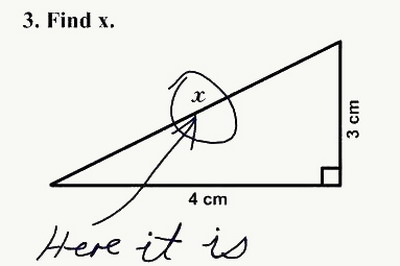
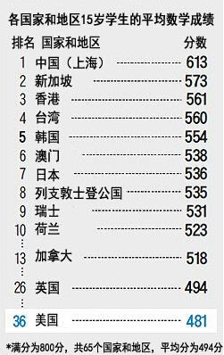
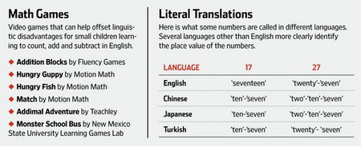
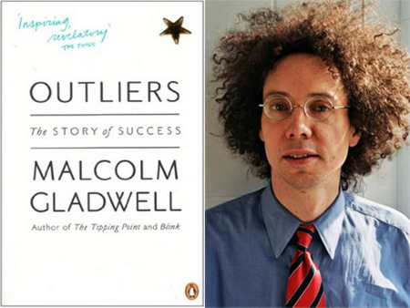
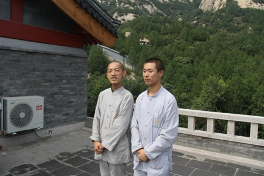
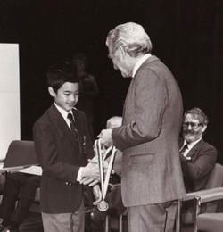
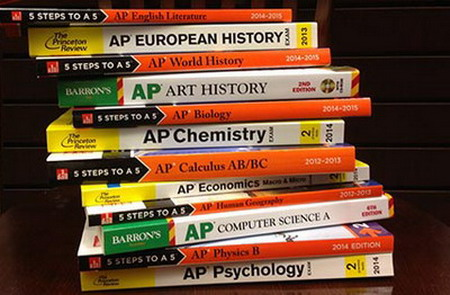
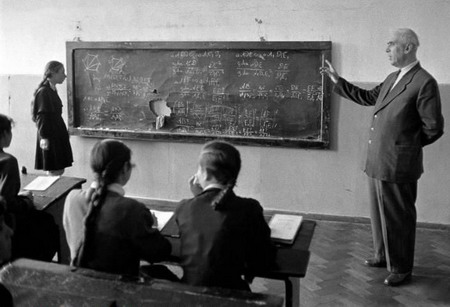
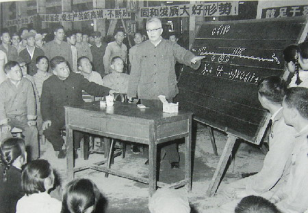

**中国人的数学好，似乎是全世界公认的事实，但中国的数学研究却相当落后，为什么会这样？**

  

文/胡修卓

  

世界人民已经懒得吐槽美国学生的数学水平了，正如他们已习惯于惊叹中国学生的天才。

  

脱离计算器就不会四则运算，把sinx/n算成“six”，美国学生闹的笑话层出不穷，每隔一段时间，舆论就兴起“救救孩子”的呼吁。相比之下，中国学生的能力之强，
令大多数美国中学生咋舌。

**网络中广为流传的美国学生在数学试卷上闹出的笑话**

  

**【中国人的数学为什么好】**

在经合组织发起的国际学生评估项目（PISA）中，上海的中学生在数学水平测试中超过其他75个城市，排名第一。英国人不胜羡慕，立刻邀请了60名上海中学数学老师赴
英介绍经验。

**来源：OECD2012年国际学生评估项目（PISA）**

  

另外，其制定的各国家和地区15岁学生数学成绩排名，大陆尚未作为整体参加测试，但中国上海的成绩高居第一，美国只排在36位。

  

除了日常的教学，竞赛的成绩也体现了这一差距。

  

国际数学奥林匹克竞赛是面向中学生的最著名竞赛之一，自1985年中国参赛以来，19次获总分第一。中国以外，只有韩国、罗马尼亚、保加利亚和苏联（俄罗斯）、伊朗和
美国获得过总分第一，其中，美国仅仅获得过一次。

  

好事的美国媒体当然会反思。9月份时，《华尔街日报》援引波士顿东北大学和德克萨斯农工大学两位教授的研究成果，将落后的原因归纳为语言问题。

  

也就是说，中国、日本、韩国、土耳其等国语言带有天然的数学优势，比如汉语，10个基础汉字就能呈现所有数字，而英语却要20个不同的单词，影响了头脑运算效率。

**不同语言中，中文、日语、土耳其语都可以运用凑十法表现数字，英语则不能。来源：wsj**

  

运算过程中，“凑十法”（make a ten）的应用与否也影响颇深。就是说，若能将数字首先凑十计算，似乎就更加清晰快速。如“9+5”，用“凑十法”可分解为“
9+1”，然后“10+4”，而英语母语者却不能顺畅的将之分解。同样，“11+17”能被中文等换为“10+1+10+7”，“eleven+seventeen”
就无法如此。

  

一些学者也反复思考这一问题，最经典的应当是有怪才之称的马尔科姆•格拉德威尔（Malcolm
Gladwell），他在《异类：不一样的成功启示录》一书中以《稻田与数学》为题专门分析研究了中国人的数学为什么特别好这个现象。

  

格拉德威尔的解释看上去非常有说服力。除了前面提到的10个基础汉字就能呈现所有数字外，他还认为，汉语的单音节使得中国人在处理数字时，心算速度天然会更快；中国人
在语言上的另外一个优势是，汉语中表达分数的方式，天然就比其他语言更简洁直观。

  

但格拉德威尔认为，中国人的数学好，还不仅仅是前述种种语言优势，中国以水稻为主的农业耕作文化具有同样的决定性。因为格拉德威尔注意到，以水稻种植为主的日本、韩国
人数学能力同样突出——适宜水稻栽种的地区，农夫一年四季都要忙碌，为了充分利用土地和时间，他们会远比小麦耕作农夫更精打细算。另外，中国古代一直是分散的小农户，
经济的独立性，使每个农夫都必须像企业家一样学会计算。漫长历史中的竞争选择，会使得以水稻耕作为主的社会数学能力更为突出。

  

不过，格拉德威尔的分析虽然头头是道，但无论是他对现象的观察，还是对现象的解释，都有非常严重的错漏。这甚至可能使他的研究变得毫无价值。

**马尔科姆•格拉德威尔与他的作品《异类：不一样的成功启示录》**

  

**【中国人的数学好么？】**

第一个问题是，数学好的标准是什么？

  

如果我们说某个人群的数学好，指的是数学研究水平，那么问题来了。数学一旦延伸到大学或研究领域，笨笨的美国人立刻站起来了，而中国人的数学优势也神奇地缩小。

  

世界数学研究中，美国、法国和俄罗斯处于无可争议的领先地位。随后的以色列和日本等国也领先中国。即使是在中学数学向中国取经的英国，数学研究同样大幅领先。如果将话
题的讨论范围扩展到研究和应用领域，反而会出现一个新问题，为什么中国人的数学研究不好。

  

以国际数学奥林匹克竞赛为例，除中国外，1985年以后的许多金牌获奖者们已在国际数学界崭露头角。法国、俄罗斯、美国、匈牙利和巴西等国的竞赛选手们都有获得菲尔兹
奖、克雷数学奖等，而中国的参赛者却在研究水平上整体落后于曾经击败过的对手。

  

美国的数学研究尤其强大，不仅在纯数学领域，物理、化学以及需要大量数学知识的金融学、需要离散数学的基础计算机科学方面也处于领先。美国在这些倚赖数学的领域聚集了
大量的人才，其自然科学家和工程师们的整体数学水平也绝不弱于其中国同行。

**曾以满分摘得国际数学奥赛金牌的“数学天才”柳智宇（左）现已在龙泉寺出家，法号圣宇**

  

为什么中国在中学数学竞赛中表现得如此出色，但在向后的发展中却后劲不足？

  

另外一个问题是，如果数学好的标准是中学生数学竞赛水平高，格拉德威尔等人显然忘掉了一段历史，1990年代以前，国际数学奥林匹克竞赛的金牌大户是苏联和东欧国家—
—国际奥林匹克竞赛原本就是由东欧国家发起，苏联和俄罗斯共获得过16次国际数学奥林匹克竞赛的团体总分第一。

  

中国在数学竞赛上开始取代苏联和东欧国家，是在苏东剧变之后——就像苏联人不再集中国家一切资源和力量来夺取奥林匹克运动会的金牌后，中国人在奥运会上的金牌开始赶超
苏联东欧一样。

  

苏联人在数学上既没有种种先天的语言优势，也从来没有水稻栽培的历史，更要命的是，俄国和东欧的农夫在西方人看来差不多是世界上最散漫粗放的农夫，他们是离精打细算、
勤劳等品质最远的人群。

  

无论是过去的苏联、东欧，还是今天的中国、日本、韩国等东亚国家，这些初高中数学计算能力较强，并且数学竞赛水平高的地区，唯一的共性就是它们有着强大的国家应试教育
体制。

  

实际上，数学竞赛和数学研究有本质区别，初高中的计算能力也与大学数学也并不相同。

  

同时获过国际数学奥林匹克竞赛金牌和菲尔兹奖的澳大利亚数学家陶哲轩曾在一篇文章中表示：数学竞赛和数学学习非常不同。尤其研究生生涯，学生们不会遇到像数学竞赛题那
样描述清晰，步骤固定的题目，尽管竞赛思维在解决研究型问题的某些步骤速度很快，但这无法扩展到更广泛的数学领域，更多问题仍赖于耐心和持久的工作——阅读文献，使用
技巧，给问题建模，寻找反例等。

**1988年，13岁的陶哲轩从时任澳大利亚总理鲍勃**霍克手中接受国际数学奥利匹克金牌**

  

此外，奥林匹克竞赛中的题目虽然难度更大，但考验的是技巧，创造性上要求却更低，但后者是研究领域的核心能力之一。

  

总得来说，数学竞赛所需的是熟练和技巧，依赖天赋，但依靠大量的集中培训亦可取得成就。而高等数学的研究和学习则靠持久的工作和深入的理解，与技巧性的算术（arit
hmetics）不同，数学研究讲求抽象化和逻辑推理的使用，对复杂多样的数学问题有深刻理解力远重要于特定类型问题的求解。

  

著名数学家威廉•瑟斯顿（William
Thurston）曾把数学竞赛比作“单词拼写比赛”。他认为，单词拼写比赛获得名次并不代表成为优秀作家，数学竞赛也一样：好成绩不意味着真正理解数学。

  

数学学习考验的是学习和思考的深度和质量，而数学竞赛需要的是“早熟程度”，要和时间赛跑，要比同龄人学得快。对一个聪明的学生来说，后者更加容易。并且，即使天赋有
限，凭借高强度的训练也能在后者取得进步。

  

显然，东亚的考试型教育能提供最为丰富的训练。行为经济学家尤里•格尼兹（Uri Gneezy）和阿尔多•拉切齐尼（Aldo Rustichini）的实验发现，
即使在参赛者水平相仿的情况下，给出单题奖励更高的竞赛能让参赛者获得最好的成绩，这恰恰是中国、东欧等国的强项：更高的竞争压力，更多的竞赛奖励，整个中学教育都以
算术能力为培训要点。

  

这在美国或其他西欧国家所不强求的，对于普通学生，只要达到基本数学成绩即可，如美国马塞诸塞州，统考难度大约是会基本的三角函数运算。

  

可以说，教育中训练强度的差别造成了普通中学生的数学水平差距。集中培训的强度，也很大程度上影响了竞赛成绩。

  

那么，进入大学之后，中美数学成绩的差异开始逆转，又是为什么呢？

  

**【中国的数学研究为什么不好】**

或许关键原因是美式的分类教育。美国对普通中学生数学计算能力的基本要求不高，有天赋、感兴趣的学生，则可以在中学里完成大学先修课程（Advanced
Placement）。修完AP之后，会参加先修课程考试。

**美国中学生的AP教材不仅限于数学，还涵盖多个学科领域**

  

先修课程难度远高于美国普通高中数学，相对于数学竞赛，它的设置更有利于形成对数学问题的理解。比如美国和加拿大的大学先修课程中，微积分部分的两门课程覆盖了一元微
积分的所有知识，相当于美国大学两个学期数学课程的内容，通过这些训练能更合理的增进对微积分的理解。而讲求竞赛的中国高中则很少注重这类知识。

  

从个人未来成长的角度看，提前完成大学先修课程比把时间花在数学竞赛上更合适，前者更接近真正意义上数学研究，基于同样的理由，大学在录取学生的时候也会把先修课程的
成绩作为一项重要的考量。

  

至于研究领域，高强度数学计算训练的效用非常低。现代数学和很多基础学科一样，延续的研究传统和学派氛围，往往决定了其成就的高低。在这一点上，中国大学与欧美大学存
在巨大落差。

  

而苏联和东欧国家竞赛成绩也曾非常出色，但同时又是数学研究最顶尖的国家——过去近100年中，苏联-
俄罗斯一直都是数学研究最顶尖的国家，是公认的和美国及法国齐名的数学研究大国。它与中国的强烈反差，恰好也是这个原因。

  

苏联（俄罗斯）优秀而悠久的数学研究传统几乎从未中断过。早在18世纪，近代数学先驱莱昂哈德•欧拉在彼得堡工作了30多年，带动了俄国著名的彼得堡数学学派。此后，
俄国和苏联又涌现出了罗巴切夫斯基、切比雪夫、李亚普诺夫和马尔科夫等数学家。

  

政治最动荡的斯大林和赫鲁晓夫年代，苏联的数学研究传统也没有中断，相反，因为战争和计划经济的需要，数学家们逃过了政治运动冲击。不但生活上有相当保障，且能有做感
兴趣研究的相对自由。

**1950年代末期，**摄影家埃里希**莱辛生镜头下的**苏联中学生在上数学课**

  

同时，他们还有着特色的讨论班体系——由知名数学家主持，不限年龄和资历，感兴趣者均可参与。这非常有助于传统的延续。苏联的讨论班中涌现了一大批年轻数学家，形成了
著名的莫斯科学派。

  

在培养更年轻的数学人才方面，苏联也与中国不同。苏联和中国同样有大量的数学夏令营，但苏联夏令营依靠兴趣报名，不强调考试和分数。讲课的是往往是某领域的大师，而不
是专注于训练学生考试的中学老师。比如柯尔莫哥洛夫等最顶尖的数学家，每年都会参加中学数学夏令营。这不但可让学生对数学产生兴趣，且能让有天赋的学生有机会与大师对
话，尽早了解真正意义上的数学。

  

此外，苏联数学界一直和国际数学界保持联系。当时极为繁荣的法国布尔巴基数学学派在苏联很受欢迎。苏联数学界翻译国际数学著作的速度也是一绝。

  

相比之下，同时代的中国数学家则凄惨的多。即使能逃过死亡，也只能按领导的安排作研究。例如，著名的解析数论学家华罗庚归国不到两年不堪其辱，但自杀未遂。此后不得不
研究和推广指导“蒸馒头”的优选法。而华罗庚的老师，清华大学数学系的创始人熊庆来则直接被迫害致死。

**1974年冬，华罗庚在广西深入车间讲解优选法**

  

而中国的学生也难说幸运。他们过早的接受了高强度训练，虽得到竞赛金牌，但前方并没有开放的高等教育氛围和连续的数学传统，让他们当中有真正天赋的人在研究领域绽放光
彩。当然，好的竞赛成绩，可让他们进入一流大学，可让学校领导评上先进，甚至对国家也不坏——将来这些学生留学美国，会让美国人感慨，中国人的数学计算能力真强啊。

  

**版权声明**

****大象公会所有文章均为原创，****  

****版权归大象公会所有。如希望转载，****

****请事前联系我们：****

bd@idaxiang.org

****知识 | 见识 | 见闻****

阅读

__ 举报

[阅读原文](http://mp.weixin.qq.com/s?__biz=MjM5NzQwNjcyMQ==&mid=208309758&idx=1&sn
=3012333e9706fdfc9c2737c6ff29a9c1&scene=0#rd)

