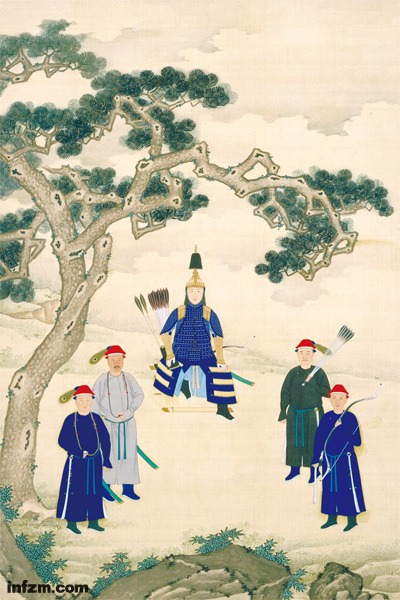

**大一统的形成**

  

中国历史上，有两种统一的模式。一种是夏、商和西周的“天子－诸侯”模式。按照这种统一模式，那时候的天下，是天子、诸侯各治其民。天子为“天下共主”，从大的方面来
说，就是统领天下诸侯，抗衡周边蛮、夷、戎、狄的侵扰，并维持内部的和平。商征服夏，固由于军事上的胜利，但真正让诸侯承认其取代夏之“共主”地位的，是向诸侯承诺“
各守尔典”的原则不变。同样，周灭商之后，能让诸侯承认其“共主”地位的，也还是向诸侯承诺“宅尔宅，畋尔田”（编者注：住原来的地方，种原来的土地）。可见，夏、商
、西周各自的“天下共主”地位，主要针对的是外部入侵，内部则是诸侯自治。

  

但是，夏、商、西周时期，这种统一体内部，兼并战争也在不断进行，并且愈演愈烈。夏禹时的“诸侯万国”，到了商灭夏，已是“诸侯三千”；再到西周灭商，则是“诸侯千八
百”；而到了春秋初年，只剩下“二百二十四国”；及战国之世，列国不过十余，而以齐、楚、燕、赵、韩、魏、秦为强。

  

兼并战争最终破坏了社会原有的组织，基层的村社共同体解体了，世袭的贵族领主制度荡然无存。而在这一过程中，社会的道德风尚也被摧毁；其中最严重，对后世影响最深刻的
变化，就是“矜（恃）势力与尚诈力”，成为社会上下的普遍行动准则。而各国君主则越来越专制，为达到集权于一人的目的无所不用其极。

  

西周时，“溥天之下，莫非王土；率土之滨，莫非王臣”的观念，还仅仅是周天子对天下的一种主权宣示。但是到了春秋中期以后，所谓“封土之内，何非君土；食土之毛，谁非
君臣”，反映的则是各国君主对土地和人民的实际控制。盖其时，诸侯“政事”的最终目标，就是追求“广土众民”。于是乎兼并加剧，争霸彻底地演变为吞并，“统一”的目标
不再是做“天下共主”，而是“并诸侯，吞天下”的“大一统”。此中，自然而然就埋伏着一种由一人专制天下的趋势。

  

**皇权总是趋向专制的**

  

秦始皇统一天下，实行由皇权专制的中央集权政治制度。这种统一模式的结构特点，就是天下为郡、县的官僚化统治。于是，历史上的分封制被彻底废除了，“陛下有海内而子弟
为匹夫”。这样的制度设计，显然是借鉴了历史的“经验教训”。而其立意，表面上是追求天下大一统，本质上却是追求皇权的排他性，彻底消除对皇权任何可能的觊觎与竞争，
以使其皇位可以平平安安地“二世、三世，至千万世，传之无穷”。从此以后，即便是分裂时代，国家无论大小，皇权总是趋向于专制的。

  

然而，“螳螂捕蝉，黄雀在后”。始皇帝的“以史为鉴”，对历史上诸侯、卿大夫擅用天子的“礼乐征伐”之权，以及天子、诸侯、卿大夫子弟争权并酿成祸患的经验教训是记取
了，但是对诸如“陪臣执国命”（编者注：家臣把持国家权力）这样的历史事实就重视得很不够。所以，当时设计的皇权专制的中央集权政治制度，对如何从官僚制度上彻底消除
对皇权的觊觎与竞争的可能性，可以说是考虑得极不充分。结果，丞相李斯和宦官赵高的一次勾结，就改变了始皇帝的临终遗嘱，杀了本该继承皇位的长子扶苏，却让少子胡亥篡
夺了帝位。

  

后人对于秦亡的原因讲得很多，却往往忽视皇权专制的中央集权政治制度本身对秦朝的短命所起的作用，是十分令人遗憾的。而秦亡之后，从汉唐一直到明清，朝代的兴亡，或由
于外族的入侵，或由于人民的揭竿而起，或由于政治体制内化生出来的异己力量的篡夺；这三个方面，除了入侵的外族正处于鼎盛状态之外，致乱之源更多的是来自皇权专制本身
。二千年间，中国的政治制度，就是在不断的朝代更替之中，寻找如何有效地强化皇权专制的办法。

  

**削夺相权与地方势力扩张**

  

秦朝创制的中央集权政治制度，其本身的设置原则，是皇权专制。秦如此，秦以后中国历朝历代所有的政治制度改革，无非是在原有的政治制度上增加使皇权变得更为专制。这种
专制的总趋势，一是不断地削弱宰相之权；二是不断地削弱地方之权。中国历史上，向来有所谓宦官、外戚专政。其原因，就在于皇帝为削弱相权，在内廷设置各种机构，侵夺原
属于宰相的职权，而用宦官、外戚来主持；皇帝还在内、外廷建立各种机构，设官任事，以分相权。

  

然而，以外戚、宦官分掌相权，固然可以使皇权更为专制，却难免使皇权沦于外戚、宦官之手。西汉外戚专政，结果是王莽篡政。东汉宦官专政，而招致袁绍举兵入宫诛杀宦官，
董卓进京废立皇帝。

  

两汉专注于削夺相权，却未能有效节制地方，而使郡一级权力成为皇权的直接延伸。这是当时制定制度的人，因迷信“中央集权”而导致的疏忽。惟其如此，皇权愈专制，则郡县
官愈专横。西汉设刺史监察郡县，但无法改变“天下郡太守多为奸利”局面；东汉在郡县之上设州，则更导致了天下“知有牧镇而不知有朝廷”的状况。

  

两汉的州、郡、县官，与地方豪强朋比为奸，造成了地方豪强势力的长足发展。三国两晋南北朝时期长达两三百年的分裂，其实都是拜两汉之所赐。其间，只有西晋出现过昙花一
现般的短暂大一统。这一时期，分裂各国虽不断强化皇权专制的中央集权政治制度，惟对地方豪强势力毫无办法，以至隋朝重建大一统，地方豪强却时时与中央抗衡。隋末各路反
隋武装，其基本力量仍是地方豪强。到唐朝再建大一统，豪强的势力才差不多在隋末的战争中厮杀殆尽了。

  

唐朝强化皇权专制，在中央无非是将两汉以来削弱相权的做法进一步制度化。为了防止地方势力久而坐大，唐朝将地方权力分得很细。惟其对中央委任的各种监察地方事务的官员
授权颇重，遂使之逐渐演变成为更高一级的地方行政；地方之权反而又加重了。由于地方分权太细，不便行政，唐朝还在边防各军事重地设置了总揽一切事务的节度使。

  

安史之乱以后，唐朝在地方遍设节度使，集一方军政、财政与民政于一身，结果形成割据之势，不再受中央控制。至于唐朝中央，宦官专政较东汉末年更有过之而无不及，等到藩
镇举兵入京剿灭宦官，唐朝也随之覆灭。

  

历史清楚地表明，怎样在削弱相权的同时强化对地方的控制，是皇权专制之下的中央集权政治制度所面临的一个更严重，也更为复杂的问题。

  

**科举制釜底抽薪**

  

隋唐时期所采取的科举制，在削弱和抑制地方势力上，是具釜底抽薪的作用。

  

当初，秦灭六国，建立皇权专制的中央集权政治制度，在秦始皇看来，天下从此只须“以法为教，以吏为师”，即可保万世太平。至二世皇帝，仍十分自信地认为，天下总不会有
人敢于造反，捣乱的终不过是些“鼠窃狗盗”之徒。皇帝顾忌的，不是戎狄，就是六国孑遗，哪里想得到连“黔首”也会有“王侯将相宁有种乎”的思想。

  

两汉世家豪族势力的发展，以及魏晋士族制度的形成，大有使政治权力固化的趋势。“上品无寒门，下品无士族”，说明贵族制度虽已被废除，却也还可以重新长成。惟隋唐实行
科举选官的制度，则无论予富予贫、予贵予贱，从此都由皇帝来操控；而那些没有士族门荫的人，这才普遍有了跻身于统治阶级的希望。

  

对此，唐太宗看得非常清楚，所以才会得意地说，有了科举选官的制度，“天下英雄尽入吾彀中矣”。从此，历代官僚子弟虽或仍享有某些“门荫”特权，但做官总还以科举为正
途。由此，中国社会的权力和财产的转移速度加快。一方面是“仕者多起自草野”；另一方面则是“千年田换八百主”。其结果，就是两汉以来的那种世代为官的士族豪强，在中
国社会彻底绝迹。天下皆以科举进用，然则富贵与贫贱移势，不过转瞬之间耳。

  

唐末五代割据一方的藩镇，与魏晋以来中国北方的那种集政治、宗法、军事、经济和文化为一体的世家豪族的坞壁，已不可同日而语。藩镇在政治、经济和文化上的力量都相当薄
弱；骄兵悍将拥立无常，“国擅于将，将擅于兵”；政权像是无根的浮萍，兴灭如走马灯一般。赵匡胤轻易地篡夺后周之后，之所以能够顺利地重新统一天下，依次剪除藩镇，其
实正是拜科举制所赐。盖科举制之下，汉魏以来所形成的那种世家豪族势力既已绝迹，社会也就不再有割据者扎根的基础。

  

科举制实行了一千四百多年，直到清末才废止，可以说是行之百代而不易了。由于科举取士，唐以后所选拔的官员，大多是会读书却不一定能够做事的人，所学又不切实际，以至
于官府胥吏的行政作用越来越大。唐、宋、元、明、清各朝，“胥吏专政”的情况越来越严重，皇帝甚至被认为是“与胥吏共天下”，官员的行政权亦由此而被更进一步地分解和
弱化。

  

与此相对应的，则是在唐太宗眼里的“英雄”们，到了宋朝或还受到优礼，但到了元朝就沦落于“九儒十丐”的境地了。明太祖曾颁布律令：“寰中士大夫不为君用，是自外其教
者，诛其身而没其家，不为之过。”当时还有一种专门用来对付大臣的刑罚，就是在朝廷上按住打屁股，称“廷杖”。“彀中英雄”一至于此，可见科举制之下，天下读书人哪里
还有半点英雄气概。

  

**专制需要统一**

  

自秦汉以至五代十国，将近1200年之中，“治日常少而乱日常多”，完全的分裂差不多400年，半分裂状态也超过200年。统一本身已不再成其为可以避免天下“树兵”
的理由，也不再具有使天下安宁的意义。所以，到宋朝统一的时候，大一统本身已不再具有任何神圣价值。赵匡胤对其之所以要统一，讲得非常露骨：“卧榻之侧岂容他人鼾睡！
”这句话所表明的仅仅是：无论天下是怎样的“治日常少而乱日常多”，哪怕统一并不需要专制，但专制却需要大一统。

  

从宋朝开始，的确可以说，历史已为专制和大一统铺平了道路。一方面，皇权专制在制度和经验上已经有了相当完整的积累；另一方面，科举制最终造成了地方势力再无可能崛起
的社会基础。故自宋而下，中央集权的官僚制度，在分散相权和地方之权方面，实行起来远比前代要有效而且容易得多。

  

在宋代，军政、财政、司法、监察和言路都独立于相权；宰相不止一个，轮流掌印，而且设副相予以牵制；从中央到地方，除了基层的县域，办事的权力被分解成许许多多的条块
，形成了一个由皇帝直接控制，相互制约和监督的非常复杂的官僚系统；皇帝则有学士院作为自己的办公机构。

  

元、明、清三代，中央集权的政治制度，也都不外乎是按照这样的方式来构建的；无非是强化中央的派出机构，使整个官僚系统的条块更加整齐有序，相互之间的牵制力也越来越
强。然而，在皇权专制之下，只要皇帝稍有疏忽，专制的权力就可能沦于皇帝所宠幸的臣僚之手。权相擅政的问题在两宋转趋严重，性质上虽非相权的重新扩张，其人却因皇帝的
宠幸，得以将原来因分拆而被削弱的相权集中而强化之，逸出皇权专制的法度之外。

  

有鉴于此，明朝干脆彻底废除宰相之职；将相权并入皇权；用司礼监和内阁两套机构共同辅政、对掌机要；并使这两班人马始终处于相互监督和制约之中；中央各部则纯粹成为执
行机构；又设专职，监察各执行机构；并以直接听命于皇帝的厂、卫军组织，执行京城内外一切有关维护皇权的特殊任务。阁权在明中期以后又有扩张，势头压过司礼监，造成皇
权控制的失衡。清朝对宦官限制颇严；内阁也不再参预机要，只处理一般政务；另设军机处，权力在内阁之上，作皇帝的核心工作班子，属员和职权都出于皇帝的随时差派。

  

上述中国历代政治演变的过程，按吕思勉先生的概括，就是“务集权于一人，但求其便于统驭，而事务因之废弛，则置诸不问”。说得更具体一些，就是事权越分越细；任何部门
、任何个人掌握的权力也都越来越狭窄；而部门和部门之间，官员和官员之间，始终是互相钳制着的；整个官僚系统便因此而不脱皇权的掌握；有关民生的事业，有没有人去办，
办得好不好，甚至办不办，反而无足轻重，一切放任了。

  

惟其如此，在这样的专制体制之中，任何动作稍大一点的“改革”，都会引起体制的失衡，引起政治动荡，不利于皇帝专权。所以，“变乱成宪”的事情，就像人体对于器官移植
一样，必然会引起强烈的排异反应。于是，“守成”就成了必须恪守的基本政治道德；而对于一切弊端却可以放任。

  

明朝自仁、宣致治之后，内乱外患不止，国势迅速衰颓，军备废弛，民生凋敝，宦官专权，党争乱政，官吏贪渎，世风日下，一发而不可收拾。但是，这些看上去非常严重的问题
，与维护皇帝专制的独一无二性来说，都不过是枝节。所以，像张居正这样的人，无论其所进行的改革如何“起衰振颓”，必然会被认为是包藏祸心而受到清算。

  

然而，恰如黄仁宇指出的那样，当张居正被清算之后，申时行因顾全大局而备受攻讦；戚继光、李成梁重整军备的努力亦归于失败；至于像李贽这样有“异端”思想的人，身陷牢
狱自不足惜；而海瑞这样坚持旧道德、廉洁奉公、执法不阿的“模范官僚”，也令人如芒刺在背，同样不合时宜。其时，有大臣上疏：“今天下之势，乱象已形而乱势未动；天下
之人，乱心已萌而乱人未倡。今日之政，皆播乱机使之动，助乱人使之倡者也。”

  

总之，“变乱成宪”固然不可接受，由“成宪”所造成的问题却必须听之任之。因为，这不仅符合官僚们阳为道德、阴为私利的处世原则，也有利于皇权专制对于政治平衡的需要
。可就是在这样的状态之下，凭着制度的惯性，明朝仍得以继续坐稳江山。若非明末由河南、陕西连年饥荒导致的大规模民变，决不至于引起像李自成攻入北京这样的事变发生，
满族的军事力量也就未必有入关的机会。

  

**强化皇权专制的心理动力**

  

仔细想来，两千年间，中央集权的政治制度，以加强皇权专制为宗旨，结果就是使专制越来越深刻。唐以后，直到近代以前，这种皇权专制的中央集权政治制度，已基本杜绝了从
体制内被篡夺的可能：宦官、外戚和嬖臣的专权擅政虽不免发生，其实完全处于皇帝的掌握之中；各层级和条块上官员威势虽重，所谓“官大一级压死人”，也绝无专擅的可能。

  

另一方面，在当时社会上，缙绅之家或能在乡里举办一些兴利除弊的事业，却影响甚微，成不了什么气候。

  

这一历史时期，要说最具危险性的，是来自境外异族的入侵，宋、明都因此而亡国。但是，宋朝总是以“岁币”与辽、西夏和金人议和。当时主和的人，虽或有使人民免于兵燹的
良苦用心；却也懂得皇帝害怕战败，且又不愿意人家战场立功的心曲。而主战的人，多数也不愿担上“幸兵以自取重”的罪名。宋朝的寇准，因“澶渊之功”，一度为真宗皇帝所
厚爱，但皇帝转念之间又以为受了“城下之辱”，而将他一贬再贬。这种爱与恨的微妙变化，正反映了皇权专制非常深刻的复杂性。在皇帝的“猜防”之下，外敌似不足道，“内
敌”却遍布朝野。

  

另一个例子，是关于明成祖朱棣的。明初在长城以北设东胜、大宁、开平三卫，构成抵御蒙古的第一道防线。大宁后来撤卫建藩，为宁王朱权的封地。蒙古兀良哈部归附明朝后，
朱元璋便在兀良哈故地设泰宁、朵颜、福余三卫，由宁王节制。“靖难”兵起，朱棣夺了宁王兵权，兀良哈成为“靖难”之师。功成之后，明成祖即允许兀良哈入据大宁，不惜隔
断东胜卫与开平卫之间的联系。之后，东胜卫和开平卫不得不先后内迁；遂使大同、宣府、蓟州三座拱卫京师的军事重镇，与辽东之间的联系也就此阻绝；北京因此而“孤悬绝北
”，先后处于蒙古族、满族铁骑的逼迫之下。这种军事上缺乏远见的举措，很大程度上也是囿于明成祖对“内敌”的顾虑。

  

清朝的武功是空前的，即便到了鸦片战争时，以当时中国军队的实力，未尝不能与隔海而来的英军争胜。然而，清廷和战无定计，几番战败之后，就轻易地割地赔款。个中缘由，
未尝没有顾虑英人勾结“内敌（汉奸、奸民、丑类）”的因素。据记述，当时沿海各战，无不有汉奸为英军效力。从那时开始，清朝总是稍经战败，就接受不平等条约，其中自亦
含有对内忧的考虑。故所谓“宁与友邦，不与家奴”，虽或出于臆测，亦非空穴来风。

  

揆诸历史，则也不仅清朝如此。当年，宋高宗宁可杀岳飞，豁出半壁江山与金人议和，目的就是要阻止金人送徽、钦二宗回国，威胁自己的皇位。相反的例证，则是明朝景泰皇帝
拒绝与瓦剌议和，结果导致英宗被送回，致有南宫之变。“与友邦”，或可偷安下去；“与家奴”，变生肘腋亦未可知。其中的因与果，皆与此种皇权专制的性质有关。“公与私
”、“恶与善”、“利与弊”，在政治上颠过来倒过去，不过系于皇帝一念之间对于“内敌”之猜防。

  

专制的性质既然是“务集权于一人”，皇帝的“猜防”当然不会有尽头。

  

明清两朝的文字狱，对皇帝歌功颂德用了一个“则”字与“贼”谐音，那就是污蔑皇帝曾经是盗贼；科举出了个“维民是止”的题目，“维止”二字怀有将“‘雍正’砍头”的莫
测居心。明明是自己牵强附会，却断定他人含沙射影。皇帝的心理有多阴暗，则天下人的心理就有多阴暗。

  

猜防之心到了这样的程度，无论什么微不足道的事情，都足以引起皇帝的警惕。以至于身边臣僚们比自己睡得早些起得晚些，或远在数千里之外的“江南富足翁”睡到“日高丈五
犹披被”，皇帝也不能释怀。大臣劝皇帝读《大学衍义》，就被怀疑是在讥刺皇帝没读过《大学》，连家带口把人家打入监牢五年。专制的心思就这样越来越变得无微不至，皇帝
的猜防之心自亦深入骨髓，无处不在，无孔不入，无所不用其极。

  

两千年的历史经验证明，这样的专制体制除非变得更加专制，否则皇帝就会担心自己的权力被削弱。所谓两千年所行之政皆为秦政，实在是秦政的一个个的加强版。而猜防是皇帝
专制心思的本质，是强化专制的心理动力。皇帝的“猜防”越甚，专制心思也就向着强化专制的方向自然而然地用力。

  

**更多内容，点击[阅读原文]——《探秘皇权，解读历史》**

  

**这里是南方周末**

**微信号：nanfangzhoumo**

  

[阅读原文](http://www.infzm.com/content/7208#wechat_redirect)

