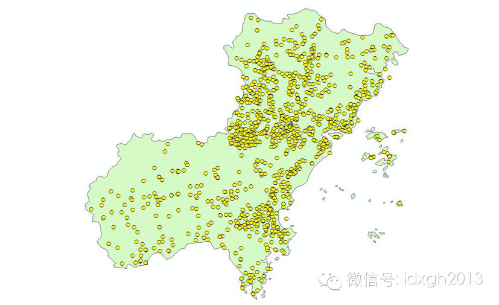
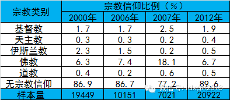
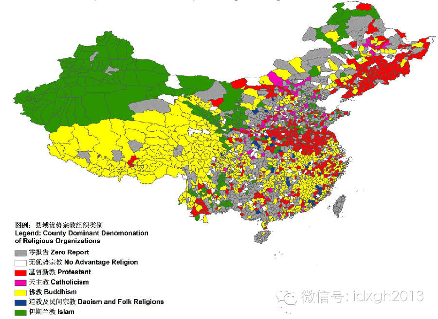
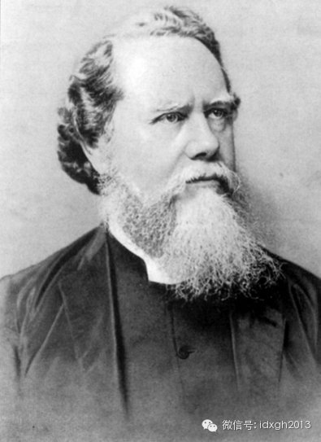
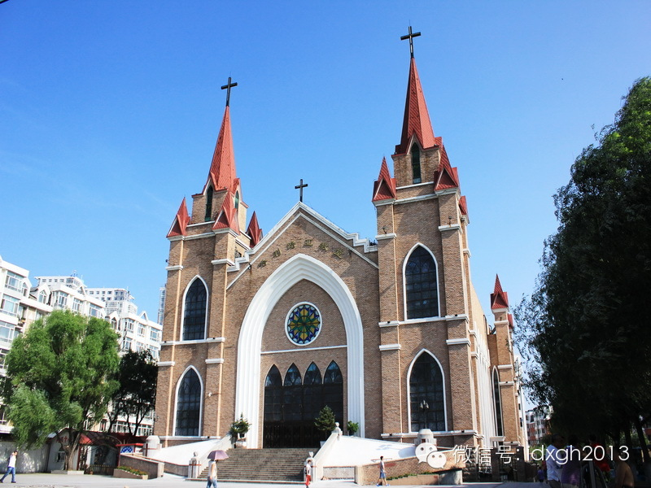
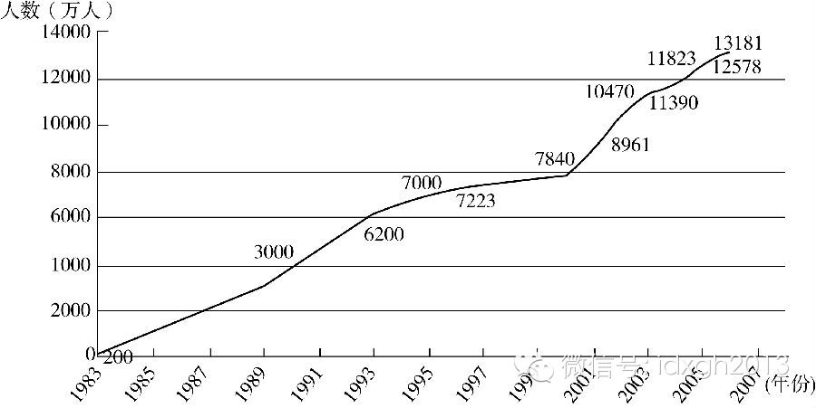

**中国有多少宗教信徒？为什么中国会出现宗教热？扩张最快的宗教是哪些？**

文/李晓璇 黄章晋

6月21日晚，巴黎东部美丽城19区一家教堂内，齐聚着东方脸孔的信徒——他们是来自中国温州的新移民。这个在巴黎聚集了最多温州移民社区的教会拥有上千信徒，在整个
大巴黎地区，华人基督教会超过20家。

温州人不是到法国后才成为信徒的。1980年代就开始移民巴黎的温州人，很少加入当地教会，而是建自己的教会；他们争相修建最漂亮、十字架最高的教堂。这些教堂外表华
丽，内部安有中央空调、投影仪等最新设备，教堂外常停满豪车。

他们在巴黎建教堂并不奇怪。以经贸发达著名的温州，其实还有另一个名字：中国的耶路撒冷。据统计，温州有超过2000家教堂，基督徒比例高达城市人口的15%（温州市
约100万人）。

  

_温州教堂分布图_

__

温州的基督教热只是中国宗教热潮的一个缩影，除了基督教、佛教，不为多数中国人熟知的巴哈伊教、摩门教甚至东正教以及其他新兴宗教也正在中国快速传播。中国大陆在“破
四旧”五十年后，进入宗教传播发展的全新时期。

  

**【中国有多少信徒】**

****

中国有多少信徒？由于宗教和民间信仰在中国定义模糊，很难有一致答案。据零点公司的调查，中国16岁以上人口中，有1.2亿人自称不信仰特定宗教，但相信神灵、佛祖或
鬼的存在，1.41亿人相信财神，1.45亿人相信风水，2.06亿人承认祖宗神灵存在。

  

即使只计算5大宗教（佛教、道教、基督教、天主教和伊斯兰教），也很难得到统一答案。

  

佛教因日常实践随意性大最难统计（官方白皮书从未公布过相关数据），从下表可看出，佛教统计波动最大。零点公司的调查（2007年）显示，1/5的人在宣称相信佛教（
非皈依）同时还选了“没有宗教信仰”。最后推论是，中国大约有1.87亿人信仰佛教，超过信仰其他宗教人数的总和。

  

_中国宗教信仰状况统计，数据来自4家不同机构_

  

基督教的人数统计争议最大。中国社会科学院2010年公布的数字是2305万，包括了“三自教会”和家庭教会的信众；中国两家学术研究机构认为基督教信众约3300万
，皮尤研究中心2011年认为中国有6700万基督教信徒；1990年代美国有媒体称中国有1亿基督徒，曾引起不小震动。

  

数字差异主要来自统计口径。官方一般以“三自教会”登记的信徒数为准，并不承认家庭教会。有学者认为“三自教会”与家庭教会信众相等，若前者为2500万人，总人数就
会逼近5000万。但不少信徒既参与“三自教会”也参加家庭教会。根据普渡大学教授杨凤岗的说法，单纯属于家庭教会的人数至多与“三自”信徒相等，更大可能是远少于“
三自教会”。这样看来，中国基督徒保守估计为3500万。

  

计算方法上较可信的是《圣经》推算法，即先抽样调查获得每个基督徒平均拥有的《圣经》数，再根据中国的《圣经》印刷总数倒推，它实际上与杨凤岗等人的估算相差不大。

  

3500万虽不及中国总人口的3%，但文革前，中国大陆基督徒人数不过80万。1982年，官方数据显示有300万基督徒，1991年为450万，到了1997年，这
一数字已达1000万，仅仅6年时间，年均增长达20%，这是一个极为惊人的数字。

  

5大宗教中最好统计的是伊斯兰教和天主教，由于两者基本都是靠家庭和血缘传教，其增长速度与人口增长率正相关。今天中国天主教信徒约500万，伊斯兰教则为2032万
人。

  

最不济的是道教，尽管有统计称，有1200万人认信道教，但很多人仅仅是有过问卦、驱鬼一类道教实践而已。事实上，道教除了作为文化旅游景点而存在的宫、观外，几乎已
找不到实体存在的痕迹了。

****

**【中国信徒地图】**

  

信众人数最多、增长最快的是基督教和佛教。佛教虽然有深厚的本土根基，但在20世纪60年代毁庙运动中，寺庙和僧侣几乎消失殆尽，算是1970年代末才开始从零发展。

  

不过，佛教和基督教的复兴有显著差异，从地理上看，越往西往南，佛教的优势越明显，而越往东往北，基督教优势越明显。除此之外，两者在城乡的扩展也明显有别：基督教的
复兴主要发生在农村，农村基督徒占基督徒总数80%左右，而佛教的复兴则更多在城市。

  

_中国现域宗教组织类别地图_

__

河南是基督教在农村扩张的典型，而周口又是河南的典型——它是基督教在河南第一个成立教会的地区。周口全市8县有1200个教堂，50万信徒。农民空闲时多聚在家庭教
会。今天周口的农村，很多坟头竖着的已是十字架而非传统墓碑，而教堂则扮演着最重要的公共空间。

  

_在河南周口，建立了第一座基督教礼拜堂的英国传教士戴德生_

__

佛教寺庙虽然大多已沦为各地方的旅游资源，但它反而为佛教复兴创造了变革的基础，大城市中活跃的非官方佛教团体举办法会时，地点早已从寺庙搬到了写字楼。昆明一个活佛
小组甚至设立“办公室”，供昆明、丽江、深圳、上海等地的居士前往交流，三年间该小组已有上百位居士，自己设立道场，每周诵经、打坐、学佛、讲座。

  

佛教在都市的发展特别多元：北京、上海的僧人和还俗子弟前往偏僻农村建庙，居士团体在家中举办学佛小组，皈依佛教的商人开办素食餐厅，寺庙的主持、法师们开设微博，粗
略统计新浪微博较活跃的活佛有近70位、法师150 位。

  

基督教和佛教在中国有相似的社会阶层分布。上海社会科学院对大学生的调查表明，有宗教信仰的人群带有“两头大、中间小”的阶层分布特征，即来自富裕和贫困家庭的学生，
信仰宗教的比例（分别为30%和23.4%），大于来自中等水平家庭（17%）的学生。有研究甚至认为，有宗教信仰的人更可能是受过良好教育和收入较高者。

  

不过，基督教在东北是奇特地以“城市包围农村”传播。以吉林为例，1982年—1993年间，基督教传播很慢，信徒只占当地各类宗教信徒总数的7.2%，远低于全国平
均水平(17.9%)，随后出现爆发式增长。今天，基督徒人数已占各类宗教信徒总数的50%，而且90%都是最近20年内皈依的。

  

1993年后东北发生了什么？

  

**【重建社会归属】**

  

时间节点上，基督教在东北爆发式增长与激烈的国企改制正好同步。

  

国企改制在东北是一次剧烈的社会震荡。东北是中国老工业基地，城市经济结构高度单一，社会结构高度单一：企业的社会化现象比中国任何地方都更突出，人们的生老病死和全
部社会关系都集中在一个封闭的单位。

  

国企改制不但意味着工人生活水平大幅下降，更严重的是因为企业的关停并转，失去了旧有的社会纽带，人们不但要重新找工作，还要重新找组织。对于全民在国企上班的社会，
一个人突然被企业抛离，内心的创伤和失落感会非常强烈

  

从东北地区信徒结构上看，迅速增长的信徒主要是下岗工人和退休者。这说明基督教在当地的扩张，主要是因为满足了社会归属的心理需求。虽然这种信仰动机和有些人因疾病困
扰入教一样，有功利和盲从取向，但教友们的关爱和鼓励对这个群体的价值是无法估量的。

  

另一方面，之所以人们选择基督教，还因为东北人口主要由关内移民构成，佛道教的根基不深。在大工业单位人情厚重环境中度过前半生的人，很容易投身到互助、关爱气氛浓厚
的基督教会。

  

更大面积的熟人社会瓦解发生在农村。

  

_哈尔滨的哈利路亚教堂_

__

传统时代的乡村社会，宗族和寺庙组织是重要的组织和情感纽带；社会主义改造消灭了宗教、宗族，人们在党的一元化领导下集体劳动、集体生活；承包制后，意识形态的真空给
了宗族意识抬头的机会，但“打工潮”导致农村空心化，只剩老人、孩子的乡村，丧失了建立宗族社会的基础。

_改革开放以来主要年份外出务工的农民工数量增长趋势_

__

此时再想建立亲密的社区关系，家庭教会几乎是仅剩选项，或者说，中国农村现状为基督教的传播提供了广阔热土。今天在基督教传播较广的农村，堂点已成为公共生活的核心，
即使家庭教会的堂点被拆掉，村民们也不会去官方建设的“文化活动中心”，而是继续凑到堂点的废墟周围感受“基菩萨”的魅力。

  

离开家乡的新一代农民工，因接受过无神论教育，很难受父辈影响信教，很多人仅在圣诞节时才跟着进教堂。有趣的是，当他们到异乡城市打工时，有些人反而会成为基督教信徒
。

  

“新客家人”是深圳城市教会的新生力量，他们孤身一人来到深圳，除了同事没有其他社会关系。工作薪水低、居住条件差、几乎没有精神生活。每周教堂聚会就是他们抚慰精神
的重要时刻。

  

教会能为异乡人迅速搭建一个社会网络。人们相互认识、彼此关心、以“兄弟姐妹”相称。“交友”成了“新客家人”在教堂的重要活动。和深圳类似，在北、上、广的教会中，
本地信徒所占比例在最近十年逐渐下降，很多地方外地信徒甚至高达90%。

  

近三十年来，中国严密封闭的熟人社会迅速瓦解，重建社会网络的心理需求，是各种宗教迅速传播的最关键社会学因素。比如，东北在基督教高速传播的同时也盛产各类“邪教”
。其实，早期基督教、摩门教的崛起也可归功于社会动荡。

  

**【精神的指引】**

宗教复兴是转型社会普遍现象。台湾和剧变后的苏联东欧都是典型，但宗教的社会功能并不仅只是重建社会归属感。

  

中国大陆企业家、教师、律师、医生等精英人群的信仰动机就复杂得多。

浙江一些教堂是“精英人士”聚会交流的平台，此类聚会被信徒称为“工商团契”，其内容和形式都与MBA课程相似：企业家们轮流发言，分享交流管理经验，有时还会按企业
规模和职务高低分组讨论。

工商团契最早出现在临近港台的福建、深圳等地，后发展到北京、温州、沈阳，甚至安徽、湖北、四川。聚会虽在教堂举办，但独立于教会组织，几乎每个地方的团契都由老板基
督徒牵头。他们最常表达的是如何把工作的基本道德与对上帝的敬畏相连，在他们看来，积累资本就是“荣耀上帝”。

  

有些基督徒经营的企业带有明显的基督教文化印记，他们向员工传福音，借圣经撰写“管理箴言”来处理公司事务与员工间的关系。不过，其价值不仅在于传道，更大的意义是通
过基督教的道德属性来加强企业管理。

  

类似的现象也出现在佛教徒中。与一般佛教徒不同，祈求个人福佑并非“老板佛教徒”的主要追求，他们组成各类基金会、企业道场、讲经会等团体，定期举办佛学相关讲座和学
习，还根据年龄和爱好举办茶道、插花、梵乐等学习班。

  

“老板佛教徒”也会把企业变成信仰传播媒介，践行其道德伦理；他们和“老板基督徒”一样，也会有额外的“信仰支出”，譬如建佛堂、供法师，捐助社会慈善活动。

  

宗教在中国精英信徒人群中，很明显地扮演了道德建构和重塑精神共同体的功能——正常社会，社会道德和伦理系统通常都来自其宗教传统，譬如西方国家来自基督教传统，而传
统中国社会则来自儒、释的结合。

  

新儒家对中国精英人群的影响也是同样的社会背景，它们都可视为是对1978年后中国社会价值观和道德空洞化的矫正：大公无私、自我牺牲、为共产主义奋斗的集体主义道德
体系，随着计划体制一道终结后，盛行的是物质主义和实用主义。

  

宗教组织内的相互帮助，很容易发展成面向全社会的慈善。近十多年，各类宗教组织在中国一直低调地践行其社会救济和反哺功能（有非政府组织的研究者认为，由于有道德和伦
理责任内核，有宗教背景的非政府组织通常有更好的组织动员效率）。

  

_2013__年慈济全球万人浴佛大典_

__

在社会慈善中扮演重要角色的恰好是发展最快的佛教和基督教——唯一的例外或许是新兴的巴哈伊教，他们似乎比较偏重教育，一直以小组学习方式在落后地区普及妇女和儿童教
育。

  

为什么不同的宗教在中国有不同的传播速度，甚至有不同的阶层、阶级分布？除了教义外，是否还与其组织方式与传播方式有关？请看续篇。

  

> 版权声明：  
大象公会所有文章均为原创，版权归大象公会所有。如希望转载，请事前联系我们： bd@idaxiang.org

大象公会：知识、见识、见闻

微信：idxgh2013

微博：@大象公会

投稿：letters@idaxiang.org

商务合作：bd@idaxiang.org

  

[阅读原文](http://mp.weixin.qq.com/s?__biz=MjM5NzQwNjcyMQ==&mid=203173166&idx=1&sn
=063c91d220a7ec621106b524f60554b5&scene=0#rd)

