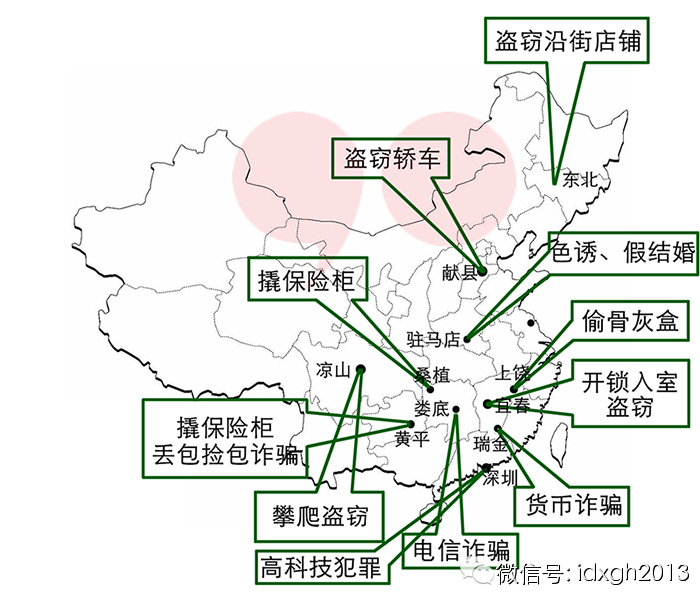

**今天中国的盗窃、诈骗、抢劫等财产侵占犯罪，很大程度上形成了强烈的地域性特征，特定类型犯罪发生后，公安往往会第一时间判断嫌疑人来自何方。**

  

文/吴致远

  

“北京市公安局提醒您，当前冒充熟人诈骗、网购及订票诈骗、冒充公检法机关谎称涉及案件等各类诈骗时有发生，请不要……”

  

只要你踏进北京任何一家银行的ATM单间，都会自动播放警方提醒电信诈骗的洪亮语音，但电信诈骗的新闻仍时有发生。1月11日，电影明星汤唯遭电信诈骗损失21万元。
几天前，更有一位沈阳老大爷虽有银行工作人员和警察轮番劝阻，依然遭电信诈骗损失40万元。有破解良方么？

  

当某种特定类型的犯罪发生时，有经验的侦查员几乎第一时间就能判断出嫌疑人来自何方。假如电动车及电线电缆被窃，多半是本地窃贼所为；而疯狂盗窃沿街店铺的往往是东北
籍嫌犯，高档轿车则要考虑河北献县方向，徒手爬楼入室盗窃的几乎可以肯定是四川凉山人，技术性开锁入室的盗窃团伙一般来自江西宜春，而青海化隆则是造枪基地。

  

上述案件要么目标特定，要么需掌握较高端的工具（特种轿车解码器）或技能（出众的攀爬能力，开锁技巧等），所以极易锁定特定籍贯人群。这类以籍贯区分的嫌疑人在公安系
统内被称为犯罪高危人群。他们所属的地域被称作犯罪高危地区。如前不久广东省公安厅出动3000多名警力围剿的博社村，其所归属的陆丰市即为中国制毒贩毒的大本营。

  

在外人看来，这种分析归类或许带有地域歧视之嫌，但它确实符合统计数据和警方内部办案经验。通常所说的犯罪高危人群，基本以盗窃、诈骗、抢劫等侵财类犯罪为主，作案踪
迹遍布全国。近几年来这三类犯罪已占到全部刑事案件的70%以上。

  

根据公安部统计，犯罪高危人群分布几乎涵盖了每个省份，其中又以河南、安徽、湖南、江西、贵州、广西、海南等地最为集中。这些地方不仅犯罪高危人群规模较大，而且犯罪
类型多，并能推陈出新。

  

比如河南驻马店是迷信消灾诈骗、冒充军警诈骗、色诱敲诈、假结婚诈骗的高危地区，贵州黄平是撬盗保险柜、丢包捡包诈骗高危地区，江西瑞金是外币诈骗、丢物捡钱诈骗、少
钱变多钱诈骗、金元宝诈骗及ATM机吞卡盗窃等类型犯罪的高危地区。当一种犯罪手法广为人知，成功率较低时，这些地区有专人负责设计更新颖的犯罪套路传播，以研发和创
新能力来对抗警方侦查手段和社会管理水平的进步。

  

从时代背景看，犯罪潮的出现，似乎是现代化进程中必然伴生的问题。

  

2012年，中国城镇化率已达到52.57%，城市人口超过农村人口。但大批向城市转移的农村剩余劳动力难以融入城市，他们多数文化程度低，缺乏职业技能，只能从事收
入不高的低技术含量的体力劳动。而城市高昂的生活成本和严格的户籍管理制度，在效果上相当于将他们驱离城市。政策和感情的双重歧视下，很容易产生严重的挫败感。

  

当融入城市的梦想最终破灭，回乡又没有立足之地时，一方面是为了生存，一方面源于失衡的心理，很多人主动走上犯罪道路。他们以同乡和亲缘为纽带，互相传授犯罪经验，结
伙作案。一些人常年在外流窜，另一些人学会犯罪技能后回到家乡，传授给宗亲朋友，交叉结伙，外出作案，得手后回乡销赃及躲藏，在宗族掩护下逃避侦查打击，犯罪带来的暴
利不断吸引新生力量加入，于是形成了大大小小的犯罪之乡。

  

犯罪高危人群和犯罪地域化的现象，其实是刑事犯罪类型化、专业化的逻辑延伸。如果将这类犯罪视为一种特殊的经济活动，则不难理解犯罪之乡的形成——犯罪技术的学习和传
授，不像正常的技术可以公开获得，它高度依赖熟人、亲戚之间的信任；越是技术门槛高，需要配套系统支撑的犯罪手段，其地域性垄断特征就越强烈。

  

另一方面，犯罪之乡的形成还与地区经济差异及特定的民情紧密相关。譬如儋州是海南第一大县级市，人口众多且构成复杂，客家人和黎族苗族混居，社会治安较差，黄赌毒泛滥
，经济不发达，是多种类型的犯罪高危人群聚集地。深圳及广东籍网络诈骗团伙把儋州发展为下线和根据地，雇佣大批儋州籍青少年参与作案，且分工明确。

  

当地甚至形成了一条完整的产业链，有人负责盗窃身份证，有人负责用他人身份证开设诈骗用银行账户，有人负责具体实施诈骗，有人负责提款分赃。下属的那大镇甚至出现了一
个二手身份证交易市场，可以在此成批购买他们丢失或被盗的身份证。自2006年至今，受骗者遍布全国。儋州还是“金砂诈骗”案件的高危地区。源源不断的犯罪收入又带动
了当地娱乐业的发达，导致社会治安进一步混乱。

  

湖南娄底是电信诈骗、合成裸照诈骗及假金龟假金砖诈骗高危地区。电信诈骗最早由台湾传入沿海的广东福建一带。泉州安溪曾是此类犯罪的大本营，亚洲最繁忙的基站即坐落于
此地的魁斗镇。自2004年以来官方重点整治后，台湾籍诈骗团伙将窝点转移到了湖南。

  

2010年公安部组织3000余名警力，协同台湾警方联手摧毁特大电信诈骗犯罪网络群，捣毁诈骗窝点及地下洗钱场所124处，仅长沙就出动警力2000人，抓获台湾籍
嫌疑人近200名，捣毁窝点22个。

  

台湾籍诈骗团伙销声匿迹后，电信诈骗又被娄底双峰籍嫌疑人接手，并发展出更灵活的单兵作战模式，在外省流动作案，得手后立即携带设备转移。我国现行侦查体制下，刑案由
发案地公安机关管辖，而此类犯罪发案地、作案地、籍贯地及嫌疑人所在地均不同，办案成本极高，往往无力打击。目前已由双峰蔓延到临近县域，高危人群规模近一步扩大。

  

济南商河县是盗窃牛羊及机动车、制造假烟等犯罪高危人群聚集地，连同河北献县、孟村、天津等地嫌疑人形成了一个庞大的盗窃机动车产业链，有专人负责提供各类高档车解码
器，有专人负责销赃，有专人负责踩点及提供作案目标。已经高度团伙化及职业化。几年前一次行动即在某犯罪专业村查获被盗高档机动车一百余辆。

_中国犯罪之乡地图。_

  

通过以上分析不难看出，犯罪高危地区通常具备如下特点：经济落后，人口众多，社会治安复杂，民情特殊。尤其最后一项，更是直接决定了各犯罪之乡的特色。

  

东三省作为传统重工业基地没落后，大批人南下寻求生计。在东北当地较少出现犯罪高危地区，而且东北人性格豪爽耿直，少机诈，暴力犯罪较多，偶有侵财类高危人群也是以持
安全锤砸车玻璃拎包及盗窃沿街店铺为主。

  

河南及安徽阜阳、亳州等地的高危人群，以传统的诈骗为主，科技含量低，侵害对象多为文化程度不高的中老年农民。广东深圳等毗邻港澳的发达城市，主攻高科技犯罪，偏重于
利用新兴的电信及网络平台实施诈骗盗窃，属于犯罪产业链的上游，并辐射带动了一大批周边省市的高危人群，而且其犯罪模式较少与受害人直接接触，人身危险性低。

  

江西湖南等地民风彪悍，犯罪目标较大，危险系数高。湖南桑植高危人群专门撬盗工矿企业保险柜，涉案金额极高，娄底双峰籍高危人群擅长PS裸照敲诈各地高官，江西上饶籍
高危人群盗窃公墓骨灰盒勒索家属，目标往往选定中产以上阶层。江浙及福建以造假售假等扰乱市场秩序的犯罪为主。

  

一个突出的问题是，在这些犯罪高危地区，为贼为盗不仅没有道德负担，反而是乡民艳羡的对象。在贵州黄平，年轻姑娘青睐的是靠外出撬保险柜发财的男性，遵纪守法在家务农
的往往被人瞧不起。

  

受制于人口、资源、地理位置和产业布局经济政策等诸多因素，中国的区际经济发展并不均衡，中西部地区要远远落后于东南沿海和北上广等经济群。城乡差距、地域差距使以犯
罪来平衡被剥夺感甚至具备了某种“正当性”，高危地区及人群以这样极端的方式“融入”社会分工，强行对收入进行再分配，争夺生存资源。

  

来看一组数据：某年山东省济南市共立刑事案件73336起,其中外来人员作案43634起,占59.5%;抓获各类犯罪嫌疑人17196名,其中外来作案人员8258
名,占48%。其中，抓获外省犯罪嫌疑人5818名(分别为东北籍1204名、安徽籍803名、河南籍731名、江苏籍679名、贵州籍653名、云南籍614名)。
北京等地外来流动人口犯罪甚至占80%以上——某种程度上，犯罪在中国成了一种另类的先富带动后富方式。

  

从概率上看，我们的读者最有可能碰到的犯罪方式是电信诈骗。如果您希望您的家人免遭电信诈骗，或可告诉他们这样的方式应对——如果遇到自称是银行、保险、经济警察打来
的电话，可对那个略带南方口音的人说：“昂岑桑哼雷格”，也许她会念及同乡之谊或认为遇见同道，放您一马。

  

大象公会：最好的饭桌谈资，知道分子的进修基地。

[大象公会所有文章均为原创，版权归大象公会所有。如希望转载，请事前联系我们：idaxiang@idaxiang.org ]

[阅读原文](http://mp.weixin.qq.com/s?__biz=MjM5NzQwNjcyMQ==&mid=10178404&idx=1&sn=
7591f97016314c4e96539dc1d1fe1dcb&scene=1#rd)

