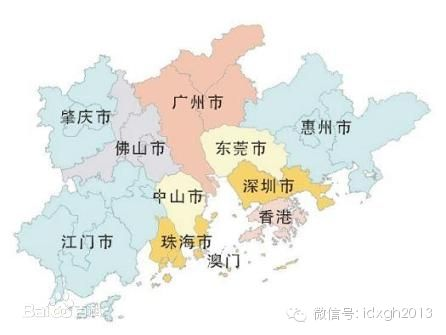
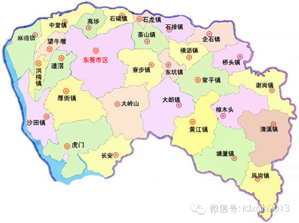
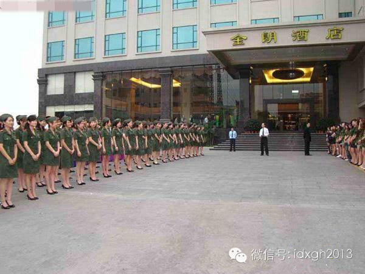
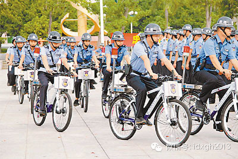
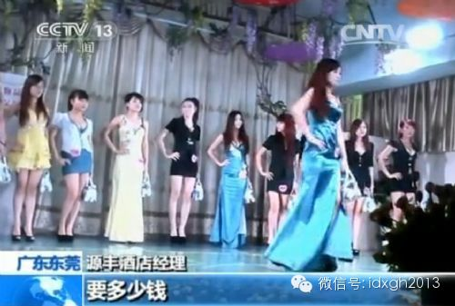

**东莞是全球星级酒店密度最大的城市。当众多酒店激烈竞争，性服务行业的革命开始了。同时在客观上，它又有较为宽松的管制环境。**

****

文/潘游

  

“十万小姐赴岭南，百万嫖客下东莞”。有人说，想理解东莞为什么是”性都”，只需要一幅珠三角地图即可。这种常见的解释，是指东莞距离三大都市——广州、深圳、香港距
离很近，构成了”1小时车程生活圈”，优越的地理区位意味着潜在消费者众多，促进了性服务行业的兴起。

  

加之东莞制造业发达，吸引了数量巨大的打工妹，部分人有可能因经济下行等原因投身这个行业，故提供了近似无限的人力供应。一幅地图，说清楚了满足这个行业生长的供需两
方面条件。  

  

_东莞在珠三角的优越区位_

  

但是自身禀赋满足“地处核心经济圈且制造业发达”的城市还有很多，譬如长三角的苏锡常等城市，或许它们的地下性服务行业规模也颇为可观，但终究比不了2014年2月9
日前的东莞。

  

“性都”之所成为全国性服务行业的标杆，甚至能够碾压性产业已闻名于世了半个世纪的东南亚同行，凭借的是坊间称为有ISO标准存在的”莞式服务”，当然还有庞大的从业
者数量，以及作为规模化、标准化结果的物美价廉。

  

在国内其他城市的性服务行业中，顾客接受的服务好坏靠的是运气——中国各色“狼友”论坛，若以岭南、岭北地域划界，最大的差别在于，岭北会不断讨论如何应对性服务业中
的服务差异。

_  
_

_  
__贾樟柯电影《天注定》中的东莞“选妃”段落（视频体积小于2M，请放心大胆点击观看）_

  

“莞式服务”胜在均质和高标准。引入了现代企业管理制度的东莞从业者，既有从态度到流程的细节标准培训，又有服务后客人回馈和打分以决定收入的绩效考核，使每个客户都
能得到“超出预期”的服务。

  

东莞“性都”地位的奠定，需要两个因素：一、本地特殊的业态形式，二、极为宽松的管制环境。这需要另外一幅地图来解释。

  

_东莞市独特的行政区划_

  

长期以来，东莞的行政区划只有32个镇（街），却没有县区级行政单位。按中国传统的行政区域架构，一般是市（地区）—县（区）—镇（乡）的三级体系。在中国，除了继承
三个群岛办事处行政编制、具体情况尚不明朗的三沙市外，地级市只有市、镇两级建制的情况，也就只存在于广东东莞、中山、海南三亚、甘肃嘉峪关这四个地方。

  

扁平的两级管理体制，应可追溯到80年代末的行政区划改革。1985年，东莞才由原惠阳市下的一个农业县，撤县建市；88年又从县级市升格为地级市，相比之后的缓慢区
划变革，东莞在那两年多的时间内完成了一次撑竿跳。

  

在中国，行政区划的级别决定城市能获得的政治资源。东莞以一个县的幅员，获得了地级市的权限。权限在两级架构下直抵基层，下辖的镇街同样有很大的自主权。这种政策优惠
为东莞快速发展减除了过多的行政成本。

  

——读到这里，也许有读者会认为是不是跑题了，请注意，“莞式服务”服务诞生于高标准的酒店，而非一般城市常见的路边店或洗浴中心。奠定东莞性都地位的特殊业态形式，
是高规格酒店。

_东莞某星级酒店“阅兵”_

  

镇街经济相互竞争的态势，常被人诟病为“各自为政”，会导致资源配置零散，重复建设。但这也意味着它能造就产业聚集——在东莞，尤其是能伴生性服务的酒店行业。相比相
邻的大城市，东莞土地供应的价格更低，两级行政结构也让审批流程、税收政策上有更多的操作空间。

  

五星级酒店既是招商引资的基础，还会被当作政绩；而没有星级酒店的镇会出台优惠政策，以奖励其它用地等方式跟进。1996年后，从制造业赚到大量财富的东莞民营资本开
始进入酒店业。

  

这与其他城市高级酒店往往是国资、外资开设的情况有很大不同。本地发达的制造业带来了无数外地商人和官员而数不清的会议会展，珠三角地区高速公路网络建成后形成的1小
时生活圈，使得酒店业需求巨大。

  

只消十年光景，东莞拥有的五星级酒店的数量，便仅次于北京和上海，成为全球星级酒店密度最大的城市。时至今日，在东莞的五星级酒店住宿的成本——特价时甚至只有四百余
元每晚——也远远低于其他城市。

  

著名性社会学家潘绥铭在《存在与荒谬》一书中曾描述道：1997年前后东莞的性服务行业便已闻名珠三角（作者隐去了东莞二字，但文中提到该地1721年修的墟场和石碑
，指的正是东莞），但行业形态——发廊、站街——和全国其他地方差异不大。这个时期，中国民间顺口溜谈到性产业，还是“不到海南不知道自己肾不好”。

  

当众多酒店激烈竞争的时候，东莞性服务行业的革命开始了。代表先进生产力的星级酒店，将现代管理学引入到性服务业中。一家酒店可将近百位性工作者组织到一起，施以集约
化培训和名副其实“成人教育”——这种教育随着竞争和时间流逝愈发完备精致，并用KPI考核进行品控。

  

将标准化生产管理带入性服务业，对有丰富制造业经验的东莞民营资本来说，完全是水到渠成之举。有坊间传言说，“莞式服务”来自某位培训师前往香港、台湾、日本、泰国等
地学习，并“在日本成人电影的基础上，融入泰式按摩的精髓，再根据中医人体穴位原理”而来，这只是一种神秘化的叙事。

  

事实上，在不允许组织卖淫的香港，性服务业态只能采取一楼一凤的个体形式，无论如何也不会发展出性服务行业中的流水线风格。讲求标准化的“莞式服务”是工业文明的成果
，是百座星级酒店的管理者和一线从业者智慧与实践的结晶。

  

东莞性服务业宽松的管制环境，也来自这张地图。

  

在其它城市，性服务行业往往聚集在某一个或某几个街区，辖区内没有红灯区的警察若想创收会“勤奋”地跨区扫黄。性工作者无法打点全部市区的警力；而由数十个镇（街）组
成、且性服务业分布均匀的东莞，关系就简单了许多，投资方是本地民间资本，与基层执法者同属本地户籍，利益关系也更为密切。

  

东莞领有“性都”之名，对东莞市官员来说绝非好事，而且东莞因性服务业遭遇央视大规模点名并非这一次。性服务业宽松的管制环境——东莞市政府的“不作为”，很大程度上
不是其主观意愿，而是根本“管不过来”。

  

从理论上讲，合理的行政区划应随着社会经济的发展变化而有所调整。但问题在于：体现制度经济学原理的政府管理体制是自上而下的；而外来人员快速涌入以及相应而来的管理
挑战，是服从区位优势、市场经济原理的，这个方向恰恰由下而上，治理的矛盾就源于此。

  

2005年前后，东莞最发达的一些镇街，其国民生产总值已超过内陆省份的十强县，人口有数十万，但因行政级别保持不变，一个镇的公务人员编制据称徘徊在150人左右。
公共服务的负担到何种地步，不言自明。

  

譬如在金融危机导致企业倒闭潮的2008年，处理相关法务的法院工作人员实行“朝8晚11”工作制，一日三餐都在办公室吃盒饭，都无法应付得过来。而一般城市企业宴请
基层税务官员的行为，在东莞极为罕见，因为东莞税务官要应付的企业多到他根本没有时间去过问。同样，为治安需要，东莞只能大量征召联防队员，去填补镇行政区划下只有十
余位的巡警编制的不足。

  

_在岭南较为普遍的联防队员_

  

正是因为涌入了近千万外来人口，而本地公务人力资源匮乏，治理思路就会特别简单粗暴，完全对不起“改革开放排头兵”的地位：出现了有广东特色的摩托车砍手党怎么办？禁
摩！哪怕这种政策实行起来，主要是给每天靠摩托车出行的市民添堵。

  

一个城市的管理人力资源匮乏如此，为什么要去优先整治能解决就业，不带来恶性刑事案件甚至降低强奸案发生率的性服务行业呢？要知道，系统清理整顿本地性服务业是极为耗
费警力资源的工作。

  

东莞市和广东省近年都提出过行政区划调整的方案，但无论是撤还是并镇，以建立区或“镇级市”，都面临着官员权力、职务分配的人事工作难度。而行政级别上调，公务员们集
体“升官”，各地要求效法的呼声必不绝于耳。这有悖追求稳妥的官僚理性。

  

_央视密集报道东莞色情行业_

  

回到主题，央视的大规模曝光，对东莞的性服务业来说，是一次寒流，东莞之所以成为性都的特殊要素，并不会因为一次寒流而改变，就像东莞市政府花巨资在央视投放东莞城市
形象广告，不可能动摇它的民间地位一样。事实上，带有工业文明特征的“莞式服务”，已由东莞扩散到周边与其有相似特征的城市。

  

**欢迎点击页面左下方“阅读原文”，参与“你支持性服务行业合法化吗？”投票**

  

[大象公会所有文章均为原创，版权归大象公会所有。如希望转载，请事前联系我们：idaxiang@idaxiang.org ]  

  

  

[阅读原文](http://mp.weixin.qq.com/s?__biz=MjM5NzQwNjcyMQ==&mid=200112346&idx=1&sn
=c003a1d49185849481846c01f2769a45&scene=1#rd)

