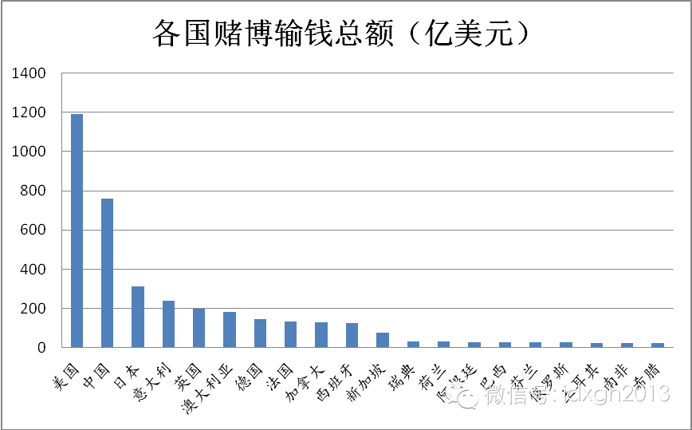
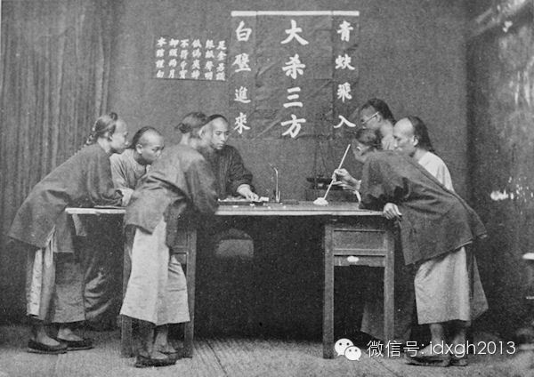
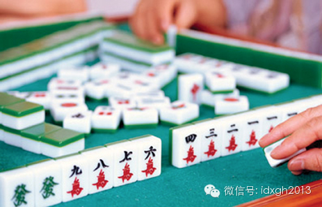
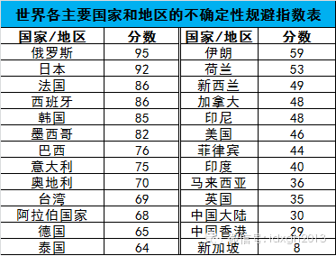
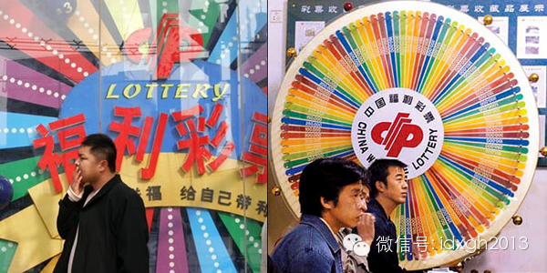
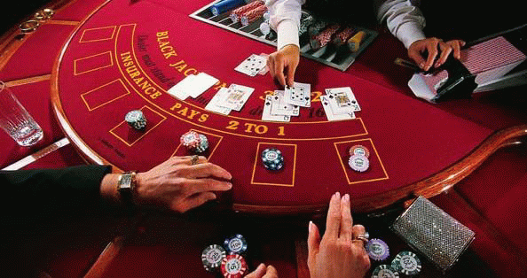
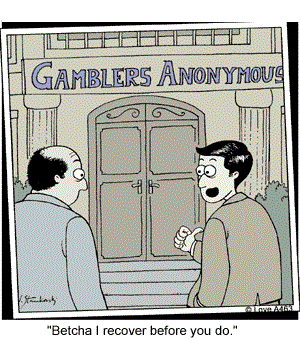

**2013年，中国人在赌博中输掉760亿美元，高居世界第二，这和其向来中庸的印象相悖。为什么会产生这种效果呢？**

  

文/郑子宁

  

中国人是世界上最好赌的吗？

  

这个结论很难被证明，尤其是大陆禁赌，实际情况无法准确计算。不过，中国人好赌是肯定的，逢年过节，华人的家庭麻将桌每个人都不陌生，日常休闲，小赌怡情是常见的选择
。

  

大赌伤身也屡见不鲜。2013年，中国人在赌博中输掉760亿美元，由2012年世界第9升至第2，仅次于美国。近年的海外赌场，操中国各种方言大声喧哗的赌客场景越
来越常见。沿着中国边境，许多国家专为华人建立的赌场都热闹非凡，如朝鲜的罗先市、缅甸的迈扎央经济特区以及韩国济州岛的赌场，豪赌通道都十分顺畅。

  

澳门这个华人世界的赌城和美国拉斯维加斯赌博营业额的对比或许更能说明问题，自2007年起，澳门赌博业的营业额就已超过拉斯维加斯，成为世界第一赌城，近年差距拉得
更大。

  

赌博输钱总额前20强，中国高居第2位（数据来源：H2）

  

大陆之外，华人的好赌同样突出。在美国、澳大利亚等多族裔的移民国家，亚裔人口赌博上瘾的概率远大于其他民族。旧金山和洛杉矶的赌场中，八成是亚裔人口，博彩公司专门
给亚裔集中的社区发广告，并派免费班车去这些社区揽客。澳大利亚最大的墨尔本皇冠赌场普客区64%是华人，贵宾区比例更高。

  

澳大利亚最大的赌场:墨尔本皇冠赌场

  

赌场只是冰山的一角。大陆官方严厉禁赌，但事实上赌博活动十分庞杂。坊间甚至传闻，中国地下博彩业规模达到“数千亿到一万亿人民币”。富豪隐秘的聚赌极少受到干扰，平
民日常的赌博基本半公开化，地下博彩业近年来屡见报端。

  

中国人好赌并非中国人自己的观察总结，清末大批探险家、传教士来华，在他们关于中国风俗民情的观察当中，热衷于赌博是他们认为中国人最突出的特征之一。那些因为赌博而
倾家荡产的人常令他们不可思议。

  

从大陆到港台，华人的赌博倾向十分明显，是什么样的魔力造成这种热情呢？

  

**【悠久的赌博文化】**  

  

历史上，中国的赌博风气就十分普遍。

  

《史记•苏秦列传》记载了齐国人嗜赌的风俗：“甚富而实，其民无不吹竽鼓瑟，弹琴击筑，斗鸡走狗，六博蹋鞠”。宋朝时，输红了眼的赌徒杀人，盗窃，抢劫，无恶不作，官
府对此头痛不已。清末八旗子弟花样百出的赌博景观，也是站在历史的肩膀上。

  

同时，中国的赌博形式非常丰富。樗蒲、骨牌、斗鸡、跑马、投壶，各阶层都有偏好的游戏。明清时代，麻将这种复杂、低廉又有趣的赌博方式征服了社会各阶层的人民，堪称中
国赌博手段的巅峰。近代西洋扑克、彩票、赛马、赌球、老虎机等传入，使得可用于赌博的游戏品种更加丰富，各个阶层都能找到合适的形式。

  

晚清的番摊赌坊

  

与世界其他文明相比，中国历史上的禁赌并不严厉。几乎所有的朝代都下过禁赌令，严苛者如宋太宗曾下诏：“京城蒲博者，开封府捕之，犯者斩”，但无不以失败告终。

  

清末，传教士汤姆逊观察到：“中国人的赌博并不限于赌场，有时在俱乐部里或私人住宅里进行；有时在路上，在街上随便什么角落里，那些体力劳动者们以此消磨他们的空闲时
间”——虽然此时清政府的禁赌令仍在进行。

  

行政命令延续力差，效果微弱，无法与在教义上禁赌的伊斯兰世界，有限度容忍赌博的基督教文明相比。

  

1949年后，中国官方严厉禁止赌博，高强度的计划体制和社会管控手段极大程度地消灭了民间赌博的空间。但赌博文化的根基并未被运动式的禁赌摧毁。

  

以麻将为例，文革初期麻被当作破四旧的对象，但风声稍松，麻将就死灰复燃。安徽省曾有公安收缴了翡翠麻将，舍不得销毁，自己偷着玩，最终被告发。聪明的赌客还发明了纸
制无声麻将以防止被他人察觉。

  

改革开放后，随着禁令的逐渐松弛，不但搓麻声再次响彻九州，各种地下博彩也从南方沿海兴起，传遍大江南北。

  

**【家庭式赌博】**  

**  
**

2005年，公安部副部长白景富宣布对少量彩头的赌博形式不再查处，这与对地下六合彩、赌场的打击形成鲜明对比。后者多出现在中国南方；前者，尤其以麻将为代表，跨越
了地域差异，堪称是中国家庭的标配。在海外，华人聚居的地方麻将赌博也很常见。

  

是什么原因让强大的政权、海内外的差异都不能阻止麻将等的延续呢？这或许与中国家庭组织方式有关。

  

作为一种集体性很强、权力差距很大的文化，中国文化中个体行为受到周围人，尤其是地位更高者的影响非常大。与西方由父母和子女组成的核心家庭不同，中国的家庭建立在家
族基础上，常举族聚居，亲戚来往频繁。家族中的族长时间宽裕，常常是老年人，需要一些具有社交功能的游戏。既能打发时间，又能更多地联络族员。

  

以麻将为代表的棋牌游戏既不耗费体力，又联络感情，收获刺激，很适合亲戚沟通，同时器材简单，场地要求低，无论贵贱都能举行。因此，赌博行为在中式家庭司空见惯，家长
也会让小孩上桌，提前熟悉成年人的社交方式。牌桌上的少年英雄，往往会得到长辈夸赞。

**  
**

  

东亚国家中，另两个盛产赌徒的韩国和越南也都具备集体性强、权力差距大的特征，加之历史上受中国文化影响巨大，各种新鲜好玩的赌法迅速传入，嗜赌就不足为奇。

  

**【爱冒险的华人】**  

  

虽然华人常给人谨小慎微的印象，中国文化也历来强调中庸，但根据霍夫施泰德的文化维度理论，中国人的不确定性规避指数在世界范围内偏低。  

  

不确定性规避指数，是管理学上衡量某种文化中的成员面对不确定情况感到威胁的程度。霍夫施泰德的研究中，中国文化的不确定性规避的分为30（满分100），在主要国家
文化里面偏低。美国人常被认为富于冒险精神，敢于挑战未知，但美国文化不确定性规避得分为46分，比中国要高得多。

  

  

也就是说，中国人的冒险倾向强于大部分国家。这是真的吗？  

  

其实，不确定性规避指数更强调对财产、机会的冒险程度。欧美国家现代化进程早，诸多社会习俗体现着理性化的原则，多数人本能回避高风险高回报的决断，尤其当涉及投资、
理财等领域时。

  

他们给人敢于冒险的印象，都是在户外活动之类的领域——在西方高福利社会，即使是不循常理的叛逆生活，风险也较低。而现代化、市场化仍在进程中的中国，冒险精神恰恰反
过来。中国的房地产市场如此火爆，股市中散户比例之高，都是中国人冒险精神的很好注解。

  

同属东亚的日本，文化上有很多方面和中国相也当接近，但其现代化进程早，社会经济理性发达，且日本灾害频繁，国民普遍缺乏安全感，总为最坏情况做打算，因此日本有极强
的不确定性规避倾向（92分）。虽然日本人均收入远超过中国，但在赌博上比华人要保守得多。

  

这种冒险特征，让中国人在境外和地下赌场上的表现令人印象深刻。墨尔本皇冠赌场记录显示，李先生从2011年10月19日到11月1日，共输掉689万澳元（约合人民
币4000万），豪放程度令人称奇。但与黄光裕公海输掉80亿的恐怖记录相比，还需要修炼。

  

华人对冒险的热爱，还体现在对赌博方式的选择上。很多西方人喜欢投入相对受限、可预期性强的刮刮卡或老虎机赌博，但这类游戏在华人中的受欢迎程度不高。

  

华人喜好的骰子、纸牌、麻将、斗鸡等赌博形式都有不封顶的特点，赌注和回报可以是天文数字，刺激感十足，即使是游戏本身不确定性并不高的麻将，也可通过和牌算番的方法
将赌注和回报成数倍乃至数十倍地放大，极大程度地增加了不确定性，满足了冒险者们肾上腺素上升带来的快感和欲望。

  

百家乐在华人中的流行，很具有代表性。百家乐起源于意大利，传入华人社会后根据英语Baccarat音译为百家乐。它规则简单，相对公平但又极度缺乏确定性。输赢都依
赖牌的点数大小，几分钟内就可以决定通往天堂还是地狱。

  

  

和二十一点等可能通过数学计算提高概率不同，百家乐实质上对技巧毫无要求，预测庄闲输赢更是接近不可能。这种最符合经济理性不足，热衷冒险的华人的胃口。赌客寄希望于
开牌过程细节变动，喊口号、慢揭快甩之类被华人仪式化。于是，融冒险、社交于一体的百家乐在华人中特别流行。

  

全澳门博彩业的85%的利润来源由百家乐产生，比其他所有博彩方式的总和还要高出6倍。想要吸引华人的赌场，都必然设置大量百家乐赌桌。

  

百家乐三珠路打法

  

或许让国外赌徒看得最傻眼的赌博方式是猜单双号，即猜对面来车的车牌尾数是单数还是双数，这种在中国南方小城镇曾颇为流行的赌博，玩家往往只是小商贩甚至社会低层——
输家输掉的小轿车或摩托车很可能是他赖以糊口的生存工具。  

  

**【爱面子的华人】**  

  

爱面子是多数华人共同的特征。相比于辛苦劳动和资本运作，赌博的收获要更气派。对于很多在海外生活的华人而言，光顾赌场是极少数能让自己重温在国内被伺候、注目和鼓励
的机会。  

  

但是，面子对赌博的影响更体现在怕丢面子上。承认自己赌技一般、因赌博给家人带来不良影响等都需要勇气，十分“丢面子”，而针对自己的赌瘾寻找专业人士帮助，更是一项
艰难的任务。这样的求助在华人眼里是非常软弱的行为，因此华人虽然赌徒多，赌瘾大，但是求助戒赌服务的反倒少。

  

1957年，洛杉矶出现了第一个戒赌互助会，任何困扰于赌瘾的人只要提出申请，都能获得一定的帮助。2005年，世界范围内戒赌互助会在11个国家举办已超过1000
次，但不包括中国。

  

在中国，除电视上偶尔痛哭流涕的家人，破门而入的警察，只有零星悔过的前赌徒自费开办的“戒赌中心”能提供戒赌帮助。一些曾经的“赌王”金盆洗手后，义务为赌徒戒赌，
令人啼笑皆非的是，他们接到最多的咨询却是“如何出老千”“如何赢得更快”的电话。

  

寻求专业的心理咨询帮助戒赌就更是丢人现眼。非但如此，为了防止家丑外扬，华人家庭中其他家庭成员往往会支付亲人欠下的赌债，以避免赌徒落得身败名裂的下场。这样的做
法虽然能一时缓解燃眉之急，但无异于扬汤止沸。

华人碍于面子，很少参加这样的赌徒互助组织

  

中国内地公开的投注方式只有彩票一种。即使是如此单一、枯燥的下注方法，2012年中国的彩票销售额仍达480亿美元，仅次于美国的680亿美元。考虑到汇率差异，这
个数字十分惊人。巴西世界杯期间，中国足彩的销售额超过120亿元，赔率、让分刷爆了朋友圈，这是一个新鲜的信号——中国的年轻人又找到颇具互联网思维的新玩法。  

  

> 版权声明：  
大象公会所有文章均为原创，版权归大象公会所有。如希望转载，请事前联系我们： bd@idaxiang.org

大象公会：知识、见识、见闻

微信：idxgh2013

微博：@大象公会

投稿：letters@idaxiang.org

商务合作：bd@idaxiang.org

[阅读原文](http://mp.weixin.qq.com/s?__biz=MjM5NzQwNjcyMQ==&mid=203754373&idx=1&sn
=75880786289d19212eb767e0ded00f9e&scene=0#rd)

