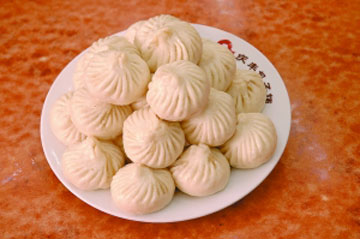
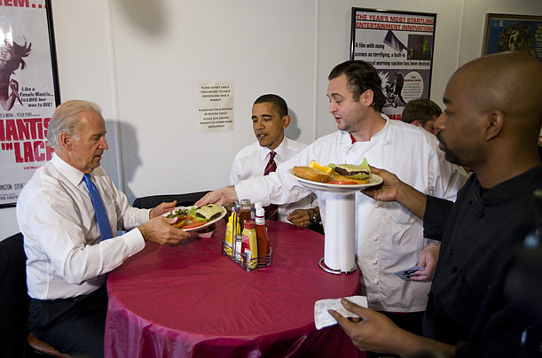
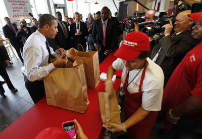
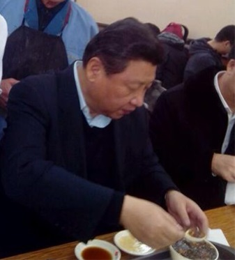
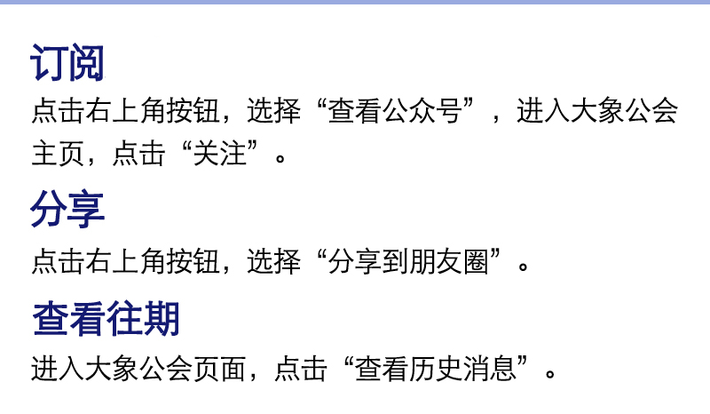

**北京有无数家快餐店，包子也有很多品牌，如果让北京食客中见多识广的人推荐，恐怕根本轮不上庆丰包子店。习近平为什么选则庆丰包子铺？**

  

文/金毓城

  

2013年12月28日中午12时许，习近平在随员陪同下，来到北京西城区月坛路的庆丰包子铺午餐。ID为“四海微传播”的微博账户第一时间发布图文消息，很快被官方
证实。总书记在包子店亲自排队付账的新闻立即成为各大门户网站头条。很快，纷纷表示感动的评论和评论文章在网上铺天盖地，28日的中文网络洋溢着热烈的包子味。

  

只是，北京有无数家快餐店，包子也有很多品牌。如果让北京食客中见多识广的人推荐，恐怕根本轮不上庆丰包子铺，为什么会选庆丰包子铺？

  

习近平在快餐店吃包子，是一次亲民形象的展示。体现亲民的方式有很多种，国外政要常见的方式是出行与饮食，最能体现亲民的出行方式，莫过于乘坐公交车辆；而以吃的方式
体现亲民，最常见的是到公众性最强的快餐店就餐。如美国总统奥巴马在2009年5月5日中午，与副总统突然现身一家狭小的汉堡店，和民众一起规规矩矩地排队买汉堡，如
此举动自然吸引了众人的目光。

_奥巴马与副总统拜登在雷氏汉堡。_

  

_奥巴马为白宫员工排队买麦当劳汉堡。_

  

要让人产生“一股亲民之风扑面而来，确实让人为之感动”的效果，中国领导人当然也要挑选一家快餐店。但中国礼制完备，去哪一家快餐店当然要讲究，不能随意选择。

  

首先它不能是麦当劳、肯德基以及吉野家这样的洋品牌，不然它会被过度政治解读——公开场合上避免与大众洋品牌沾边，已成今日中国领导人的惯例；其次，它也不能是一家民
营企业品牌，否则会被视为对某个企业的支持。其实历代中国领导人在小吃问题上，一直避免与民营品牌接触。也就是说，国家领导人不沾洋品牌和民营品牌，是一种非公开的政
治正确。

  

譬如毛泽东1958年4月在长沙火宫殿兴致勃勃题词夸奖火宫殿的臭豆腐时，火宫殿早已完成了社会主义改造，变成了一家国营店，而此前毛数次回湖南并未踏足火宫殿。改革
开放后，餐饮业整体上变成了一个民营资本为主的市场，但中国领导人前往就餐的快餐店，全都是依然保持国营化的传统老字号，譬如接待国家领导人最多的西安老孙家饭庄就是
国营控股企业，它的股权持有者是全国唯一上市的餐饮企业西安饮食集团。

  

在今天的北京，国营快餐店可选择的余地并不多，北京国营餐饮业大都属于几家大型企业集团，集中老字号最多的是北京华天饮食集团公司，该公司2004年12月根据西城区
委区政府和区国资委决定合并重组而成，旗下拥有鸿宾楼、烤肉季、同和居、同春园、护国寺小吃、庆丰包子等一大堆传统老字号。这些品牌中真正算得上大众快餐且有一定影响
力的，数来数去可能只剩下庆丰包子铺这一家。

  

当然，庆丰包子也许本身就比其他快餐更具亲民特色。包子不同于盒饭、面条，它不但在北京是最具代表性的传统快餐方式，在中国任何地方都具极高的覆盖率。而且包子本身就
可视为中国饮食的特色——周边日本、越南、蒙古等国的包子当受中国影响而来，日语中“中华まん”这个称呼就很能说明问题。

  

至于“主席套餐”中的炒肝，则是地道的北京本地吃食。从习近平吃炒肝的姿势看，大院长大的习近平对炒肝应该不算特别熟悉。真正的北京人吃炒肝并不用汤匙和筷子，而是整
碗端起来抿着喝下，所以早些年前若有人吃炒肝用勺筷，老北京人一看就知道此人为外地人。

_习近平吃炒肝。_

  

不熟悉北京炒肝的外地人，或许会奇怪一种熬出来的浓汁状食物，为什么会将制作过程称为“炒”；同样的疑问也会发生在实为煮出来的爆肚上。研究满语和北京民俗的老专家爱
新觉罗•瀛生考证过，炒肝中的“炒”字并非汉语中用油翻炒之意，而是源于满语“colambi”，满语中的这个“炒”字意思广泛，烹、炒、煎、熬都能称之为“炒”。称
之为炒肝，就是因为契合了熬煮这个意思。而满语中的“煮”字（满语为bujumbi）第一个音节，发音类似“爆”，这也正是爆肚称呼的起源。

  

炒肝源自满人按萨满教习俗祭神并分食祭肉后，将剩余的肠、肚等内脏烩成一锅由众人分食的习惯。满清建立后，这一习惯带入北京，逐渐发展出炒肝、卤煮火烧等多种小吃。而
炒肝、卤煮这两样最具北京特色的小吃，因其独特的强烈味道，却又是很多外地人最无法接受的。

  

美国副总统拜登或许就是这样一个例子。2011年8月18日，美国副总统拜登访华在鼓楼东侧的姚记炒肝店吃快餐时，他和随从点了5碗炸酱面10个包子和一些凉菜，而该
店最著名的卤煮、炒肝却是完全没点。据美国大使馆官员时候介绍，选择姚记炒肝店是事先经过仔细筛选的，进了炒肝店却不点炒肝，想来经过一番斟酌思量。

  

快餐是不少国家和地区政要展现廉洁节俭的常见手段。论吃快餐之最，莫过于台湾素有“便当王”之称的马英九，据马身边的人披露，马英九一年吃下700多个盒饭，有人评论
说，看到温乎乎的排骨盒饭时，“光闻味道就想撞墙”。

  

不过，在快餐店与居民一起吃快餐比起在办公室吃快餐当然更能体现亲民。拜登在鼓楼附近的快餐店表演亲民秀时，正值时任美国驻华大使的骆家辉掀起一股亲民廉洁风，引起中
国不少网民的感概，好在，《环球时报》及时、清晰地表达了自己的冷静：

  

『拜登在北京街头吃碗面条的安保代价，比他在钓鱼台国宾馆里享用美食要昂贵得多。中国所有驻外大使赴任时都不会有大批随从，世界所有拜登一级的出访者都会很乐意在出访
地有走进民间小食店的机会。把这些通通上升为美国政治的“廉洁”，这只能说是做这些评论的舆论环境是扭曲的。』

  

[大象公会所有文章均为原创，版权归大象公会所有。如希望转载，请事前联系我们：idaxiang@idaxiang.org ]

[阅读原文](http://mp.weixin.qq.com/mp/appmsg/show?__biz=MjM5NzQwNjcyMQ==&appmsgid=
10052934&itemidx=1&sign=509d3549304bf1bd7b9b012e707cbc9b&scene=1#wechat_redire
ct)

