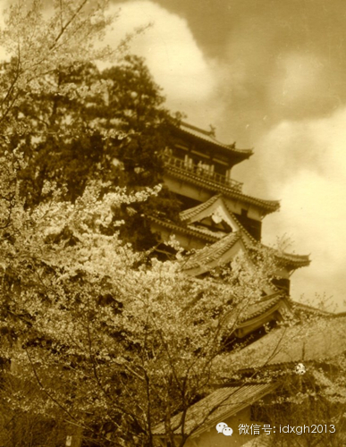
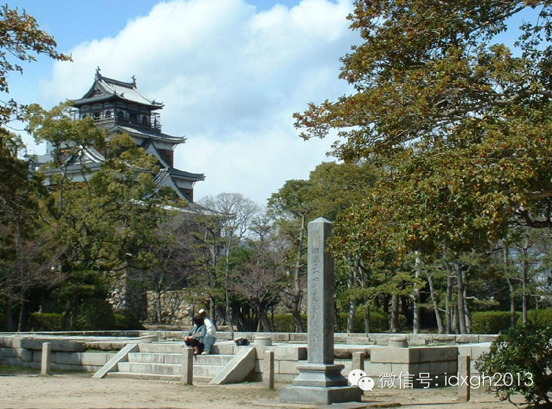
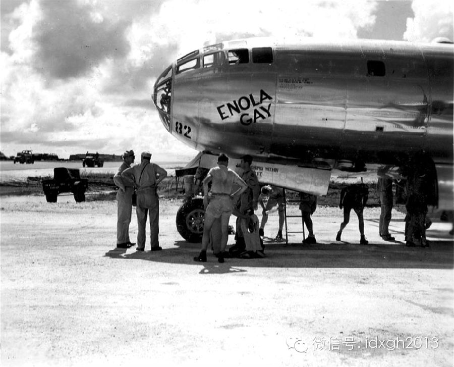
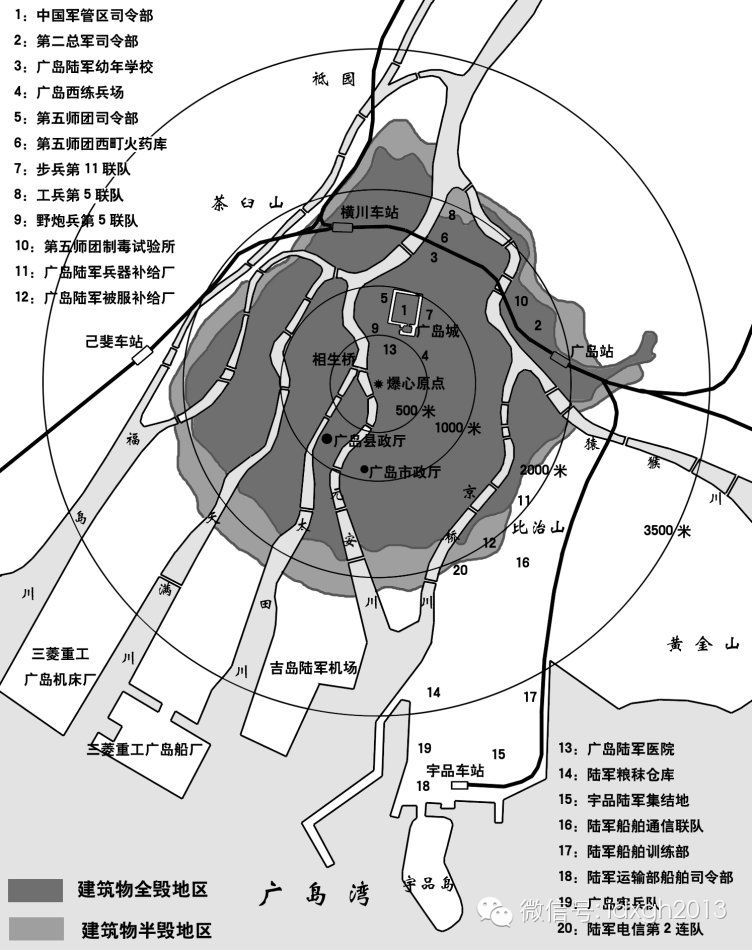

**广岛和长崎本来不必成为原子弹轰炸的目标，多重原因叠加，让它们最终不幸被选中。如果历史能够重演，受攻击的很有可能是小仓和京都。 **

  

文/阎京生

  

1945年8月9日，第二颗原子弹在长崎爆炸。此前三天，广岛爆炸了人类历史上第一颗实战原子弹。

  

相比东京、京都、横滨等城市，无论人口、规模、军事、经济，广岛和长崎都远不能与其比较。为什么美军会选择这两座城市作为目标？他们的依据又是什么？

  

**【难产的名单】**

**  
**

1945年4月，为了确定轰炸的城市，美国“曼哈顿工程”的负责人与陆军航空兵的专家组成目标选定委员会，要从日本城市中挑出4座，2座为首要轰炸目标，2座作为备选
。

  

最初的候选名单由美国陆军航空兵战略航空参谋长诺斯塔德准将（Lauris Norstad）开列，
17个日本城市依次为：东京、川崎、横滨、名古屋、京都、大阪、神户、广岛、吴、下关、山口、八幡、小仓、熊本、福冈、长崎、佐世保。

  

从军队的角度来说，目标重要性越高，震慑效果越好。但这是人类第一次原子弹实战，遴选的标准要综合文物保护、科研、战后管理等因素，尤其是对原子弹现实破坏性的测量。

  

因此，城市当时被破坏的程度至关重要，程度越小，越可以准确评估原子弹的威力。其次，投放城市不能太大，也不能太小，最好将破坏控制在一定范围，更方便美军专家事后评
判其威力。这样，东京、大阪、名古屋这几座面积大、同时已破坏严重的城市就剔除了。佐世保、吴等小城市也随后被删除。

  

多方考虑后，5月10日至11日，委员会选定了第一批城市：

  

**1.京都，AA级目标**

**2.广岛，AA级目标**

**3.横滨，A级目标**

**4.小仓，A级目标**

  

京都鹿苑寺金阁

  

这些目标都有共同的特征：

  

**1.**军事、工业潜力高，要么是军备供应和生产中心，要么是重要的指挥部或军队集结地。

**2.**城市直径在4.8km以上。

**3.**地形平坦，爆炸冲击波的效果可以得到充分发挥。

  

左图为名古屋城天守阁，右图为1945年5月14日空袭中其被焚毁的场景

  

战局时刻变化，讨论也更加细致，委员会在5月28日选定了新的目标城市，并与军队协调——投放原子弹之前，禁止对这些城市常规轰炸。这四座城市（按轰炸的优先级排列）
是：

  

**1．京都**，日本的故都，100万人口的巨大工业城市，其他日本城市已严重破坏，大量人口和机器设备都迁往京都，它成为战争后期最重要的军事生产中心。

  

**2．广岛**，日军指挥中枢之一，第二军总区司令部所在地（日本本土只有两个军总区，第一军总区司令部在东京），同时是日本陆军最大的集结地，从中日甲午战争时期开始，参加日俄战争、吞并朝鲜、出兵山东、出兵满洲、侵略中国大陆和东南亚的日军部队绝大多数都在广岛市区的宇品港登船出发，因此这里有规模巨大的军需品、军火仓库、码头设施，此外城东还有铁路中转枢纽和军火制造、船舶维修等重工业设施。

  

**3．小仓**，小仓兵工厂所在地，厂区长达1.3公里，宽0.8公里，附近还有铁路车辆厂、机械工厂和发电厂。

  

**4．新泻**，濒临日本海的重要工业城市，拥有一座炼铝厂、一座巨大的钢铁工厂、一个重要的炼油厂和一个油港码头。

  

广岛城天守阁，1945年原子弹爆炸中被冲击波吹垮

  

广岛大本营遗址

  

但是“曼哈顿工程”负责人格罗夫斯把这份名单提交给马歇尔时，遭到了陆军部长亨利**史汀生的反对。史汀生在20世纪初担任菲律宾总督，期间多次造访京都，对这座优雅
而美丽的千年古城感情很深，京都传统而悠久的文化给他留下了深刻印象。史汀生称，京都对日本人有巨大的感情价值和宗教意义，如果将其毁灭，将给战后管理带来很大的困难
。

  

格罗夫斯显然不接受这个理由。他反驳道，京都市区里有264公顷已查明的和195公顷待查明的工业区，正在生产机床、精密机械、飞机零件，以及无线电和火控仪器，是最
有价值、最重大的军事目标。但史汀生坚持己见，并向马歇尔力陈不可轰炸京都的文化、政治理由。

  

马歇尔实际认为是否轰炸京都无关紧要，在他的计划中，即使不用原子弹，几个月后也得用燃烧弹和高爆弹轰炸。无奈的史汀生找到了杜鲁门总统，劝说他将京都从名单中划掉，
并继续禁止对其常规轰炸。杜鲁门同意了。

  

但是，美国军方和科学家仍然坚持京都为首要目标，他们列举了一条十分实际的理由：京都坐落在盆地中，街道都是方形网格状，最适合评估原子弹轰炸效果。7月21日，陆军
部向在波茨坦开会的杜鲁门总统发去电报，请求把京都重新加入轰炸名单，结果被拒绝。

  

7月24日，作为京都的替代品，长崎被列入原子弹轰炸名单。但是这里地形多山，并不能很好地测试原子弹的效果，所以，1945年7月25日，杜鲁门最终下达对日进行原
子弹轰炸的指令时，目标城市的优先级为：广岛、小仓、新泻、长崎。

  

**【广岛上空的蘑菇云】**

**  
**

8月6日，美军对广岛进行了第一次原子弹轰炸。7时50分，美机编队在四国岛室户岬上空飞入日本领空，23分钟后从东北方向进入广岛市区上空。8时12分17秒，原子
弹载机“恩诺拉**盖伊”号机长蒂贝茨通知机组人员戴上护目镜。8时13分47秒，投弹手法雷比少校开始用诺顿瞄准镜搜索目视轰炸目标——太田川和元安川分流处T字形
的相生桥。

  

广岛原子弹载机“恩诺拉**盖伊”

  

广岛原子弹“小男孩”

  

8时15分17秒，“恩诺拉**盖伊”号炸弹舱门打开，原子弹“小男孩”从9600米的高空中笔直地落了下去，仅仅比预期时间晚了17秒。8时16分整，“小男孩”内
的气压引爆器发出脉冲信号，引爆雷管，将重约25公斤的铀块“子弹”迅速射入35公斤重的铀块“靶心”里，两块铀235合而为一，“小男孩”爆炸了。爆心投影点在相生
桥以东约100米的细工町19番地岛病院上空。据1969年的综合评价，爆炸高度为（580士15）米。  

  

广岛原子弹爆炸地图

  

1944年日本人口普查时，广岛市区人口为343034人，此后进行了5次大规模疏散。按照日本政府的估计，8月6日当天广岛市内的市民人口约为28万到29万人，一
部分市民于前一日或该日清晨去乡下购物、工作或看望亲属，另有约1万名“国民义勇队”从乡下进城协助拆除房屋。

  

此外广岛市内约有3到5万名朝鲜劳工和侨民，37名伪满、汪伪和伪蒙疆政府选派的中国留学生，9名来自马来亚、菲律宾、印尼、缅甸的留学生，以及约3200名美籍日本
人和10多名德国、白俄侨民。在因岛、向岛两处战俘营内还有一批盟军战俘（其中约10人死于原子弹轰炸）。

  

广岛是日本第二大军事指挥中枢，8月6日当天，市内的第二集团军人数为23158人，另有约2万名新应征的军人经广岛中转前往外地。

  

原子弹爆炸前的广岛城（中国军区司令部）

  

原子弹爆炸后的广岛城

  

受伤的广岛警察为市民填写空袭受灾证明，凭证明可领救济券

  

**【不幸的长崎】**

  

8月9日，美军准备对第二目标小仓投弹，并将长崎作为备选。但小仓的天气十分不利，装有原子弹的轰炸机“博克之车”在云层上空穿梭了3次仍未找到缺口，最后向第二目标
长崎飞去。

  

此时长崎上空的云层也很厚，云量达8/10，“博克之车”第一次通过时未能找到目视投弹目标。按照规定，机长斯韦尼在这种情况下应带弹返回，但他和机组成员商量后决定
采用雷达轰炸。

  

“博克之车”在箕岛上空调头，携带空头测量仪器的“伟大艺人”号紧随其后，两机从西南方向进入长崎上空，向预定爆心——三菱重工长崎船厂方向飞去。投弹手比汉（Ker
mit Beahan）正准备换用雷达瞄准器，突然发现两块云团之间有个大缝隙，第二投弹点三菱重工长崎兵工厂清晰可见，于是立即通知斯韦尼进行目视轰炸。

  

长崎原子弹载机“博克之车”

  

在提尼安岛组装完毕的长崎原子弹“胖子”

  

10时58分，比汉瞄准了预定轰炸目标——三菱重工长崎船厂以北2.5公里的长崎市中心体育场跑道，扔下了原子弹“胖子”。根据美国陆军测量部L902地图，爆心投影
点在浦上天主教堂附近，松山町交叉点中心东南约90米，东经129°°51′56″4，北纬32°°46′12″6的位置（即长崎和平公园原子弹爆心投影点纪念碑处）
。

  

“胖子”爆炸的准确高度有几种说法：1945年调查为（490士25）米，1966年为（500士9）米，1969年为（504士10米）。1976年综合分析的结论
为（503士10）米，这是最可靠的资料。

  

爆炸的时间也有几种推断：长崎气象站的自动记录显示上午10点54分时气压有剧烈振动，事后查明这个记录器的时间不准确，后修正为11点05分。距离长崎38公里的云
仙岳气象站于上午11点02分、距离70公里的佐贺气象站于上午11点07分也均记录有气压震动，最后确认长崎的爆炸时间为上午11点02分。

  

爆炸中心浦上地区是天主教徒集中地，2万名天主教徒中1.5万被炸死。长崎市民总计有19748人在爆炸一周内死亡，
1951年美日调查团统计的死亡人数在29570人到39214人之间。

  

不过，长崎的日军死亡并不多，甚至少于各国侨民。驻长崎的军人包括第122混成绿团和第134高射炮团，约有9000人，只有约150人死亡。市内1.2万名朝鲜劳工
和侨民中死亡约1500到2000人，600多名华侨中约200人遇难，此外长崎各工厂煤矿中的中国劳工也有约400人遇难，其中40多人是关在浦上监狱里被炸死的。

  

**【第三颗原子弹？】**

  

两颗原子弹轰炸后，日本极度担心第三颗原子弹投放。长崎受袭后，日本方面已经得知新泻将成为下一座目标城市。8月11日，新泻县对新泻市市民发出“原爆疏散”的命令，
大多数市民逃往城外，整个新泻成为一座空城。

  

但是8月14日，即日本投降前一天，执行原子弹投放任务的第509大队飞机在日本投下了7枚外形、重量与原子弹相似的“南瓜”炸弹，飞行路线是先经过京都市上空，然后
在爱知县境内投弹，目标是名古屋兵工厂。所以一些日本历史学家推测第三颗原子弹的目标很可能是京都。

  

模拟训练用的“南瓜”炸弹

  

但实际上“南瓜”是训练用炸弹，与原子弹轰炸目标无关。第509大队的飞行员在7月20日起就开始对日本城市投掷“南瓜”，以获得足够的经验。

  

8月15日，日本无条件投降，人类历史上唯一一次原子弹实战也就宣告结束，满目疮痍的广岛、不幸被轰炸的长崎成为日本永恒的伤痛。

  

> 版权声明：  

> 大象公会所有文章均为原创，版权归大象公会所有。如希望转载，请事前联系我们： bd@idaxiang.org

大象公会：知识、见识、见闻

微信：idxgh2013

微博：@大象公会

投稿：letters@idaxiang.org

商务合作：bd@idaxiang.org

举报

[阅读原文](http://mp.weixin.qq.com/s?__biz=MjM5NzQwNjcyMQ==&mid=204150665&idx=1&sn
=0f11ea70d5b488da6b2c70eb8a41e76e&scene=0#rd)

