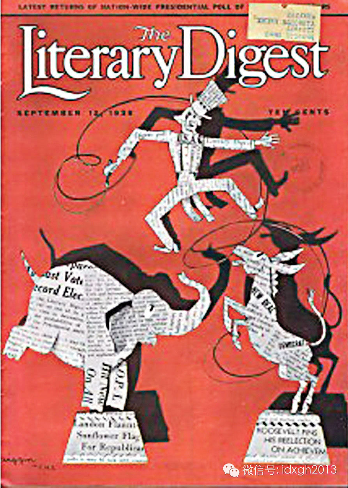
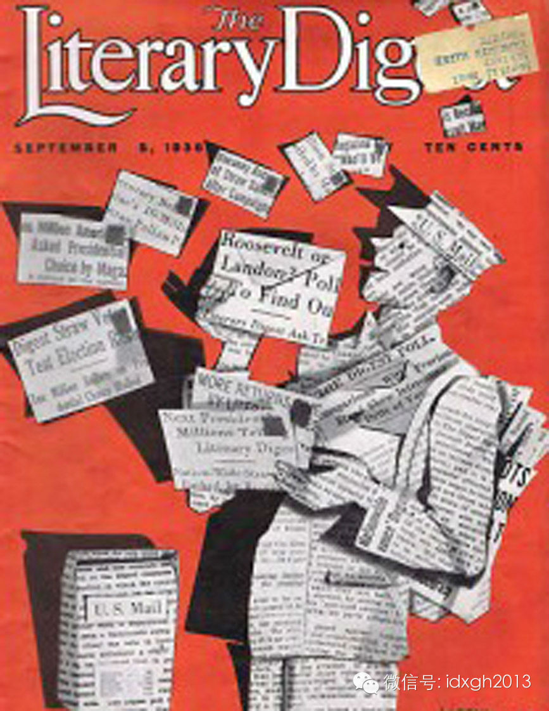

**苏格兰独立公投的结果能被准确预测吗？没有一家机构敢于给出准确答案。为什么联系更便捷的今天，民意调查者反而不如一个世纪前自信？**

  

文/hitay

  

苏格兰独立公投的结果即将出来，但直到今天，没有一家机构给出明确的预测：与以往西方政治报道的习惯相比，有点反常。

  

如果这是一场大选，早就会有民调机构做出精确到十分位的结果预测。一般大选预测都会给出上下0.5个百分点的误差区间，如果两位候选人在民调中的差距在1个百分点之内
，人们会说“结果太近，无法判断”，但4至5个百分点的民调差距，几乎已经判了其中一位的政治死刑。

  

苏格兰独立公投

  

而这一次，BBC、《卫报》等媒体的专栏作家以及各种政治分析师却都表示：“民调的结果太接近了而无法判断”。虽然各方民调显示，公投前一周，反对独立的一方领先4至
5个百分点。

  

为什么会有这种差别？

  

负责任的分析师会告诉你，大选是固定周期举行的常规事件，分析员们有的是机会根据历次大选的结果，调整他们的模型。而公投的周期和规则都不固定，选民的行为也无法预测
。

  

其实不必如此自责，从源头来说，预测投票结果就是一件拼概率的事。

  

谁最先发明了民意调查？

  

并不是大学教授或者专业媒体，而是纽约的广告商。20世纪初，麦迪逊大道的广告商们为了忽悠广告主，拼凑了各种毫无方法论可言的调查结果，来宣传其广告的神奇效果。很
不幸，广告代理往往紧贴着另一项影响力巨大的行业——媒体，很快这些方法便被同一办公楼里的记者们采用，新的报道形式诞生了。

  

初期，这些粗糙的方法效果不错。1920年起，美国《文学文摘》杂志向他的读者附送民意调查表格，来收回做数据分析。从最初的数十万份调查结果开始，它成功预测了19
20年的哈定、1924年的柯立芝、1928年的胡佛，还有1932年的罗斯福。

  

《文学文摘》认为，样本越大，结果越有说服力。1936年大选前，他们寄出了多达1000万份调查表，回收230万份。这占到了当时美国全国选民人数的1/10。《文
学文摘》宣布统计结果：130万人支持兰登VS97万人支持罗斯福。自然，兰登将以3:2的比率获得胜利。

  

《文学文摘》1936美国大选议题

  

总统民意调查

  

时任美国民主党全国委员会主席的詹姆士**法利评论说：“任何理智的人都无法逃避文学文摘通过如此庞大的抽样所得出的结论，我认为，这是人们希望这个国家的政府发生变
化的完整证据。”

  

所以，美国第33任总统叫兰登？

  

当然不是。1936年大选的结果是：罗斯福赢得了60%的选票，美国总统选举历史上最大的胜利之一。

  

另一项事实更令人惊讶。一家名为盖洛普的不知名公司，只对1000人进行了调查，就获得了远比《文学文摘》100万人更精确的大选预测。从此之后，盖洛普扶摇直上，逐
渐成为全球第一的民意调查公司。

  

盖洛普凭什么能战胜《文学文摘》？

  

其实，盖洛普的武器很简单——取样。根据中心极限定理，一个取样良好的1000人的样本在预测数千万人的群体时，远比回复率仅23%的大样本精确。回复率如此之低，又
没经过仔细的取样分析，哪怕只预测2000万人的群体，也可能出现非常严重问题。

  

简单来说，中心极限定理是说，对于一个数量庞大的群体，我们可以通过观察随机抽取的一个小样本的特征，就能大致判断出整体的特征，并确定正确率有多大。

  

这里的关键词是“随机”。如果说，运用中心极限定理计算的置信区间，抽样数等指标，是现代民意调查和大选预测的科学内核，那么抽样就是最接近艺术的部分。

  

这让民调脱离了最初混乱的方法论。经过几十年的发展，20世纪80年代，民意调查界已经总结出了一系列非常完整的抽样模型。

  

大致分为三类：①分层抽样；②概率比率规模抽样（PPS）；③（往往是）两者混合。

  

不过，只靠随刊附赠的回寄卡片肯定不能实现精确调查（您想拥有23%的回复率吗？）。民调的后期发展，要感谢固定电话的普及。

  

普及率的提高增加了取样的范围，1980年代，美国的电话普及率已在99%以上，覆盖几乎更个阶层。

  

同时，固定电话是一系列有规律的数字，这十分方便抽样。具体方法是：先抽取一些电话局区号和局号，再在这些区号和局号内随机抽取电话号码。尽量说服人们回答问题以保证
回复率，然后根据上次大选的选民构成，对抽样结果的数据进行加权。最终得到结果。

  

由于电话的覆盖率和地理属性，这套体制运转良好。全国性、地区性选举都能用。人们不断改进抽样方法，也使得民意调查的结果越来越精确。此后，预测大选几乎变成了一个数
学问题：如何抽样？如何赋权？如何计算置信区间？投票似乎都可以取消——交给盖洛普打电话就完了嘛。

  

但到了21世纪，社会正在变得越来越复杂，沟通渠道也越来越多，人群与人群之间行为的差异也越来越大。预测大选变得越来越难。

  

首先是移动电话的崛起，越来越多的人开始只采用移动电话，完全不安装固定电话。相比固定电话，移动电话号码不规律，而且更私人——人们接到移动电话上的调查，更不愿意
合作。这就拉低了回复率，并且增加说服成本。

  

回复率越低，样本的代表性越可疑，这说明样本只描述了“那些愿意回答问题的人”的意见，而非真正的全体意见。另一方面，一个长期持有纽约州移动电话的美国人，可能居住
生活在加州，他的电话访问结果，对纽约州参议员选举毫无意义，他可能注册成了加州选民。

  

之后，博客、论坛和有线电视网等“小众传媒”的崛起，使得人群变得更为分散。一个来自大都市的黑人和一个美国小镇的白人青年，可能拥有完全相同的政治观点，因为他们都
是同一个政治博客的忠实读者。

  

这使得抽样变得更加困难，人们的社交生活和人际关系网络很大程度上决定着人们的政治观点，而在互联网时代以前，社交生活和人际网络都受到地域的制约。而现在，因为互联
网，一切都变得更加困难。

  

于是，近年来抽样方法变得更像一门艺术，甚至是巫术。2012年美国总统大选，一家新成立的民调公司PPP异军突起，击败几乎所有对手，成为预测最精准的民调机构之一
。

  

而他们之所以比其他人更精准，是基于一个假设：他们认为，2012年，黑人、西班牙裔和妇女的投票率，会和2008年一样高。因此，他们的抽样是基于这个假设来设计的
。

  

**这个结果揭示着两个问题：**  

  

**1.**民调公司要先预测不同人群选民的投票率，以此确定抽样方法，但这种预测本身就可能是“跳大神”的结果。至少，风头很盛的PPP投票率假设没有任何实证研究支撑，完全由首席分析师根据阅读新闻和以往经验得出。

  

**2.**“跳大神”的结果很可能比实证的研究更精确，因为，若用更多的民调来计算投票率，将为整个系统引入更多的误差。复杂系统里，一个微小的误差扰动，都可能因此结果的巨大差异。

  

随着通信更加方便，传统权威机构的结果质量不断下降。提供民调结果的创业公司越来越多，到了这一步，大选预测也越来越像股价和天气预测了。

  

2008年，一个叫做Nate Silver的哥们终于把在股价和天气预测中经常使用的一个工具，引入了大选预测。这就是回归分析。

  

纳特**西尔弗（Nate Silver），美国统计学家和作家

  

Nate Silver自己并不做民调，他只是分析其他公司的历史民调结果，他的假设是，各种公司的民调方法都会系统性的扭曲代表性，他只需要通过回归分析，识别出这
种系统性扭曲，再通过加权平均的办法，对最新的民调数据进行加工。

  

作为一名统计学家，Nate Silver还引入了其他外部变量来对统计数据进行加工，大到GDP、失业率，小到各个选区不同党派的选民注册数量等。

  

他赖以为生的工具，就是回归分析。

  

Nate Silver和他创立的538公司（美国选举人团总票数），在2008年和2012年的大选中都表现优异，以至于当他预测2012年大选中，奥巴马在一些关
键州将胜出的消息传出后，共和党大佬和评论家们公开抨击他试图影响选举结果。

  

当然，因为选举预测的公司越来越多，一些奇异的现象也会产生，比如根据别人调整自己的数据。今年，又是美国的中期选举，一家名为Mitchell Research的
民调机构公开承认，当他们在预测了密歇根州的参议员选举结果之后，发现其调查结果和全国大多数民调机构差别很大，因此，他们重新做了一次调查，再发布了一个和主流相比
更靠谱的结果。

  

这种方法，已经类似于韩兰成和周德江同志的相声了：播音员把头伸出窗外，抬头看看天气，然后发布天气预报。不过，根据芝加哥大学的一份匿名调查，绝大多数经济学家在发
布宏观经济数据预测的时候，最重要的信息来源是“其他同行的预测”。所以，谁说这不可以呢？

  

  

> 版权声明：  

> 大象公会所有文章均为原创，版权归大象公会所有。如希望转载，请事前联系我们： bd@idaxiang.org

大象公会：知识、见识、见闻

微信：idxgh2013

微博：@大象公会

投稿：letters@idaxiang.org

商务合作：bd@idaxiang.org

举报

[阅读原文](http://mp.weixin.qq.com/s?__biz=MjM5NzQwNjcyMQ==&mid=205301073&idx=1&sn
=387765ce033eea7b5912629a2a8e1f80&scene=0#rd)

