**《亮剑》中，山本特战部队一改“鬼子”愚蠢的形象——制服整齐，身手矫捷，德制MP38冲锋枪更是令人印象深刻。冲锋枪自此成为各路神剧日军特战队的标配。可惜，这都是现代编剧的想象，二战时日军几乎不用冲锋枪。**  

  

文/思明州

  

虽然惜败给李云龙，《亮剑》中的山本特战队仍凭借时髦的外形，受到部分观众喜爱。一些编剧受此影响，大范围复制这一模板，一定程度上固化了现代观众对特战队的想象。

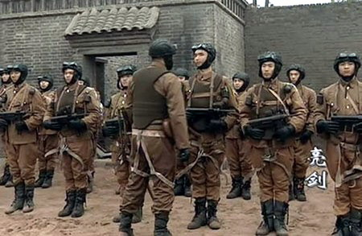

**《亮剑》中的山本特战部队**

  

这是真实的情况吗？

  

显然不是。二战中国战场，日军确实组织了很多类似特种部队的挺进队，但他们大多相当土气：穿着中国军服，扛着单发步枪和轻机枪。

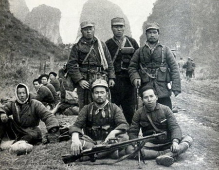

**抗战期间在中国战场上真实的日本特战部队—挺进队。他们全部打扮成中国军人的模样，并且使用中国武器**

  

这种土气很容易理解：伪装向来是偷袭和渗透的关键，鲜亮的山本部队若想斩获国军或八路军的指挥所，几乎一定会被提前发现。

  

也许编剧们会辩解，二战日本空挺队就配备冲锋枪。是，这确实是少有配备冲锋枪的日军部队。但首先，空挺队除了冲锋枪，主要用步机枪和迫击炮，其次日本空挺队的主要任务
是空降到美军机场，炸毁飞机，与作战陆军、挺进队完全不同。

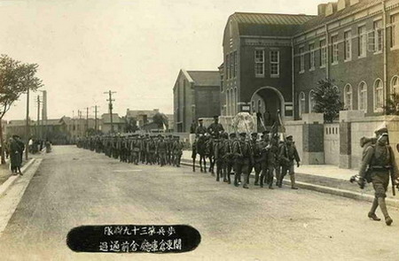

**驻大连日军整队出城训练**

  

此外，在某些情况下部分日军的驾驶员和工兵会配备冲锋枪，比如814淞沪会战。但日军非战斗部队也同时受过全套步兵训练，所以大部分仍用步枪、短步枪，反而是训练不同
的日本海军比较喜欢冲锋枪。

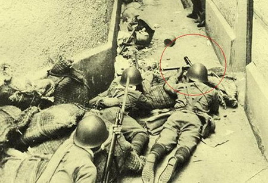

**在淞沪会战中，一支日军小分队在使用冲锋枪进行巷战**

  

可以说，日军主力部队几乎不使用冲锋枪（《亮剑》中的德制MP38的道具其实是美国的M3冲锋枪），即使有，也是给非战斗部队或部分海军，堪称军中精英的特战队更不会
配备。

  

为什么会这样？

  

网络上有各种说法：战术思想严重落后；日本岛国，资源少，制造不起；工业能力落后等等。

  

但真实的答案相当简单——**不需要**。

  

和中国观众的印象相反，冲锋枪并不是什么高级货。它其实是一种发射手枪子弹的轻型自动枪械，发明之初，是为了辅助阵地战，扫清战壕附近的敌人。

  

中国观众常将冲锋枪和自动步枪弄混，典型的就是称AK-47为冲锋枪。但它其实属于突击步枪（自动步枪），使用中间型威力枪弹，火力猛，射程远，可以连续发射。

  

这几项特点冲锋枪并不具备，主要由其弹药决定：所有冲锋枪都打手枪子弹，而突击步枪则使用步枪子弹与中间型威力枪弹。

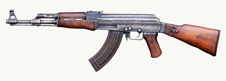

**AK-47突击步枪**

  

所以，一般情况下，定位于近距离自卫武器的冲锋枪就不可能被用为主战武器。

  

比如野战中，攻防机枪500米左右就已经开火，步枪200-300米距离也可以开火，而冲锋枪实际有效射程只有50米，精确射程则更短。

  

二战时代，步枪子弹口径较大或长径比大，同时枪管很长，步兵实际开火距离远超现代战争。同时，训练有素的步枪手，100米距离几乎百发百中，若加强训练的精锐部队，2
00-300米卧射也几乎弹无虚发。所以野战中持冲锋枪进攻，进入有效射程前就几乎会被步机枪点射干净。

  

至于防御战，进攻者多数会使用机枪压制，同时，会辅以优秀步枪射手狙杀，掩护冲锋的步兵。

  

若是防御方持冲锋枪，由于反制能力差，只能等待对方到有效射程30-50米范围，即使侥幸挨到，被贴近到如此地步，在战术上也就等同于失败了。

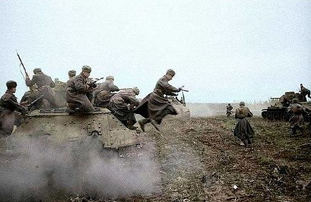

**只有步枪手才能在远距离有效驱散掩护坦克的步兵，而冲锋枪手则做不到这一点**

  

同样道理，步兵反坦克作战，冲锋枪手等到有效射击时，几乎对坦克束手无策，也难以掩护携带炸药包、燃烧瓶、火箭筒的反坦克兵。

  

即使进入近距离，比如城市巷战，也主要拼训练程度，冲锋枪并不占优。城市战中并不只等同于距离近，它更像是多种距离的复杂体——楼顶数百米的狙击，角落里对100米外
的瞄准，几十米巷战的正面相接，室内几米距离的贴身战都有，综合来看，冲锋枪并不优于带刺刀的步枪。

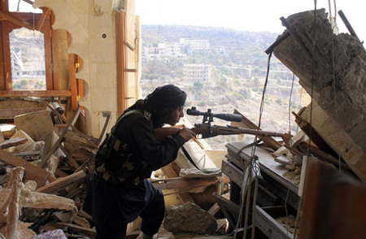

**叙利亚反对派使用老式莫辛纳干步枪狙杀远处的敌人**

  

日本陆军自然熟悉冲锋枪的优缺点。相较而言，步枪符合二战时日军积极进攻，多线作战的特征。

  

无论中国大陆的野战攻防，南洋的山地丛林战，太平洋岛礁的防御战，日军都是在异国他乡，人数上以少打多会是战场常态。

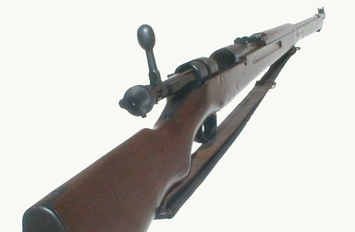

**日本三八式步枪**

  

为抵消人数劣势，日军的办法是制造远距离开火机会，尽量避免近距离接触。于是，300米距离就可以瞄准，且射击精度很高的三八式步枪成为日本基层步兵的核心枪械。这种
战术，冲锋枪肯定无法胜任。

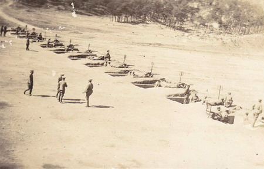

**冲锋枪手如果冲击步枪手阵地，在100-300米距离就会遭到无法忍受的伤亡。而冲锋枪对于在上百米外卧姿射击的步枪手则没有办法压制。图为日军在进行卧姿射击训练**

  

那么，冲锋枪就一无是处了吗？

  

也不是。至少，由于制作简单、门槛较低，可以在短时间内大量生产，而且训练简单，受到不少国家亲睐。

  

典型例子就是苏联。二战初期，德军就全歼了苏联正规军，苏联只能大批征召毫无经验的平民。战况紧急时，只经过1-2周训练便发上战场，根本无法练熟步枪，简单的冲锋枪
练两天基本能使用，非常节约时间。

  

同时，东线的核心是坦克战，而坦克的主要敌人之一是火箭筒手，二战德军的铁拳火箭弹（战争中总共消耗了500万发）一般最大射程只有30米。当时苏军步兵主要坐在坦克
外壳上，用冲锋枪扫射打击潜伏的德军火箭筒手非常合适。

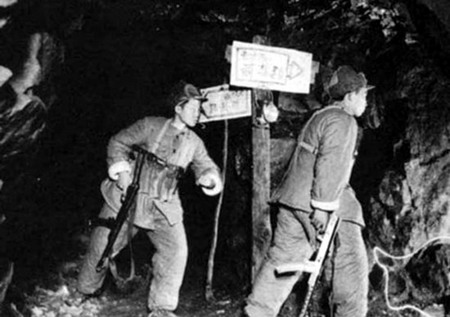

**志愿军喜欢冲锋枪是因为到了朝鲜战争相持阶段，战斗主要形式就变成了阵线相对固定的堑壕战和坑道战。在黑暗的坑道里冲锋枪是一种非常不错的武器**

  

而一些特殊战斗形式也适合冲锋枪。朝鲜战争进入相持阶段后，主要为阵线相对固定的堑壕战和坑道战。在狭小近距离的坑道洞穴中，冲锋枪连发速射的作用就显示出来了。

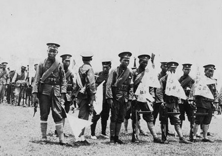

**一支装备着冲锋枪的军阀部队**

  

无论任何战斗形式都装备冲锋枪的军队，几乎都不是专业军队，如中国1920-1930年代的红军和各路军阀。前者多是未经严格训练的征召农民，后者则以雇佣的兵油子为
主。

  

大量装备冲锋枪的苏军与日军的战斗，也从侧面展示了冲锋枪的局限性。

  

最典型的是1938年的张鼓峰战役，此役，日军以1个师团对抗苏军3个步兵师，1个机械化旅，苏军还有大量空军和炮兵配合轰炸和炮击。战后统计，日苏被双方子弹杀伤比
为323：869，交换比1：2.7，被弹片杀伤的日军572人，苏军1498人，交换比为1：2.6，被刺刀杀伤的日军4人，苏军110人，交换比1：28。

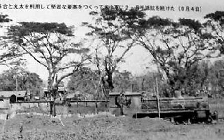

**100多日军躲在几节火车皮里，依靠步枪点射，打垮了3000美军特战部队**

  

美军也曾被此困扰。缅甸的密支那火车站，没有重火力支持的美军麦瑞尔支队攻击日军据守的5个火车头和1个车厢。这是一支由罗斯福和丘吉尔在1943年魁北克会议上特别
批准的突击队，虽为团级，其指挥官确是准将。

  

但在日军三八式步枪准确的射击下，美军屡攻不下，3000多士兵有2800人被迫撤出战斗，其中1200多人因步枪造成的心理压力，战役后被送往医院，包括连支队长官
。据说日军才轻伤3人。

  

最终，战斗只能由国民党军队接管，凭借人海和疲劳战术，硬推过去才打下来。

  

其实，美军战斗部队也很少装备冲锋枪。海军陆战队，装甲师或者步兵师，往往1个师仅配几十把。但瓜岛战役时很多美军士兵忍不住扔掉冲锋枪——因为冲锋枪的小子弹在热带
丛林中几乎无效。

  

美式冲锋枪与日式步枪的对决还在后期的东北战场上演过。共产党的四野多次与装备冲锋枪和卡宾枪的国军近距离搏斗，最大的一次，共军的辽南独立师刀挑了国军1000多人
。四野老兵曾回忆，他们在手榴弹掩护下，挺着刺刀冲进敌阵时，新1军的冲锋枪手都拦不住。

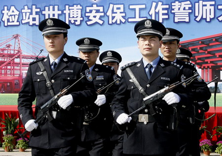

**现在的冲锋枪主要装备警察。警匪枪战多是十几米距离，足以压制手枪，同时附加伤害小，适合和平时期的警方**

  

冲锋枪在二战和朝战之后就基本被正规军队淘汰了，如今只有少数特种兵装备。当然，这并不代表冲锋枪多么先进——特战部队还装配弓弩。只是特战部队任务类型多，冲锋枪是
其武器一种。

  

日军当然比抗战剧的编剧懂得这些，他们不会带着冲锋枪、制服光鲜的去渗透中国军队的司令部，就像他们不会被人随便手撕一样。

  

**版权声明**

****大象公会所有文章均为原创，****  

****版权归大象公会所有。如希望转载，****

****请事前联系我们：****

bd@idaxiang.org

****知识 | 见识 | 见闻****

阅读

__ 举报

[阅读原文](http://mp.weixin.qq.com/s?__biz=MjM5NzQwNjcyMQ==&mid=206979675&idx=1&sn
=3cd427f2f80b9fb0a4631f1705108692&scene=0#rd)

