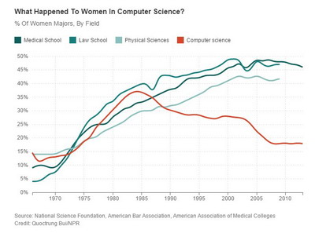
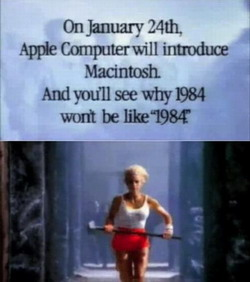
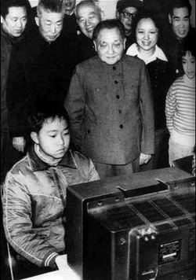
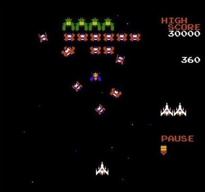
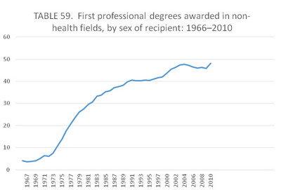

**多数码农（程序员）为男性，人们通常解释为：编程需要数理等逻辑思维，感性的女人天生不适合。但计算机发展初期，女程序员占绝大多数，占行业统治地位。为什么会这样？**

  

文/Hitay

  

提起程序员，人们通常会想到一群不修边幅的男子，顶着奇厚的镜片，在屏幕前面无表情的工作——似乎是一个专属男性的行业。

  

一群女程序员聚在一起？这让人无法想象。但美剧《曼哈顿计划》就有这一场景：男主角弗兰克第一次抵达核试验场地，他的上司指着一群年轻姑娘们，对他说：”Come，M
eet the computers!（来，见见这些程序员！）”

**美剧《曼哈顿计划》**

  

但在当时，这是极普遍的现象，甚至“程序员”一词都带有性别色彩——二战结束以前，Computer是指办公室里操作手摇式机械计算器的姑娘们。

  

这一定程度上是20世纪初第一波女权运动争取的结果：西方社会终于能够接受女性在办公室工作。不过，男性仍然强势，仍占据着重要的管理岗位，只有地位相对较低、看似繁
琐无趣的Computer等角色留给了女性。

  

直到1950年代，欧美大学数学系毕业的女性最理想的工作都只是当一名Computer——毕竟能够进入办公室了。更多的Computer为高中毕业，或者接受的职业
教育（vocal training）。正是这些女性Computer，占据了第一代“码农”的主体。著名的Elsie Shutt就是其中之一。

**Elsie Shutt**

  

Shutt毕业于哈佛大学数学系，成绩十分优秀，获得过富布赖特学者奖学金——美国政府设立的对年轻学者最高的表彰。不过，1940年代的数学界还是男人的世界，哈佛
等学校甚至数学课采用男女分班，连助教都有区分——女助教只能教女班。

  

因此，Shutt毕业后无法继续从事研究，只好和当时其他的优秀女性一样，在雷锡恩公司做一份Computer的工作。

  

当时的雷锡恩公司正在为美军研发新一代雷达，需要大量的计算，因此装备了ENIAC的第二代产品——ORDAC，基本操作和ENIAC一样，区别仅在于编程时不必手工
修改电路连接。

  

Shutt在这个岗位表现出色。50年后，因为在ORDAC的优异工作，获得了ENIAC 50年纪念徽章。

  

但Shutt的著名还不是因为她是第一批女“码农”，而是另外一项男人没有做到的事情——组织了可能是美国历史上第一家软件公司。

  

某种程度上，这与当时的女性工作环境有关：上升空间有限，还要承担家庭责任。Shutt一直从事编程工作，但她结婚后，不得不离开岗位回家。

  

1950年代的计算机，还没有软件甚至操作系统概念。程序员都直接用010010的机器码和硬件对话，因此，码农们多数是驻场IT。Shutt却与众不同，回家后，她
接受了老板的提议，在家继续写程序。她干得不错，于是工作越来越多，以至于不得不联络以前的老同事们，一群为了带孩子离开工作的女性Computer，一起写程序。最
后，为了更好地组织，Shutt开了一家公司，如此崭新的商业模式令人眼前一亮，她也登上了《商务周刊》的封面。

  

女程序员们看起来干的不错。但奇怪的是，这些优秀的女性并没有把衣钵传承下去，现在男性甚至占据了程序员的绝大多数。这种趋势是什么时候开始的？

**1965年以来，美国女性在一些传统男性占优的领域里获得专业学位的比率图**

**其中红色为计算机科学**

  

从教育学位的获取中，我们或许能有一个直观的判断。在美国，1965年后法律、医学、物理学等此前男性主导的多个学科，女性获学位的比率都在不断上升。大多数学科的趋
势在1984年后仍旧延续，只有计算机科学（红色线）例外——1984年后，女性计算机科学学位获得者突然下降，并持续走低。

  

1984年？这一年发生了什么？难道美国女性突然失去了对计算机的兴趣吗？

  

很遗憾，虽然很多社会科学家关注这一现象，仍未产生共识性的解释。不过，一些因素是大家都认可的，比如1984年前后计算机的普及。

  

1980年代以前，计算机主要是生产工具，普通人不可能买一台价值百万美元的IBM
System360。因此，计算机科学和其他工科一样，是脱离于日常生活的专业技能，基本只有进入大学的相关专业才有接触。

  

1980年代后，个人计算机普及，美国中产阶级家庭也开始能够买得起。但当时的计算机远不如现在发达，尤其是个人计算机，对民众来说功能有限：文字处理类功能早有传统
的打字机可替代，互联网远未民用。

**1984年，苹果公司发布Maciontosh，这个著名的苹果1984广告，标志着个人计算机的普及**

  

那它能做什么？

  

娱乐。更准确的说是打游戏。这是专业人士以外，第一代个人计算机的最主要功能。尤其是打打杀杀的半军事类电子游戏。

  

当时，科幻文化在美国如日中天，《星际迷航》、《星球大战》、《回到未来》成为一代人的经典。它们天马行空的想象，非常适合开发为电子游戏：反正谁都没见过宇宙飞船长
什么样，随便画几个三角形就可以代表。同时，宇宙是黑的，很适合当时黑色的电脑屏幕。

**邓小平1984年视察小朋友用电脑：这是一台接在电视屏幕上的APPLE II，基本上除了玩游戏也做不了什么太实际的工作**

  

受此影响，许多大男孩爱上了家庭中的电脑，为了玩当时流行的科幻类游戏。1980年代这群玩着电子游戏长大的男生们忽然发现，在大学的计算机系，他们有着比女性同伴们
好太多的计算机基础。

  

这会让很多女性觉得压力太大而选择放弃这门课程：和中国不同，美国的大学生们进入大学以后才决定专业，很多人在第一、第二年都会尝试各种课程，如果一个从没玩过电子游
戏，没尝试过自己编程的女性，在大学里和一堆从小玩着APPLE II的BASIC语言（早期很多电子游戏直接以BASIC语言的形式分发，甚至有计算机杂志一行一行
打出贪吃蛇之类游戏的BASIC代码，让读者们自己输入电脑，运行游戏）长大的男同学们一起上课，难免感觉压力太大。

  

这是一种对个人电脑普及初期男性程序员增多的解释。1990年后，个人电脑进一步普及，功能逐步增加，许多适合女性的功能也可以开发。这一时期女性获得计算机科学学位
仍旧下降。这又是为什么呢？

  

许多社会科学家将目光投向了另一种解释：Nerd文化。

  

这是发生在美国社会的特殊现象。传统上，美国社会的主流价值欣赏品学兼优，又擅长体育、社交的男性。他们高中时代是是查尔斯河上的划艇运动员，是爱荷华农田里的橄榄球
队队长，未来是美军上校，IBM蓝血精英和华尔街投行家。

  

但这让另一些男性受到了冷落——那些瘦弱、矮小、貌不惊人的男生。这些Nerd往往不被主流认可，但计算机时代的到来，使得Nerd们扬眉吐气：通过比尔盖茨，扎克伯
格这些IT精英们，人们发现，原来高中时代那些躲在角落里，带着厚眼镜，腼腆不说话的“盖茨”们，居然能通过看似呆滞的计算机工作，改变世界，积累起惊人财富。

  

1980年代，Nerd文化逐步成型，其标志性电影“The Revenge of a Nerd（Nerd的复仇）”、“War
Games”等，都在这一时期推出。他们重复强调同一个主题：貌不惊人的高中男生，通过玩计算机，不仅干掉了学校的霸凌（Bully），还拯救了世界，再抱得校花归。

**记得小蜜蜂吗？这个任天堂FC上的经典游戏，其实是复刻的人类最早的电子游戏：星际大战**

  

这种文化从最初被视为弱者的Nerd的美国男性，逐步扩展到世界其他国家的青少年中（其实印度、中国的理工男在西方社会的整体形象，就是标准的Nerd）。好在今天N
erd们已彻底咸鱼翻身，《生活大爆炸》和《社交网络》大热让Nerd们扬眉吐气。这种文化之下，编程，仿佛是传统文化中的美式橄榄球，成为的男性骄傲的标志——前者
代表着巴顿式和华尔街式的领导力男孩，后者代表着比尔盖茨和穆斯克式的腼腆但却能改变世界男孩。

  

当然，这只是一种解释，并没有让所有人信服。更多的人似乎相信，是因为数学原因，女性退出了这一领域——计算机科学越来越依赖高深的数学，越来越依赖严密的逻辑，而“
感性”的女人因此被认为不能胜任。

  

不过，根据美国国家统计局的数据，1967年以后美国女性获得非医学领域的科学学位比率呈清晰的上涨趋势，直到接近50%，部分学科还超过了男性。

**美国女性获得非医学领域的科学学位比率**

**（数据来源：美国统计局 制图 hitay）**

  

了解美国大学学习压力的人会明白，几乎所有的科学学位，对数学的要求都不会太低。如果女性真的无法胜任，那么这些学历几乎不可能拿到。

  

无论是什么原因，今天程序员这个群体悄然成为外界刻板印象最强烈的人群，以至于在中国，一谈到宅男屌丝、直男癌，人们首先想起的就是程序员，能拯救这个职业整体形象的
，只有更多的女程序员了。

  

**版权声明**

****大象公会所有文章均为原创，****  

****版权归大象公会所有。如希望转载，****

****请事前联系我们：****

bd@idaxiang.org

****知识 | 见识 | 见闻****

阅读

__ 举报

[阅读原文](http://mp.weixin.qq.com/s?__biz=MjM5NzQwNjcyMQ==&mid=207252497&idx=1&sn
=a4328198b2b4dc1bdc5bcca4bac1b11e&scene=0#rd)

