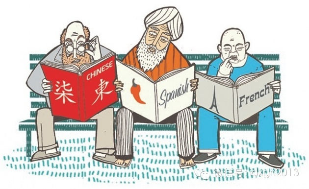
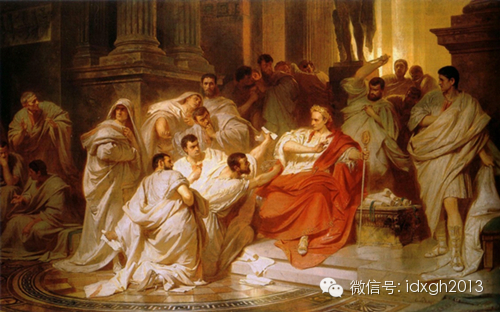
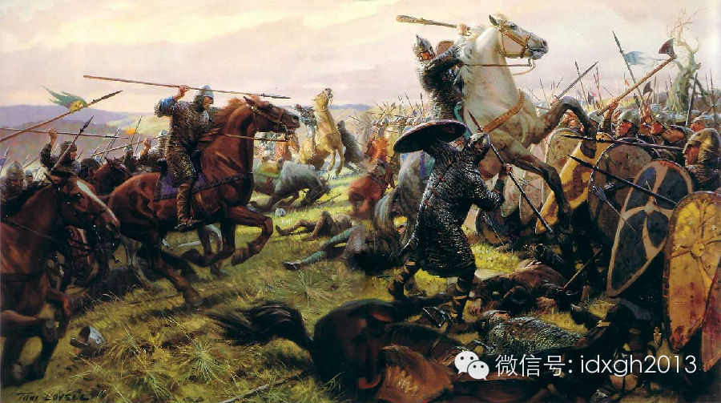
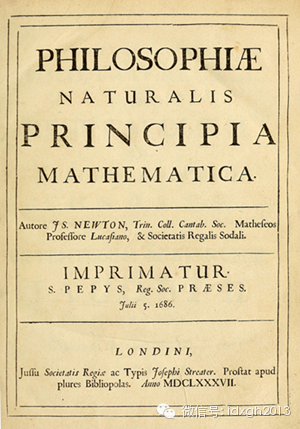
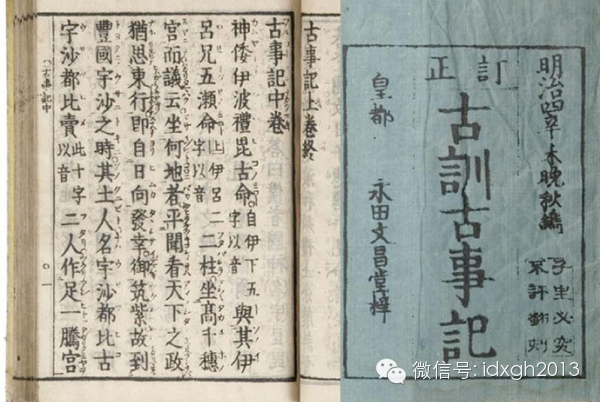
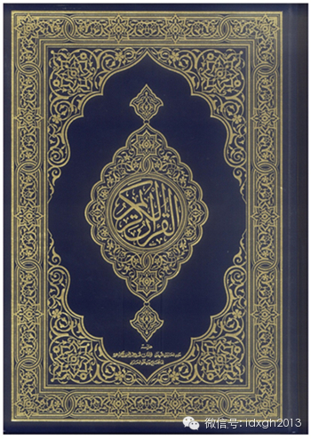
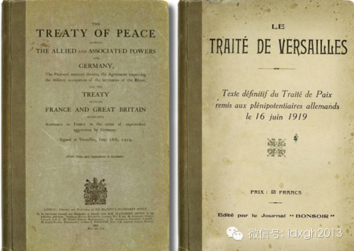
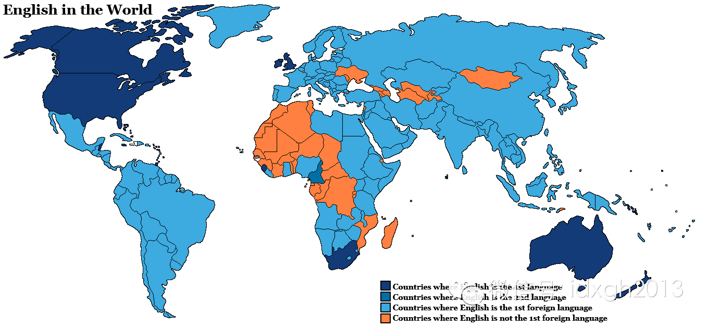

****

**牛顿的《自然哲学的数学原理》初版用拉丁文而不是英文写成，凯撒大帝死前最后一句话用的希腊文“Kaὶ σὺ τέκνον ？”他们为什么选择这些外语呢？**

  

文/刘大可

  

英语应退出高考吗？有观点认为：低阶层家庭可减少教育支出，高阶层人能节省时间成本——如果英语足够小众，再学习西班牙语、法语的必要性就会降低。另一种说法更为“正
确”：为维系汉语纯洁性，不应在义务教育中考核英语。  

  

外语的选择是否能如此简单决定呢？

**  
**

**【征服者的语言】**  

  

是否选用一种语言，最重要的影响因素是权力，这集中表现为对征服者语言的学习。从古典时代的罗马帝国与拉丁语，到近现代的英美霸权与英语，都清晰体现了这一点。

  

从公元前5世纪初开始，罗马帝国征服了地中海沿岸所有文明，他们的部落语言拉丁语就以征服者的姿态成为了地中海世界法律、行政、军事、文书上的通用语言。尤其在帝国西
部，拉丁语到5世纪就已经成为了最广泛使用的语言，原先的凯尔特语被视为下层的方言。

  

但在曾经受希腊文明浸染的帝国东部，拉安丁语的推广并不顺利。早在罗马帝国之前，亚历山大大帝的赫赫武功将希腊语塑造为地中海东部的上层语言。古埃及法老王室用的都是
希腊语，著名的埃及艳后本人就是希腊征服者的后代。连凯撒大帝都用希腊语与她调情，包括他被刺死前最后一句话：“Kaὶ σὺ τέκνον
？”（吾儿，亦有汝焉？）

  

画家皮洛蒂1865年油画《恺撒之死》，恺撒对着布鲁图斯惊呼：“吾儿，亦有汝焉？”

  

即使被罗马帝国征服后，地中海东部仍以希腊语为尊。除文化上的深厚基础，东部丰饶的物产也是希腊语抵御拉丁语攻势的力量所在。因此，此时成书的《圣经**新约全书》用
希腊语写成，并非拉丁语或希伯来文。

  

然而世界上没有永恒的霸主，随着罗马帝国解体，日耳曼的蛮族入侵，拉丁语在不列颠群岛的统治地位遂被打断，英语就开始形成了。

  

大不列颠岛南部是罗马帝国最北方的边疆，统治十分薄弱，最先受到日耳曼族群中盎格鲁、萨克逊等部落侵占。今日英国人被称为盎格鲁—萨克逊人即源于此，现代英语中一半词
根都来自这两部落的日耳曼方言。

  

8世纪的欧洲迎来“维京时代”，丹麦人横扫了英格兰，还曾短暂地将英格兰纳入版图，于是北欧的诺斯语也进入古英语的上层语言。讲述北欧英雄事迹的英文史诗《贝奥武甫》
就在此时形成。Take、same、hit、bag、leg、sky、they等2000余现代英语词汇都来源于诺斯语。

  

1066年，诺曼底公爵威廉征服了英格兰，建立了一个讲法语的诺曼王朝，于是数千法语词汇进入英语。现代英语中，动物和动物的肉往往是两个不同的单词，比如cow和b
eef，pig和pork，就反映了征服者的角色——动物由本土英国人饲养，词源来自日耳曼语，而肉要奉献给讲法语的贵族，故词源是法语和拉丁语。

  

Tom Lovell所绘《黑斯廷斯战役》，诺曼人征服中的决定性战役——当时英国人不懂骑马打仗吃了大亏，如今的“骑兵”一词“Cavalry”就在这场战争之后经
宫廷从法语进入了英语

  

**【有教养的书面语】**

  

征服者固然能决定上层的流行趋势，科学、文学方面的学者更在乎语言的规范、准确。拉丁语就是此语言之一。它脱离口语，异常稳定，词义不发生漂变。

  

在罗马帝国兴盛之前，西欧有学识者就认识到了拉丁语作为书面语言的好处。

  

公元前1世纪到公元后2世纪被称为拉丁语文学史上的黄金时代和白银时代，《高卢战记》《论共和国》《名人传》《变形记》《诗艺》等军事、政治、历史、文学著作直到今天
都被视为经典，拉丁语成长为堪与希腊语媲美的文学、诗歌的语言。同时，因为语法和词汇统一，它打破了时空的阻隔，也巩固了上层阶级之间的联系，为后来的罗马帝国提供了
支持。

  

此后的西欧，拉丁语一直是学者撰写专著的首选用语。波兰的哥白尼、法国的笛卡尔、英国的培根、德国的高斯、荷兰的斯宾诺莎、瑞士的欧拉、瑞典的林奈……都用拉丁语写下
了改变世界的著作，自然包括牛顿那本《自然哲学的数学原理》，在初版40多年后，它才被译为英文。

  

今日，罗马帝国的权力褪去后，拉丁语仍然以标准命名语出现在天文、气象、生物、地质等学科中，被视作整个科学界的上层语言。凯尔特语、诺斯语等相对口语化的语言就没有
这般长寿。

  

《自然哲学的数学原理》拉丁语首版，值得一提的是，此书全凭哈雷彗星的发现者爱德蒙**哈雷提供了出版费才得以问世

  

东亚文明中，汉语的文言文因同样的稳定性，造就了深远影响，包括没有直接占领过的日本。

  

文言文本是秦汉口语，经过不断的规范化成为标准书面语，此后两千多年的时间里都保持了极高的稳定性，东亚多数外围国家受此影响。5世纪左右，文言文传到了尚无书写系统
的日本。日本最早的史书《古事记》，就由汉语文言文写就，加入了区分日语语序的标记。这种写法被称为“漢文”，一直到19世纪都是日本男人最正式的书写方式，今天仍然
是日本学校教育中的一项内容。

  

明治时代修订的《古事记》，正文全用汉语文言写成。今日看来，中国人要比日本人更容易读懂它

  

但“漢文”这种“文言二途”的书写系统，毕竟属于外来语言，没有相当的培训，很难为普通民众掌握，于是逐渐出现了“假名”。今天日语最常用的平假名，早先是女人用来写
抒情诗、写歌词用的，11世纪初的《源氏物语》通篇都是平假名，当时地位很低。假名的使用规范明治时期才制定出来，和“漢文”一起构成标准书面语。

  

《源氏物语》流行后，在12世纪的绘本手卷中，草书演变成的平假名看上去像道士的符。当时女人写假名，男人用汉字，形成了两种性别、两种文字的格局

  

今天的日本语言学者认为，汉字融入日语和诺尔曼人征服不列颠群岛并将法语带入英语的影响一样重大。《诸桥大汉和辞典》是最大的日本汉字字典，共记载近5万汉字，不过在
战后的现代日文中，常用的汉字大约只有两千多。能在书写中使用多少汉字是日文水准的重要指标，这与英语母语者故意使用拉丁语或法语的单词，以标识上流地位的做法十分类
似。

  

**【信仰的载体】**

  

一种语言被塑造为宗教用语，那么它的影响力也会随宗教的扩张而增加。拉丁语之于基督教就是如此。

  

罗马帝国灭亡后，基督教会将拉丁语作为宗教制度的重要保证。礼拜、传道、唱诗，都使用拉丁语，《圣经》选用圣哲罗姆的《拉丁通俗译本》，僧侣最重要的工作之一就是用拉
丁语抄写圣经。中世纪时，研习拉丁语经典是神学的头等工作，经院哲学就在这一过程中被建立起来。

  

2009年动画电影《凯尔经的秘密》全片围绕右侧这本泥金手抄本的绘制历史展开，这本手抄本是爱尔兰的顶级国宝，代表着凯尔特人海岛艺术的巅峰——注意封面是字母“χ
ρι”的艺术体，乃是希腊语“基督”的头三个字母，当时的爱尔兰修士是西欧少数懂希腊语的群体

  

与此同时，东罗马帝国完全沉浸在希腊文明的余晖之中，希腊语不但是日常用语，更是学术、行政、宗教的标准语，自然也被东罗马帝国奉为正宗的东正教用语。

  

斯拉夫人的一支南下后，便受影响皈依了东正教，将希腊语作为宗教语言。中世纪的希腊语之于斯拉夫人，如同拉丁语之于日耳曼人，今天多数斯拉夫语言都在使用西里尔字母，
比如俄语字母，就是9世纪时为了传教方便，用希腊字母改编而成的。在东正教的影响下，这些希腊文的后裔们成为东欧的标准语言。

  

圣西里尔和圣美多德拿着西里尔字母表，这对同胞兄弟都是东正教传教士，他们根据希腊字母发明了一套字母用来向斯拉夫人传教，是今天俄语、乌克兰语等书写系统的前身

  

公元7世纪后，阿拉伯人在地中海周围建立了一个久违的大帝国，留下了一个延续至今的伊斯兰世界。

  

相比基督教，伊斯兰教在语言上更加较真，穆斯林认为《古兰经》本身就是奇迹，《古兰经》的经文不应该以别的语文来呈现，所以无论穆斯林母语是什么，都要先学阿拉伯语才
能阅读《古兰经》。在北非地区，阿拉伯语驱逐了原有的语言，成为所有人的书面语乃至口语，最古老的埃及也放弃了埃及语和希腊语。

  

不过，阿拉伯字母没有元音，在漫长的扩张过程中，无法保证它的规范性。当代阿拉伯语许多方言已经无法在读写上沟通了。

  

沙特阿拉伯出版的《古兰经》，注意中央的阿拉伯语书法被称为“太斯米”，意思是“奉至仁至慈真主之名”，伊斯兰社区都能看到

  

**【新力量的投射】**

  

拉丁语、希腊语、阿拉伯语和汉语，对古代世界有着深刻影响，但当今世界的语言格局却更属于那些新崛起的力量。

  

先崛起的语言是法语。17世纪法国成为欧洲大陆最强大的力量，同时也是欧洲的文化霸主。建筑、绘画、戏剧、歌剧，乃至金迷纸醉的宫廷生活令各国艳羡，古典主义文学也席
卷了各国文坛。

  

经过18世纪的启蒙运动， 19世纪的浪漫主义大潮，法语作为欧洲各国宫廷语言和外交语言长达300年，直到1919年才失势——当年第一次世界大战结束，《凡尔赛和
约》签署时同时使用了法语版和英语版，这被认为是英语的国际影响力超越法语的转折点。

  

1919年《凡尔赛和约》的英语版和法语版

  

20世纪初，英语已经是使用国家最多的官方语言，尤其是一战结束时，美国成为世界第一大经济体，英美两个超级大国的接力，使英语词汇大量流入各种语言，甚至替代了某些
语言中的原有词汇，以显示说话者的层次。

  

英语在当今世界的分布情况，深蓝色国家以英语为母语，蓝色国家以英语为第二语言，浅蓝色国家以英语为最常用的外语

  

素以稳定著称的汉语也受到这一趋势影响。像“你们店里有没有‘Wifi’？”这类英文单词直接嵌入汉语的情形，已颇似日语假名里夹着汉字——这被许多人看成汉语的危机
。

  

除了简单的嵌入，英语的语词构造方式也深入到现代汉语。比如现在银行常用的“按揭”，其实就是汉语的“抵押”，由“按金”的前一半“按”，和英文“mortgage”
的后一半读音“揭”杂交而成；再比如“杯葛”这个看上去文绉绉的词，实际上是英语“Boycott”（抵制）一词的音译。

  

而“这是不对的”“他的识别度很高”之类看上去纯然汉语的表述，其实是英语语法配汉字，真正的汉语会直接说“这不对”和“他很好认”。

  

与学者们对汉语纯洁性的关心相比，家长的选择更为实际。中国一二线城市如此之多的双语学校、双语夏令营，以及有钱人不遗余力地在子女的英语教育上大笔投资——它们显然
超出了普通考试的需求——都说明了一个最简单的道理：英语的掌握程度，在中国显然是标定一个人未来发展空间和社会地位的重要工具。

  

上图是上海的双语幼儿园，下图是内陆小城镇的考生，他们都在学习英语，但这显然不是一场公平的竞争

  

某种程度上，如何让中国人不分地区、贫富、阶层，能够更平等地接受英语教育，平等与世界对话，或许远比设法维护汉语纯洁更为重要——若将英语从高考统考中赶出去，它当
然会变成一种更多依赖家庭投资的学习，最终将使得较为贫困家庭的子女丧失成为未来社会精英的机会。这种对外语的不选择，在全球化的今天将决定一代人的命运。

  

> 版权声明：  
大象公会所有文章均为原创，版权归大象公会所有。如希望转载，请事前联系我们： bd@idaxiang.org

大象公会：知识、见识、见闻

微信：idxgh2013

微博：@大象公会

投稿：letters@idaxiang.org

商务合作：bd@idaxiang.org

[阅读原文](http://mp.weixin.qq.com/s?__biz=MjM5NzQwNjcyMQ==&mid=203531431&idx=1&sn
=1dfce3d90fd73b7ea009aff0261780d8&scene=0#rd)

