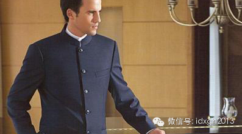

**习近平出席荷兰王室晚宴的着装，并非中山装，而是一种与西方正式场合礼仪要求对接的大礼服，而中山装更非源自日本学生装，它由西式军装而中国民族装，有一条奇异的意识形态推进路程。**

  

文/潘游

  

3月22日，国家主席习近平携夫人彭丽媛，在阿姆斯特丹王宫出席了王室安排的晚宴。见到图片或视频新闻报道后，也许是国人已习惯领导人在外事场合身着西装领带，故颇觉
惊讶，有人因此分析道：国家主席身着“中山装”体现了文化自信。

   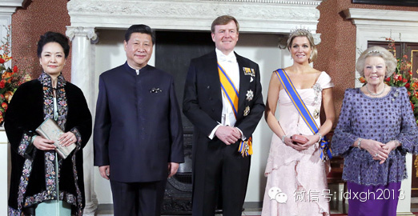

此说不确。其实，习近平的新式服装与中山装差异不小。按众多中山装起源说法中的一种，它更像中山装的母版——“企领文装”。

  

“企领文装”流行于民国初年的南洋华侨社会中，“企”在其中取站立之意，而企领的英文翻译为“Mandarin
collar”，再音译回来则是：满大人领。所谓满大人领，即为满族服饰中的立领领口特点，满族的立领和汉族传统的交领截然不同。

  

这种中山装起源论大抵是：某洋服店资深裁缝黄隆生，在孙中山的指示下以“企领文装”上衣为基础，在企领上加一条反领，构成了“立式翻领”，以代替西服套装中的衬衫硬领
效果；同时又将上衣的三个暗兜改为四个明兜，且口袋被裁制成可以随放进物品多少而涨缩的“琴袋”式样。于是，有了后世的中山装。

  

按这样的叙述，习的服装，由于不再有紧闭的翻领，还能露出一点点白色衬衣；且四个兜改回三个兜，左胸衣兜露出黑底白斑点丝巾，下方的两个口袋改为暗兜，看上去不再像补
丁，所以从整体上看更加类似母版“企领文装”。

  

**【涉外新式大礼服】**

  

“新式服装显示文化自信”的分析是一种过分解读。在荷兰国王威廉-亚历山大一世邀请的晚间国宴上，选择这种衣着其实是我朝礼制愈发完备的表现。

  

最正式的晚宴或其他宴会，在英文中有一个有趣的代称：“White Tie
Party”，直接翻译过来是“白色领结宴会”。这也好理解——白色领结最能代表最正式场合中的部分衣着要求。

  

国宴在宴会的逼格划分中，自然是皇冠上的明珠。其要求相当细致：晚礼服的上装须为黑色，上装的前摆要齐腰剪平，后摆则较长，成燕尾状。所以人们也一般称之为燕尾服。上
装外侧还要佩戴各种勋章和奖章，以示荣耀。上装内则要配置白马甲，浆硬白衬衫、以及白领结。下身则着镶有两道丝带的黑裤，系黑条纹皮带。

  

如果这些描述缺乏画面感的话，看一下图中荷兰国王的衣着吧，规范得挑不出任何问题。

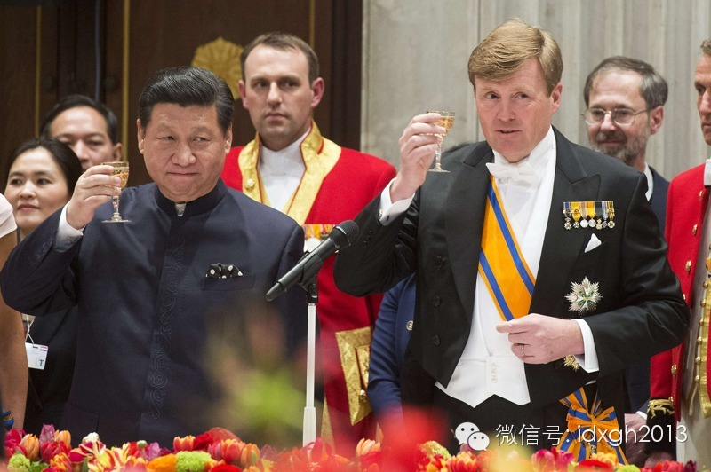

  

19世纪末期到20世纪20-30年代，White Tie Party盛极一时，上流社会的贵族们高度依赖这样的聚会来扩展自己的朋友圈。时至今日，White
Tie Party可能不再那么频繁，但我们依然能在重要的外事场合看到类似的图像资料。

  

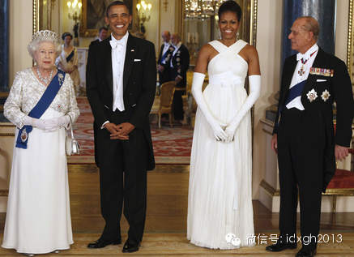

_2011年5月24日，出访英国的美国总统奥巴马及其夫人，在英方举办的晚宴上宾主双方（奥巴马总统和女王的丈夫菲利普亲王）均身着晚礼服。_

  

通常，高级且正式的晚宴准备时间较长。组织发起的一方要确定宴会的主题、时间、地点、与会人员等，之后将这些信息体现在精美的实体邀请函上。邀请函上照例会有着装要求
，如果没有按照要求赴宴，显然非常不礼貌。

  

1959年9月，苏联领导人赫鲁晓夫访美。出席美方正式宴会时，没有身着晚礼服，而是简单的普通深色西装和浅色领带一穿了事，令东道主颇感不爽。此后，苏联大使为赫鲁
晓夫访美举行答谢宴会，上次没有得到对等“礼待”的艾森豪威尔总统也做出了降级，改穿晚间非正式活动时所需的小礼服，但赫鲁晓夫仍以一袭普通西装回应，再次挫败了美帝
国主义者的险恶用心。

  

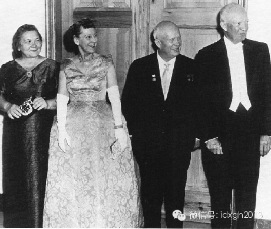

_美苏两国最高领导人及其夫人的合影。图中艾森豪威尔（右一）身着小礼服。小礼服的上装与普通西装类似，但左右两襟为黑缎，此外配马甲，白衬衫，领口为不浆软领_

  

赫鲁晓夫的衣着在资本主义世界看来，自然是不讲礼貌；但社会主义阵营也确有政治忌讳——哪个社会主义国家的总书记、党主席穿过燕尾服？那东西也太“资本主义”了。

  

中国与之类似。改革开放前，中山装是外事场合的不二之选。1971年，乔冠华率团出席联合国大会前，周恩来还亲自交待：“在出席正式会议的时候，中国代表要穿中山装，
不要穿西服。你们可是代表中国啊。”后来最高领导人华国锋在参加铁托葬礼时，亦是以黑色毛呢料中山装亮相。

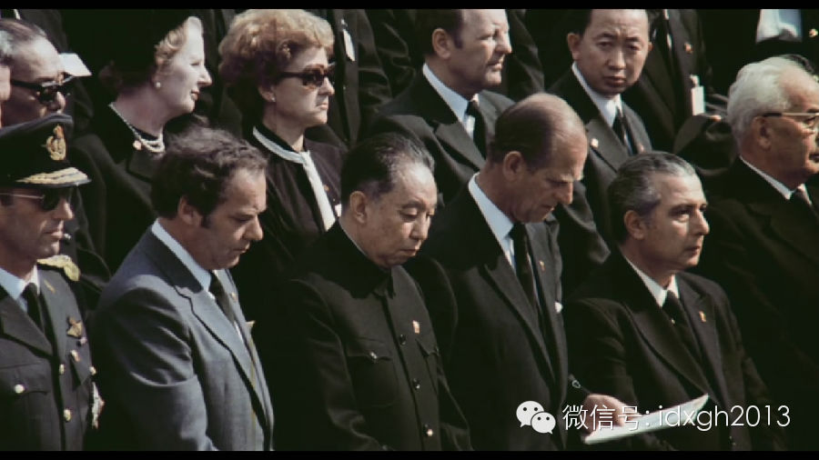

_因铁托去世时值五月，天气略热。闭合立领的毛料中山装相当不舒适，华国锋不得不多次用手拭去两鬓及额头的汗水_

  

广义来讲，西服是“西方服装体系”的简称；而我们日常理解、使用的是狭义的“西服”，英语词汇为suit。自80年代初胡耀邦第一次身着suit亮相后，俗称为“西服
”的上下同色同面料套装，成为立志改革的中国政治人物的标配。所以，无论是出访还是在中国驻外大使向驻在国元首递交国书，深色西服套装占据了绝大部分比例。

  

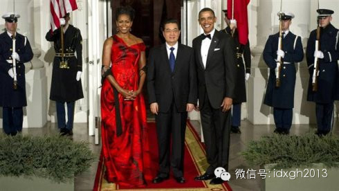

_胡锦涛访美时，奥巴马身着小礼服，胡锦涛身着普通西服_

  

可以称得上例外的是2008年4月22日，时任中国驻法国大使孔泉抵达爱丽舍宫，向萨科奇递交国书。当时有分析人士指出，此前的314事件和奥运火炬传递时的风波，是
孔泉大使穿着强调中国特点乃至民族主义气质的中山装的原因。（见下图）

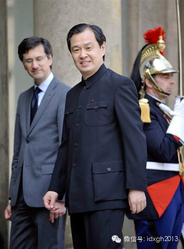

  

正是因为参加重大国事活动时，如何选择得体的服饰是一大难题。从2008年起，在西方文化中淫浸多年、获得英国太平绅士头衔的政协委员刘长乐提案建议道：

  

“按照西方传统礼仪，出席这些正式礼仪活动，嘉宾应着晚礼服（如男士着燕尾服、系领结等），但这些服装确与我国服饰穿着习惯和审美标准不相适应，目前我国领导人多以穿
着西装出席，似有不尊重对方之嫌……因此建议今后中国领导人出席外国正式礼仪活动中，可穿着设计精美、质地考究的中式礼服，这不仅可以避免失礼，并可展现我国家领导人
的魅力和风采，更是弘扬了中国传统文化。”

  

六年后习主席访问荷兰的装扮，可视为这种有所追求的体现。

  

**【内外有别】**

  

中国的大礼服其实早有定例。在非涉外的极隆重场合下，最高领导人所穿的中山装，不仅前后两个三十年互不否定，且与前朝一脉相承。

  

文章开头介绍到的那种中山装起源论，与“中山装日本学生服起源论”等说法同样不靠谱。中山装与其诞生时代的部分欧美军装，几乎没有任何差异——如果不算肩章、领章和腰
带的话，哪怕是被解读为东方特色的立式翻领，也是奉行“拿来主义”的结果。

  

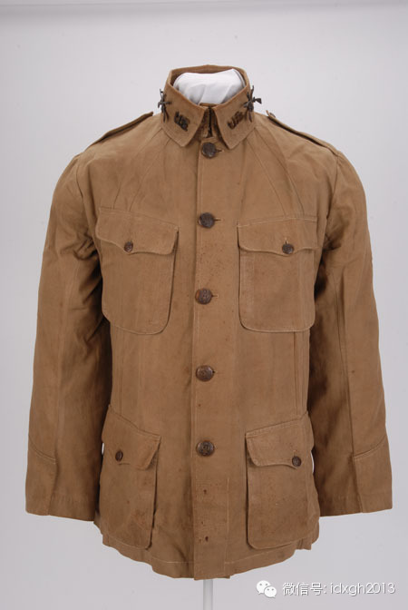

_此图为美国陆军第七步兵团A连士兵1907年配发的卡其布军装。这种高度近似中山装的军装从1904年一直装备到了1910年。撤装时大清朝还没有灭亡。有趣的是，
该军装恰好有五枚纽扣。而在国民党徒为中山装附会的极多政治含义中，五枚纽扣代表着“国父”的五权分立思想或五族共和理念。  
_

  

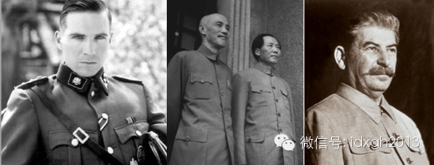

_左图是《辛德勒的名单》中的剧照，拉尔夫**费因斯饰演的德国纳粹党党卫队军官，其制服上，立式翻领，风纪扣样样俱在。_

_中图为重庆谈判中毛蒋二人的合影。中山装在中国的大礼服地位一脉相承。_  

_右图为斯大林身着类似制服，中山装在三十年代的全球主要媒体上被称为“斯大林装”；后来毛泽东成为了世界共产主义运动中的新星，服装就被六七十年代的媒体称为“毛装
”，现在看来，无产阶级的革命事业将由朝鲜继续进行下去，所以未来中山装可能被称为“金装”。_

  

中山装的起源发展究竟为何并不重要；而同样款式的服装，纳粹军官穿起来英气勃发、社会主义国家领导人却臃肿土气老掉牙，原因也仅仅是身材差异和缺乏其他装饰物点缀。

  

真正有趣的问题是：中山装是如何在中国推广的，以及流行时间极久现象背后的原因。这一切都要从鲍罗廷对国民党的改造说起。

  

当国民党被改造成一个列宁主义原则的政党时，它急需将自己不同于北洋及地方政治力量的特质展现出来。一切能承载并展示其特质、意识形态口号、提法的外在符号——无论是
旗帜、发式、还是服装——都被赋予了政治含义。

  

保罗**康纳顿在其社会学名著《社会如何记忆》中写道：“服装作为物化的人与场合的主要坐标，成为文化范畴及其关系的复杂图式；代码看一眼就能解码，因为它在无意识层
面上发生作用，观念被嵌入视觉本身。”

  

中山装既是工作时的职业装，又是休闲时的便装，也是典礼时的礼服，更是革命军军装，平民实用风格契合国民党的左派基因；除了五枚纽扣的政治含义外，四个口袋则象征来自
儒家传统的礼义廉耻；三粒袖扣表达着“三民主义”。附会（或者说将政治含义编码到服装中）只是第一步，只有国家权力才能将符号贯彻到社会的各个角落，通过长期宣传灌输
，让人们记住服装背后的“人造记忆”，进而认同服装代表的政治倾向。

  

虽然1927年之后的南京国民政府，在各种指标上都算不得一流的极权政权，但在其能掌握的省份、大城市，身着毛呢料中山装的国民党大员，毫无疑问是中央意志的化身。在
下级公务员群体和教育系统中，面料较次的中山装也被定为统一制服。国民党的中山装推广，确实是中国历史上的第一遭。

  

然而，人民并不总是驯服。如果人们觉得一个身材尚可的男子，穿着中山装也很丑，那多半是因为政治上的偏好。曾有台湾人回忆道：“国府来台接收官员多数穿中山装，当年中
山装的口袋特别大，可以装很多钞票，因此中山袋就成为贪污的代名词。甚至可以说，那时候穿中山装代表统治阶级。”

  

将中山装推广到社会每个角落的政治力量，其组织并未衰颓（两岸都是如此），但中山装上附会的那套政治话语早已过时，社会成员抛弃它的时刻很快就要来到——两岸官场也早
已不将其作为常服——除非它能被赋予新的含义。

  

这个新的含义就是权力，并往往意味着最高的政治地位。国庆当天登上城楼，现任常委身着中山装者仅有总书记一人。同在城楼上若有“撞衫”，那一定是元老。

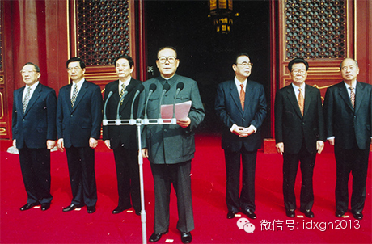

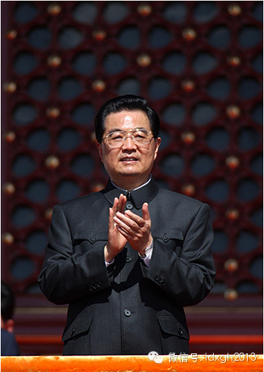 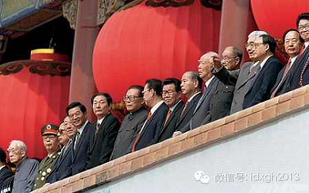

_1999年登上城楼的国家领导人们，身着中山装者从左起分别为：薄一波、江泽民、宋平_

  

即使今天中山装被当作中国民族特色的服装，国家元首身着民族特色的服装也不是在强调文化自信，否则印度、巴基斯坦乃至阿拉伯世界国家元首身着传统色彩更浓厚的服装又该
做何解释？

  

真要找一个刻意在着装上体现文化自信的国家元首，倒也不难找到，光着膀子的普京就是一个。

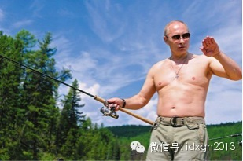

  

[大象公会所有文章均为原创，版权归大象公会所有。如希望转载，请事前联系我们：bd@idaxiang.org ]

———————————————  

**大象公会订阅号的自定义菜单上线了，左边是官网文章精选，右边是大象公会官方微社区，点击进入来吐槽发帖吧！**

  

[阅读原文](http://mp.weixin.qq.com/s?__biz=MjM5NzQwNjcyMQ==&mid=201313392&idx=1&sn
=e20478452695da19b6475f9ed4272b60&scene=1#rd)

