**12月3日下午，马英九宣布辞去国民党主席。党的领袖，不同政党不同时期，称呼五花八门，有主席、总书记、总裁甚至元首，这些称呼有什么讲究吗？**

  

**文/黄章晋 郭子健**

  

政党领袖无论是书记还是主席，通常只是称谓习惯的差别，但有些时候却是例外，而且，选择何种称呼，有时也有历史脉络和规律可寻。政党领袖这个职位，到底有多少种称呼？

  

**【书记与主席的意识形态偏好】**

  

如果将现当代历史上存在过的也统计在内，党的领袖的称呼大约会超过十种之多。

  

今天用于党的领袖最常见的称呼，当然是书记（或称总书记和第一书记）和主席这两种。这两种称呼在多数情况下没有什么区别，但是，在西方国家，一个政党的领袖是叫书记还
是主席，却有一定的习惯规律。

  

主席（Chairman）和书记（Secretary），两者在汉语和英语中的原意都非常相近。主席是指坐在最重要位置的上的那个人，而书记则是指负责文件记录和撰写
的人。两者在原意上的地位等级差别颇大。

  

尽管经引申后，两者都可用来称呼政党领袖，但主席除了政党领袖，还可用于行政和立法机关最高级别的职位，而书记则几乎只用于政党领袖。

  

主席和书记在中英文原意与引申上的微妙差别，恰恰是有些政党习惯使用主席，而有些政党更偏好书记的原因。

  

在西方，称政党领袖为书记的，多为左翼政党，这种共同偏好或许是因为书记这个词，会予人以更平等的意味。最常见的是社会民主党。社会民主党是1889年成立的第二国际
的产物，他们多信奉向“社会民主主义”或“民主社会主义”，但被归入社会民主党的政党，并不一定都叫XX社会民主党，很多时候叫工人党。

  

而西方国家偏右或偏保守派的政党，党的领袖几乎罕有使用书记这个名称的，他们都更习惯用主席这个称呼。在英语国家，甚至主流政党几乎都不会用书记这个称呼。譬如英国工
党，按其政治光谱，它更应该用上书记，但它和保守党一样，并没有发明一个专门用于党魁的称呼，只能用工党领袖这样的词来称呼。

**Keir Hardie，工党创党人之一及其第一位领袖**

  

日本自民党无论是其某些价值光谱，还是其强烈的门阀特征，都显得比西方国家的保守党更保守，其政党领袖的称呼也破能显示这一保守特征：总裁。

  

日本政党从中间到左翼的光谱颇为丰富，它的称谓变化来得也远比西方国家更为多元。日本社会党用的是委员长，公明党用的是党代表，而日本维新党是维新会和连结党2014
年9月21日合并而成，所以，它的领袖干脆就称为共同代表。日本共产党以前用的是典型社会主义特色的总书记，1970年后改为委员长。

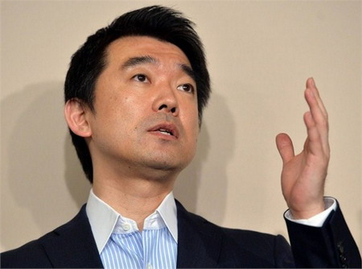

**日本维新党共同代表、大阪市长桥下彻，他曾因公然宣称“慰安妇是战争必需品”而被多国外交部批评为“无耻、恶心之徒”**

  

党的领袖用什么称呼，有些时候的确有鲜明的意识形态或价值观取向。譬如1949年以前中国第三大党中国青年党，其领袖被称为中央执行委员会委员长，1945年该党通过
决议，将其定位由革命政党改为普通政党，党首也由委员长制为主席制。

  

最喜欢使用总书记这个称呼的，当然是被西方称为共产党国家的执政党。而这些国家喜欢使用总书记，却是斯大林留下来的遗产。

  

**【主席与书记的轮回】**

  

在列宁创建布尔什维克时，总书记这个职位完全不是党的最高领袖。而且列宁从创建布尔什维克到他去世，布尔什维克（苏共）并没有一个与特定称呼用来专指党的领袖。

  

十月革命前，列宁获得的党内明确地位，是1917年10月在俄国社会民主工党（布）中央委员会上当选政治局委员，虽然政治局以其为首，但并无明确职位。

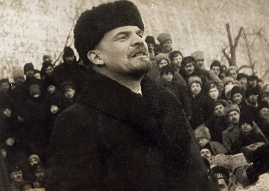

**1917年当选政治局委员的列宁**

  

列宁在夺取政权后，他的职位是苏维埃主席，在列宁时代，苏维埃是集行政、立法、司法于一身的超级权力机构，到了斯大林时代它才变成橡皮图章（**见大象公会《一切权利
归苏维埃》**）。

  

但列宁很早就是布尔什维克无可争议的精神领袖。他的话事权不在于一些临时职位（1905年4月社会民主党大会大会主席、1917年7月布尔什维克第六次代表大会名誉主
席、1921年6月、共产国际第三次代表大会的名誉主席），而在于他的思想他的笔他的嘴——列宁曾主管党的机关报《火星报》、《新生活报》，通过这个平台，左右全党的
意志和观念。

  

斯大林曾在革命前主管过《真理报》，但他既不善于写作，也缺少深邃的思想。他在悄然掌握巨大的权力时，甚至都不是个引人注意的领袖。他的权威来自他对总书记（书记处总
书记当时仅相当于秘书长）这个职位的权力运用。

  

1922年4月斯大林在列宁建议下当选中央总书记——选择斯大林当总书记，是因为此前书记处三位权力相等的书记，在完成列宁赋予的消除党代会或明或暗的反对力量时，权
责不明、互相推诿，而性情粗暴的斯大林很适合这个任务。

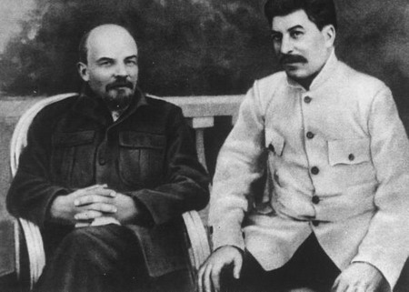

**1922年的列宁和斯大林**

  

此前，斯大林已经承担了分管工农兵检察院（相当于政法委）、组织局（相当于组织部）的工作，擅长琐碎行政事务的斯大林，迅速掌握了党内的实权，基层党政官员全部是他的
人马。

  

不以思想、理论和煽动力见长的斯大林，在列宁去世后，凭借强大的官僚机器迅速战胜了老资格的托洛茨基、季诺维也夫等人。总书记这个职位才成为党的最高领袖的代称。19
52年苏共取消了“总书记”这一称谓，斯大林仍担任书记。

  

赫鲁晓夫有意挑战集体领导这一党内政治传统，设立“第一书记”作为党内最高领导人，而勃列日涅夫又将之改回，总书记成为苏共最高领袖的职位就固定下来，直至苏共解体前
夕。

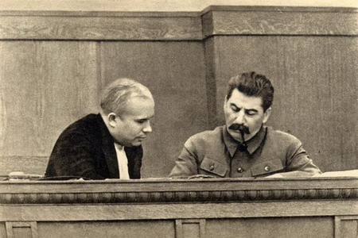

**赫鲁晓夫与斯大林，摄于1936年**

  

苏共的创造性发明为其阵营内的小兄弟们提供示范，自苏共起，供全世界社会主义政党备选的，多数情况下有书记、总书记、第一书记这三个称呼。

  

1921年中共一大召开时，由于代表人数少，仅选了几个中央委员，名义上中共中央最高机构是中央局，由三人组成，陈独秀任中央局书记。1933年中共中央设中央书记处
，书记处成为中共中央最高机构，总书记也成为名义上党的最高领导人。

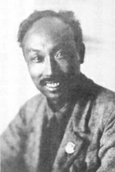

**1922年，时任中央局书记的陈独秀**

  

不过，在此期间中共实行的仍是集体领导制，总书记只负责主持会议和统筹日常工作。再加上中共根据地的分散和共产国际顾问的控制，中共的“总书记”从未真正实现个人权力
集中。

  

转折点发生在1943年3月20日，毛泽东担任中共中央政治局主席和中央书记处主席。其转折不在书记变主席，而是权力架构和党的领袖权力的变化：

1、由毛泽东、刘少奇、任弼时三人组成的书记处根据中央政治局决定的方针处理日常工作，书记处实际上变成政治局之上的最高决策机构；

2、党主席具有最终决定权，这条带来了更为深远的影响。

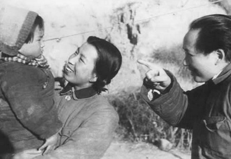

**1943年的毛泽东与江青**

  

中共八大后，书记处又降为负责日常工作的事务性机构，随之增设的是“中共中央副主席”这一称谓和政治局常委会这一机构。

  

使用“主席”这个称呼，在当时也有本土化看齐的象征意味。当时中国本土政党多用“主席”来称呼领袖，而总书记则明显带有“共产国际”的附庸的意味。早在1941年4月
，斯大林就考虑过解散“共产国际”这个革命任务既过时，又授人以干涉内政把柄的组织。

  

中共在共产国际宣布解散两个月前改“总书记”为“主席”，不知是否是巧合。

  

“主席”这个党的最高领袖称号，中国一直用到八十年代，中共十二大取消了党主席和副主席一职，党的最高领导人改为中共中央总书记，未再设副总书记。而党的最高领导人有
最终决定权也被无形取消。

  

**【总理、总裁、元首、永远的……】**

  

并非所有共产党都受苏联影响，党的最高领袖使用总书记这个名目。越南和中国一样，经历了一轮完全相同的从总书记到主席再到总书记的轮回。

  

1951年之前，越共（不同时期名字不同）领袖循苏联惯例称总书记，1951年2月，第二次全国代表大会，正式成立越南劳动党，胡志明当选为中央委员会主席。胡志明也
像毛泽东一样，形成了姓氏+主席头衔的固定称谓。

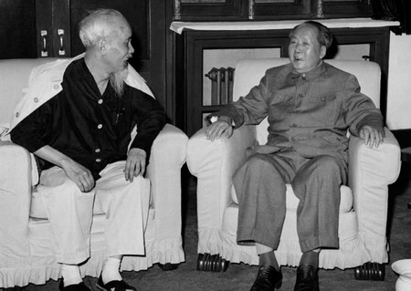

**1965年5月16日，毛泽东与来访的越共中央主席胡志明交谈**

  

但1969年胡志明去世后，主席这个称呼被改为总书记，只有胡志明才与主席这个称谓挂钩，而且此后历任总书记再无人能拥有胡志明的绝对权威。

  

尼泊尔共产党是今天少数坚持信奉“毛主义”的政党，其领袖普拉昌达坚持用主席而非总书记，或许也是一种坚守信仰的表现。

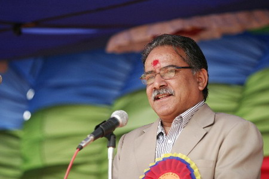

**尼共主席普拉昌达**

  

台海两岸虽然共同尊奉孙中山，但在使用的称谓上截然不同，大陆绝不会在孙中山名字后面加上“总理”二字。因为孙中山的总理，是孙在国民党的党内职务而非政府职务。

  

1905年8月20日，国民党的前身中国革命同盟会成立，孙中山被推举为总理，黄兴同盟会庶务（相当于协理）。总理是党的最高领导人。同盟会会章还规定:“总理对于会
外，有代表本会之权，对于会内，有执行事务之权，节制执行部各员，得提议于议会，并批驳议案”。

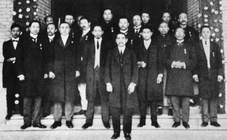

**1912年1月1日，孙中山在南京宣誓就任中华民国临时大总统。图为1912年1月，孙中山和总统府官员合影**

  

1919年10月，国民党经再次改组后，孙中山任国民党总理兼中央执行委员会主席。因为孙的特殊地位，孙为国民党永久总理，此职他人不再使用。

  

或许是蒋介石认为他统一中国之功同样值得特殊纪念，在1928年2月当选国民党中央政治委员会主席后犹嫌不过瘾，1938年当选为国民党总裁。

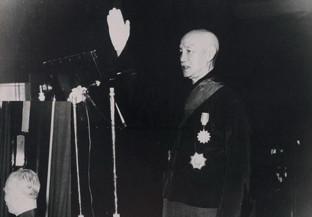

**1954年5月20日，蒋介石在台湾宣誓就任中华民国总统。时年67岁**

  

当时法西斯独裁在一定范围内颇受欢迎。张学良考察意大利回来后，对墨索里尼的独裁统治大为赞赏，蒋介石曾直抒胸臆道：独裁就是总裁，总裁就是独裁。

  

墨索里尼自认为天底下没有人能比得过他，作为法西斯党的领袖，主席、书记这样的称呼都不能表现他的伟大，于是有了“领袖”这个词。对墨索里尼五体投地的希特勒同样认为
自己是独一无二的伟人，于是也有了元首这个党内最高领袖的称呼。

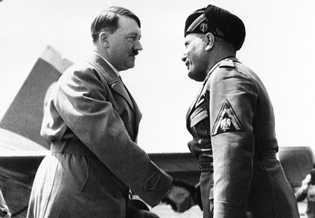

**希特勒与墨索里尼握手致意，摄于1934年6月14日，威尼斯机场**

  

其实，德语“元首”一词Fuuhrer，与墨索里尼专有的“领袖”是同一个词。希特勒确实实现了对“元首”的专用权——因为希特勒的缘故，今天德国人甚至已经很少使用
与这个词沾边的词了。

  

有必要发明一些新的领袖称谓。

  

朝鲜领导人金日成去世后，被称为“永远的国家主席”，金正日去世后，又被称为“永远的总书记”，金正恩只好用“第一书记”的称谓，金正恩的孩子该用什么称谓，这是个问
题。

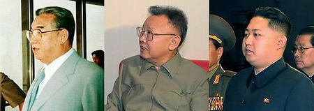

  

**版权声明**

****大象公会所有文章均为原创，****  

****版权归大象公会所有。如希望转载，****

****请事前联系我们：****

bd@idaxiang.org

****知识 | 见识 | 见闻****

阅读

__ 举报

[阅读原文](http://mp.weixin.qq.com/s?__biz=MjM5NzQwNjcyMQ==&mid=208929527&idx=1&sn
=944d7da4da9c214cf0ab485884394222&scene=1#rd)

