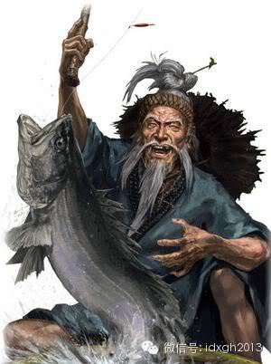
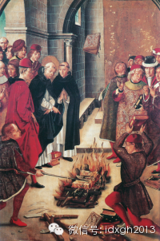
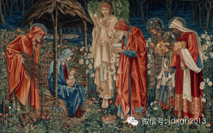
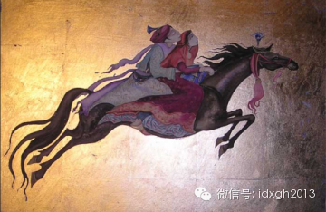
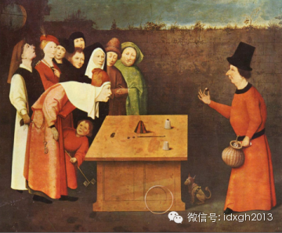
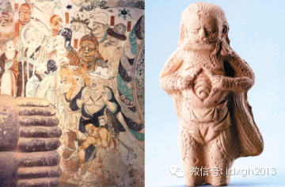
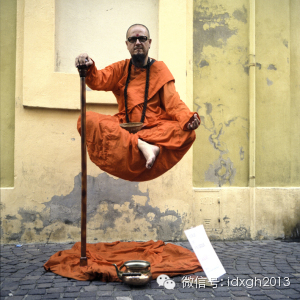

**基督教、伊斯兰教、佛教这些世界性宗教在其成为一个地区的全民信仰后，行使奇迹的案例很少发生在其正统教士群体，但其中某些新兴流派则会频繁展示奇迹，并因此获得极大的传播力量。**

文/刘大可

一家人熄灯准备入睡时，发现墙壁上隐现蓝白色荧光的十字架和各种字符，主人立即想起白天那位全能神传教者的宣教，眼前的一切无疑是“神迹”的显现。在一些社会调查报告
和警方的笔录中，这类因为亲眼见证奇迹而皈依某类宗教的案例非常多。

  

行使奇迹，自有宗教始，就是传教活动的重要一环，只是到了现代，传统宗教的传播才不再有行使奇迹的情形。但它却在中国今天新兴宗教中大量出现。在信徒看来，奇迹是神在
向信徒显示其存在的证明，在无神论的研究者看来，行使奇迹是宗教传播中征服信众最有效的心理暗示手段。

【奇迹的见证】

几乎所有传统宗教都在其典籍中留下了各种神迹的记载。无论是古老的拜火教，还是犹太教、基督教、伊斯兰教和佛教，关于神迹的记载都是其早期文献中的重要内容。最典型的
是关于摩西、耶稣、穆罕穆德行使的种种奇迹。

  

这些奇迹一般可划分为超能力的展示，譬如在水上行走或者悬空飞行等，能治病救人甚至唤醒死者，能幻化出粮食或水，能与鸟兽、死者或神灵对话。而来自印度的佛教，奇迹的
展示略有不同，譬如火化后生出舍利子或死后拥有不腐的尸身，以及能知道人的前世今生。

  

原产古印度的佛教本来更接近一种形而上的哲学，但是为了在广大的底层人群中发展信徒，西域佛僧不但大量吸收了中国本土的巫术，更常常变戏法震慑众人，从而在六朝时期迅
速发展。

  

比如三国的支谦来自大月氏，他为了消除孙权对佛教的疑惑，承诺可以得到舍利珠。支谦从供奉了21天的铜瓶里取出五彩宝珠，铁砧都砸不烂，孙权果然信服。东晋龟兹佛僧鸠
摩罗什，乃是汉传佛教最重要的翻译家，相传他曾用火焚烧一根五彩丝绳然后扔在水里，取出来仍是完好的五彩丝绳。

  

最著名的是西晋后赵僧人佛图澄，他来自天竺乌苌国。《晋书**艺术列传》里记载，后赵高祖石勒要试他法术，他便在钵盂里里盛水，焚香咒祷，旋即又青莲花在水面上开放，
光彩照人，折服了石勒，受到国师般的重用。

  

佛教深远影响了中国本土信仰，为回应佛教体系完备的哲学理论，中国本土信仰用老庄学说构建了自己的形而上学，在幻术这种事上也互不相让。西周末年的巫在春秋时期发展为
方士仙家，做些观星占卜、治病炼丹的事，给秦始皇寻找长生不老药的徐福就是一个方士。

  

最善于行使奇迹的恐怕是三国时的左慈。据载，曹操想吃吴松江鲈鱼，左慈就找了个铜盆倒上水，用竹竿钓上一条三尺多长的鲈鱼。曹操又说吃鱼要蜀地产的姜，左慈顷刻间也买
了回来。后来曹操出去郊游左慈跟从，变出许多酒肉让所有官员都吃饱了——最后曹操疑心他是个邪祟，想杀他，他就穿墙出去。

_日本游戏《三国志__12__》里的左慈，正从铜盆里钓鱼_

方士仙家和其他中国传统信仰最后发展形成了道教。唐代李氏以老子李耳为祖，而道教奉老子为太上老君，自然受到格外推崇。比如新官上任或者官员升迁举行的大型“烧尾宴”
就有一道道教肴馔“仙人脔”，乃是说煮肉用的清水沸腾之后竟变成了白色的奶水，大显神奇。

  

在中国，宗教传播与行使奇迹不能不提黄巾军起义、方腊起义、白莲教起义，甚至元末反蒙古人统治的大起义，这些新兴宗教的快速传播，无一例外地伴随着大量行使奇迹的故事
。

  

基督教、伊斯兰教、佛教这些世界性宗教在其成为一个地区的全民信仰后，行使奇迹的案例很少发生在其正统教士群体，但其中某些新兴流派则会频繁展示奇迹，并因此获得极大
的传播力量。典型如八世纪在伊斯兰教中出现的苏菲派，十三世纪在天主教中出现的圣多明我会。

  

从文献记载看，他们行使的奇迹，并未超出早期的类别。不过，由于他们是在已有信仰的信众中争取信徒，往往会出现精彩纷呈的奇迹斗法。

【奇迹的斗法】

阿拉伯帝国灭亡波斯以后，古老的拜火教开始向东西两个方向扩散，尤其是其中一个重要的支系摩尼教，在东方成为明教，在西方则成为清洁派，在法国南部和意大利北部大举传
播，到12世纪末已成了天主教的心腹之患。

  

于是在1204年前后，天主教圣多明我会的创始人多明我（又译圣道明），与清洁派信徒展开了一场斗法。他前往清洁派社区，站在火堆前与异端打赌，各自将经书扔进火里，
让双方都信任的火焰作出裁决，烧掉伪经。结果圣多明我的《圣经》丢进火里完好无损，清洁派的经书却化成了灰烬。

  

而让纸张抵御焚烧在这位多明我身上也不止发生了一次，他在法国城市凡耀用来批判异端的手稿三次扔进火里都没有燃烧，至今都被称为奇迹。当然，这比《圣经》里记载的耶稣
神迹可差远了。

_ 多明我与清洁派斗法_

伊斯兰的苏菲派在行使奇迹上似乎更高一筹。传说有的人可以悬浮在空中，吹气治病，使死人复活，与动物交谈，能预知未来。苏菲派诞生之初曾因神秘主义教义和修炼行为被视
为异端，到了11世纪他们被主流容纳，到了15世纪，他们在中亚地区开始获得比正统派更大的影响力。

  

草原上的吉尔吉斯人、哈萨克人、土库曼等突厥语游牧民皈依伊斯兰，主要是他们的贡献。苏菲派传教士与正统阿拉伯经院派神学家不同，不会去讲什么思辨，而是用人民喜闻乐
见的德行和奇迹来传教。

  

苏菲派中行使奇迹最著名的是曾统治南疆的阿帕克和卓。阿帕克和卓是新疆历史上著名的白山派创始人，因为他善于行使奇迹，“当他出现在人民当中时，有的人兴奋的流下眼泪
，有的人高兴得引吭高歌，有人狂蹦乱跳，有人昏厥晕倒，据说他行使的奇迹数不清”。

  

阿帕克和卓值得提及，不是他很短时间就由默默无闻迅速在喀什噶尔成为地位仅次于先知的圣人，而是1670年他被叶尔羌汗国的伊斯玛仪汗逐出南疆后，创造了不可思议的奇
迹。

  

穆罕默德**喀什噶里的《和卓传》记载了阿帕克和卓最后的流亡经历：“在Chin这个国家里有个叫Chu的地方。在那儿异教徒们有个婆罗门僧侣，他行使奇迹并依靠传教
建立起自己的宗教。阿帕克和卓到那里后逐渐显示出善良的德行和各种奇迹，使异教徒大为惊奇。异教徒都转而崇拜他……”

  

历史学家多认为，阿帕克和卓最终流亡到了西藏，并且依靠行使奇迹折服了五世达赖喇嘛（即文中的“婆罗门僧侣”），达赖喇嘛因此致信准噶尔蒙古的领袖噶尔丹，要求他出兵
帮助阿帕克和卓。1680年，噶尔丹派军攻陷了喀什噶尔和叶尔羌，阿帕克和卓恢复了统治。

  

阿帕克和卓的后世似乎未能继承他善于行使奇迹的能力，但他本人的超能力传说，使其家族在此后两百多年都拥有极强号召力，清军征服新疆全境后，其后裔每次振臂一呼都会引
发大规模反叛暴乱。

  

十九世纪俄国征服中亚地区后，一些伊斯兰教苏菲派传教士仍然以奇迹笼络了大量信众，后来俄国警察逮捕了一些反叛的苏菲派领袖，留下了描述这些“奇迹”的可信现代文献。
当然，以现代人的眼光看，这些人其实是很了不起的魔术师。

  

比如这些人不生火就能做熟抓饭，其实是炉子底下通了蒸汽管道；他们的馕坑里有取不完的馕，能供上千人人食用，因为馕坑连着地下室，地下室里有一大群人在烤馕；有时候不
用询问就知道门外来的是什么人，原来报信的仆人都是托儿……

【魔术、巫术与奇迹】

现代无神论者很容易认为古代宗教传播中的奇迹，其实是古老的魔术。而且世界最古老的魔术和宗教似乎在地域上是同源的，它们都来自波斯。

  

在欧洲各种语言里，魔术的词源都是“magi”，一个古波斯语词汇，欧**亨利短篇小说《麦琪的礼物》里的“麦琪”就是这个“magi”，典故出自《新约圣经**马太
福音》：耶稣降生后，东方有“三博士”被天象指引前来朝拜，赠以黄金、乳香、没药三样礼物。这个“博士”正是对“magi”的另一种译法。

_东方三博士带礼物探望初生的耶稣_

在汉语，“魔”这个字本来是“磨”，用于音译梵语佛经里迷惑人心、阻挠修行的“魔罗”（mara），到南朝时梁武帝将偏旁从“石”换成了“鬼”。但直到清中期，中国人
见识了西方艺人的绝技以后，这个字才音意兼备地用来翻译“magic”等舶来词汇。

  

“麦琪”在古波斯就是拜火教的神职人员。甚至根据一些考古发掘和上古汉语语音重建的研究，中国的“巫”可能就是古波斯的“麦琪”在公元前8世纪传入中国的结果，那大约
是西周末年。

_左图：汉字金文的“巫”，右图：从中东地区传播开来的魔法符号平头十字_

在“麦琪们”的时代，巫术和魔术并没有界限，都是宗教活动的重要内容。他们的知识天然包括了神秘主义和营造幻象，也就是同时是占星术和魔术发明家。比如，波斯帝国的石
油能渗出地表，麦琪们很早就发现石脑油这样的易燃液体，进而发明了口吐烈焰的喷火术。

  

吐火在公元前的世界着实是了不起的法术，以至亚历山大大帝征服波斯帝国之后，拜火教很快以渊博的知识和神奇的法术折服了希腊人，到罗马时代更传遍了地中海，在包括以色
列在内的迦南地区也很流行。

  

神秘知识和魔术的组合成了宗教传播的样板，以至于耶稣出生的第一个神迹就是用占星天象召唤这些知识渊博的麦琪，他成年后医病、驱魔、复活死人的行径除却杜撰附会，就更
有表演的可能了。

  

三个麦琪、礼物、魔法和神秘知识的组合除了出现于《福音书》，还以另外一个意想不到方式为我们熟知，那就是《一千零一夜》里那则《乌木马》的童话故事：波斯国王有个独
生王子，这天来了三个麦琪，各自带一件礼物，其中有一匹乌木马。王子好奇跨了上木马，立刻被带上天空飞升而去，从此展开了一段惊奇的大冒险。

  

这个故事里，麦琪们身负魔法与神秘的知识，宝物里的机关暗道也反映了魔法的实质，更重要的，最聪明的麦琪以大坏蛋形象下场凄惨，明确表明了阿拉伯波帝国对拜火教传播的
打击态度。

_王子带着公主骑上乌木马，飞升而去_

  

对待以法术震慑他人，而使其信服的行为，并非只有伊斯兰教采取了打压的态度，基督教甚至更甚。这些不受己方支配的神秘力量实在是一种信仰威胁，魔术师在漫长的中世纪里
都没有得到过善待。

  

早期基督教世界只有个别贵族能雇用魔术师作为表演娱乐，据称9世纪时，一个魔术师还为王室表演，在隆冬变出满树花果，甚至还表演了把人一切两半的大戏法。但到了106
6年，教会就禁绝了魔术和杂耍艺人在城镇里定居。到1206年，法国卡佩王朝的路易九世干脆将所有的魔术师驱逐出境，因为这会让恶魔在他的子民中蔓延。

_杯子扣小球的戏法，荷兰画家希罗尼穆斯•波希的《魔术师》，绘于1502年前后_

  

对魔术最严厉的打击在中世纪末，教会认定魔术是恶魔的黑魔法予以全面审判，15世纪的德国，一个小女孩被判定是女巫烧死了，因为她把一块手帕撕碎又复原如初，做出让当
局不能理解也不能控制的事情来，从古到今都是死罪一条。

  

然而，这并不意味着基督教对魔术之类采取了完全拒绝的态度，有黑魔法就有白魔法，对于神父、牧师和传教士来说，用魔术营造一个神迹要比任何劝导都更能让人信服上帝的威
力。当然，他们自己不会说那是魔术。

  

前文谈到摩尼教传入中国后即为明教，方腊起义、白莲教起义，都与这些幻术家的传教有关。但世俗皇权统治的中国对西来的魔术总体上则较为宽容。北宋末年，首长在东京检阅
军队时，受阅士兵会表演一种叫“七圣刀”的幻术，大抵是一阵蔽目的浓烟过后，有七个人身穿各式衣服，拿着真刀真枪破面剜心地打斗起来，最后喷上水，毫发无伤。

_左图：敦煌壁画里的剜心剖腹的表演；右图：宋代的“七圣刀”陶塑玩具___  

九世纪，印度婆罗门教集大成者商羯罗在《奥义书》的注疏中介绍过一种魔术：一个艺人爬绳子上了天，然后扔残肢下来。这个魔术在中国叫“仙人索”，出现在蒲松龄《聊斋志
异》里的《偷桃》中，不过往天上扔绳子的老者和爬绳子的小孩是白莲教的能人。这个戏法后来在许多国家也有表演，被称作“印度绳子术”，但那已经是18世纪以后的事情了
。

  

大体而言，中国本土发明的神迹比西来的难度较低，比如前文提到唐代道家发明的乳白色的“仙人脔”，如今的厨师都知道菜籽油在沸水里会变成白色的乳浊液，但菜籽油烹饪在
唐代尚未全面流行，自然成了仙法。

_现代中餐里有很多奶白汤的菜_  

而明清两代直到建国之初，一贯道等团体展示的奇迹同样难度系数较低，比如用白醋密度比油大而沸点比油低表演沸油取物，利用姜黄遇碱变红表演杀鬼见血，利用酸碱指示剂原
理用清水写字，等等，不一而足。

  

【新时代的奇迹】

魔术与神秘力量分离，变成光明正大的表演艺术搬上舞台，是西方世界科学进步和工业革命的结果：一方面头脑充盈的人们越来越不相信玄乎的事，另一方面城市生活需要更多的
文化娱乐，“Magic”这个词终于有了我们现在熟悉的“魔术”含义。

  

而西方传教士在欧洲之外的“蒙昧世界”传教时，依然要用到行使奇迹的手段，只不过，近世的传教士在展示神迹时，用的已经不是魔术，而是其先进科学技术和现代医学。对生
产力低下的部族来说，西方传教士们掌握的早期现代医学，已近乎奇迹了。

  

_印度魔术悬空打坐的原理：从地下的垫子到手杖到穿着的袍子，有一根坚硬的金属贯穿其中，如今欧洲街头的表演者比比皆是。_

  

即使在历史悠久的中国，传教士们在清末获得传教通行时，其医学和自然科学知识依然是无往不胜的利器。比如传教士苏慧廉此前只接受过简单医学培训，自称是“对医学非常无
知的青年人”，但他治疗感冒、发烧、天花、霍乱时的成功，老百姓口口相传他是“一位金发碧眼的神医”。

  

中华人民共和国成立后将所有“会道门”一股脑列为邪教统统取缔。但奇迹却并未被消灭。或许是因为奇迹已经成功地进入中华文化，成为其不可分离的一部分，所以，1980
年代后，中国兴起了好一阵子的气功热，大师们吞竹签、断铁链、碎大石、踩鸡蛋……各显神通，刀枪不入。

  

这些人不但是老将军们老干部们的座上宾，甚至钱学森也主张国家应大力投入人体科学研究。那是一个神仙纷纷下凡的时代，虽然他们展现的奇迹，甚至远不如两千年前的波斯和
印度幻术师。

  

今天，人们依然可以看到电视上各种神功拥有者的公开表演，可以看到武警部队表演胸口碎大石、头顶开酒瓶。或许，当全能神教的传教者去拜访待皈依者时，悄悄用夜光墨水在
其墙壁上涂涂写写时，不必惊讶主人在晚上认为那是奇迹的显现。

  

> 版权声明：  
大象公会所有文章均为原创，版权归大象公会所有。如希望转载，请事前联系我们： bd@idaxiang.org

大象公会：知识、见识、见闻

微信：idxgh2013

微博：@大象公会

投稿：letters@idaxiang.org

商务合作：bd@idaxiang.org

  

[阅读原文](http://mp.weixin.qq.com/s?__biz=MjM5NzQwNjcyMQ==&mid=202795727&idx=1&sn
=a46b5698e3084bb511161f093f87a025&scene=0#rd)

