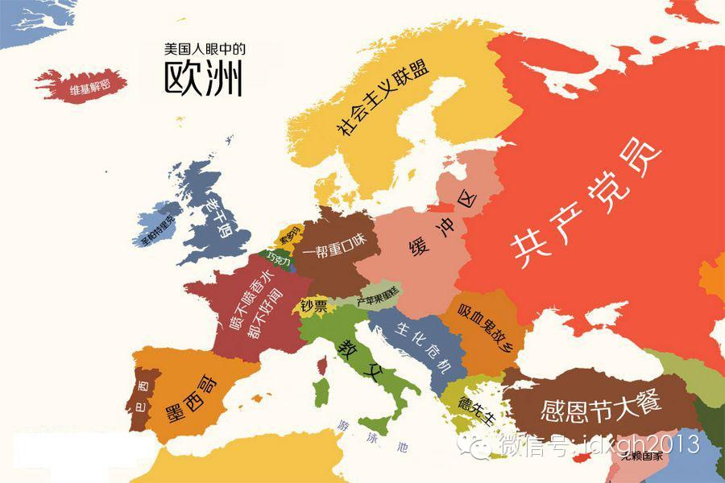
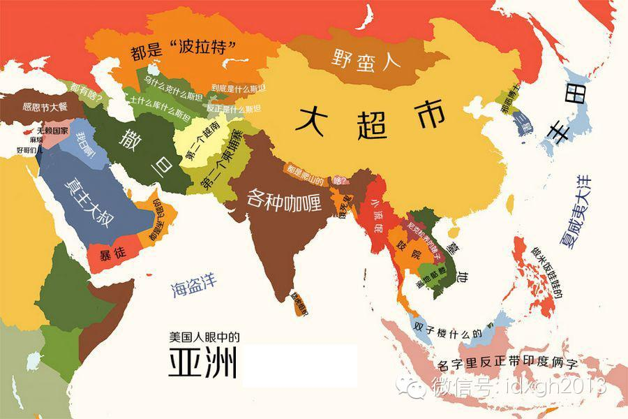
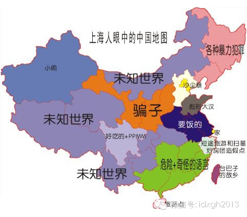
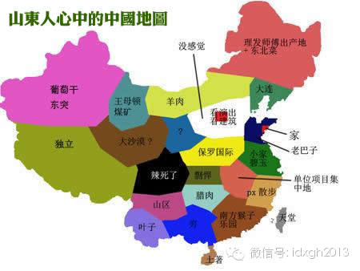
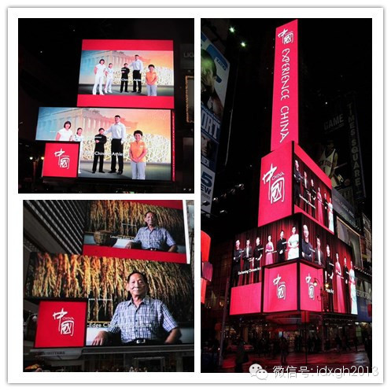
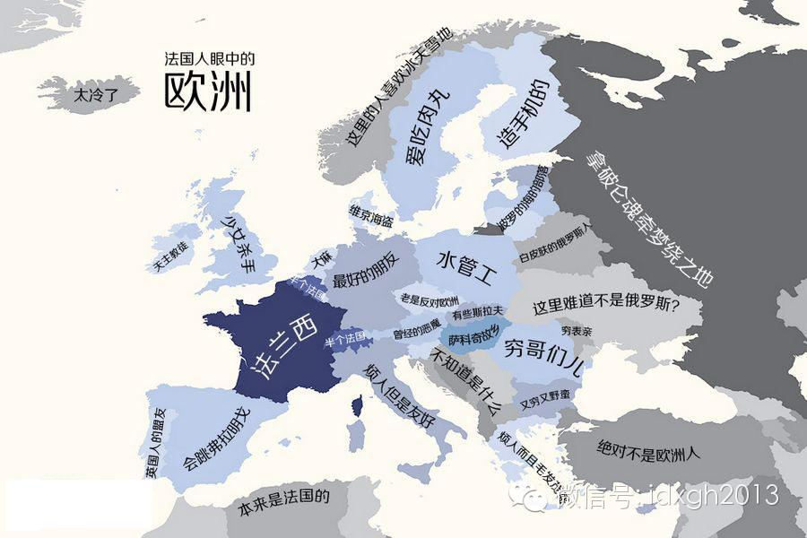
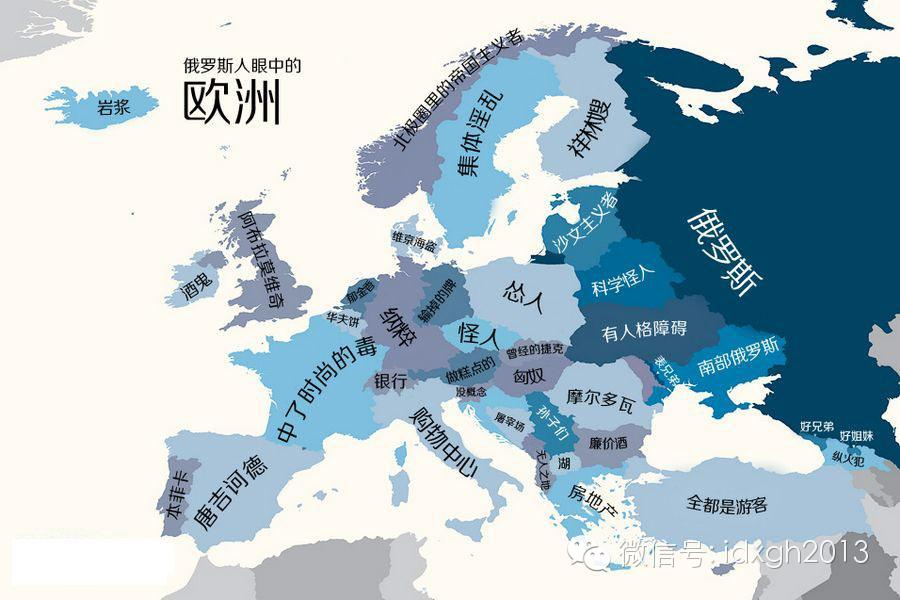

**对不同人群的偏见永远存在。不过，也有些“脸谱化”是乐意被人接受的——如果他自认为正处在歧视链条的最顶端。而互联网的兴起第一次重新划分了“我们”与“他们”的标准。**

  

文/黄章晋

  

司马迁肯定不是中国最早的“地图炮”，但称他为史上最著名的“地图炮”当不为过。他在《史记**货殖列传》中介绍当时中国各地物产、风土时，顺带把当时对中国各地人的
性情都总结了一遍，不但为今后的各种“地图炮”定下基调，而且为后来各种地方志的本地民风总结提供了范本。

  

在描述各地民风形成原因时，司马迁有教化说、周边环境影响说、地理环境说等总结。

  

譬如梁、宋故地的民风，因为尧、舜、汤诞生于此，故“其俗犹有先王遗风，重厚多君子”，而种、代故地，因为“地边胡，数被寇。人民矜懻忮，好气，任侠为奸”，而“中山
地薄人众，犹有沙丘纣淫地余民，民俗懁急，仰机利而食”，西楚人则“其俗剽轻,易发怒”。比“山地之民近悍，江湖之民近黠”之类单纯的水土说，看上去要练达、智慧得多
。

  

【“我们”的心理需要】

  

把以地域、民族、职业等外在概念划分的人群视为一个整体，再为之刻画一个固定的脸谱，是无分古今中外的共同习惯。越是在文化不发达的时代和地区，人们越倾向于用自然水
土等拟物思维来总结不同人的特征。

  

这种脸谱化的认识，其实是人类认识和描述世界时的本能。按现代个性心理学创始人高尔顿**奥尔波特的说法就是，它是最不费力的规则。最简单的比方是人们对颜色的认知：
颜色是连续的光谱，本无法被划分为若干清楚的边界，但为了大幅节省精力和简化表达，只能以赤橙黄绿青蓝紫之类的名字来定义。

  

类似的还有人们对时间概念的使用，人们确定约会时间时，总是倾向于使用8点、8点半或8点15分这样尽可能接近整数的节点，再讲究精确的人，也不会使用8点13分23
秒。

  

不但从简化认识这个角度看，对不同人群的偏见是永远存在的，而且为了精确认识，人们会不自觉地总结出更多的共性。问题是，这种概括的基础是对人、事、物一致且不变特征
的把握。而人群恰恰是最易变的描述对象。10多年前，台湾人的茶叶蛋，多数大陆人确实吃不起，但今天多数大陆人已富得可以嘲笑“台巴子”见识浅陋了。

  

“地图炮”现象中更重要的一个社会心理因素，是人群对社会认同的渴求。人们通过不断强调“我们”与“他们”之间的差别，来强化自我认同。如果这种差别强化的是我们的优
越感，自然最易被津津乐道。而反衬“我们”优越的，自然是“他们”的种种可笑和荒谬。

  

司马迁时代的“地图炮”，对一个地区的描述往往只有寥寥数语，到了今天，不但各种高度凝练的段子层出不穷，而且每个地方都发展出了一套自我中心论的“中国观”或“世界
观”。

  

_保加利亚摄影师扬科•萨佛诺夫出版的《世界偏见地图》，对人类脑中的刻板印象描绘真切。_

_  
_

_ _

_ _

_国内流传甚广的《XX人眼中的中国地图》。_

  

如果说的是“我们”的好话，带有权威感的“地图炮”论述是非常受欢迎的。十九世纪德国地质学家费迪南•冯•里希特霍芬的《中国：我的旅行与研究》，记录了他对中国各地
风土人情的观察总结。一个德国人，权威而又客观，自然是中国近些年各种人文畅销书必须引用的。

  

余秋雨老师是极擅于捕捉和把握这种心理的大师。他深谙对一个地方的赞美要含蓄克制且带有学术探讨意味的精妙之道，他对湖南岳麓书院的赞美，使他成为湖南举办的岳麓大讲
堂的首位嘉宾，他对山西票号的追思，使山西政府终于想起来要弘扬晋商文化，并向他发出了第一份邀请。

  

中国需要余秋雨这样的大师。几十年高度计划的政经体制，使各个地方面目模糊、缺少文化识别性，而民间流传的地域成见，又几乎全部是贬义的。不是只有东莞愿意砸进数亿元
洗脱“中国性都”之名，无论是处于地域歧视链条中下游的地方，还是没被列入歧视链条但急切想提高知名度的地方，都乐于通过大规模宣传，重新塑造一个自己所希望的脸谱。

  

【“我们”应该是谁】

  

通常，“我们”总会认为，那个被“他们”脸谱化的“我们”是一种傲慢与偏见。哪位河南人喜欢听外地人讲述的各种河南段子，哪位“江北人”乐于接受“江南人”的无声歧视
？哪位内蒙古人乐意被人问起你是否骑马上学？又有哪个新疆人希望人们把小偷和切糕与他挂钩？

  

不过，也有些“脸谱化”是乐意被人接受的——如果他自认为正处在歧视链条的最顶端。

  

譬如，英国人多半愿意接受自己被当作古板且有腔调的绅士。殖民地时代，有些英国下层社会的混混，乐于去印度，因为这才有机会让自己变得像一位英国绅士。而有些东北人一
旦离开家乡，嗓子就直了，且喜欢冷天光着膀子，因为“东北人都是黑社会”这一偏见可以让他享受到站立于食物链顶端的快感。

  

有时，“他们”的偏见会以奇特的方式塑造“我们”。

  

伊朗、沙特这类被外界认为宗教意识最强烈的国家，对饮食上是否严格遵循清真规范远不像中国人想象的那么在意——除了不点猪肉，他们并不刻意挑选清真馆子。而中国则截然
相反，某种程度上，穆斯林在中国是汪洋大海中的极少数，而并无独一神教信仰的汉族对伊斯兰的理解只能停留在不吃猪肉上。这种来自“他者”的定义，或许成为中国穆斯林对
饮食格外在意的重要外部因素之一。

  

虽然人口流动和经济交往，总是在瓦解传统社会中“我们”与“他们”的固有边界，但人群内在的心理需求，又同时会不断通过文化建构来强化、塑造自我认同。

  

这种对“我们”的心理需求，是安德森的“想象的共同体”的社会基础。行政力量可以借助这种需求，将“我们”的边界与内涵，由传统的小范围的乡土之别，上升到行政区划的
省际、国家和民族之别。

  

崛起的中国也开始努力改变外部对中国人的刻板形象。北京奥运会时，典型的中国人形象依然是身着白衫打太极的老头，以及北京老建筑群落空地上放风筝的市民。而在纽约时代
广场的广告中，中国的形象代言人已经变成了各类成功人士，传统与乡土的中国人一下变得高大上起来。

  

_纽约时代广场上的中国形象广告。_

  

但现代社会可以组成“我们”的标准，远非国家力量可以统一塑造。互联网的兴起真正打破了传统，第一次使得重新划分“我们”与“他们”的标准，可以是意识形态和价值偏好
，持任一观念的人都可以找到属于自己的“我们”。

  

在这个全新的平台上，社会分工的深化和精细，使得职业、教育、兴趣爱好背景等都可以成为区别彼此的原因。最匪夷所思的是，“理科生”与“文科生”这种笼统的教育背景之
别，也能成为划分“我们”与“他们”的边界。

  

今天中国的公共议题，明显可以看出“我们”与“他们”的声音，早已超越了传统社会的地域、民族等自然属性，而带有强烈的观念属性。互联网这种技术，是对近现代国家努力
塑造出的想象共同体的最有力解构。

  

也许今天的中国，是全世界“我们”和“他们”固有边界重塑最剧烈的案例之一。但这又是全球现象。亨廷顿的《我们是谁》所表达的，就是在文化和种族多元的社会变迁下，对
“美国人”的定义剧烈松动的焦虑。

  

【地图炮最安全】

  

虽然中国自古就有“非我族类、其心必异”的说法，但相比种族、文化多元的西方历史，中国境内较少种族和语言差异，使得中国人并不是狂热的种族偏见分子。

  

地理大发现之后，西方人曾以科学的名义，将对不同种族的偏见上升到固化的生理差异。因解放黑奴而青史留名的林肯就曾说过：“我相信白人种族和黑人种族之间的体质差异，
将禁止这两个种族能在社会和政治平等之下共同生活。”而马克思与恩格斯的通信中，则充斥着对斯拉夫人的歧视，譬如恩格斯在谈到一个叫品得的人时说：“他是一个彻头彻尾
的斯拉夫人，感情轻浮，甚至下流，喜欢谄媚，又高傲自大。”

  

甚至列宁、斯大林对斯拉夫人的态度也和革命导师相同，他们早期的著述中经常有俄国人愚钝、落后和迷信之类的字眼。花了几十年时间，苏联/俄罗斯的领袖们才统一改了口径
。

  

直到战后生物学的进步，消灭了种族歧视的生物学理论基础，而政治正确，又消灭了种族歧视言论在公共空间的存在机会。好在西方国家较小，互相之间关系密切。在今天看来，
他们彼此之间的成见，更像是中国不同省份之间的互相揶揄，而不涉及民族情感——为他们提供了足够充分的地图炮话题。

  

_法国人眼中的欧洲。更多图片参见《世界偏见地图》一书。_

_ _

_俄国人眼中的欧洲。更多图片参见《世界偏见地图》一书。_

  

今天，中国各省之间，类似河南人、安徽人、东北人、广东人的段子，多少因为缺少新素材，已让人丧失新鲜感，而且人口流动也在迅速抹平差距和隔膜。好在，对外，我们有日
本、菲律宾、越南、印度、马来西亚等一大堆邻居可供仇恨，对内，还有香港人说大陆人是蝗虫、台湾人说大陆人吃不起茶叶蛋。弹药永远不缺。

  

不过，茶叶蛋这事也许是台湾人迟到的报复。1970年代生的中国人，都曾唱过一首儿歌，词曰：“报告司令官，你老婆在台湾，没有裤子穿，扯了二尺布，缝个花裤裤，东补
补、西补补，还是露着大屁股。”这是人们依据大陆当时的真实生活而产生的对台想象，说不上太多恶意。

  

[大象公会所有文章均为原创，版权归大象公会所有。如希望转载，请事前联系我们：bd@idaxiang.org ]

———————————————  

**大象公会订阅号的自定义菜单上线了，左边是官网文章精选，右边是大象公会官方微社区，点击进入来吐槽发帖吧！**

  

[阅读原文](http://mp.weixin.qq.com/s?__biz=MjM5NzQwNjcyMQ==&mid=201442695&idx=1&sn
=3bc32c034b7a5a89ddc17dfdca2d50c0&scene=1#rd)

