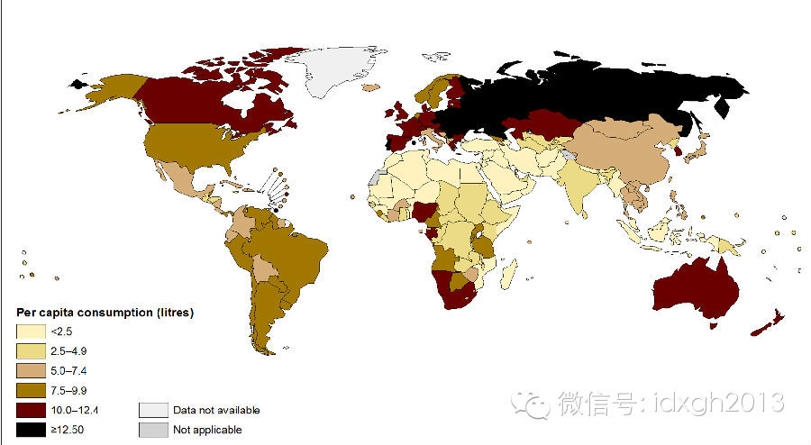
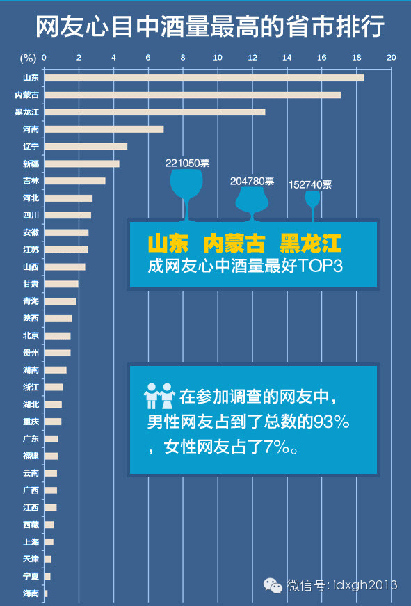
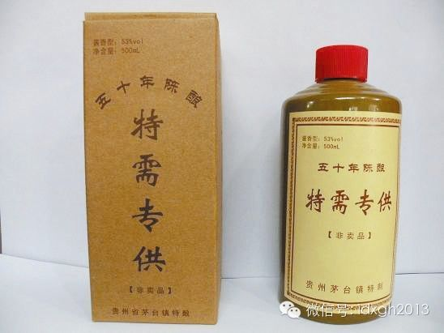
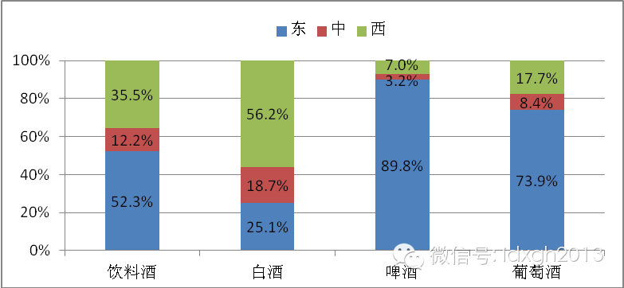
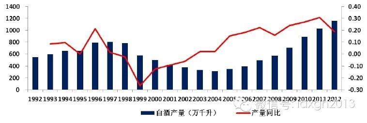

**为什么中国人特别喜欢劝酒敬酒？为什么人们认为北方人比南方人更能喝酒？为什么中国白酒会出现十年一个周期的波动？**

文/杜修琪

“四川人喝酒可不是为了放松休息。它经常乃是竞赛性质的，通常会用到白酒，一种强烈的，口感恶心的谷物酿的酒。男人们相互敬酒，一口干掉，而这种饮宴很有发展为恃强凌
弱的倾向，参与者们相互刺激，直到某个人喝出病来。”

美国作家何伟在《江城》中的这段话，相信中国大部分地区的男人看后会纷纷表示不平——灌酒几乎是全中国的特点，并非一省一市的专名，更重要的是，无论哪个“中国最能喝
排行榜”，四川人都无法排进前列。

不过，中国人豪饮的方式虽让美国人感到震惊，但大部分中国人日常是不爱喝酒的。世界卫生组织2010年的报告显示，中国15岁以上人口年人均消费酒精约6.7升，与俄
罗斯15.1升、捷克13升、法国12.2升的消费量相差甚远。甚至无法比拟人种、文化相近的韩国（12.3升）和日本（7.2升），连地处热带、无需饮酒御寒的泰国
人，也比中国高0.4升。

_世界人均酒精消费量分布图（2010年）_

【中国式酒桌文化】

几乎所有民族都有程度不一的劝酒行为，为什么中国的“酒桌文化”会给人留下强烈印象？

它实在太精细复杂了。有些以豪饮著称的游牧人，招待客人时喜欢一醉方休，这是因为他们日常社会交往较少，来了客人犹如过节；但其礼数和讲究通常很简单，至多灌下几碗即
可。

东亚的日本、韩国，职员们喜欢下班后集体喝酒，但日本人基本保持随意，韩国人比日本人更讲究尊卑，但其礼数的复杂程度远不能与中国相比，也不像中国这样非要把人灌醉不
可。

自古中国就有劝酒传统，但古人的劝酒、灌酒，与其他民族的劝酒并无特别不同，而今天中国的酒桌文化因为发展出一套通行全国的规则，并非古代传统的简单继承。

  

中国各地酒桌文化基本原则相同：下级向上级敬酒，显示恭敬和服从；上级对下级劝酒，表现亲密与庇护；同级间相互斗酒，则展示力量，活跃气氛；每一级不能乱了步骤。

  

敬酒顺序：必须先等位尊者互相敬酒，然后才是位卑者按层级高低，先后向位尊者敬酒；一定要弄清地位排序，先敬地位最高，然后次高，一旦顺序出错，不但易引起不悦和怀疑
，而且会弄得位尊者之间彼此尴尬。

敬酒姿态：位卑者向位尊者敬酒，必须离席走近位尊者，碰杯时杯口必须低于对方酒杯，无论对方喝多少，都必须双手举杯先干为敬。位尊者若离席向位卑者们敬酒，位卑者们须
做感动雀跃状。

灌酒规则：地位最高者当然是酒宴上被灌酒的第一目标，但只能适可而止，位尊者喝到适度，充分领略下属的忠诚后，接下来通常是欣赏手下面红耳赤互相灌酒的娱乐时段。

斗酒规则：若是两个组织参与的酒宴，通常主人会努力把客人们放倒，但位尊者总有人代酒，双方主帅并非斗酒主力，承担重任的多半是中层骨干。所以，被放倒的通常是敢为领
导豁出去的中层。

两个单位斗酒，最大价值不是把对方摆平，而是各自增进内部凝聚力——平时难得在领导面前表现的下属有了最直接机会，而下属忠心耿耿的表现，则会让领导非常享受。

酒能让人放松、兴奋、自控力降低，容易快速建立互信和亲密关系，在人情社会，它几乎是万能的情感粘合剂。而在人情因素考虑较少、讲究规则和程序的社会，酒宴就很难成为
商务、公务活动中的重要纽带，酒更多出现在个体之间交流感情的场合。

所以，人情社会较浓的东亚国家劝酒文化相对较浓，而日本、韩国、中国的社会尊卑层级分明程度有别，酒桌文化的强度明显有递进关系——中国人虽不像韩国人一样，年龄稍大
几岁就分出地位高下，但中国整个社会的组织体系都被纳入自上而下的15级行政级别，这种层级和秩序远比韩国更森严。

另外，中国自1950年代末的社会改造，将中国人的全部社会关系都纳入“单位”内；日、韩的组织只管成员的加薪、升职，而中国的组织还管户籍、分房、职称评定、子女入
托入学等。个人极端依附体制，是中国式酒文化诞生的基础。

不过，一旦离开等级分明的场合，中国人就没有这么多规矩，饮酒量也会大幅降低。加拿大滑铁卢大学调查发现，华人移民加拿大后，酒精消费立即大减，最高降幅达70%。

但只要留在中国，就免不了经常出入酒桌，酒宴文化不但令一些人苦不堪言，也成为年轻人进入单位最大的考验和压力，由于能喝就可以迅速获得赏识，网上有大量年轻人咨询如
何锻炼酒量。

中国什么地方的人最能喝？

【南北东西酒量有别？】

一般认为，北方比南方更能喝，山东、东北、内蒙、新疆、河南都有足够资格认为自己才是天下第一。有门户网站做过问卷调查，结果显示北方人酒量强于南方。

  

_网友心目中各地的酒量排行 _来源：搜狐健康__

__

不过从生理角度讲，中国南北方的酒量差别有限。人的酒量取决于身体的解酒功能，近一半中国人因缺乏乙醛脱氢酶2（ALDH2），在解酒的第二步——代谢乙醛时存在缺陷
。这种缺陷在南北方人口的分布上差别不大，因此，中国南北方饮酒能力在生理上的区别很小。

如果与欧美人和非洲人比较，则中国人无论南北都不善饮。欧美人代谢乙醛的缺陷比例很小，体质上普遍比中国人能喝，只是他们除了酒吧狂欢之类少数场合外，很少像中国人这
样往酒量极限上喝。

中国酒量排行榜的形成，其实是非常晚的事——1970年代末以前，酒类凭证配给，在普通百姓，它是稀有的硬通货，即使是官员，虽然可按行政级享受不同档次白酒，其所得
亦相当有限。另一方面，高强度的意识形态和计划体制下，人情松动权力的需求和空间非常有限。

前面的分析，其实已经回答了为什么中国南北方和东西部存在酒量差别：酒桌文化强弱其实与体制化程度正相关。1970年代末以前，北方的体制化程度明显高于南方，不但大
型国有企业和工业投资多集中于东北、华北以及西南地区，农村的集体化热情也明显有别（农村先进典型几乎都出自适合大规模集体劳作的北方）。

1980年代后，中国南北和东西部的体制化差别进一步放大，体制依附性最低的东南沿海，部分地方的主流社会不但没来得及形成像样的酒桌文化，甚至开始朝着悖离典型中国
酒桌文化的方向发展。

中国酒桌文化的强弱并不完全由其体制化程度排名决定。北京、山东就是两个明显两个特例。

1980代末，北京就与周边形成鲜明对比，公务和商务宴请少有劝酒、灌酒。或许因为北京是权力中心，官员扎堆，不敢随意造次；等级制森严的环境，酒桌文化对所有人都是
极大负担。此外，北京官员受教育水平远高于外地，外事交流也让其视野更开阔，不易形成酒桌文化。

山东未必是公认酒量最大的地方，但却是公认的酒桌文化第一输出大省。如果以体制化程度看，山东其实是北方地区体制化程度较轻的地区，但它又被公认为官本位思想最强的地
区。这或许是其酒桌文化地位的来由。

地域文化的自我认知或许对酒桌文化也有影响，无论是山东、东北、内蒙还是新疆，其自我认知中都有豪爽、勇猛、彪悍这类正面的关键词，而在酒桌文化较淡的东南沿海地区，
这些关键词往往是负面的。

当然，无论是山东人、东北人还是内蒙人，没人喝得过解放军。军队的体制化程度最高，又有“酒壮英雄胆”的文化。部队不像地方酒桌文化那么繁琐，直接就是“感情铁，喝出
血”。白酒企业也乐于同军队建立关系。2011年，茅台集团宣布同7大军区结成军企友好互建单位，“与人民军队紧密相连的特殊情感融入了彼此的血液”。

  

_网络流传的茅台军队特供酒_

【白酒的沦亡】

然而，中国酒桌文化核心的白酒，今天已处于迅速沦亡的境地。

1993年，“人头马一开，好事自然来”的广告语传遍大江南北，洋酒因其高昂价位成为地位的新象征。得风气之先的广东最早接触洋酒，但洋酒消费很快由时髦和炫耀，变成
了真正的口味欣赏。今天广东洋酒销售占全国1/3，广州的芝华士和皇家礼炮销量每年能翻番，其他品种洋酒的增长率也在30%左右。

在人口最多、收入最高的东部，白酒已经不是酒类消费的第一选择，2012年白酒销售额的56.2%来自西部，比中部和东部总和还多。同一份报告显示，全国73.9%和
89.8%的葡萄酒、啤酒在东部销售，这一比例在中部和西部分别是8.4%、3.2%和17.7%、7.0%。

  

_中国典型企业酒类销售额比重_  

白酒由于被定位为宴请酒类，逐渐被从酒宴之外的市场挤出。喝白酒耗时、伤身，不符合城市快节奏生活，啤酒成为最大替代者。另外，中国今天大部分白酒品牌都诞生于最近二
三十年，很难谈得上稳定可信的品质，在与洋酒的争夺中，不免落于下风。

酒吧这个新兴市场无疑是洋酒的最大推销者，源自西方的酒吧文化天然与洋酒高度契合。由于洋酒价格对今天的中国人已是大众消费品的水平，越来越多的年轻人因对洋酒文化和
口味的认同，转而成为其日常消费者。

在国酒低迷时，黄酒却在近年有了高速增长。黄酒较低的度数、温和的口感以及与之匹配的江南酒文化，使之逆势增长，成为洋酒的强劲对手。2009年，中黄集团黄酒销售额
为8.5亿元，2012年超18亿，在普遍的酒业停滞中，3年翻了一番。

中国白酒注定已无法改变酒宴用酒的形象——白酒厂商的广告一直在强化它与权力的关系，其广告代言多为张铁林、张国立、陈道明、唐国强等以扮演帝王而著名的演员，有些广
告直接就让代言明星装扮成满清帝王。

  

由于白酒高度依赖公款消费，而公款消费其实是一个不稳定的市场——中央领导人每隔10年换届，换届后都会整顿党政作风，公款消费市场会出现大幅萎缩。所以，最近一二十
年来，我们很容易观察到白酒市场周期性的起伏，高端白酒就更为明显。估计这次寒流比以往更强烈。

_1992__—2012年白酒产量和产量增速情况_  

__

2012年12月下旬，中央军委下令，要求接待工作不安排宴请、不喝酒，坊间称为“军队禁酒令”。解放军作为高端白酒的重要消费者，他们突然禁酒，对中国白酒行业无疑
是雪上加霜。

有意思的是，中共十八大会议期间，贵州习酒充当了中国主要门户网站十八大专题的赞助商，其知名度借势大幅提升，只是，不知道它现在怎样了。

  

> 版权声明：  
大象公会所有文章均为原创，版权归大象公会所有。如希望转载，请事前联系我们： bd@idaxiang.org

大象公会：知识、见识、见闻

微信：idxgh2013

微博：@大象公会

投稿：letters@idaxiang.org

商务合作：bd@idaxiang.org

[阅读原文](http://mp.weixin.qq.com/s?__biz=MjM5NzQwNjcyMQ==&mid=203137008&idx=1&sn
=ef273f90f218a9b72db1451e7a40f292&scene=0#rd)

