**1925年，五卅运动爆发，为应对这种大规模的群体性事件，世界上第一支特种部队在上海诞生。1960年代中期，西方各国受民权运动刺激，开始大规模发展防暴武器和控制骚乱技术。**

  

文/I.Issak  黄章晋

  

持续两个月的乌克兰民众抗议在近一周突然变得暴力起来。如果你看了媒体发布的基辅骚乱的照片，一定会讶于知道这场骚乱目前为止只死了三个人。如果你没看过，这里有两张
精选：

  

  

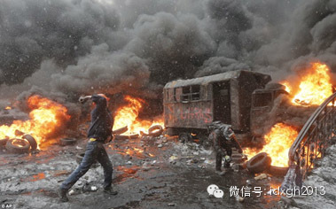

  

【大炮、马队、坦克：维稳的野蛮时代】

  

几乎自有权力以来，对付抗议示威乃至骚乱就成了政府的重要工作之一。巴黎人是世界上最有街垒巷战经验的市民。1852年拿破仑三世坐上法兰西王位后，任命奥斯曼主持巴
黎的大规模城市改造工程，巴黎一些窄小曲折的巷被笔直宽阔的马路取而代之，以便发生大规模群体事件时，可视情况不同而派出骑兵乃至动用大炮。它果然在后来镇压巴黎公社
时发挥了效用。

_ 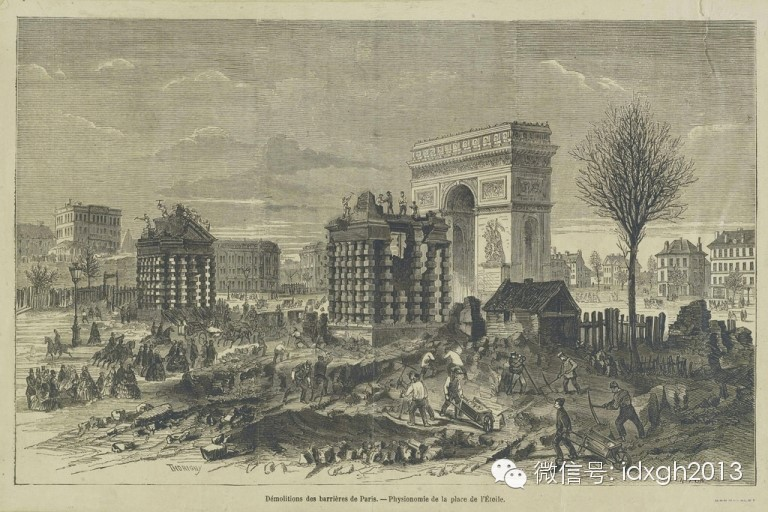_  

_巴黎星形广场改造工程_

  

在那个时代，发生大规模群体性事件，政府惯用的手段主要是武装部队。由政府组建的警察1829年诞生于英国，其最初任务只是维护基本社会秩序，当时伦敦是欧洲犯罪之都
，光天化日之下的抢劫盗窃甚至纵火蔚然成风。

  

警察的出现是文明的象征——棍棒代替了子弹和刺刀——英国警察的武器只是一支木制短棒，它和警察一起作为标配传入及其他国家。1912年后，法国警察又率先装备了用溴
乙酸乙酯制造的催泪手榴弹。然而，警察的编制和装备并不足以对付大规模群体性事件，在社会矛盾激烈的俄国，频繁出场的是手持马刀的哥萨克骑兵。

  

1929年10月24日，华尔街股灾引发全球经济危机，世界陷入动荡时代，警察力量不足是普遍现象。当时的英美，罢工引发骚乱，多由专门镇压劳工的保安公司来维持秩序
。这些人与罢工工人的区别是帽子，他们头戴礼帽，而工人至多头戴鸭舌帽，为此他们通常右臂会缠上一截布条。对付工人的武器是一根五十公分长的木棍及少量能发射催泪弹的
枪支。如果保安公司无法制止事态恶化，这时才会轮到军队上场。

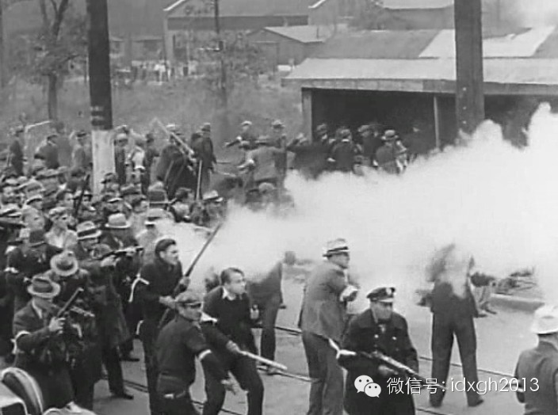  

_1932年美国一家保安公司正在帮助镇压罢工_

  

1930年代军队的镇压方式已变得非常专业而文明，人、马都配戴防毒面具的骑兵先用催泪瓦斯驱散骚乱者，然后在人群中纵马用棍棒左右开弓。如果遇到硬茬，坦克也会出场
——譬如在麦克阿瑟奉命镇压要求提前领到养老金的一战老兵时。那时的坦克虽然非常小，但比马队更有心理威慑力。

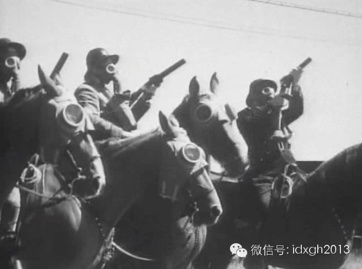  

_1932年向罢工者发散催泪瓦斯的美国骑兵_

    

今天，人们已经无法接受如此简单粗暴对付群体性事件的方式。骚乱人群控制已成为公共安全方面的一门显学，大多数国家都有专门组织特别的警力，在经过严格训练后，以最低
的生命和财产成本将骚乱扼制在摇篮状态。

  

正如历史上的诸多伟大智慧一样，现代骚乱控制体系同样起源于中国。

  

【“奈伊做忒”：世界第一个特警部队的诞生】

  

1843、1848、1849年英美法租界相继在上海划定，使得上海形成了一个租界社会。据《清末上海租界社会》一书记载，早期租界内的生活一片祥和：“上海租界的生
活有如英国乡村一般的平静，人们所感到的不安和忧虑皆微不足道。”

  

好景不长，随着太平军三次进攻上海，以及小刀会起义，上海及周边居民为躲避战乱纷纷逃进租界境。租界内的华人人口从“华洋分居”时期的500人激增到2万人。治安状况
急转直下——难民大都是无以为生的下层人民，还夹杂了大量流氓土匪甚至各国逃兵。一时间，租界内赌场、妓院林立，垃圾成堆。“持续多月，即使在租界之内闲游，人们亦认
为不携带武器是不安全的。”为应对治安恶化，西方人模仿欧洲出现的警察局，在公共租界内成立了“上海公共租界巡捕房”，相当于现在的市公安局。

  

然而，巡捕房的成立并没有让治安状况有多大程度的好转，除了难民源源不断注入租界，西人为节省经费，也大量聘用了待遇更低，因而更不愿意卖命的华捕、印捕——西人巡捕
的普通年薪为585两，而华捕却只有94两，印捕的待遇大概是华捕的两倍，但和西捕比还是有相当大的差距。

  

当时上海已成为公认的亚洲犯罪之都，各国的犯罪网络都在上海建立分支，游离在黑街暗巷的流氓更是多不胜数，而巡捕房的各籍巡捕是最普遍的攻击目标。刚刚调到上海巡捕房
才4个月的英国人费尔贝恩（WilliamE. Fairbairn），在一个背街的小巷里被连捅数刀，并被扔在自己的血泊里等死。

  

幸运的是费尔贝恩最终得以在医院康复。出院后费尔贝恩意识到，在一个如此危险的城市维护治安，不身怀绝技是不能生存的。赴上海前，他曾在英国驻远东海军服役，期间他曾
学习过朝鲜和日本的格斗术，是第一个从日本大师手中接过柔道和柔术黑带的西方人。当然，上海给了他很多实战锻炼机会：有资料称，费尔贝恩在上海工作期间，一共经历了6
00多次街头斗殴，多数情况下是以一敌众。他身上有数不清的伤疤。

  

1910年，他调任到上海三年后，费尔贝恩被委托训练整个巡捕房的巡捕。这时费尔贝恩已通过总结不同门派武术的经验，创造出了自己的格斗法——Defendu。这种打
法快、准、狠，接受过Defendu训练的巡捕，遇到黑社会暴徒时，可以轻松“奈伊做忒”（沪语：把他做了）。

_ 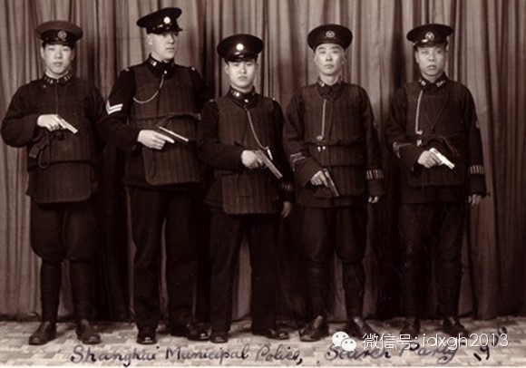_  

_1930年，已经被费尔贝恩训练过的巡捕们_

_ 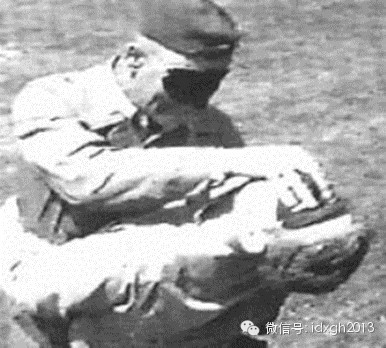_

_费尔贝恩的戳眼演示_

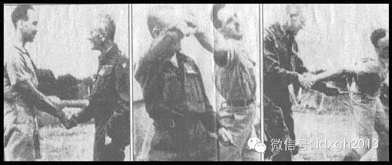

_费尔贝恩演示如何通过一个普通的握手制服对方_

  

1925年，五卅运动爆发，并最终在黑帮和流氓的参与下变成一场暴力骚乱。为应对这种大规模群体性事件，费尔贝恩组织和训练了一个巡捕分队，并设计了一整套战术，旨在
防止骚乱的扩散、防止抢劫以及避免平民伤亡。

  

费尔贝恩治理骚乱的经验，不但让世界上第一个特种部队——储备部队（reserveunit）诞生在上海，更让他本人成为这方面的权威——从上海公共租界巡捕房退役之
后，费尔贝恩先后训练了新加坡和赛普勒斯的骚乱控制部队，而包括美国海军陆战队和英国情报机构在内的诸多军队、特工组织和精英部队，都将他的Defendu作为格斗教
材。

  

【盾牌方阵：费尔贝恩的遗产】

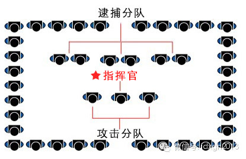  

_防暴警察经典方阵_

  

随着武器技术的进步，现在的骚乱控制部队和当时的上海公共租界巡捕房看起来应该还是有一定的差异，但是费尔贝恩当时设计的战术核心至今没有太大变化。

  

当全面骚乱爆发时，骚乱控制部队通常会组成一个方阵。方阵的四个边由防护严密、手持盾牌的分队组成，装备相对轻巧的指挥官、攻击型分队（使用警棍、催泪弹等非杀伤性武
器）和逮捕分队则位于队伍中央。

  

这种方阵的优点在于机动性强：在一场全面爆发的骚乱中，方阵很容易陷入四面楚歌的境地。这时，无论是哪个边队受攻击，那个边队就会被指派为方阵的前边。如此，不需要太
多的变换，整个方阵就能转变方向应对危机。同时，在一个边对陷入严重攻击的时候，其它分队可以迅速跟上，在攻击型分队提供火力掩护的同时，其它编队提供肉盾支持。

  

不是所有参与骚乱的人都是十恶不赦的歹徒——他们中的大部分都是看热闹的旁观者，或者是受广场效应而无端卷入的不明真相的围观群众。

  

逮捕这些人，是对警力资源的严重浪费（方阵中一般都会配有摄像人员，方便秋后算账），因此警方在试图快速平息骚乱时，总会优先控制领导人或者非常暴力的人。发现这样的
目标之后，方阵的前方分队会增加左右间距，让骚乱人群从身边通过，一旦目标进入到了方阵内部，间距被迅速关闭，逮捕分队便会以最快的速度制服目标。

  

当然，也不是每一次群众聚集都会演变成骚乱，但是当警方判断出一个人群有失控的可能，便会致力于将骚乱的种子扼杀在摇篮状态。比如下图中乌克兰警察面对相对平静的示威
人群时，排出了和人群等长的一字型人墙，墙后是更为机动的分队准备采取下一步行动。

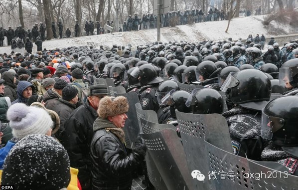  

_乌克兰防暴警察的人盾_  

  

当警民双方以这样的姿态僵持一段时间之后，人墙分队会突然开始整齐划一地敲打盾牌和跺脚，这样的声音足够让参与热情不高的群众心理防线崩溃，作鸟兽散。

  

【当代骚乱控制：驱散为主，降低伤亡】

  

然而，费尔贝恩的巨大贡献并不是一开始就被世界各国警察吸收。二战后，西方国家进入一个社会稳定、财富高速增长的黄金时代，大规模群体性事件发生频率急剧降低，控制骚
乱的技术和装备陷入一个停滞期。

  

譬如透明防暴盾牌和头盔面罩使用的聚碳酸酯，其大规模制造技术1958年就被德国拜耳公司发明，但它被开发于警用时已是近20年后。而英国警察1829年开始使用的木
质警棍，到20世纪90年代才改为新式的伸缩型警棍。

  

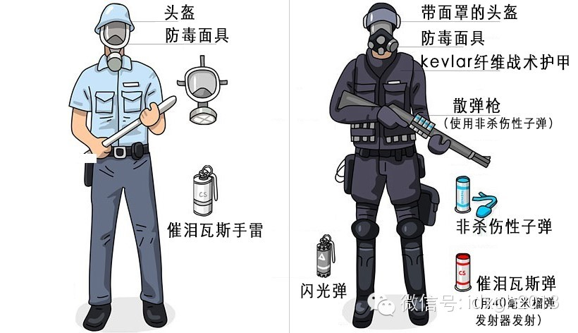

_1968年的美国防暴警察与2011年的对比（图片来自《纽约时报》）_

  

1960年代中期，西方各国受民权运动刺激，才大规模防暴武器和控制骚乱技术。最先有所反应的当然是街头运动文化源远流长的法国。1968年，受中国红卫兵运动启发，
法国爆发了“红色五月风暴”。

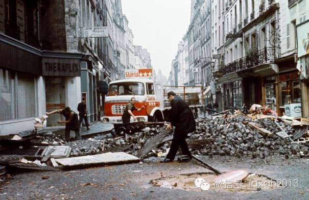

_巴黎街头的铺路砖被学生刨出来当成武器_  

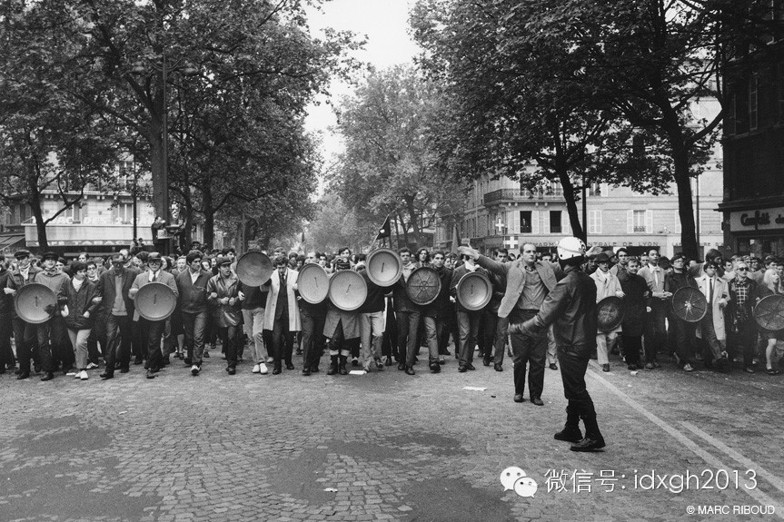

_1968年7月，手持缴获盾牌的巴黎游行者_

  

同一时期，美国警察在对付全国各地蔓延的反战运动和民权运动时，除了头盔别无防身物。有些时候他们极易于街头骚乱的一方混淆——1970年5月，美国反战学生与支持尼
克松的蓝领工人数次发生正面冲突，工人阶级队伍的标配是各式各样的安全帽，从空中完全无法区分工人和警察。

  

到了1970年代中期，西方各国的防暴警察在装备和技术上才大幅提升，与今天相差无几。1984年3月英国煤矿工人大罢工，持续时间长达一年之久，这时上阵的防暴警察
，盾牌、头盔、催泪瓦斯一应俱全。而且盾牌也发展出了两种形制，一种是便于机动时使用的圆形盾牌，一种是设置人墙障碍时用的方型盾牌。

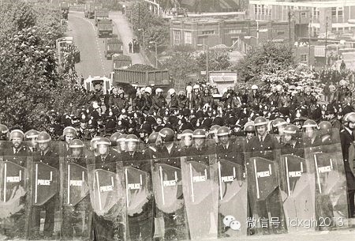

  _1984年5月29日英国警察对付大罢工组成盾墙_

  

这次大罢工最大的冲突1984年6月18日发生在罗瑟拉姆附近的欧格里夫焦化厂。这场被称为“欧格里夫战役”的大规模互殴，矿工和警察各出动了近1万人，有数名矿工纠
察队成员被骑警用警棍重创。此后，骑警这种野蛮暴力很少用于类似场合。

  

驱散为主，降低伤亡成了这个时代的基本特征——7年后，警方向矿工支付了42.5万英镑赔偿。

在西方国家防暴警察技术日新月异的同时，苏联等社会主义国家由于人民生活安定祥和，不但防暴技术没有跟上时代甚至没有专门的防暴警察。以至于1980年代中亚和波罗的
海地区出现大规模骚乱时，只能动用坦克和子弹。

  

倒是波兰因为多次发生社会动荡，在防暴技术和装备上与时俱进，团结工会闹事时，波兰防暴警察装备着与西方同行一样先进的盾牌头盔和催泪弹。

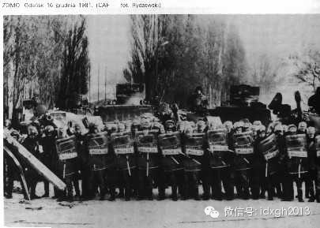  

_1981__年12月16日，波兰纪律部队在格但斯克造船厂组成盾墙_

  

1970年代这一波防暴技术和战术的更新，奠定了今日防暴警察的基本特征——哪怕是罗德西亚（今津巴布韦）这样的穷国因陋就简。随着技术的发展，防暴警察变得越来越像
太空战士，只不过，越是进步的技术，造成的人员伤亡和社会震荡越小。

   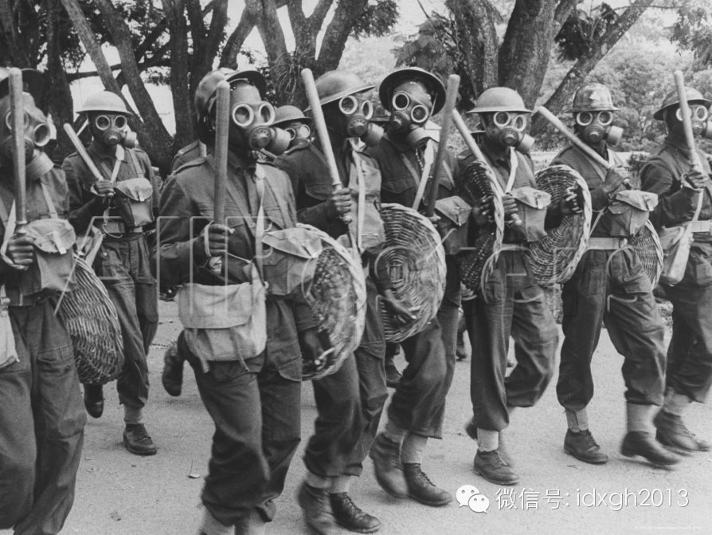

_1970年代手持柳条盾牌的罗德西亚（今津巴布韦）防暴警察_

  

当然，防暴警察不能只靠盾牌和头盔的保护组成人墙，人墙背后通常还会有多个人墙及机动部队。机动部队的职责主要还是在于制服与逮捕，而后备人墙部队则可以通过助跑获得
动量，然后突然以纵队从前排人墙背后穿出，之后以斜线前行，直到重新形成横排。这样，骚乱群众就会被有效推后一段距离。

  

非杀伤性攻击性武器是骚乱控制的最后一道防线，当人群失去控制，暴力不可避免时，警方就会运用非杀伤性攻击武器来制服人群——或者大多数情况之下，将人群有意驱赶到一
个指定位置，并逐渐分散人群。防暴榴弹发射器枪和专用子弹是最常用的武器之一。

   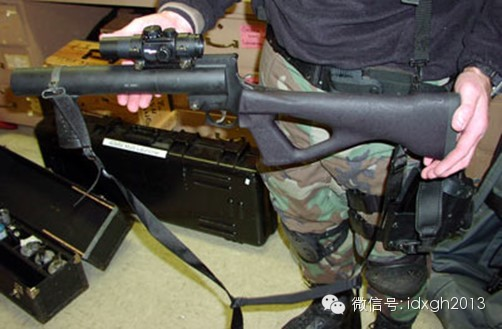

_防暴专用40毫米榴弹发射器枪，上为单发，精度较高，下为连发_

  

防暴专用的榴弹有多种选择，常见的有木弹和橡胶弹，通常会发射向地面，这样榴弹在反弹地面之后集中骚乱者腿部。而泡沫榴弹因为质量太轻只能近距使用，通常它用来攻击那
些距离方阵太近并可能构成威胁的个体。

  

烟雾弹、催泪瓦斯等也是通过榴弹枪发射，但是它们的使用通常比较少——因为他们发出的声音和制造的画面很可能给骚乱者带来烈士般的苍凉悲壮感，而防暴警察自身总也不能
避免涕泪满衣的结局，即便他们戴着防毒面具。

  

胡椒弹是防暴警察另一个常用武器，胡椒弹在击中身体之后将胡椒液释放出来。若人群中有老人或者小孩，防暴警察则会发射普通的水弹——对早已成为惊弓之鸟的骚乱人群，水
弹依然能造成足够的恐吓效应。发射胡椒弹的枪的结构非常类似彩蛋枪。

   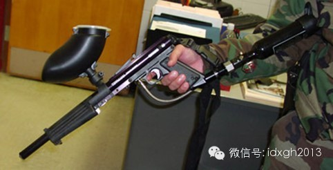

_胡椒弹发射枪_

  

乌克兰的骚乱愈演愈烈，俄罗斯外交部警告说“骚乱即将失控”。两个月的和平示威，最终在政府蔑视和挑衅下落入暴力深渊，可见战术和装备不是控制骚乱的最好手段——难道
对话谈判，对一个政府来说，其羞辱一定会大过警民双方向全世界展示自己战斗民族的风采吗？

  

[大象公会所有文章均为原创，版权归大象公会所有。如希望转载，请事前联系我们：idaxiang@idaxiang.org ]

[阅读原文](http://mp.weixin.qq.com/s?__biz=MjM5NzQwNjcyMQ==&mid=200018316&idx=1&sn
=98e428dac003e59914048007a7beb26a&scene=1#rd)

