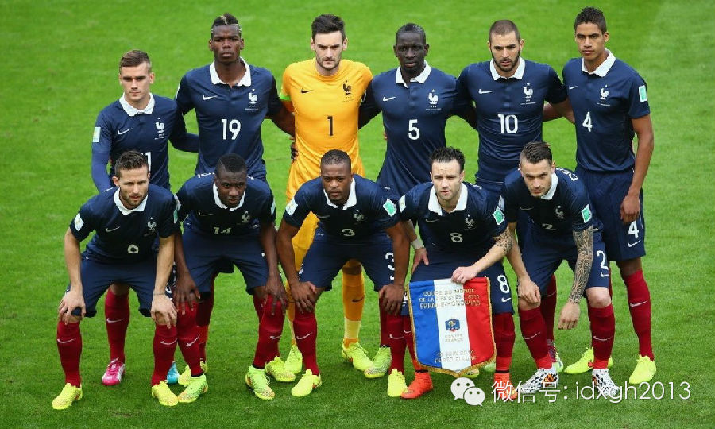
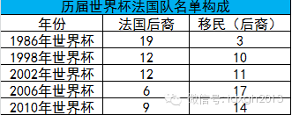
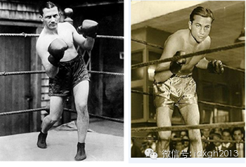
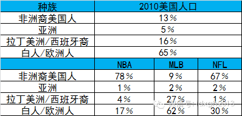
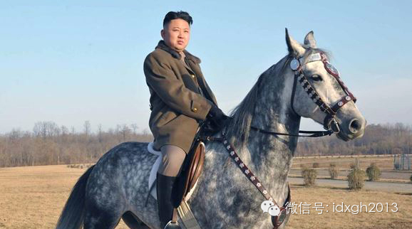
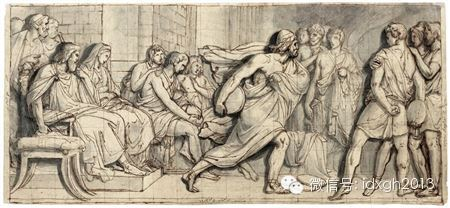
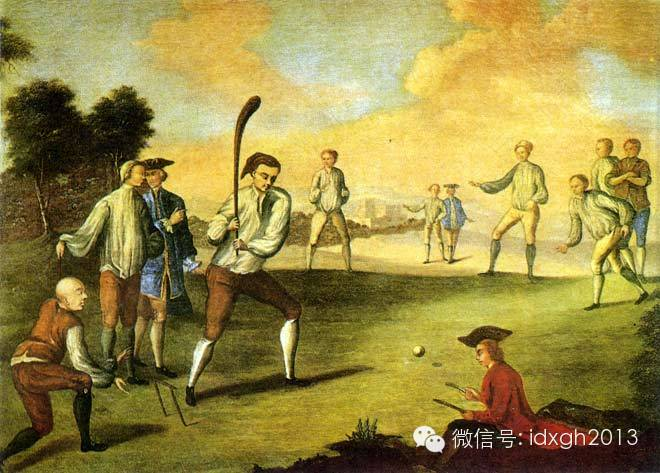
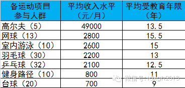
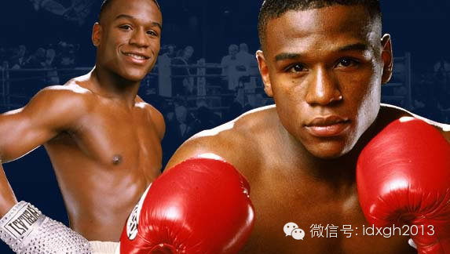
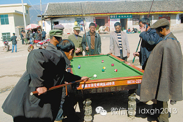

**为什么世界杯的欧洲球队在变“黑”？为什么越是“高大上”的体育项目白人越多？不是身体素质原因，是经济原因。**

  

文/杜修琪

  

如何区分伪球迷？观看法国队比赛是个好方法。酒吧里，如果同座一脸困惑询问：“这是法国队?难道不是尼日利亚或者喀麦隆么？”此时你还想认真看球，就可转身寻找下一桌
了。

  

6月21日世界杯瑞士对法国的比赛，堪称伪球迷的灾难之作。双方移民后裔比重都超过一半，让人恍惚间连呼上当，以为看的是洪都拉斯vs厄瓜多尔。为保持观众的专业水平
，法国真是煞费苦心。电影中金发碧眼的帅小伙不见了，取而代之的是黑人球员博格巴、萨尼亚、阿尔及利亚后裔本泽马等。

  

2014年6月21日瑞士vs法国——法国队阵容

  

历届世界杯法国队名单构成

  

不仅法国移民球员增加，球员肤色变“深”是欧洲趋势。德国的土耳其后裔帮助他们2000年后重新崛起，荷兰、英格兰、比利时首发阵容都不止一位移民后裔，球队中的移民
比例都远超总人口比例。

  

为什么会出现这种现象？最流行的解释是身体素质。黑人的身体素质更优越，适合运动，当然挤掉白人。但阿尔及利亚人、土耳其人、摩洛哥人的各项身体指标不可能比西欧人更
出色，为什么他们的移民后裔比重比黑人、欧洲人都高？即使是黑人，也不能凭身体素质通吃。相比讲求配合、团队协作的足球，拳击更为直接，更拼身体，但黑人运动员只在2
0世纪中期称雄一时，现在前苏联国家的拳手已将美国黑人的地位抢了过来，更有趣的是，黑人统治拳击之前，拳坛霸主是一个被广泛认为羸弱的民族——犹太人。

  

对，你没看错。两次世界大战期间，犹太人曾是美国拳坛最活跃的族群，二三十年代1/3的拳击手是犹太人，在1910年—1940年，犹太人赢得了26个世界冠军，诞生
了传奇拳王本尼**伦纳德、巴尼**罗斯。彼时的犹太人在欧洲备受压迫，大批前往北美新大陆，根基不深、穷困潦倒。拳击成就让他们一脚踢开病夫的招牌，第一次在美国社
会站了起来。

  

这种现象还是身体素质决定的吗？

  

20世纪初期,两个家喻户晓的犹太裔拳击运动员。左为本尼**伦纳德，右为巴尼**罗斯

  

**【上升的梦想】**

  

移民后裔获得成就的比重高显然与身体素质没多大关系。实际上，这与体育本身的特点有关。

  

体育是一项身体的锻炼，也是一种社会活动。围绕体育的组织、规则、文化、多重社会、政治、经济因素，出现一个伟大的运动员，一个伟大的赛事，或者一个广受欢迎的项目，
必定有适当的社会环境，仅凭身体素质或者人数众多并不保证获得成就。典型例子是世界杯期间，奋力在友谊赛输给马里的中国男足。

  

欧洲移民后裔在足球上的成功，和他们其他上升通道狭窄有很大关系。布尔迪厄在著作《the weight of the world》中，采访了法国的边缘人群，多数
人都在抱怨移民后裔“无所事事，破坏社区”，同样贫困的白人也抱怨阿尔及利亚青年“不工作，不吃苦，充满暴力欲”，是“麻烦的来源”。在德国，土耳其后裔占移民总数2
/3，平均收入只有德国人的一半，受教育程度偏低，因此，足球成了土耳其裔年轻人跨入上层最快捷的方式。

  

统治美国拳坛的犹太人，其时正在经历融入美国社会的痛苦。1911年，纽约城区75％城市的妓女是犹太人，50％
的妓院由犹太人所拥有。1921年，纽约州监狱20％的犯人是犹太人，他们包揽了几乎全部的走私犯罪。

  

二战结束后，退伍军人权利法案和民权运动兴起，增加了美国少数族裔的上升渠道，1950年后犹太拳击手迅速从拳坛隐匿。在此前后，另两支拳坛重要力量是爱尔兰人和意大
利人，他们先后称雄职业拳击，并在犹太人从走私和卖淫行业退出时接管过去。如今，成功融合进美国主流社会的犹太人被视为智慧和精明化身，意大利人和爱尔兰人则仍与黑帮
形象紧密相连。

  

拳击和足球虽然需要刻苦训练，其入门的门槛却不算高，一旦成名回报率极高。比较类似的如篮球，橄榄球，它们都富有观赏性，商业化程度高。这些项目吸引了移民等较低阶层
。另一些项目虽然商业化运营，富有观赏性，却少见来自较低社会阶层的球员，比如冰球。美国四大联盟中，冰球联盟（NHL）非裔球员最少，现役与退役球员总共78人，还
不足NBA一年的球员多。

  

2010年美国种族人数以及其在各项运动中所占比重

  

这是由于装备价格高昂，且入门成本高，超出了较低阶层的承受能力，无法如拳击、足球那样在简易的场地下刻苦练习，因此失去了这条上升通道。与足球和篮球相比，冰球更像
是中产阶级的自娱。

  

**【不同阶层的格调】**

  

一些运动是阶层上升的途径，另一些则是上升后追逐的目标，比如马术。马术是奥运会上最贵的项目，贵到为成绩一掷千金的东德、苏联都选择放弃。此外，赛艇、高尔夫等都是
这种类型。这些运动因为门槛过高，自动将低社会阶层的人排除。较高阶层的人因经济、政治、社会地位的优势把控着这些运动。悠闲的时间、奢侈的设备、雍容宽阔的场地，这
一切造成了资源丰富的贵族与贫乏阶层间不可逾越的高墙。

  

金正恩酷爱马术

  

回顾体育的发展历史，体育都带有强烈的阶级特点。古希腊时期，体育本身就是贵族的特权，平民没有时间也没有金钱参与。《奥德赛》中，伊卡萨的 Odysseus
为了向科浮岛国王Alkinooos 展示其贵族荣耀，亲自上阵扔铁饼，以示技巧之娴熟。

  

Odysseus 扔铁饼

  

这种贵族垄断的状况一直维持到工业革命前。此后，逐渐有了闲暇和金钱的民众扩大了体育基础，赌博活动点燃了运动的热情，贵族失去了以往的特权。

  

1660年，英国乡间绅士们为了在赌桌上更好的收获，创建了世界上第一只专业板球队。从此，板球俱乐部盛行，球员的交流和竞争促进了运动发展，同时加剧了狂热的赌球风
气。

  

早期英国的板球运动

  

18世纪后，英国的城市化和工业化加深，更多的民众聚集到城镇，被体育运动所吸引。1848年，为了让牛津和剑桥间的足球比赛更加规范，第一份正式的规则《剑桥规则》
诞生，更规范的体育形式又促进更广的区域定期比赛，形成了专业的联赛。1888年，基于俱乐部基础的英格兰足球联赛开始，第一运动随着英帝国的扩张，传播到世界各地。

  

职业俱乐部联赛建立后，凭借闲暇时间丰富经常获胜的贵族因失去了时间优势，被职业球员挤了出来，转而寻找更符合其地位的运动，马球、高尔夫、斯诺克等在此时获得亲睐。

  

贵族的心态和寻求阶层上升的移民正好相反：他们希望将自身与社会其他阶层区分开，不希望下级阶层加入。体育参与方式是实施这种社会区分的有效方法，越昂贵、费时、占地
的运动，越可能被贵族选中。

  

对普通民众来讲，体育最大的乐趣是比赛的刺激可以缓解生活的乏味与辛苦，因此他们更偏向于价格低廉、场面火爆的运动。

  

2008年，学者吴振对中国各运动参与人群的分析

  

阶级分层最为明显的英国社会，体育项目的差别非常醒目。直到近半个世纪，在民主化的强大压力下，英国贵族才开始亲近工人阶级的运动。皇室成员偶尔出席足球的比赛，伊丽
莎白女王还询问贝克汉姆的脚伤，以示亲民。

  

进入20世纪，大众传媒的发展造就了许多体育明星，各国家的联赛成为体育的关注中心。2013年，世界上收入最高的运动员梅威瑟一年进账1.05亿美元，其构成也极富
拳击这项平民运动的特点：全部来自比赛奖金，没有一分钱来自广告代言。这种明星不会得到上流社会喜欢，但平民的狂热足够梅威瑟占据世界收入最高运动员的宝座。

  

弗洛伊德**梅威瑟,美国职业拳击手

  

**【搅局者】**

  

除贵族和平民运动，还有一种体系，能让最贫穷的人从事贵族运动，在没有文化积淀和社会支持时，凭借有规划的训练摘金夺银，这就是举国体制。

  

举国体制依赖于强有力的行政力量，以便调集和动员一国之内所有资源，集训某一运动项目。历史上拥有这种动员力的都是社会主义国家，登峰造极的是东德。

  

1968到1988的20年间，东德共获得519枚奥运奖牌，仅落后前苏联（774枚）和美国（624枚），虽然人口只有1600万，面积只有11万平方公里。

  

东德最擅长的奥运项目，是女子田径、游泳和体操。女子运动由于观赏性不足，市场化程度弱，多数国家都是爱好者自己出钱训练，与职业联赛的强度不能相比。东德集中了全国
的运动科学家，挑选适龄女子，制定精确的训练计划，其强度甚至高于联赛中的职业运动员。

  

同时，东德还利用举国体制的优势，动员另一项资源——兴奋剂，来提高运动成绩。柏林墙倒塌后，诸多档案解锁，东德有计划使用兴奋剂的事件被查明：至少10000名运动
员，在指令下长期服用各类禁药，至少100名运动员死亡。大部分优秀运动员都在服用禁药，几乎所有的奥运会奖牌获得者都包括在内。

  

东欧剧变后，中国就成为世界上举国体制的代表。虽然没有获得东德那样的奖牌成就，中国的举国体制也显露出威力——在跳水、击剑、体操、举重等一系列商业化程度低，观赏
性弱的项目上屡获世界冠军。

  

欧洲贵族伙伴们惊呆了，本来没有平民参与且昂贵的个人化项目应由他们尽情表演，没成想被毫无运动基础的东方国度击败。但这并不是最致命的，当趿拉着拖鞋，叼着半根烟的
小镇青年成群结队打起“斯诺克”，“英特耐雄耐尔”真的要实现了。

  

  

> 版权声明：  
大象公会所有文章均为原创，版权归大象公会所有。如希望转载，请事前联系我们： bd@idaxiang.org

大象公会：知识、见识、见闻

微信：idxgh2013

微博：@大象公会

投稿：letters@idaxiang.org

商务合作：bd@idaxiang.org

[阅读原文](http://mp.weixin.qq.com/s?__biz=MjM5NzQwNjcyMQ==&mid=203185673&idx=1&sn
=39d05e2d9b2d6eae3b58bb1014adae4d&scene=0#rd)

