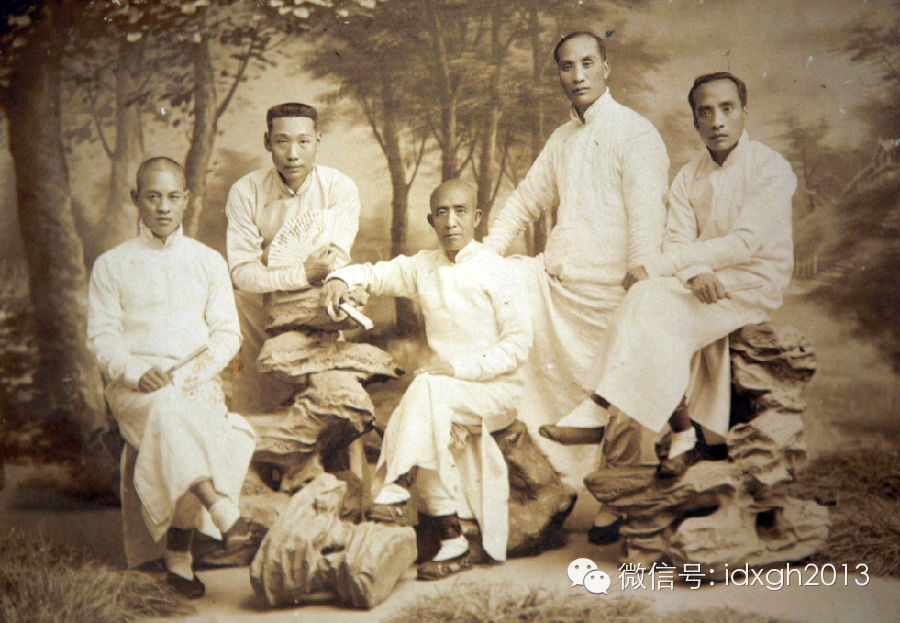
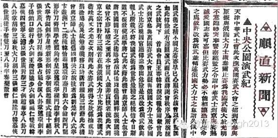
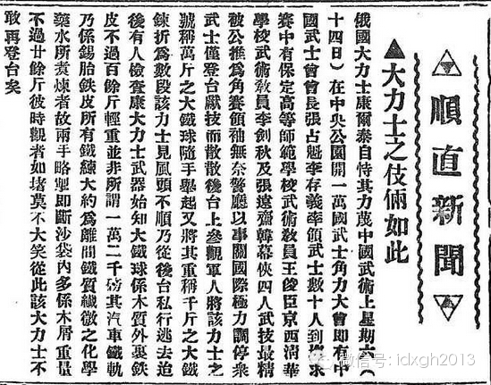
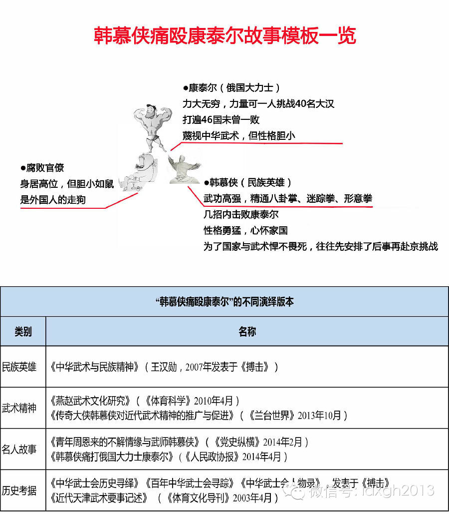
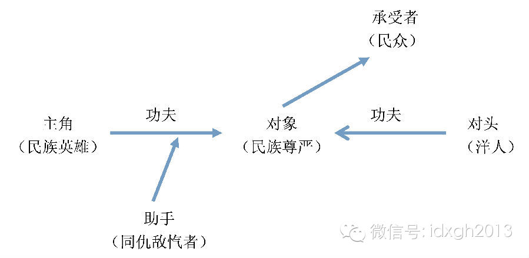

**一个俄国大力士，不远万里来到中国。为了鼓舞中国人的民族自尊心，在不同时间、不同地点，被流派各异的中国武术家反复击败——这是中国近代的武术神话，一代又一代杂志编辑和电影导演，用文艺创作洗刷着自己人赋予的民族耻辱。**  

  

文/李清末

  

20世纪90年代初，由香港制作的一系列功夫电影火遍大江南北。时空背景放在了内忧外患的清末民初。大家因此熟悉了这样一个桥段：无论主角是陈真、霍元甲还是黄飞鸿，
其成名路上往往要击败一个身体强壮、态度傲慢的外籍大力士。

  

从文艺创造到历史的距离似乎并不遥远。今天，我们依然可以在网络上轻易检索出“曾经打败西方大力士的武术家”的列表。其中最有名的故事里，反派主角外号“震寰球”，是
一位曾游历全球的俄国大力士，真名康泰尔的他获得过许多拳击比赛冠军。

  

故事的时间地点非常详尽：1918年9月康泰尔到达北京，在中央公园设擂比武，还在报纸上刊载了广告，其文案中的货币单位极为诡异——“康君乃世界第一大力士，今来京
特设擂台三天。凡能打一拳或踢一脚者，赏50卢比。能将他打倒一次者，奖金牌一枚。”

  

在故事中，天津中华武士会在民族精神感召下，派出二代弟子韩慕侠等人应战。中国武术大师当然获得了最后的胜利。

  

可惜这项“荣誉”并不专属韩慕侠。《体育文史》杂志曾在1993年发表《刘百川击败康泰尔始末》，新增一位为国扬威的好汉外，故事的时间地点也转换到了1916年的上
海；而主角身份是另一个“微创新”的突破口。一位回族身份的河北武术家王子平，凭借击败康泰尔的事迹也进入了《中国穆斯林》《回族研究》等期刊杂志。

  

如果把反派的姓名再修改一下，名单还可以开列的更长：七星蟑螂拳传人范旭东、少林高僧释德根、中华武士会的创办者等人。他们都有同样的经历——某西方大力士在中国摆擂
，打伤或打死中国武师多人，吓得无人再敢挑战，主人公看到后大怒，在几回合内击败或直接打死西方大力士。

  

“本土武术家痛殴某国大力士”已成为一种文艺创作模版。闪耀着爱国主义气息的故事，经历了几乎百年不间断的编撰、润色、演绎和传播。

  

韩慕侠（左二）1918年已经41岁，但是在故事中他三招把“力气一万四千磅”的康泰尔打得倒地不起

  

**【康泰尔同志，弱者需要您】**  

  

若具备常识，应能从网络流传的“击败大力士”故事中看到许多细节硬伤；而学过实用技击术的人，也一定不会相信传统武术家有击败技击术精湛的大力士的可能。生于1908
年且自幼习武的武术家赵道新，在接受《精武》杂志访谈时，便直言传统武术基本不存在技击性。

  

技击术注重技巧和力量，对体能的要求很高。不像传统武术那样充满文化内涵和中国哲学大名词。在实用主义的技击术视角下，“不战而屈人之兵”“中庸和谐”“以柔克刚”“
后发制人”是一系列违背技击原则的作死行为。

  

关于康泰尔最早的记载见于天津《益世报》1918年9月17日刊发的《中央公园演武纪》。相比荒诞的故事，这则报道是严肃的。报道中的康泰尔来华以表演为主。而中国的
武士会成员上台表演时，只是抬起康泰尔曾举过的铁球并“绕场三匝”，因此获得了奖牌。

  

《益世报》1918年9月17日的报道详尽地记述了比赛过程

  

那么，一则平白无奇的报道是如何演化成今天这个样子？

  

我们熟悉的近代历史叙事一般为“祖国饱受列强欺凌”。这样的话语本身含有一定“弱者想象”成分。有了“弱者想象”，就会合乎逻辑地提出道义诉求，还需要在精神层面得到
赈救。“弱者”形象首先意味着屈辱，更能带来“弱者”的自我身份认同。例如台湾政大教授杨瑞松曾做过研究，发现特别能凝聚爱国心与救亡责任感的“东亚病夫”一词，存在
着很大误会——

  

西方人只用这个词汇描述国家意义上的中国，指向国家治理方面始终不见起色的近代中国；而恨铁不成钢的本土民族主义知识分子，在传播中将之上升到了“中国人是东亚病夫”
，病夫与身体素质联系到了一起。

  

面对挑战，中国精英以新建构的中华国族主义对抗帝国主义。譬如近代著名“民族发明家”梁启超就说：“知他人以帝国主义来侵之可畏，而速养成我所固有之民族主义以抵制之
，斯今日我国民所当汲汲者也。”

  

梁启超建构国族主义时，将“国俗”视为国家精神（他用词为“国性”）的一部分，中医、武术、乃至舞狮这样的民俗都在其列。当武术上升到了近乎等同中国传统文化的地位，
并在国族建构中承担“靠打赢外国人换取尊严”的重要任务后，就提供了激发民族主义的可能。例如，电影中的陈真一定要踢碎日本人手书的“东亚病夫”牌匾。

  

这种心结在20世纪90年代的电影中，依然有所体现。例如：《东方不败风云再起》是《笑傲江湖》电影三部曲的最后一部，其时空设定在更早的明代。雄雌莫辨的东方不败，
面对大航海时代的殖民者毫不畏惧，徒手接子弹后，说出了一句最能凸显“弱者”翻盘愿望的雷人台词：“你有科学，我有神功！”

  

**【民族主义越强大，康泰尔战绩越差】**

**  
**

最先将康泰尔来华改写成如今故事雏形且有相当影响力的，是三十年代民国杂志《国术周刊》主编金警钟撰写的文章。他新增了演武前夜的情节：韩慕侠不满限于“演武”，遂到
康泰尔居住的六国饭店将其打败，第二天又在中央公园将康泰尔吓跑。

  

“中国武术大师击败外国大力士”的桥段自此大量传播。《国术周刊》是一份国民政府官办的杂志。“官方媒体”不顾新闻原则看来是有道统的。国民党对武术（即国术）的热爱
不单单源于国民党浓重的民族主义气质，更因为早在1909年，陈其美、宋教仁便委托国术师组织“精武体操会”，该会是霍元甲所属“精武会”的前身。

  

国民政府成立不到一年时，就设立了中央国术馆，并发展成一套从中央到县级的武术推广体系。其实，在中国两千余年不绝的“大一统”治理逻辑下，韩非子“儒以文乱法,
侠以武犯禁”的教导，历代领导核心始终铭记。国民党人的例外，是因为清中叶以后中央政府始终没能重建暴力垄断的权威。

  

太平天国起义时，清中央对暴力机器的垄断明显松动。地方武装崛起，一路发展直到庚子拳乱，东南互保，各省的军阀化几近完成。地方实力派认为武术家是难得的人才，需求空
前繁荣。

  

更为重要的因素在于庚子拳乱后，清廷试行新政。采取了一系列宽松开明政策，为清末社会团体的兴起和武术社团的出现奠定了基础。故事的发生自此具有了合理的时代背景。

  

直至中国大陆权力更迭，民国武师多有“会道门”背景，并与国民党关系深厚。因此在镇压反动会道门运动后一蹶不振。当大陆告别高度意识形态化的年月，对外开放后，中外的
交流令落差再一次显现出来，民族主义的复兴与之同步。

  

在此背景下，文艺作品市场对一切能证明“我们不差，反而很强大”的信息都空前渴望，所有能承载如此信息的形式——小说，杂志，电影，连环画，都会卖座。

  

行业杂志采编人员对本国、本行业的赤诚从未改变。1982年1月《北京体育》杂志采访了韩慕侠的女儿韩小侠，最终成文的报道中，康泰尔被描述为身高两米，力量一万四千
磅的大力士，更打遍了46个国家，另取得10枚金牌。

  

这一版故事体现了对细节的追求。比如康泰尔在北京的事迹又多了“单手拔河胜了20名大汉”；比武阶段摆下的擂台原则为“打死勿论”，时间改为七天，前五天无人敢应战，
韩慕侠听到消息后义愤填膺，立志绝不让后世记载为“无人应战”。于是，考虑到被打死的可能，便安排好后事赶赴北京。

  

《益世报》9月18日的报道揭露了康泰尔只是一位用假道具行骗的卖艺人

  

故事的演化与完善几乎没有尽头。

  

1988年，一本《武林奇杰韩慕侠》的小说又向前迈出了一大步。书中先描述康泰尔遍访天下高手勤奋学艺，后周游各国却在上海被中国拳师打败，于是改变策略在北京演武，
这样一来就“向下兼容”了最初的报道。但人到北京后，骄狂复发，主持举办万国武术大会。整个故事在多处进行了戏剧化处理，为了使42岁的韩慕侠参加比赛，还加入了三顾
茅庐的桥段。

  

1995年，韩小侠女士将整个故事提升到了不可企及的高度——他的父亲成为了周恩来的师父。发表在综合性文史期刊《纵横》的这篇文章，除了将《武林奇杰韩慕侠》中虚构
的故事概要引用外，还描写了韩慕侠教周恩来形意拳的“历史”，据称，此后功夫高手周恩来在指导中央特科工作时，因为武功高强甚至亲赴惩治叛徒的第一线。

  

近年来，韩慕侠的故事依然在广泛传播

  

**【香港电影的推波助澜】**

**  
**

文字工作显然不够，电影才是塑造爱国武术家的最好手法。

  

进入70年代，香港功夫片崛起。“打败西方大力士”的始作俑者，即为邵氏公司出品的《龙虎斗》，其后李小龙的《猛龙过江》《精武门》等片影响更大。这类故事被一而再、
再而三地搬上银幕。

  

20世纪90年代，香港功夫片强势登陆。扶清灭洋的黄飞鸿、反清灭洋的红灯照、民国建立后的霍元甲、陈真，为观众提供了更为真实的武术救国的样本。这一时期，由徐克导
演或监制，李连杰主演的几部黄飞鸿系列电影成就最高。

  

此前，黄飞鸿在其他导演的电影中仅是一个惩恶扬善、打抱不平的侠义英雄，而徐克片中的黄飞鸿不仅是抗击外敌的民族英雄，还和一个象征着现代文明的人物形象——十三姨，
有了感情纠葛。黄飞鸿谈着恋爱学着英语，了解各种先进技术，甚至在最后认识到武术的局限，开始使用西洋枪械来御敌。

  

相比同期《中国可以说不》那种只有肾上腺素没有脑细胞的叫喊，黄飞鸿系列电影估计是90年代普通中国大众能接触到的最健康的民族主义了。

  

不过，事情也会起变化。进入新世纪，在各种抗日电视剧影响下，武侠电影推陈出新。新版《霍元甲》中，李连杰起初打败了“一拳可以打穿长城，一个小指头可以捏死一名中国
武师”的英国拳王奥比音，但外国商人为了挽回自己的面子及金钱，又设计了一场霍元甲一比四的车轮战——故事已经演化为一群居心叵测的外来商人同中华武术精神的较量。霍
元甲连胜英国拳王史密夫、比利时皇家骑士队总教练荷索、欧洲击剑冠军安东尼后，被日本人毒杀。

  

中国武术家与外国大力士故事的模板

  

赵文卓在主演的内地香港合拍片《苏乞儿》中，苏乞儿单场打败了3名西方大力士。大力士不但三打一，还会在场上使用斧头、匕首、药剂等违规器物，这无疑反衬了国术家们的
凛然正气。

  

另一位打星甄子丹则在《叶问2》中打败英籍世界拳击冠军后，发表了一段耐人寻味的演讲：“今天的胜负，我不是想证明中国武术比西洋拳更优秀。人的地位虽然有高低之分，
但人格不应该有贵贱之别，我很希望，从这一刻开始，我们大家懂得怎么去互相尊重。”

  

相比1990年代谦卑的学习态度，富裕发达起来的中国，已经有“更优秀”的自信。然而不变的，是对尊重的饥渴。

  

> 版权声明：  

> 大象公会所有文章均为原创，版权归大象公会所有。如希望转载，请事前联系我们： bd@idaxiang.org

大象公会：知识、见识、见闻

微信：idxgh2013

微博：@大象公会

投稿：letters@idaxiang.org

商务合作：bd@idaxiang.org

举报

[阅读原文](http://mp.weixin.qq.com/s?__biz=MjM5NzQwNjcyMQ==&mid=204764617&idx=1&sn
=104350689c60e972d2338b18843d5f50&scene=0#rd)

