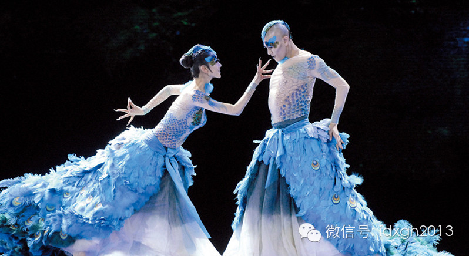
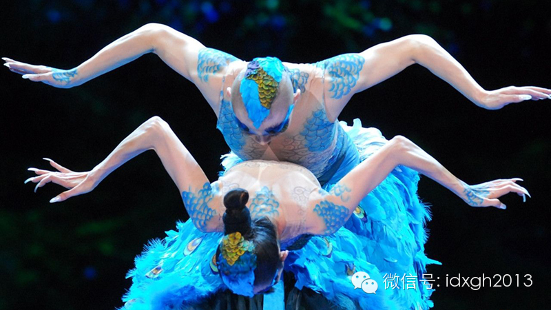
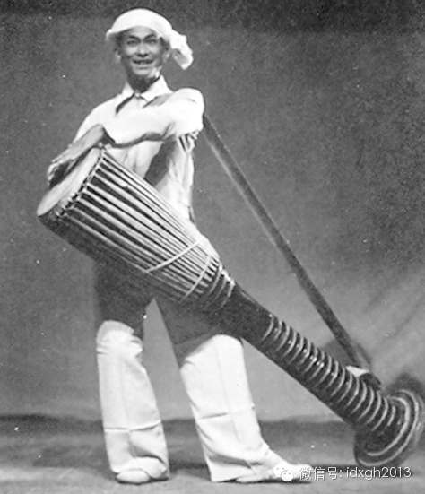
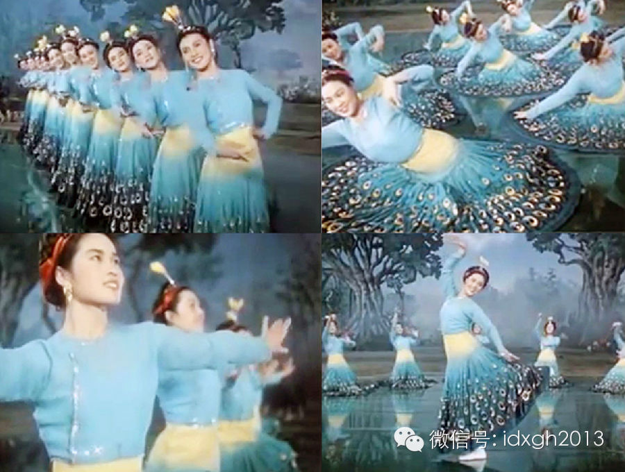
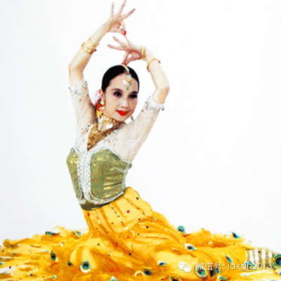
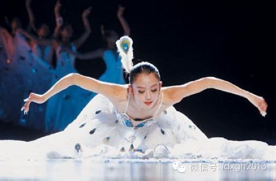
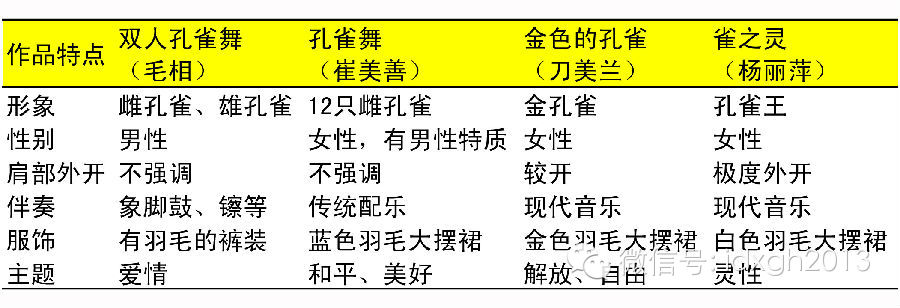
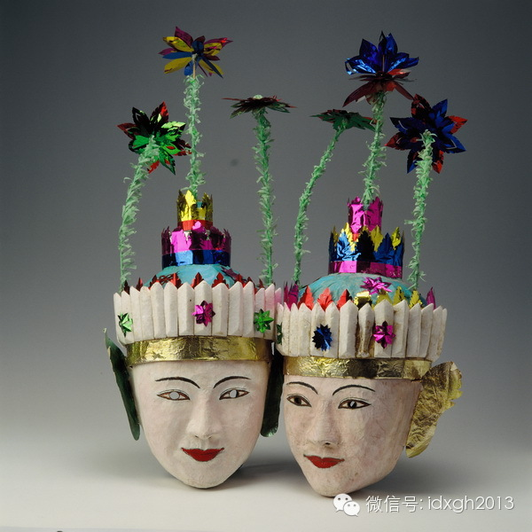
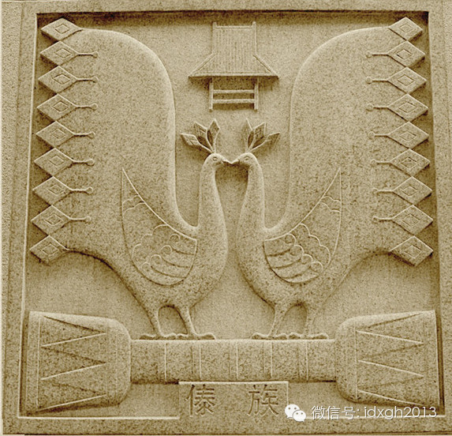

**白族姑娘杨丽萍所跳的孔雀舞，与傣族最初的舞蹈相差甚远。从1951年开始，舞蹈中就被加入了蒙古族、维吾尔族等多个民族的元素，时至今日，“孔雀舞”和“傣族”的联系已十分模糊。是什么力量在推动它不断改变？**

**  
**

文/李晓璇

  

1956年12月16日，云南德宏州举行中缅边民联欢大会，两国总理一同观看了一场颇有特色的舞蹈——《双人孔雀舞》。表演结束后，周恩来紧握住演员毛相、白文芬的手
说：“果然名不虚传，孔雀舞很优美，但还要继续发展，让它更加完美”。

  

此时的孔雀舞已与传统舞大相径庭：从单一男性表演变为男女同台，融入了维尔吾族、蒙古族等歌舞元素后，第一次将祭祀、自娱的动作编排为现代意义上的舞蹈。

  

而周恩来的话又让孔雀舞的变化更进一步。半个世纪后的今天，杨丽萍等艺术家的表演中几乎看不到传统男子独舞的痕迹，即使标志性的“三道弯”动作，也由传统的静态、横向
为主，变为大量运用头和胸、腰和臀、胯和腿呈现的S状曲线——对于年长的傣族人而言，“孔雀舞”与“傣族”，都有一种挥之不去的陌生感。

  

2012年春晚，杨丽萍、王迪表演的舞蹈《雀之恋》

  

**【苏式文化制造的“民族舞”】**  

  

孔雀舞的改造，源于1951年中央民族学院文工团对云南的访问。

  

艺术创作以毛泽东《在延安文艺座谈会上的讲话》精神为指导，强调民族、民间特色。同时，苏联红旗歌舞团、国立民间舞蹈团、小白桦树舞蹈团陆续访问中国，其民族舞蹈强烈
、直观地冲击了中国舞蹈界。为了创作有民族特色的作品，中央民族学院文工团到各地采风。

  

当时，孔雀舞艺人毛相正在民族干部培训班学习。一天晚会上，毛相为访问团表演了相对原始的孔雀舞，中央民族学院文工团十分赞赏，吸纳他为成员。

  

这次邂逅成了孔雀舞发展的关键转折。很快，包括毛相在内的大批演员前往苏联学习先进经验。

  

云南德宏的民间艺人毛相，他首次将孔雀舞带上舞台

  

经过一番全新的艺术培训，毛相创作了更先进的“双人孔雀舞”。他调动了年轻时对景颇族、德昂族、阿昌族舞蹈的观察，糅合了大鹏鸟舞、鹭鸳舞、大象舞、花环舞的元素，并
且在细节上，加入了蒙古族的硬肩、软肩、笑肩、抖肩，维吾尔族动头、晃颈的动作，孔雀舞因此焕然一新。  

  

不过，这次改造仍然保有原有的孔雀舞基础，由男性表演，同时动律上以传统走步为主:两膝微曲,脚跟主动向上抬起，重拍在下全脚落地，基本保持上下均匀的节奏。舞蹈姿态
以四肢弯曲为主，身体主干的弯曲并不明显，通过手臂和手形的位置变化形成各种孔雀姿态。

  

最关键的变革是在舞蹈编排上。以孔雀生活习性为主线，使得孔雀舞“有头有尾”，成为完整的舞蹈节目。

  

双人孔雀舞反响不错。中央歌舞团创作室的核心编导金明很快拜访毛相，这是一次关键的变动——专业人士第一次加入孔雀舞改造，让进程陡然加速。

  

专业的金明迅速接管了新舞的创作。在金明看来，要重点体现傣族姑娘的柔美，模仿孔雀的优雅造型再合适不过。于是，孔雀舞就此换了性别，服饰也从长裤变成了长裙。

  

此时的中国舞蹈界正虚心地向苏联学习，全方位引进古典芭蕾训练体系。因此，金明在体态、技巧处理中突显了延伸、拉长的芭蕾审美，比毛相舞蹈动作中的弯曲和小巧更进一步
。同时，为提炼傣族的民族特性，他突出了传统傣族舞蹈中由呼吸带动的上下动律元素。并且，为了让表演更出色，一位朝鲜族姑娘被选为领舞者。

  

由金明编导，朝鲜族演员崔美善表演的《孔雀舞》，这也是孔雀舞自毛相后第一次由专业演员表演

  

一系列的改变使得“孔雀舞”的形态与民间大相径庭，虽背离了传统，却十分符合现代审美。

  

1957年，《孔雀舞》获得了苏联举办的第六届世界青年联欢节舞蹈比赛金质奖章。同年，《人民日报》评论中介绍：“这个舞和傣族的孔雀舞，无论是内容和形式、风格都大
不相同，这就很难看作是根据傣族的舞蹈传统在原有的基础上加工整理出来的东西”，但却高度评价道：“姿态活泼轻盈，看起来是华美的……广泛吸收东西各国、各民族的舞蹈
，参考借鉴，这对于我们的舞蹈创作，有极大的帮助”。

  

**【杨丽萍的第三次改造】**

  

但是，孔雀舞的改造并非一帆风顺。

  

文革初期，文艺黑线专政论打击了之前绝大多数艺术成就，孔雀舞也包括在内，被称为“封、资、修”的产物，当时的代表人物刀美兰也被下放，一度风光的舞蹈协会、歌曲团均
处于瘫痪状态。

  

1976年后，孔雀舞逐渐复苏。1979年庆祝建国三十周年献礼演出，少数民族歌舞重新登上舞台，孔雀舞在各类舞蹈大赛频频获奖，公演接踵而至，甚至于在领导人出访这
样的国家级活动中，孔雀舞都成了必不可少的节目。

  

刀美兰《金色的孔雀》堪称这一时期孔雀舞的代表作。刀美兰在回忆中认为：它不仅表现了傣族人民的善良和美丽，更传达了傣族人民从“四人帮”迫害中获得新生后的喜悦心情
。

  

在编导上，全舞被分为苏醒、嬉剧、飞翔三个部分，表现了一只美丽的孔雀在黑暗中苏醒饮水，梳理羽毛，然后展翅飞翔的情景。对应的舞蹈动作是：从呼吸带动背部起伏表示苏
醒，到用眼睛的转动和脸部的表情表达孔雀的激烈感情，以及通过旋转来表示飞翔。

  

1980年，《金色的孔雀》在第一届全国舞蹈比赛上获得了优秀奖。

  

刀美兰的孔雀舞

  

刀美兰的孔雀舞很快深入人心。但一年后，第二届全国舞蹈比赛中，《雀之灵》横空出世，白族姑娘杨丽萍得到了编曲和表演双重大奖。观众这时发现，这支舞蹈已然抛弃了以往
惯用的傣族元素，看起来并不正宗。

  

《雀之灵》  

  

按照杨丽萍的解释，她并非只是想模仿孔雀的外形，而是想描写一只具有灵性的孔雀其美丽的内心世界，倾诉一个傣族姑娘或者一个舞蹈家在追求她的理想世界。在动作编排上，
除通过有节奏有层次的动律来表现孔雀的机敏和灵巧，她极度发挥着手的表现力，手臂波浪式的运动，独特的五指形态出神入化，背手转的舞姿更是优美动人。

  

这意味着孔雀舞改造的重要变化——从形式上注重地域性舞蹈语言，到更关心形象塑造和内心情感。《雀之灵》在身体形式特征上，展示更多的是古典芭蕾审美，情感上更加个人
化，与最初朴实的祭祀、丧葬功能相差甚远。

  

现在，孔雀舞最原始的图像资料已经不复存在，但可以肯定，若今天的观众看到它们，没有人会认为那就是“孔雀舞”。

  

不过，不断升级之后的“孔雀舞”极受欢迎，并在旅游业的带动下，反作用于傣族，成为民族舞蹈学校的培训项目。

  

代表性孔雀舞的演变过程  

  

**【民族舞与被“建构”的民族】**

  

很多人对此十分疑惑：这样的舞蹈还是傣族民族舞蹈吗？这个问题其实极难回答，因为“孔雀舞”和“傣族”的联系十分模糊。

  

孔雀舞一词，最早记录于明朝，但直到民国时期，都找不到详尽的描述，也没有证据表明孔雀舞和傣族直接相关。西南地域的其他民族，如布朗族和德昂族中也有模仿孔雀起舞的
记录。

  

这可能与上座部佛教（也叫小乘佛教）的影响有关。云南众多族群普遍信仰小乘佛教，其经文中，曾有孔雀在释伽牟尼寿宴上起舞祝寿的故事。明代以来，西南地区的佛寺壁画中
，可找到不少人首孔雀图案。这是孔雀舞的重要文化来源。

  

南传上座部佛教节日面具，也是最早跳孔雀舞的舞具

  

“傣族”这个称谓和对此的认同，其实建构于1949年后。

  

西南地区的民族构成十分复杂，从文化和语言上讲，傣族与缅甸的掸族、坎底傣，老挝的主体民族佬族、泰国的主体民族泰族、印度阿萨姆阿豪姆人有共同的渊源，但是划分于各
个国家，导致名称各异。

  

在中国，“傣族”这个称谓包含了西南地区傣那、傣泐、傣雅等多种支系，仅上述三者分布各异，历史不同，语言和文字也有差异。有学者研究表明，德宏与西双版纳的傣族支系
间历史上从未交流过，汉族虽统称傣族为摆夷，但在20世纪50年代民族识别前，各支系甚至连对方的位置都不清楚。

  

因此，即使在傣族内部，孔雀舞的形式也并不统一。比如，德宏地区的孔雀舞叫“嘎洛拥”、“嘎楠洛”，多舞于红白喜事时，为土司专属，付钱就可欣赏；西双版纳地区则称为
“凡朗拥”，一般在节日和宗教仪式中上演。景谷县的孔雀舞和西双班纳类似，而沧源县，孟连地区则和瑞丽属一个流派。

  

中华人民共和国成立后，出于提炼民族性格的需要，第一次将孔雀舞与傣族联系起来，成为其民族象征。介绍孔雀舞时，常见的叙述是“傣族人民热爱美丽、幸福、吉祥的象征孔
雀”，这种观念和20世纪50年代建政初期中共领导各民族“追求自由、和平、幸福”愿望相似，得到大力的推广。

  

中华世纪坛56个民族的图腾石雕——傣族图腾，它亦是民族建构的一部分

  

这种影响极为深远，以致半个世纪后的今天，白族姑娘杨丽萍的孔雀舞仍被冠以“傣族舞蹈”的头衔。诸多舞蹈专家，民族学者毫不犹豫地认定：孔雀舞在本质上是一种具有浓厚
傣族风格的文化形象。

  

> 版权声明：  

> 大象公会所有文章均为原创，版权归大象公会所有。如希望转载，请事前联系我们： bd@idaxiang.org

大象公会：知识、见识、见闻

微信：idxgh2013

微博：@大象公会

投稿：letters@idaxiang.org

商务合作：bd@idaxiang.org

举报

[阅读原文](http://mp.weixin.qq.com/s?__biz=MjM5NzQwNjcyMQ==&mid=204502644&idx=1&sn
=9faea21d2271c4bae93368253eb48be6&scene=0#rd)

