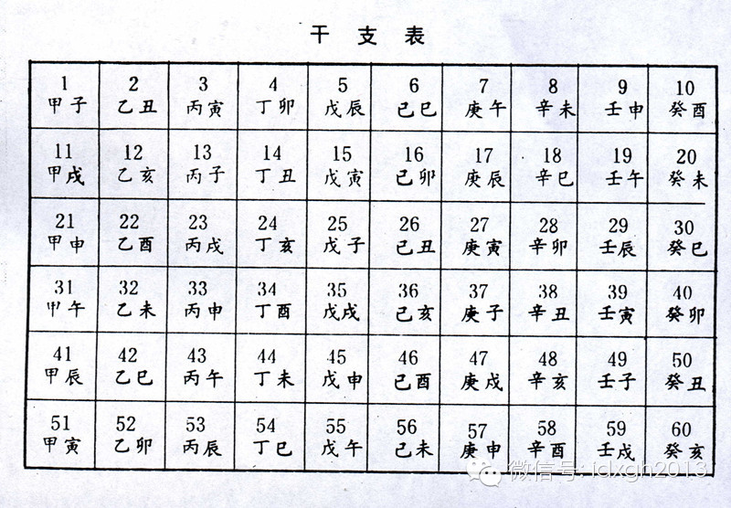
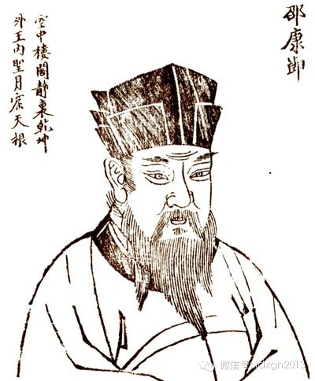

**理想的个人命运预测，应当是凡人皆不同命。要实现精确算命，历朝历代的大师们已历尽千辛，但至今仍任重道远。 **

  

文/郑子宁 HiemsRuls

人皆有对未来不可知命运的强烈好奇，故所有文明自诞生之时，都出现了以预测未来凶吉为生的职业，并发明出无数种预测未来的理论和学说。在预测个人命运时，大师们都会本
能地追求精确性，理论上，理想的预测应当是凡人皆不同命，这当然需要其学说体系能做到这一点。

  

中国本土最流行的预测学说，理论源自易学，命理学确立了以出生时间为算命基础的方法。

  

当代常说的“八字”，就是以此种方法为纲，共立年月日时四柱，每柱以干支纪数，各用两字，形成了四柱八字的几个格局。

  

但是，在唐朝，初生的命理学却不是当今常见的四柱八字，而是三柱六字——时柱并没有被包括在内。

  

干支纪年法，是一种六十进制的算法。天干有甲乙丙丁戊己庚辛壬癸十个，地干则有子丑寅卯辰巳午未申酉戌亥十二个。每个循环由甲子开始，每过一年，天干地支各向后挪一位
，如，第二年就是乙丑。

_干支纪年表。_

以此类推，一直到第六十年，天干恰好完成六个循环，地支恰好完成五个循环（60是10和12的最小公倍数），两者都回到初始状态，新的甲子年开始，进入下一个大循环。

  

在古代，干支纪年法是记录时间的一个重要方法，很多历史事件都以干支法表记。譬如今年是甲午年，一百二十年前的1894年也是甲午年，在这一年发生了著名的甲午海战。

  

但是，干支不仅仅限于纪年，月和日也可以用干支法表示。

  

如此，在三柱六字的情况下，每柱都有六十种可能性，一共有多少种可能性呢？有的读者可能会认为是603，即21,6000种可能性。如果这样想那可就错了。

  

问题出在月柱上。因为月柱循环一次共需六十个月，也就是整五年，因此相隔五年的两年中，每个月的月柱就会完全一样。譬如今年是甲午年，本月即五月则是己巳月，五年前的
2009年的五月也是己巳月，五年后的2019年的五月还是己巳月。

  

不消说，作为五的倍数，六十年前和六十年后的甲午年五月自然仍然是己巳月。由于这个限制，月柱天干在产生新的可能性方面的作用是可以忽略的。虽然这样大大降低了命理业
从业人士的记忆/掐算压力，但也导致提供的可能性少了很多。

  

不过，由于无论是一年还是一月的日数都不能被六十日整除，一年一月的日数又不恒定，在一个长的统计周期内，每一个日柱都可以和一个特定的年柱月柱组合相配，因此日柱可
以视为和两者都不相关的一个变量。因此，三柱六字就提供了60*12*60=43200种可能性（顺带一提，命理上每年和每月的起始日期和一般生产生活中用的公历农历
都不完全一致，年以每年春分为起始，月则自春分开始，每隔一个节气就往前进一月）。

  

唐朝初年，经历了三国到魏晋南北朝时期和隋末的混乱，全国人口数量相对较低，如唐高祖武德五年（622年）全国为219万户，贞观十三年（639年）也不过稍过300
万户，估计人口则为1200余万。

  

三柱六字，传为贞观年间的李虚中所创。这一时代，全国通过三柱六字测算命理若平均分布，则每种命会有300人左右，如考虑男命女命在命理学中会有不同诠释，也有150
人左右“同命”。

  

而因为四万多种组合全部出现的所需时间远超过人的极限寿命，在实践中，“同命”者则会多得多（下文对“同命”人数的估计也存在类似局限）。但是综合而言，将这些人分散
到全国，则作为服务行业来说，命理学从业人员在本地遭遇同命的情况相对还是比较少的——只是在大都会，如长安、洛阳等地可能会碰上较多给六字相同的人算命的苦恼。

  

虽然唐朝后来人口经历过迅速攀升又受安史之乱影响降低的变化，但命理学整体而言仍旧仰仗三柱六字。

【翻倍，再翻倍】

到了宋朝，中国人口持续增长，宋太宗太平兴国五年（980年）全国有近650万户，人口估计为3200余万，三柱六字就显得不够用了。于是，相传在命理学家徐子平的推
动下，第四柱——时柱——登场，三柱六字演变成了传承至今的四柱八字。

  

时柱同样采用干支法表记，因此，月柱和年柱遇到的问题同样在时柱和日柱上重复。由于一日有十二时（每个时辰相当于现代的两小时），每整五日时柱就会完成一个循环。因此
在四柱八字体系构筑完成后，理论上说可以出现60*12*60*12=518400种命，是三柱六字的十二倍。

  

对于命理学从业人员来说，时柱的引入无疑是一大喜讯。与月柱类似，由于循环的规律性，推算时柱需要额外记忆的内容很少，另外也有口诀帮忙（如果读者留意过当代算命先生
掐算，可以发现月柱时柱多数不需要翻查万年历，年柱很多人也背下来了，但是日柱要翻历书的可就为数者甚众了）。

  

此时，命运类似的人变成了原来的十二分之一，命理学的精确度发生了极大的提升。宋朝命理学确实是一个蓬勃发展的年代，连不少高士名流也热衷算命占卜，还有专门从事算命
的机构。

  

宋朝的繁荣持续时间很长，加之商业的发展和新农业技术的运用，人口增长到前所未见的程度。到了宋徽宗年间，人口已经突破一亿，远远超过之前历史上的人口高峰，加之宋朝
领土小，人口密度更是高企。在这样的情况下，五十多万种命的局限性又开始暴露，全国理论同命者再次达到200左右（考虑男女则亦有100上下），时代呼唤命理学新的发
展！

  

在这样的背景下，《邵子神数》横空出世，作者邵雍是著名易学大师，他对命理体系的一大改进就是引入了刻的概念，每一时都分为八刻，同时不同刻的人则命同运不同.通过这
样的手段，命理提供的可能性再次翻了八倍，理论上可出现的命共有60*12*60*12*8=4147200种。全国命运完全相同的人跌回两位数。

  

_邵雍像_

宋朝很多方面是中国古代社会发展的巅峰，其繁荣富裕程度后来的朝代难以匹敌，人口峰值后世也难以突破。元朝由于元初的大屠杀，人烟稀少，终其一朝虽面积广大，但人口始
终低迷。

  

明朝早期人口相对稳定，到了嘉靖末年，由于美洲高产作物的引进，中国人口开始了新一轮的快速攀升，到了万历后期人口已经超过宋朝时的峰值，如果趋势持续则全国命运相同
的人又会突破三位数。可是，随后而来的清兵入关和大规模的屠戮以及疫病流行再次将中国人口拖入低谷，命理学的发展再次遭遇挫折。

  

清朝中叶，经过百年以上的承平，加之摊丁入亩等刺激人口增长的政策，中国人口再创新高。到了乾隆后期，全国人口已破三亿，四百多万种可能很快也会再次出现百人同命运的
尴尬局面，在这样的背景下，相传由伟大命理学家铁卜子创制的命理体系，铁板神数就应运而生了。

  

铁板神数这个体系可谓惊世骇俗，前文所述从三柱六字，到四柱八字，再到邵子神数，理论命局增长倍数都是比较有限的，和人口增长有一个相对平衡的关系。

  

而铁板神数完全颠覆了这个规律，它以四柱八字为经，先天后天数为纬，增加了父生肖、母生肖，兄弟姐妹个数（零到十三）三个先天数，体现了命理学发展的最高水平，远胜紫
微斗数之类的体系。

  

由于三个额外先天数的引入，理论命局可能性爆炸式增长，共计有60*12*60*12*8*12*12*14=8360755200种之多。如此多的理论命局，做到全
国人口每人一命那是绰绰有余（实际上由于分布问题仍会有重复），而且中国人口怎么也涨不到八十三亿人，更别说全国人口了，就是全球人口也还尚未涨到这个数呢。铁板神数
应该再也不用改动了吧？

  

_计划生育宣传海报。_

可惜啊，铁卜子千算万算似乎还是有一点没有算到：从二十世纪七十年代开始，中国实行了计划生育，这下兄弟姐妹个数可是当不了先天数了，于是命局一下减少了百分之九十以
上，只剩下了近六亿种，又做不到一人一命了。命理学的发展再次遭遇重大挫折。看来，要实现精确算命，还是任重而道远啊。

  

[大象公会所有文章均为原创，版权归大象公会所有。如希望转载，请事前联系我们：bd@idaxiang.org ]

———————————————  

**大象公会订阅号的自定义菜单上线了，左边是官网文章精选，右边是大象公会官方微社区，点击进入来吐槽发帖吧！**

**  
**

  

[阅读原文](http://mp.weixin.qq.com/s?__biz=MjM5NzQwNjcyMQ==&mid=202313159&idx=1&sn
=613053940a7c4e8d5a1212fe9b745d24&scene=1#rd)

