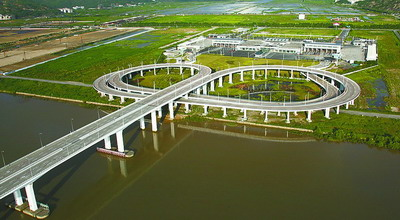
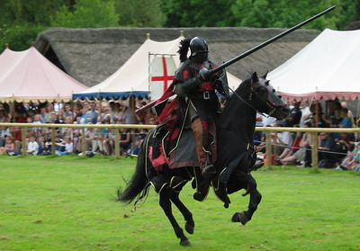
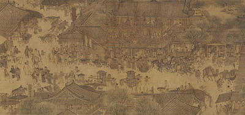
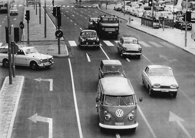
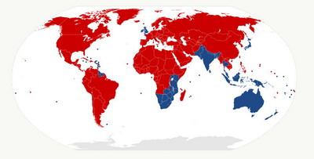
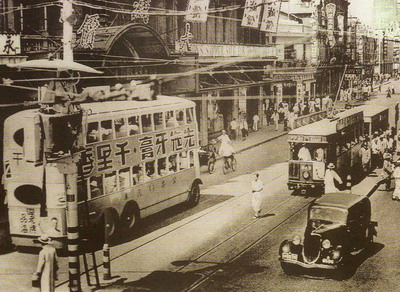
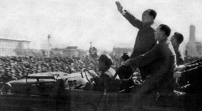

**1967年9月3日，瑞典街头混乱的交通**

**从这天起瑞典的道路行车规则从靠左行改为靠右行**

**  
**

**对于中国大陆的人来说，“右侧通行，注意安全”是习以为常的准则。不过，并不是所有国家都如此。世界上35%的人口、10%的道路处于左向规定之下，如英国、日本。那么靠左和靠右又是如何形成的呢？**  

  

文/杜修琪

  

香港和内陆差别有多大？

  

开车的人肯定有体会。和澳门一样，香港的车辆靠左侧行驶，驾驶员座位安排在车右侧，都与大陆相反。因此，十分考验跨越边界后驾驶员的调整能力——坐在左行的驾驶位置，
驶入右行的道路。

**连接澳门与大陆的莲花大桥**

**珠海桥头的换向匝道桥使两岸交通规则得以互换**

  

不过，最考验左右行转换的并不是香港。驾车穿越非洲南部才最刺激——从左行的纳米米亚，来到右行的安哥拉，平稳穿过靠右行驶的刚果（金），又进入左行的乌干达，跨过肯
尼亚—索马里边境后再右行，在索马里拉萨诺德以北又要转向左侧。一趟下来，足以让经验丰富的驾驶员发疯。

  

发疯的不只是驾驶员，导演也常受此困扰，尤其是大范围穿越古今中外的剧本——调整通行方向都要花很大精力。

  

那么，为什么有的国家向左，另一些向右？这是由不同文化的特点决定的吗？

  

实际上，古代的马车、行人往往没有左右行的标准，即使有，也往往与当前相反。多数地区的道路通行方向都在20世纪确定。很大程度上，英国和欧洲大陆的差异，决定了世界
道路的左右之分。

  

**【为了防身，请靠左通行】**

从留下的车辙来看，至少古罗马时期，欧洲大陆的道路是靠左通行。

  

当时，道路上远没有现在拥挤，人们遇到的最大麻烦不是车祸、堵车，而是抢劫。一种解释称，在右侧行走，更方便右手拔刀、搏斗，因此人们逐渐形成了靠左的习惯。

  

可是，这种解释只适合行人，若是骑士则可能相反——左手持盾，右手持矛，常常保持在对方的右手边。而且难免夸大了武器的影响，毕竟，避免抢劫、攻击只是一部分原因，多
数的安全路段仍以运输为主。

**2012年，美国德州文艺复兴节。骑士表演者左盾右矛，全副武装**

  

更合理的解释可能是骑马。多数人惯用手为右手，他们上马也需要先踩左侧脚蹬，再翻身上去。汽车没有出现之前，马匹无疑是交通最重要的工具，因此影响了当时人们对通行方
向的选择。

  

但是，古代道路的拥挤程度远不如今天，多数情况下不需要确定的通行方向。中国也是一样，唐太宗颁发的《仪制令》中有最早的对交通规则的规定：“凡行路巷街，贱避贵，少
避老，轻避重，去避来”，主要强调儒家“礼”，具体到靠哪个方向行走并不重要。

**《清明上河图》（局部）北宋画家张择端所作**

**车马行人并无确定的通行方向**

  

不过，中国古代进城楼时，也有确定的方向——靠左。《隋唐嘉话》载：“城门入由左，出由右，皆周法也”，驿道的“堠子”（里程界碑）也多靠左设置，与今天正好相反。

  

而欧洲则在中世纪出现了差异，1756年，英国第一次规定在伦敦桥需靠左通行，马车增多后，又在1773、1835年两次以法案形式确立全国的通行方向：靠左。

  

而多数欧陆国家与此相反。1752年，俄罗斯女皇伊莉莎白下令全国靠右通行，法国也在大革命之后改为向右，但他们的理由比较独特：为了与之前的传统一刀两断。他们认为
，之前多数靠左通行，是方便向贵族请安。革命之后万象更新，道路上自然也要改变。

  

**【势力扩张与左右之争】**

19世纪时，欧陆的多数国家已完成右转——最迟的是西班牙和葡萄牙，20世纪30年代左右才统一靠右。一些国家还在国内出现混杂现象，如1899年前的比利时，部分城
市向左，部分向右。

  

右转趋势离不开扩张势力的推动。尤其是拿破仑，征服欧洲期间，拿破仑每到一处就强硬的推行法国规范，当然也包括通行方向。同样，希特勒的扩张也让波西米亚等地区统一靠
右行驶。

**1967年瑞典街头，尽管道路上已经画了新的路标，但司机们显然还没熟悉新规**

  

而英国仍旧保持左行——毕竟，这个岛国远离欧陆征伐，可以保持古老的社会规范。也避免了汽车普及后，大陆内统一行驶方向的趋势。现在，除了英国欧洲仍旧保持左行的国家
是：塞浦路斯、爱尔兰、马耳他——都是岛国。

  

扩张的影响还体现在世界范围殖民地的通行方向。英国本土虽小，其殖民地却在19世纪遍布全球，这些地区自然遵循了英国的标准。而法国、德国等欧陆势力范围则多靠右通行
。当时的规范主要针对马车，20世纪后，汽车逐渐普及，仍延续了这些交通规则。

  

随后，殖民地不断独立，其中一部分仍继承原有制度，也有少数国家出于政治原因，采用了相反的方式。

  

美国就是改制的最有影响力的例子。独立战争之前，北美十三个殖民地多是靠左行驶。独立后，一方面希望与英国有所区分，另一方面，法国在独立战争期间给予美国巨大帮助，
其思想、文化对美国影响颇深。1792年，宾夕法尼亚州最先通过了右行方案，1804年、1813年，纽约州和新泽西州也通过类似法令，右行逐渐在美国普及。

  

同属于北美的加拿大则较为复杂——法语区和英语区习俗、规则都有差异。经过多次讨论、妥协，1923年后也向右转了。

  

当然，更多的殖民地保留了原有规则。比如曾是英殖民地的香港。另一些则在殖民国变化后维持原样，如澳门。1928年，葡萄牙转为右行，澳门却依然左行。一是澳门的车辆
多来源于香港，二是没过多久，同样左行的日本就占领了澳门，延续至今。

  

日本也是靠左通行，但他并不是英国殖民地，历史上，武士们靠左通行以方便拔剑固然有影响，更重要的是1870年左右颁布的马车通行法案规定左侧行驶。之后又从英国引入
铁路交通规范，造成了靠左行驶的惯例。不过，冲绳在被美国占领期间奉行的是靠右行的美国标准，1978年才改回来。

**世界范围内那些靠左行驶与靠右行驶的国家**

  

二战期间，日本占领地区一度也规定左行，如中国东北等。战后这些国家都自行制定了政策，但汽车业的崛起，日本仍有保持了另一种形式的影响————由于大量进口日本二手
车，阿富汗、缅甸、俄罗斯远东等右行地区，却大量使用驾驶室在右侧的左行车辆。

  

**【中国的右转】**

中国大陆的右向行车规则在1946年之后形成。在此之前，一度出现“南方向左，北方向右”的局面。

  

十九世纪后期，西方各国的势力进入中国。德、法、俄等国主要经营北方，南方则是英国势力占优。因此，南北方的租界制定了各自的交通规则，出现“一国两制”。

  

最早有关通行方向的告示出现在1872年，由上海租界工部局发布，多次刊登在《申报》上：“凡马车及轿子必须于路上左边行走，右边超过”。

**上世纪20年代的上海街头，车辆统一靠左行驶**

  

民国建立，尤其是北伐之后，国民政府形式上统一全国。 1934 年12 月，国民政府颁布《陆上交通管理规则》，规定全国车辆靠左行驶，结束了左右混行的局面。

  

但抗战后期出现了新的情况——越来越多的美国援助的汽车进入中国，因此，许多地区出于实际考虑，转而适应美国车辆的右行。

  

这让国民政府考虑转向的必要性。主要为了节省恢复左行的改装费用、减少美军肇事。

  

《申报》做了一份估计：“向国外购入车辆，其驶向多须改装，而改装费须达车价百分之十二。统计全国车辆因改装而支出之费用,殊为浩大……”

  

至于肇事，当时，上海、天津、成都、重庆等城市都驻扎了一定量的美军，确实出现了不少事故。据统计，1945年 9月 1日至12月
31日，美军车辆在上海市区肇事共 68起,伤 54人,死 18人。

  

当然，这些肇事并不都由于驾驶方向有别，美军酒驾也是原因之一。但当时的舆论普遍将矛头对准了混乱的通行规则。

  

不过，由于日本的突然投降，原计划10月实施的改制推迟到了1946年1月1日。为此，各地竭力宣传新政。

  

重庆专门举办了演习——宣传靠右通行。31日下午二时至四时，政府在小什字至都邮街一带试行演习，有警察维持秩序，据报道参加的车辆一律靠右行驶，“成绩斐然”。

  

天津则规定施行新政后的一周为“宣传管理周”，之前的12月23日，还在全市各娱乐场所巡回演讲，27日又给人力车做训话等。成都也很重视娱乐场所，政府决定，新规实
行前 3日，在繁华地段印刷标语，同时在电影院映放交通广告，并在街头演讲。

  

上海自然是改制的重点城市。当时，上海登记汽车12余万辆，居全国第一，但其来源复杂，统一向右行有难度。当地报纸连续刊登头条宣传通告，12月
31日，市政府大礼堂举办招待会，市长、副市长、公用局长、警察局出席，再次通告改革方案。

  

但是，上海的施行时间比全国规定慢了6个小时——全国公路都在1月1如0时更改，只有上海是凌晨6点。其理由具有十足的个性：

“兹以是晚适为大除夕，各界狂欢庆祝中，未便骤然改变，故决定元旦日晨六时正起实施”。

  

不过，虽然晚了6个小时，上海的排场却很了不得。当天6点，12万多汽车鸣笛足有2分钟，才全部转为右行。

  

于是，右行的规范就此在大陆统一，共产党执政后也延续了这一方式，直到今天。

**“请同志们统一靠右行！”**

  

**版权声明**

****大象公会所有文章均为原创，****  

****版权归大象公会所有。如希望转载，****

****请事前联系我们：****

bd@idaxiang.org

****知识 | 见识 | 见闻****

阅读

__ 举报

[阅读原文](http://mp.weixin.qq.com/s?__biz=MjM5NzQwNjcyMQ==&mid=207592339&idx=1&sn
=5b46edc35426a60e423db429cddcf8bf&scene=0#rd)

