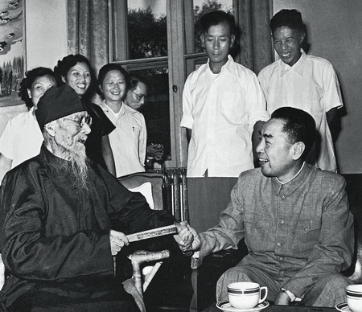
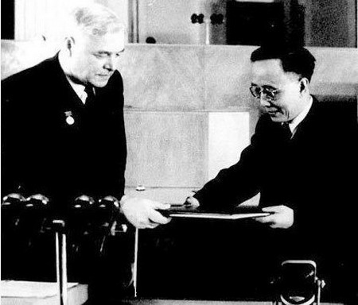
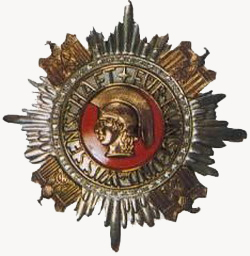
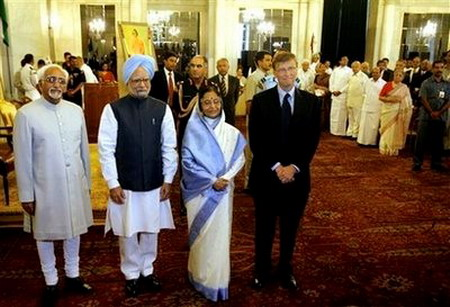
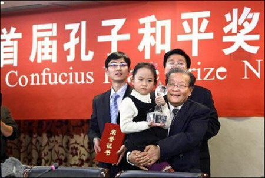
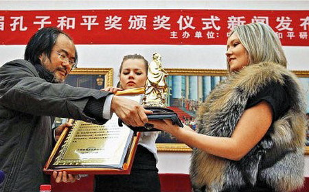
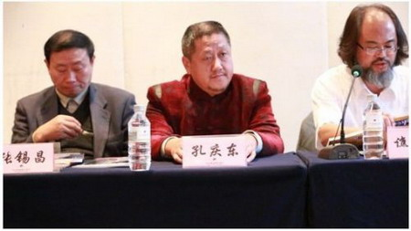

**没有哪个诺贝尔奖项比和平奖更尴尬。一旦发生分歧，异议的一方恨不能自立新奖，以示对抗。历史上已有多项和平奖因此设立，无论奖金、人数，诺奖都曾落于下风。那么，和平奖到底哪家强呢？**  

  

文/杜修琪

  

不喜欢诺贝尔和平奖？“国际和平奖”或许会满足你——至少在1991年以前是这样。它听起来更权威，更有世界影响力，而且立意十分鲜明：反对帝国主义。

  

它由世界和平理事会在1950年起颁发，其领导人声名卓著：诺贝尔奖得主约里奥•居里先生，他是苏联人民的法国老朋友。

  

世界和平奖系当年在波兰华沙举办的第二届世界保卫和平大会的产物，在有81国代表参与的大会上，组建了世界和平理事会，决定颁发国际和平奖，分为国际和平奖、荣誉国际
和平奖、约里奥•居里和平勋章。

  

世界和平理事会总部设在巴黎，但1952年遭驱逐后，辗转维也纳、布拉格，最终于1968年迁至芬兰赫尔辛基。看上去它比诺贝尔奖更中立、更国际化。不过，世界和平理
事会90%左右的资金来自苏联。1991年苏联解体后，它失去了大部分的员工、资金，目前搬至希腊，其活动已罕有所闻。

  

虽然今天多数中国人对此奖项并不熟悉，但在中国建国初期，它在公众中的知名度和曝光率远高于诺贝尔奖，中苏反目后，它才突然从中国公众的视野中消失。

  

该奖成立之初，中国人被频繁照顾。1956年，因参与为世界和平理事会绘制的《和平颂》，齐白石获国际和平奖。在郭沫若搀扶下，93岁高龄的齐白石领取了3.5万人民
币的奖金，宣布将一半存入银行，其利息作为“齐白石国画奖金”资助年轻画家。

  

国际和平奖似乎有着传承关系，1957年，搀扶者郭沫若也获奖了——约里奥 - 居里勋章。这并不出人意料，从1950年起，郭沫若就担任世界和平理事会的副主席，曾
为全球反对原子武器做出了巨大贡献——据官方宣传在中国组织了2.2亿签名，接近全球签名人数的一半。

  

1956年9月1日，周恩来总理出席世界和平理事会“授予齐白石国际和平奖金仪式”并与齐白石亲切交谈

  

当然，这不是郭沫若第一次获得和平奖。1952年，他专程赴莫斯科领取斯大林和平奖，因心情激动，当场朗诵了原创诗作《光荣与革命》：

> "斯大林的金质的英容,辉煌地,照耀在我的胸上。

>

> 我代表着保卫和平的中国人民,作为一个形像,

>

> 接受了毛泽东同志领导下的全中国人民的光荣,

>

> 但也接受了一个庄严的使命,在今天是意义深长。"

随后，他将十万卢布的奖金捐赠给自己领导下的“中国人民保卫世界和平反对美国侵略委员会”。

  

1952年4月9日，郭沫若领取斯大林和平奖

  

“和平”是一个应用广泛，定义清晰但又极为含混模糊，甚至在不同人群中看法截然不同的词汇。即使诺贝尔和平奖也是如此。依照遗嘱，诺贝尔和平奖应颁给“为促进民族团结
友好、取消或裁减常备军队以及为和平会议的组织和宣传尽到最大努力或作出最大贡献的人”，20世纪中期后，为适应现实变化，它开始颁给环保、人权活动家，但也因此被指
责扩充了“和平”原有的内涵。

  

正是由于“和平”的定义模糊，尤其是存在对立的意识形态阵营时，双方往往需要争夺对“和平”的解释权，设置和平奖奖项无疑是个有效手段。

  

苏联当然是此中高手。1950年冷战刚开始，苏联官方很快设置了斯大林和平奖，并通过苏联和平委员会的资助，由居里先生出面创办国际和平奖。这两个奖项用意非常明确：
对抗以诺贝尔和平奖为代表的“帝国主义”意识形态。

  

不过，相对于较独立的挪威诺贝尔奖委员会，苏联人显然更为直接而自信——直接颁发给本国领导人。

  

赫鲁晓夫上台后，将斯大林和平奖改为列宁和平奖，1959年便颁给自己列宁和平奖章；以热爱收藏勋章著称的勃列日涅夫当然不会错过这种机会，1972年，“为缓解冷战
造成的紧张局势”做了突出贡献的他领取了列宁和平奖章，以及1万卢布（约合2400美元）。

  

国际和平奖也不甘落后。1975年11月，在萨哈罗夫获得诺贝尔和平奖一个月后，勃列日涅夫又兴冲冲戴上了约里奥•居里金章。

  

与诺贝尔奖不同，每年斯大林（列宁）和平奖可颁发多人，第一年就一口气发出了7份，此后多数在三人以上。国际和平奖更厉害，第一年发出了12份。从人数角度，完全盖过
了对立阵营的诺贝尔和平奖，当然，苏联的朋友们也因此有了更多机会。

  

1950年的宋庆龄，1960年的苏加诺，1961的菲德尔•卡斯特罗，1962年的恩克鲁玛（加纳首任总统）都获得过斯大林/列宁和平奖。同时，一部分和平奖还颁给
了对立阵营的政治活动家，比如1950的毕加索，1959年的杜波依斯（美国非裔民权活动家）等。

  

但是，对方阵营的人毕竟不如己方可靠，稍不注意就有可能被拆台丢面子。1957年，伯特兰•罗素和郭沫若同一批获得国际和平奖，但不识好歹的罗素拒绝领奖。

  

由官方设立的奖项，自然也容易被政治局势所左右。中苏关系蜜月期，宋庆龄、郭沫若、齐白石三人四次获国际和平奖、斯大林和平奖，中苏交恶后，再也没有任何中国获奖者，
当然中国人也迅速忘掉了这些奖项的存在。

  

苏联解体彻底结束了这两大奖项的存在。1991年后，国际和平奖和列宁和平奖就再也没颁发过。

  

不过，与诺贝尔和平奖的对抗，苏联并不是最强烈的。1935年，诺贝尔和平奖颁发给了著名反纳粹记者、作家卡尔•冯•奥西茨基，受到巨大刺激的希特勒决定彻底抵制诺贝
尔奖，所有德国人不得领取任何诺贝尔奖——包括文学奖、化学奖、物理奖、生理学/医学奖。

  

当时德国人获得诺贝尔奖的数量远多于任何国家，它完全有资格单干，1937年，希特勒设立德国艺术与科学奖，意图取代诺贝尔奖。

  

该奖最大的特点是奖章：造型硕大，并镶满了钻石，极少有人能佩戴，也几乎没有合适的衣服悬挂。因此，受奖者一般要特制一个支架。

  

德国艺术与科学奖章，坠饰镶满钻石。此外，获奖者还会得到一个红白相间的腰带

  

德国国家艺术与科学奖1939年因为战争原因停止，战后当然也没有恢复。

  

对于“和平”的理解差异，并不一定都体现为意识形态的对抗。二战后，殖民体系瓦解，一批独立的新兴国家，在经济获得长足发展后，高涨的民族主义情绪令其有强烈追求国际
话语权的冲动，由政府出面组织设置和平奖当然是个捷径。

  

比如韩国。1988年汉城奥运会的成功，让韩国上下异常兴奋，两年后，为纪念近160个国家和地区和平、友善的相聚，首尔（汉城）和平奖创立，每两年颁发一次，奖金2
0万美元。

  

韩国人民是知恩图报的，1990年第一届和平奖就颁给了时任国际奥委会主席萨马兰奇。之后的获奖者多是国际知名活动家或组织，如1992年美国国务卿舒尔茨，2004
年捷克总统哈维尔，2012年潘基文。

  

首尔和平奖的评奖较为贴近国际主流标准，因此，其受奖者常常很快会获得诺贝尔和平奖，无国界医生、孟加拉国慈善家默罕默德•尤努斯都在三年内再获诺奖。

  

印度也有政府主办的国际性和平奖，他们甚至设置了两个几乎一样的奖项：为了纪念英吉拉•甘地和甘地，分别于1986年、1995年设立英吉拉•甘地和平奖、甘地和平奖
。前者奖金1000万卢比（约16万美元），后者250万卢比（约4万美元），均为每年颁发。名义上，和平奖由纪念信托基金颁发，但其评选委员会基本由政府高层主导。

  

两者除了奖金数额之外，差别并不大，以至于获奖者都有重合——捷克总统哈维尔在1993年和2003年分获英吉拉•甘地、甘地和平奖。

  

2009年盖茨和梅琳达基金会领取英吉拉•甘地和平奖仪式，图为盖茨和印度总统普拉蒂巴•帕蒂尔，总理辛格和副总统哈米德•安萨里

  

当然，诺贝尔之外的和平奖并不都由政府组织包办。民间也有不少和平奖颁发组织，由于政治色彩较弱，它们在某些方面要比政府奖项灵活，而且按照对和平的不同理解，形成了
自身的特色。

  

至少奖金上，民间奖项的最高值要比上述政府主办的和平奖更高。由美国著名投资人邓普顿设立的邓普顿奖，目前的奖金为110万英镑，远超诺贝尔和平奖。其全称为邓普顿属
灵研究或发现促进奖，主要颁给为人类精神领域做出贡献的人士，如1973年的特雷莎修女，1983年的索尔仁尼琴，其评定标准与诺贝尔和平奖部分重合，一些获奖人曾获
诺贝尔和平奖。

  

宗教类和平奖是民间奖项重要部分。日本的庭野和平奖，就专门奖励促进宗教领域合作的知名人士。中国佛教协会主席赵朴初于1985年获此奖，奖金20万日元。类似的还有
基督社区国际和平奖等。

  

德国书业和平奖是民间历史较久，影响力较大的和平奖，由德国书业协会自1950年起颁发，目前的奖金也很丰厚——25万欧元。它的获奖者十分贴合其名称：多数为文化界
人士或知识分子。知名获奖者如1982年的乔治•凯南、2001年哈贝马斯、2003年苏珊•桑塔格、2012年的廖亦武。颁奖仪式在每年的法兰克福国际书展举行，德
国的政界、知识界精英一般都会出席，堪称德国最重要的文化奖项。

  

中国也一度拥有过自己的民间和平奖——孔子和平奖。《环球时报》于2010年11月曾发表评论，呼吁建立“孔子和平奖”，以抢夺国际话语权。一个月后，中国乡土艺术协
会就组织了第一届孔子和平奖，奖金10万人民币，获奖人为连战。但是连战并没有对此公开置评，也没有领奖。

  

连战未回应孔奖，由小女孩代领

  

俄罗斯女留学生代领孔子和平奖

  

2011年，第二届孔子和平奖决定颁给俄罗斯总统普京，但就在消息宣布之后，文化部叫停了这一奖项，孔子和平奖立刻转移至香港注册。和连战一样，普京也没有对此有任何
表示，主办方找到来自俄罗斯、白俄罗斯的4位女留学生替普京领奖。

  

但转移至香港的孔子和平奖并没有停止脚步，2012年再接再厉，颁给了前联合国秘书长安南，以及中国科学院院士袁隆平。2013年，颁给了释一诚。但是截至目前为止，
尚未有人领取该奖。

  

2013年，孔子和平奖评选委员会的委员在新闻发布会上发言

  

> 版权声明：  

> 大象公会所有文章均为原创，版权归大象公会所有。如希望转载，请事前联系我们： bd@idaxiang.org

大象公会：知识、见识、见闻

微信：idxgh2013

微博：@大象公会

投稿：letters@idaxiang.org

商务合作：bd@idaxiang.org

举报

[阅读原文](http://mp.weixin.qq.com/s?__biz=MjM5NzQwNjcyMQ==&mid=206133772&idx=1&sn
=8e0354b504bf7c1090946d8bf2b8546c&scene=0#rd)

