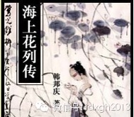
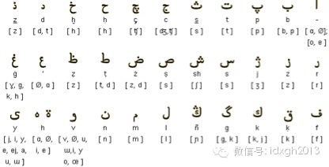

‍‍‍‍**捍卫语言纯洁运动不但是各民族都有的历史，也是常见的现实，它的推进力度当然与政治相关，但目的却并不总是与此相关。‍‍‍‍**

  

文/郑子宁

  

英语里面“鸟”、“鱼”怎么说？想来我们的大部分读者都应该知道是“bird”、“fish”，那么，英语中的“鸟类学”、“鱼类学”呢？恐怕能答上来的人应该非常少
。现在谈起语言纯洁运动，人们第一反应往往是英语词汇入侵，但英语中“鸟类学”、“鱼类学”都使用希腊借词，分别为“ornithology”和“ichthyolo
gy”，与bird、fish无关。

  

对一个懂希腊语的人来说，这两个词很容易理解，因为看到这两个词就能轻易辨认出词根，但对一个以英语为母语的人，未经专门学习，“ornithology”和“ich
thyology”这两个词就显得非常佶屈聱牙了。

  

英语中的“ornithology”和“ichthyology”，多少有点像今天汉语中经常出现的各种英文缩写的新词，譬如NBA、WTO、CEO之类。这几个借自
英语的新词，对大都市年轻人来说早已成为语言中的一部分，但IMF、WiFi、SOHO、HR等词，对多数中国人来说，依然如读天书。

  

最近《人民日报》等官媒呼吁保持“汉语纯洁性”，其意不在反对外来词，而是反对直接借用英文缩写词，譬如不反对“电邮”，但反对“EMail”,不反对“诺基亚”，但
反对“NOKIA”。虽然为iPhone和iPad这种速朽的词找到对应汉语稍显多余——譬如VCD还没找到合适的汉语翻译就已退出历史，但尽量减少直接来自外来词汇
，降低大众的学习、交流障碍，倒也有其道理。

  

英文中存在大量类似“鸟类学”这种外来词的现象，在欧洲颇为普遍。欧洲中世纪受教育的主要是贵族子弟，他们从很小的年纪就开始学习古典语言（常见的有拉丁、希腊、希伯
来等），掌握这些词自然问题不大。但是随着欧洲进入近现代社会，教育普及，大量平民也开始接受教育，这些来自外语的词就成了学习障碍。

  

而在西欧主要语言中，英语又颇为独特，因为英语来源上是一种日耳曼语言，但后来经过诺曼征服后，大量词语从罗曼语言进入英语，造成英语高阶词汇和日常词汇的差距极大，
这个问题就特别突出。

  

从19世纪开始，就不断有文化界人士主张替换英语里面来自外语的词汇，以方便没有受过古典语言训练的学生接受教育。威廉**巴恩斯就是一位杰出代表：虽然他自己流利使
用希腊语和拉丁语，但他仍然主张清除不必要的借词，上述“ornithology”他就认为完全可用“birdlore”代替。

  

美国人诺亚**韦伯斯特（美国英语最具权威的词典《韦氏词典》就是由他编写的词典发展而来）拒绝所谓学习英语必先修希腊拉丁的观点。他主张要“将我们的母语从迂腐的喧
哗中拯救出来”，语言应该为大众所理解而不是少数精英阶层的玩具。

  

今天，美国英语出现了很多和英国不一样的拼写，如“color/colour”、“center/centre”、“dialog/dialogue”，这些正是诺亚
**韦伯斯特摆脱古典语言桎梏的思想的产物。

  

英语世界的先贤们，推广普及教育的愿望，其实与孔夫子有教无类的主张颇有共通之处。只不过，英美是典型的“小政府”，不会介入语言的系统改造中，所以，英语的语言纯洁
运动最终效果颇为一般，没有多少外来难词被英语自身的词汇取代，“前言”现在既可以用本土的“foreword”也可用外来的“preface”，可算此运动的少许斩
获。

  

现代中国的白话文，其实可以看作是二十世纪初语言纯洁运动的结果。

  

拉丁语对现代意大利人已成了一种外语，文言文对当代汉人与之相似。文言文以先秦上古汉语为标杆，虽然汉字书写不太表音，荣誉遮蔽汉语的变化，但对多数中国人来说，某些
文言文，如《尚书》中的周初八诰和外语已没有什么区别。

  

白话文运动一开始就排除文言成分，提倡“我手写我口”，与前述英语纯洁运动旨趣类似。但是“我手写我口”带来了一个问题：废除了超越时间空间的文言，记录口语的白话文
该如何与汉语中芜杂的方言共融？

  

从二十世纪初期到今天的实践看，原来各种白话逐渐被以北京官话为基础的现代白话文取代，反过来也可以说，白话文通过排除了方言和古语成分，完成了全国范围内的纯化整合
。近代四大白话（京白、苏白、韵白、粤白）的拉锯，最终以京白全面胜出收尾。

  

虽然今天各地人写的白话文往往还可看出方言痕迹，但已很少能造成交流障碍。而方言白话除了少数小众爱好者会拿来入文，其他场合已经被“纯洁”掉了。可以说，白话文运动
作为一次语言纯洁运动已经成功。

  

从效果上看，由于这次语言纯洁运动，就算没有受过文言教育的两个汉语圈人士也能进行交流，对构筑政治民族共同体的益处不言而喻。这类纯洁运动当然有“便于统治”的目的
，到底是好是坏，全看持什么立场了。

  

不妨看看下面用没有“纯洁化”的方言白写的同一句话，其差异之大，是不是得找个翻译？

  

例：我跟你说，他们不在这里。

苏白：我搭倷讲，俚笃弗勒哀搭。

粤白：我话畀你知，佢哋唔响呢度。

闽南白：我共汝讲，因毋伫这。

  

_使用大量苏白的小说《海上花列传》_

  

没有强力的政府，当然不会有强烈而深远的语言纯洁运动。历史上最大规模，影响最为深远，也最成功的语言纯洁运动，是土耳其的语言纯洁运动。

  

土耳其语言纯洁运动发端于奥斯曼帝国灭亡，土耳其共和国成立的混乱之中。1932年，土耳其语言协会在国父凯末尔的亲自关照下成立，它被直接赋予极高的政治目的——与
旧历史彻底告别，重塑民族与国家认同。它是一场史上含有匹敌的制度化的语言革命。

  

奥斯曼帝国是个古典伊斯兰帝国，阿拉伯语和波斯语在其精英阶层中享有崇高声望。虽然随着时间推移，奥斯曼土耳其语地位逐渐提升，但它在各方面都深受波斯语和阿拉伯语影
响。这种流行于宫廷精英阶层的语言，到了奥斯曼帝国覆灭时已经和土耳其内地平民讲的土耳其语脱节。

  

土耳其共和国成立后，国父凯末尔励精图治，试图将土耳其从一个中世纪伊斯兰帝国演变成一个现代民族国家——改变国家从改造国民始，改造国民从改造观念始，改造观念从改
造语言始。

  

奥斯曼土耳其语采用波斯式的阿拉伯字母书写，凯末尔首先废除了阿拉伯字母，改用拉丁字母。为斩断与过去的联系，大量阿拉伯语和波斯语的借词随后被废除，用土耳其自身词
根组合替代，当土耳其本土语词实在不敷使用时，就从古代突厥语和现代其他突厥语（如哈萨克语）中挖掘。此外，土耳其语还引用欧洲语言（主要是法语）词汇用以取代波斯和
阿拉伯来源的高阶词汇。

  

经过一段时间努力，土耳其语的阿拉伯和波斯借词被干掉大半，土耳其语焕然一新，脱胎换骨。这种经过纯洁化的语言，正迎合了土耳其从一个中世纪伊斯兰帝国向一个现代世俗
化共和国转变的需求。土耳其语纯洁运动让年轻的土耳其共和国与奥斯曼帝国的荣光与耻辱彻的切割。

_奥斯曼字母表_

_  
_

如此剧烈的语言纯净运动当然有副作用。

  

由于现代土耳其语的很多词汇是对语言了解不深的人仓促组成用以替代借词的，在理据方面未必适当，那些向其他突厥语借用的尤其如此。另外，阿拉伯语和波斯语借词本来占据
了土耳其语词汇系统里面高阶的那部分，疾风暴雨般的骤然清除，对土耳其语的表现力有不小的负面影响。

  

纯洁化运动过烈的问题1930年代凯末尔已经意识到，因此他支持所谓“太阳语言论”，改理论认为：土耳其语是全世界所有语言的祖宗，其他语言的词追根到底也是土耳其语
词，所以，所谓借词本质而言还是土耳其语自己的词汇，不须清除。这种强大的逻辑得到凯末尔垂青，大概是他作为实用主义者看到了这个理论的有用之处吧。

  

公正地说，语言纯净运动对土耳其现代化贡献巨大，但也形成了无法挽回的历史断层。奥斯曼帝国时期的文献普通人无法读懂自不必说，甚至凯末尔本人在共和国成立时发表的长
篇演说，当代土耳其人阅读原文已有相当困难。

  

1963年，该文就被翻译了一次，此时距离演说尚不到半个世纪，结果到了1986年又有再次翻译的必要了，于是再译，到了1995年又进行了三译。土耳其人为他们的决
绝付出了巨大的代价，它的确担得起“灾难性的成功”这一评价。

  

今天汉语借词数量并不算多，汉语在中国拥有绝对强势地位（汉语人口会其他语言的比例很低），作为大众教育基本没有太大短板，统一已经完成，与历史切割估计会被当成千古
罪人。所以，所谓纯洁运动似乎没有太大必要。

  

至于英语缩写词的大量使用，《人民日报》文章认为是翻译人才不足或偷懒，虽有道理，但并非全部，譬如郭敬明等新锐作家，他们在写文章时，不怕麻烦地一定要把肯德基写成
KFC、宜家写成IKEA、星巴克写成starbuck，与他们的读者的某些特殊癖好，在心理动机上是一样的——他们喜欢在淘宝上购买软件，以便安卓手机也可在社交工
具上显示“发自我的iphone”。

‍‍

‍‍‍‍‍‍‍‍  

[大象公会所有文章均为原创，版权归大象公会所有。如希望转载，请事前联系我们：bd@idaxiang.org ]

———————————————  

**大象公会订阅号的自定义菜单上线了，左边是官网文章精选，右边是大象公会官方微社区，点击进入来吐槽发帖吧！**

[阅读原文](http://mp.weixin.qq.com/s?__biz=MjM5NzQwNjcyMQ==&mid=202008522&idx=1&sn
=31c4f7a28694ff385d330d8a4a663804&scene=1#rd)

