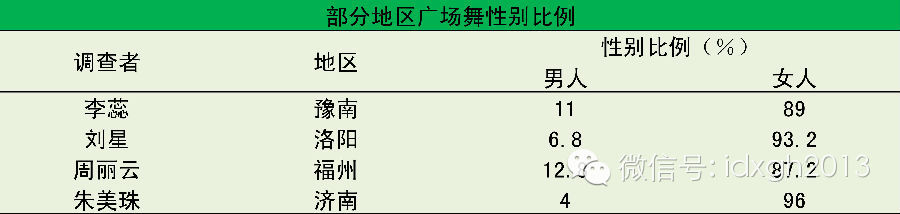
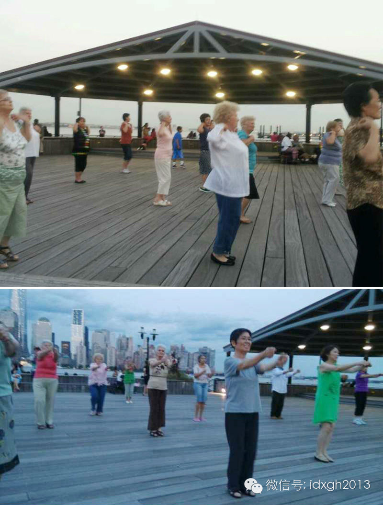
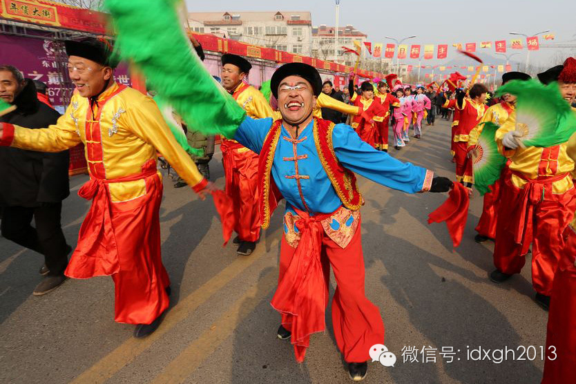
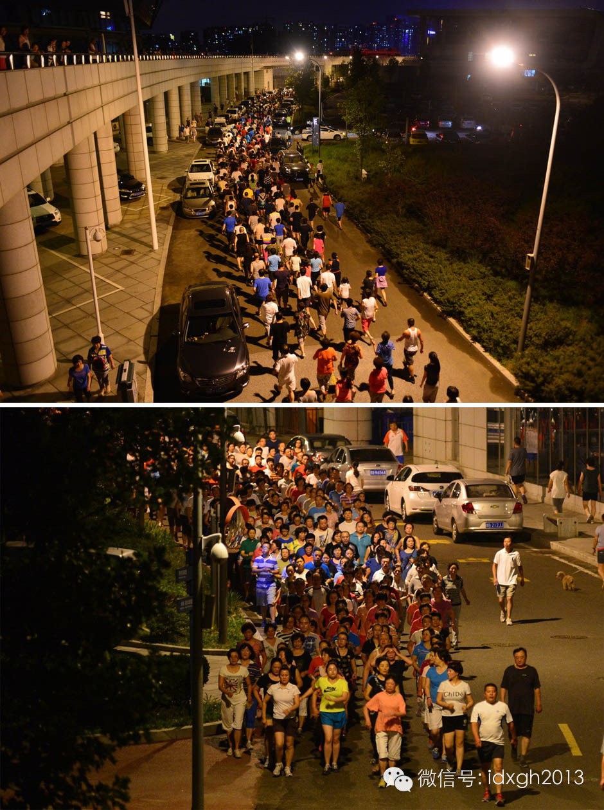
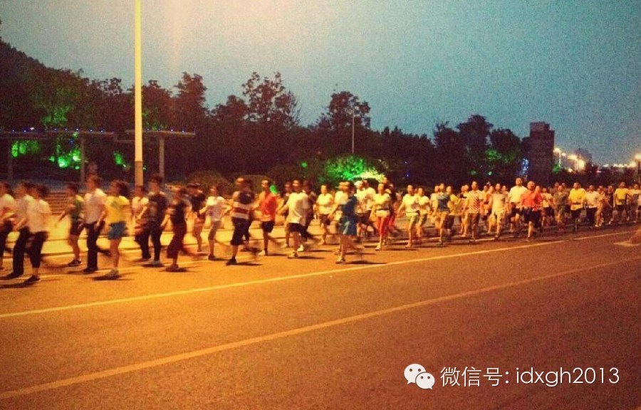
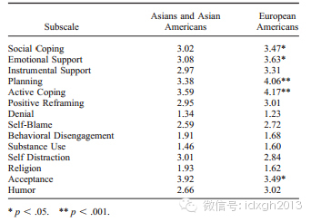
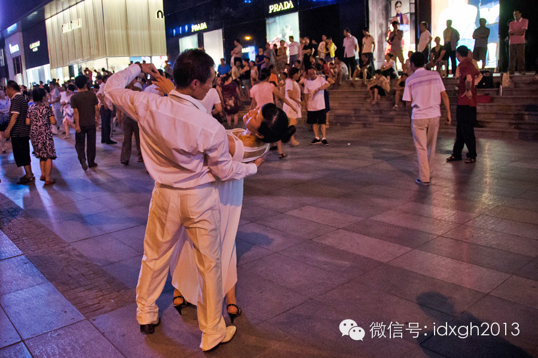
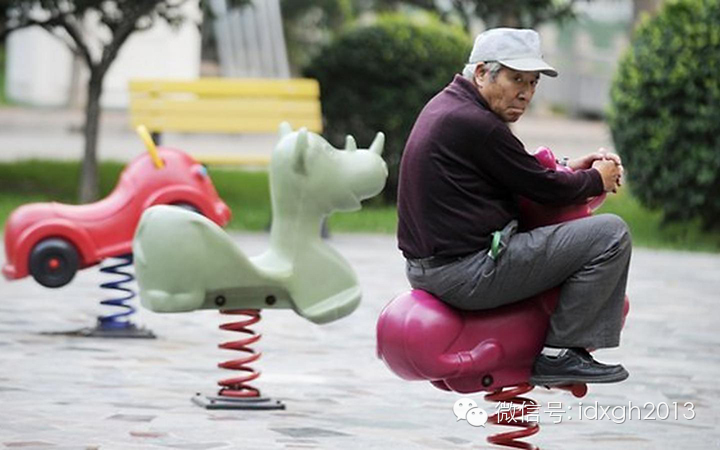

**相比女性，中老年男性对广场活动的选择看起来十分矛盾——宁愿选择秧歌、交际舞，也不出现在广场排舞的队伍中。这是因为中国男性天生羞涩吗？**

  

文/杜修琪  

  

你见过广场上跳舞的“大爷”吗？

  

很少。多数人印象中，傍晚的城市空地永远属于中老年妇女，偶尔少数男性点缀其中，根本不占主流。

  

虽然没有全国性调查，但部分地区性的研究显示，广场舞中女性的比例都在80%以上。

  

部分地区广场舞性别比例

  

这一趋势在国外仍旧延续。今夏的美国泽西城J. Owen
Grundy公园，一些美国白人在中国阿姨引领下，克服语言、文化障碍，在队列末尾顽强学习，终于掌握了广场舞技能。这些人无一例外，都是中老年妇女。

  

J. Owen Grundy公园的广场舞，白人阿姨已占半壁江山 赵智沉|摄

  

为什么会这样？

  

一般的说法是，广场舞动作妩媚，更偏向女性，中老年男性羞于参与。这显然是错误的。实际上，传播最为广泛的“佳木斯快乐舞步”，动作与广播体操相差无几，根本不涉及动
作的性别差异。而妖娆程度几乎爆棚的东北秧歌，传统上不乏男性舞者。

  

跳秧歌的中老年男性

  

**【排舞，交际舞，暴走族】**

  

中国的“大爷”真的都含蓄内敛，不适合广场舞吗？

  

当然不是。但首先，要将广场舞这个模糊的词厘清——如果细分，至少能将其分为排舞、交际舞、民俗舞几类。

  

通常人们说的“广场舞”，是指排成队列，动作整齐，在城市空地跳的舞蹈。在形式上它们属于排舞。而其他出现在城市空地的舞蹈，较常见的为交际舞、民俗舞，前者多是简化
版的现代舞，甚至迪斯科，后者以秧歌为代表。

  

这几类广场舞中，排舞简单易学——站在队列后模仿即可，方便陌生人社交、参与；交际舞动作亲昵，多数舞者是熟人，夫妻配对几乎为标配；民俗舞多出现在郊区、回迁楼等，
传统色彩浓厚，但在现代社区逐渐减少。

  

一般意义上的广场舞——排舞，男性舞者极少，但广场上的交际舞、民俗舞男性比重并不低。尤其交际舞。

  

这时候，被认为稳重的中老年男人也轻盈起来，跳起远比排舞妩媚的华尔兹、秧歌。

  

如果将范围放宽，观察广场上的其他活动，男性参与者的比例就会相对提高。如最近中老年人流行的“暴走”，一些较大规模者，如青岛国信体院馆、徐州云龙湖的暴走团，都起
源于之前的广场舞团队，但一经转化，男性比例便骤然提高。

  

青岛国信体育馆外数千人的暴走团，每晚以灯亮为信号，绕场三周，自动解散

  

徐州云龙湖珠山景区，每晚“万人暴走”，大小方阵数十个

  

显然，中老年男性和女性都有健身需求，面对孱弱的场地供给（**详见《广场舞思密达》**），广场都是他们重要的活动范围。

  

但为何只有排舞男女比例悬殊？

  

与交际舞、暴走相比，排舞最重要的区别不是动作，而是它的交际功能——每个队伍按熟练程度排列先后，领舞都是老资格的组织者，对新加入者十分开放，只要跟在队尾学习（
部分要求缴纳场地费）。

  

这样的形式十分适合陌生人交往。经历了近十年突飞猛进的城镇化，越来越多的人从熟人社会搬入了现代小区，原有联系被打破，新的社交网络逐渐形成。这也正是广场舞（排舞
）在中国出现并壮大的时间。

  

所以，中老年女性与男性相比，更愿意与陌生人交往，更能适应到陌生人社区的转化？

  

没错，就是这样。

  

**【可怜的“大爷”】**

  

更进一步说，已婚中年男性对妻子的依赖，要高于妻子对他的依赖。尤其在脱离了旧有社交网络之后。

  

这在社会学中体现为社会支持（socialsupport）的差异。简单说，社会支持是个人利用其社会网络，为自己获得精神、物质帮助的总和。

  

学界的研究表明，相对于男性，女性的总体社会支持程度更高。她们更愿意参与其他人的社会网络。当然，也更依赖于此。

  

2005年，《American journal of
psychiatry》的一篇研究对比了1000余对男女双胞胎的成长过程，发现女性往往比男性更多的获得感情性社会支持，也更多地给他人提供社会支持。

  

一旦面临压力，女人更愿意向社会网络中的他人寻求帮助。而此时的男性则矜持得多，更倾向于向妻子寻求帮助——如果未婚，其抑郁症倾向明显增加。这也是为什么寡居对男性
的伤害大于女性。

  

社会支持也受文化差异影响。同样面临迁移压力，欧洲裔和亚裔的社会支持程度也有差距。

  

Ucla的研究者在2004年发表的论文中，美国的欧洲后裔在多数社会支持项上，要高于亚裔居民。这也和不同文化的社会交往、集会等传统差异有关。

  

数据来源：《Culture and Social Support: Who Seeks It and Why?》，Shelley E.Taylor 等著

  

中国“大爷”一旦从熟人社会转入陌生人社会，应对会尤为吃力。他们不得不放弃了旧有关系网络，依赖妇女先在新住宅区建立“妈妈帮”，再由女性介绍，进入交际网络。

  

在体育锻炼方面，女性往往能适应于开放的排舞，借此建立社会联系，而中老年男性虽然在原来的熟人社会参与秧歌等民俗舞蹈，但跨入新社区的秧歌队首先要进入熟人圈子，这
遏制了他们进入广场舞等队伍。

  

暴走团这种形式，并不需要多深的交往，也无需因学习动作频繁求教于他人，其黏合程度远弱于广场排舞，因此受到“羞涩”男性的偏爱。

  

至于交际舞，当然是男女搭配最佳。但中国的中老年人，对待贴面近舞的开放程度毕竟有限，因此，舞伴多是夫妻搭档，或者男男、女女搭档。若男方不愿参与，也会连累女方—
—怎么能看着自己老伴与他人蹦恰恰？所以，交际舞的男女比例在广场舞中最为均衡。

  

广场上的交谊舞，往往出现在东部发展程度较高的城市中，舞蹈者往往搭配更加得体的服装

  

**【中老年妇女的逆袭】**  

  

社会支持的性别差异，主要是因性别角色的社会化造成的。由于生理上、文化上的差异，传统上男性的社会角色较女性强势，社会对其抱有坚强、独立的期待，这让他们不容易向
他人寻求支持。

  

女性则在多数时间处于弱势地位，感情丰富、敏感不仅被允许，还因有益于关怀他人而得到鼓励。这增加了女性寻找、给予社会支持的倾向。

  

虽然在20世纪后，女权运动很大程度上冲击了固有的社会性别差异，但其影响一直延续至今。对于目前中国的中老年人，受旧习俗的影响远高于年轻人。

  

不过，即使在社会、婚姻中受到压抑，一旦进入中老年，性别的优势便有一个逆转的趋势——相对于男性在进入中老年后精力、能力、影响力的下降，女性因卸去抚养子女的担子
，拥有了更多的支配时间。同时，“十年媳妇熬成婆”，话语权也大大增加。尤其是移入陌生人社区后，再不必因外出活动，背上极重的道德负担。

  

至于男性，很难再像年轻时在社会中打拼，再建立新的社会联系十分困难。如果是在宗族习俗较强的东南沿海、山东等地，还会有家族联系，让男性维持社会交往，获得地位、尊
重，即使是在东北、西北这样家族规模较小的地区，只要留在原来的熟人范围，就仍还有身边的旧友可以交流。

  

但一旦搬离旧环境——这在快速城市化的中国正无数次上演——男性常常会陷入孤独境地，而此时，他们常常只有通过“轧马路”来排解苦闷，或者等待妻子将其介绍进新的圈子
。

  

对面的老太太怎么还不看过来……

  

> 版权声明：  

> 大象公会所有文章均为原创，版权归大象公会所有。如希望转载，请事前联系我们： bd@idaxiang.org

大象公会：知识、见识、见闻

微信：idxgh2013

微博：@大象公会

投稿：letters@idaxiang.org

商务合作：bd@idaxiang.org

举报

[阅读原文](http://mp.weixin.qq.com/s?__biz=MjM5NzQwNjcyMQ==&mid=205512108&idx=1&sn
=4f9d6deb20bf37cc03b7a678102738df&scene=0#rd)

